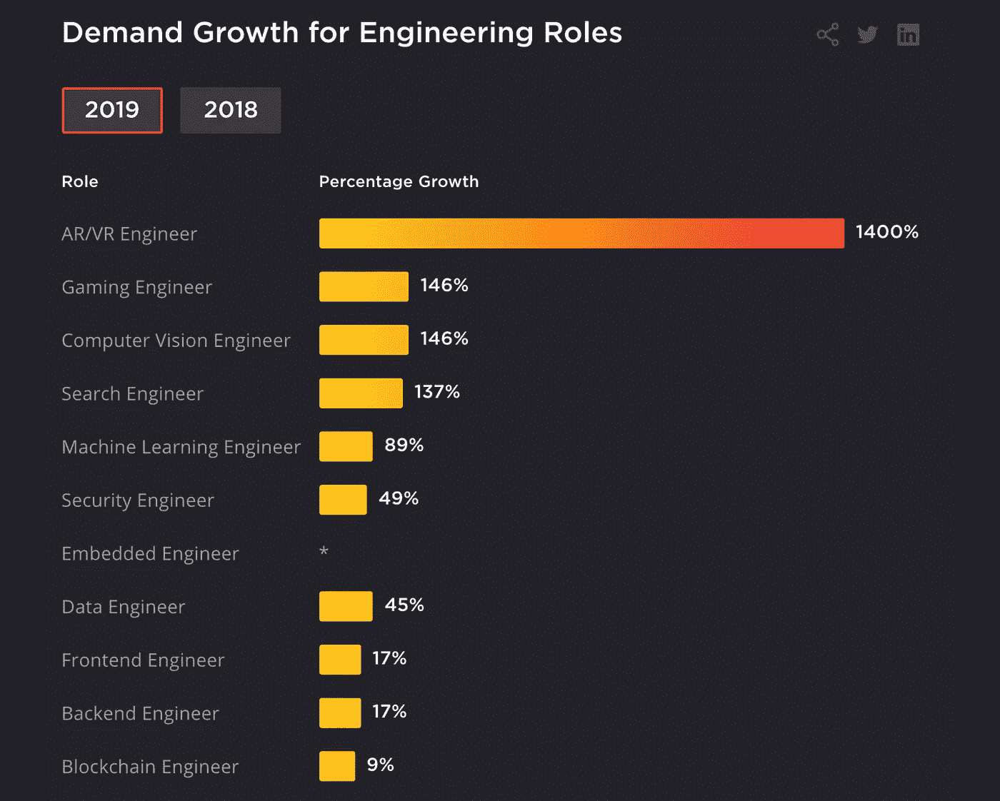

# 亚马逊的新服务可以创建无需代码的应用程序

> 原文：<https://levelup.gitconnected.com/amazons-new-service-can-create-apps-without-code-3bbc9a58223d>

## 像 Honeycode 这样的无代码应用会夺走你作为软件工程师的工作吗？

照片由[晨酿](https://unsplash.com/@morningbrew?utm_source=unsplash&utm_medium=referral&utm_content=creditCopyText)在 [Unsplash](/s/photos/amazon?utm_source=unsplash&utm_medium=referral&utm_content=creditCopyText) 拍摄

# 什么是蜜码

亚马逊网络服务(AWS)，最近公布了亚马逊 Honeycode。这是一款无代码开发工具，任何企业都可以使用它来构建自己的定制业务管理 web 或移动应用程序，用于日常运营。

> “我们真的希望将 AWS 的强大功能推广给业务线中的所有人，他们希望创建这些自定义应用程序来完成工作，但目前不具备这样的技能。人们通常更喜欢构建定制应用程序，但定制编程的需求往往超过开发人员的能力，造成团队要么需要等待开发人员腾出时间，要么不得不雇用昂贵的顾问来构建应用程序。”亚马逊网络服务副总裁拉里·奥古斯丁说。

亚马逊表示，企业目前使用微软 Excel 和谷歌 sheets 等电子表格来管理日常运营，这可能非常繁琐，很难维护。但是我觉得你可以很容易地使用云来维护 Google sheets 和 Excel 来与你的团队合作。

无论如何，Honeycode 允许企业专门为企业中的每个部门创建定制应用程序。企业可以为多达 20 个用户免费使用该平台，之后，他们需要为每个用户和应用程序在其服务器上占用的空间量付费。Honeycode 旨在简化管理任务，而不需要企业的 IT 团队来创建和管理应用程序。

# Honeycode 能做什么

1.  Honeycode 为用户提供了一套常用的模板，如待办事项应用、调查、库存管理等。
2.  它允许用户对移动和网络应用程序都有一个个性化的视图。
3.  经理可以决定谁能看到什么信息。
4.  您可以从 CSV 文件导入数据或创建自定义表格。
5.  所有用户都可以在他们的手机或电子邮件上获得个性化的相关通知，更新分配给他们的任务或任何关键数据的变化。
6.  通过设置相关的触发器和条件，工作流的任何方面都可以自动化。
7.  Honeycode 数据库中的表可以轻松扩展到每个工作簿 100，000 行。
8.  用户可以使用亚马逊的云安全地存储和管理他们的所有数据，并在任何运行互联网的设备上检索这些数据。
9.  Honeycode 为其用户提供了两个 API——GetScreenData 和 invokscreenautomation——允许其用户以编程方式与 Honeycode 应用程序进行交互，从 Honeycode 工作簿中读取数据，并根据条件设置触发器。

尽管这些功能很棒，并且让企业更容易管理他们的任务，但 Google sheets 和 Excel 仍然可以用来执行类似的操作。另一种选择是使用微软的 Power 平台，该平台允许企业管理和分析数据，同时牢记无代码理念。它甚至包括 Microsoft flow 来创建 Microsoft 服务或其他第三方应用程序之间的自动化工作流。Honeycode 上还没有像这样强大的工具。

 [## 业务应用平台|微软动力平台

### Microsoft Power 平台不仅仅是其各个部分的总和。将它们连接在一起，并连接到 Office 365、Dynamics 365…

powerplatform.microsoft.com](https://powerplatform.microsoft.com/en-us/) 

# Honeycode 做不到的事情

1.  Honeycode 不能做所有的事情，它只是为了帮助经理管理他们的业务而设计的，它只能创建类似于这个目的的应用程序。抱歉，你还不能用它做游戏。
2.  Honeycode 不支持应用集成，至少目前不支持。亚马逊希望保持其新服务的简单，目前它处于测试阶段，所以我们可以期待更多的功能和集成即将到来。
3.  它不允许你从蜂蜜代码中导出代码，亚马逊说这是因为他们想让它完全没有代码；看起来他们更想把你留在站台上。
4.  Honeycode API 目前只有两个功能，从工作簿中检索数据和自动化某些任务。在撰写本文时，它还不允许您使用 API 编辑或追加数据，但是我们可以预计这些功能很快就会出现。
5.  用户目前仅限于在注册 时分配的一个 [*团队，这意味着用户不能在注册时分配给您的初始默认团队之外创建其他团队。*](http://beyond%20the%20initial%20default%20Team%20assigned%20to%20you%20at%20sign%20up)
6.  用户可以从 CSV 文件加载数据，并使用 Honeycode API 读取数据，但是没有将数据链接到其他来源的选项。
7.  Honeycode 没有像微软的 power platform 这样的竞争对手所拥有的许多功能，例如目录和数据链接功能，与第三方应用程序和云服务的连接等。

在撰写本文时，Honeycode 刚刚发布了测试版，所以我们可以期待更多的功能即将到来。

# 这对开发者意味着什么，他们应该担心吗？

这是一个棘手的问题，不同的人对此会有不同的看法。这是我的感觉-

亚马逊以占领市场和摧毁竞争对手而闻名。当它第一次开设网上商店销售书籍时，任何人都很难想象它会主导或者创造现在被称为电子商务的东西。它迫使许多出版商通过其网上商店出版，那些拒绝出版的出版商已不复存在。亚马逊迅速发展其在线业务，开始销售各种商品。我们都知道。因此，如果亚马逊对无代码应用是认真的，那么它可能会尝试创建可以创建游戏、消费者应用等的服务。

但是不要担心，已经存在很多无代码开发平台，比如 Buildbox、Salesforce platform 和 Appy Pie。他们没有接受软件工程的工作。这些平台在很长一段时间内都会受到限制。对软件工程师的需求每年都在增长。

> 从 2018 年到 2028 年，软件开发人员的就业率预计将增长 21%，远高于所有职业的平均水平。将需要软件开发商来满足对计算机软件日益增长的需求。- [美国劳工统计局。](https://www.bls.gov/ooh/computer-and-information-technology/software-developers.htm#:~:text=5%25-,Employment%20of%20software%20developers%20is%20projected%20to%20grow%2021%20percent,projected%20to%20grow%2010%20percent.)

开发者应该关心获取/学习市场所需的新的/相关的技能。如果你只是知道如何创建基本的游戏和网站，Buildbox 和 Wix 会取代你的工作。但是如果你能创建可扩展的复杂应用程序，与其他开发者一起工作，你就不必担心无代码应用程序。

> 在过去的 20 年中，软件工程经历了爆炸式的增长，并且似乎一直保持着这种势头。根据《财富》的数据，2019 年全球前 15 大科技公司的总收入为创纪录的 1.67 万亿美元，比 2018 年增长 2%。现在软件公司比以往任何时候都多。

来源:[https://quanticdev . com/articles/software-engineering-in-2020/](https://quanticdev.com/articles/software-engineering-in-2020/)

# 一些有用的链接和参考

 [## 介绍 Amazon Honeycode -无需编写代码即可构建网络和移动应用| Amazon Web Services

### VisiCalc 于 1979 年推出，我为我的 Apple II 购买了一个副本(如右图所示)。电子表格模型是…

aws.amazon.com](https://aws.amazon.com/blogs/aws/introducing-amazon-honeycode-build-web-mobile-apps-without-writing-code/)  [## AWS 为何打造无代码工具

### AWS 今天发布了 Amazon Honeycode，这是一个围绕类似电子表格的界面构建的无代码环境，有点…

techcrunch.com](https://techcrunch.com/2020/06/24/why-aws-built-a-no-code-tool/)  [## AWS 推出 Amazon Honeycode，这是一款无代码的移动和网络应用构建工具

### AWS 今天宣布推出亚马逊 Honeycode 测试版，这是一款全新的完全托管的低代码/无代码开发工具，它…

techcrunch.com](https://techcrunch.com/2020/06/24/aws-launches-amazon-honeycode-a-no-code-mobile-and-web-app-builder/?guccounter=1)  [## 亲爱的，我做了这个应用！亚马逊的测试版无代码开发平台对于特别的东西来说是很棒的，但不是很多…

### 亚马逊发布了 Honeycode，这是一款基于浏览器的工具，用于构建在 AWS 云上运行的无代码应用程序…

www.theregister.com](https://www.theregister.com/2020/06/25/amazon_honeycode_nocode/)