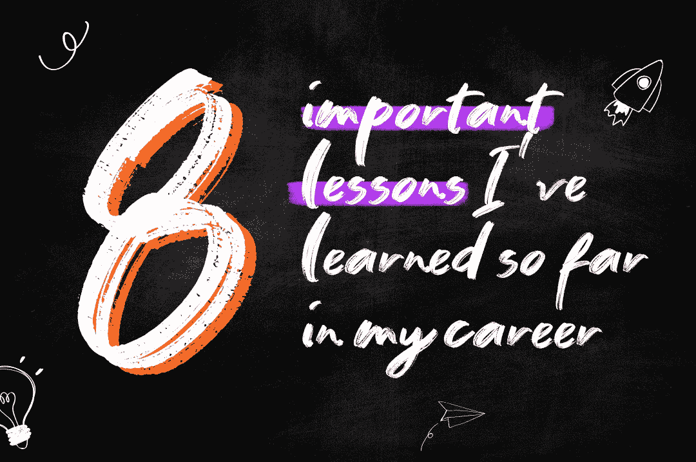

# 27 岁的亚马逊高级软件工程师——迄今为止我在职业生涯中学到的 8 条重要经验

> 原文：<https://levelup.gitconnected.com/amazons-sr-software-engineer-at-27-8-important-lessons-i-ve-learned-so-far-in-my-career-9fdfbfbc1a6a>

## 在我的整个职业生涯中，我一直想早点学到的东西

> *免责声明:我不代表亚马逊发言。观点是我自己的。*

首先，让我们简单介绍一下我自己:我叫丹尼尔，今年 28 岁，软件工程师，13 岁开始学习编码。经过 8 年的职业经历，我于 2019 年加入亚马逊，担任 SDE2。大约两年零三个月后，也就是 2021 年，我被提升为亚马逊的高级 SDE。

在这篇文章中，我将分享我在整个职业生涯中学到的一些东西，我希望以前就能学到。这些知识承载了我的个人经历和个人信念。希望对你有帮助。

# 1.虽然编码很酷，但是你可以通过支持其他同事来获得更多

编码很酷，非常酷。作为软件工程师，我们喜欢构建软件。而且，对我们来说，构建软件最直接的方法就是实际编写软件代码。

但是，当你一整天都在编码时，你是在用一个特定项目中的一段编码来交换 6 到 8 个小时。没有人向你学习，你也学不到任何东西，因为你是一名高级工程师，这个范围对你来说不是挑战。

即使你能比经验不足的工程师更快地交付代码，那又有什么意义呢？这是不可持续的，没有考虑长期和队友的个人进步。

作为一名高级工程师，你拥有并行支持许多项目的知识和技能，在许多方面，如代码审查、系统设计、产品规格、业务验证、卓越运营等等。通过这样做，你可以更有策略地工作，利用你的技能使你的团队更加敏捷，提高团队和项目之间的协同作用，帮助你的同事改善他们的职业生涯，等等。

这就是我们所说的[力量倍增](https://en.wikipedia.org/wiki/Force_multiplication)，你的影响力、知识和行动可以让你的整个团队倍增他们的交付能力、软件质量、团队协作、士气、工作生活平衡以及软件工程工作的其他积极方面。

# 2.你的话很有力量，不管是积极的还是消极的。先听，最后说。

你是你所在组织的推荐人，可能也是你所在公司的推荐人。

有人钦佩你，认为你可以指导他们改善职业生涯。

你的赞美可以激励缺乏经验的人取得惊人的成就。你的批评会导致经验不足的人日子不好过，甚至放弃。

如果你认为某人做错了什么，或者某人有改进的机会，私下和他谈谈，不要粗鲁。此外，谈论这个人的想法，而不是谈论这个人。人不是他们拥有的想法。

不要表现得好像你垄断了真相，什么都知道，而是作为一个关心他人进步并想帮助他人的人。仔细倾听，试着理解这个人的观点。人们是不同的，他们有不同的背景和信仰。

在会议和团队决策中，你的意见可能会使整个团队产生偏见，因为人们会相信不可能出现他们对而你错的情况，因为他们钦佩你。

在会议中，当一个话题开始被讨论时，让人们发言，仔细听所有的观点和想法，并且是最后一个发言。如果你先给出你的观点，那么，人们要么会因为你的观点而产生偏见，因为他们相信你(通常比你自己更相信你)，要么会压抑自己的想法，因为他们不相信自己是对的，而你是错的。即使你是一个很酷的人，而且你的公司是一个说话舒适安全的地方，总会有人害羞或不自信。

# 3.如果你因为缺乏经验而不行动，你将永远不会获得经验。

经验很重要，但不需要什么都懂就开始行动。其实恰恰相反，你需要实践你学到的东西，所以你获得了经验。

有些东西你在书本或课程中学不到，比如如何修复你创建网站时出现的小错误，或者你在部署服务器时与队友学到的技巧。这是买不到的，你需要生活在其中。

不要因为害怕犯错，害怕不知道所有的事情而被麻痹。只是行动，寻求帮助和尝试。相信我，你会想出办法的。

人们专注于目标，但是你应该试着专注于你正在探索的道路，并享受它。目标是终点，你的学习之路是永恒的。

# 4.你的英语不需要很完美。

这是上一次学习的附录，但值得专门讨论。

这里没有太多要讲的，只是题目里已经有的:你的英语不需要很完美，你不需要说得像个本地人。

在日常工作中，没有人会在意你的语法错误。

不要误解我的意思，我不是说如果你有机会就不应该努力提高你的英语水平，我是说你对不完美的恐惧不应该阻碍你迈出下一步。

这篇帖子可能有很多语法错误和糟糕的书面句子，但没关系，你可以得到我的消息，这才是重要的。大多数人不会说第二语言，如果你的第一语言不是英语，而你会说，那么你的英语已经很好了。

# 5.FAANG 的工程师不比你强

> *FAANG* 是一个缩写词，用来指代五家科技公司的股票*脸书、亚马逊、苹果、网飞*和*Alphabet*(*G*指的是 Alphabet 的核心公司*谷歌*)。

在我加入亚马逊之前，我曾经认为我比 FAANG 的工程师更差。

出于某种原因，我曾经视其为软件之神。创建我每天使用的应用程序的人，他们每秒处理数十亿次请求。

当我加入亚马逊时，我有点担心自己不够好，不适合这个角色。但我很快注意到 FAANGs 的人都是普通人，他们知道一些话题，但不知道其他话题。

当然，我在亚马逊遇到过优秀的人，但我也在以前工作过的其他公司遇到过。最终，每个人在每个地方都有东西可以教和学。

现在我是一名 FAANG 工程师，我不比任何人强。我不比任何人差。你不比我差，也不比我好。

我什么都不知道，也永远不会知道。关键是要虚心与其他人一起学习。

# 6.了解业务会引导你做出更好的决策

归根结底，软件是为了解决业务问题而创建的。如果没有解决问题或者没有用户，那么构建一个具有完整的 CD 管道、100%的测试覆盖率和遵循最佳实践的杰作软件是没有意义的。

另一方面，一个质量差的软件，在给用户带来其他不便的同时，几乎没有解决用户的问题。

高级工程师是团队中的关键人物之一，是技术团队和业务团队之间的粘合剂。为此，你应该尽可能多地了解业务和产品。基于此，您将学习如何做出权衡，不仅考虑技术方面，还考虑业务方面。

最终，你会明白大多数事情取决于风险和潜在回报。

你会在生产中部署一个有已知错误的软件吗？一个初学的工程师可能会说不。

高级工程师会说:看情况。要看这个 bug 的影响。它会在生产中持续多久。能看到这个 bug 的用户群的可控程度。客户成功团队如何参与帮助用户解决这个问题。对于用户和企业来说，等待漏洞修复来启动整个功能有多糟糕。

了解你正在构建的软件的业务，与业务团队和客户成功团队接触，了解程序和产品的路线图，以及客户的挫折和抱怨，是制作向人们交付价值的高质量软件的关键。

# 7.注意你的姿势，注意你的健康

你一天中大部分时间都坐在电脑前。从长远来看，不良姿势会导致严重的背部问题，这将是痛苦的，也许无法解决。

投资购买符合人体工程学的椅子、桌子、键盘和鼠标。注意你的姿势。

还有，尽量每小时起床，喝水，睡好觉，去健身房。

我知道这看起来像是父母的建议，当我年轻的时候也曾经这样想，但是你会变老，你的身体会从今天开始感觉到这些坏习惯。

我不是给出具体指导的专家，所以我建议你去寻求专家的帮助。

# 8.你应该学会如何将一个想法转化为一个网站或应用程序，这将帮助你创新和探索你的创造力

人们有想法，我们中的许多人已经有了创建一个革命性的应用程序或平台的想法。

当你是一名开发人员时，你比其他人领先一步，因为你知道如何开发应用程序。

但是，如果您是前端开发人员，您可能无法开发应用程序的后端逻辑，或者无法从头开始创建服务并部署它。

如果你是后端开发人员，你可能无法开发前端应用程序，也无法开发移动应用程序。

最后，虽然你是一名开发人员，但是会有一些障碍阻止你创建应用程序，测试你的想法，并通过实践和尝试来学习。

这种从零开始创建整个应用程序并将其部署到互联网上的能力，对每个人来说，都将为你打开一个充满可能性的世界，所以我强烈建议你学习如何构建应用程序前端(HTML，CSS，Javascript，React)和后端(任何后端语言，如 Java 和 Python)，如何部署应用程序(AWS，Google Cloud，Azure，Firebase，Heroku …)，以及一点点 UX 设计器。

# 分级编码

感谢您成为我们社区的一员！更多内容见[级编码出版物](https://levelup.gitconnected.com/)。
跟随:[推特](https://twitter.com/gitconnected)，[领英](https://www.linkedin.com/company/gitconnected)，[通迅](https://newsletter.levelup.dev/)
**升一级正在改造理工大招聘➡️** [**加入我们的人才集体**](https://jobs.levelup.dev/talent/welcome?referral=true)