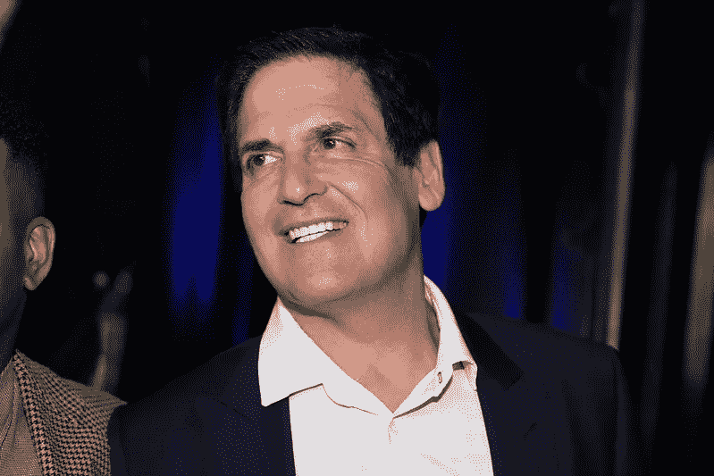
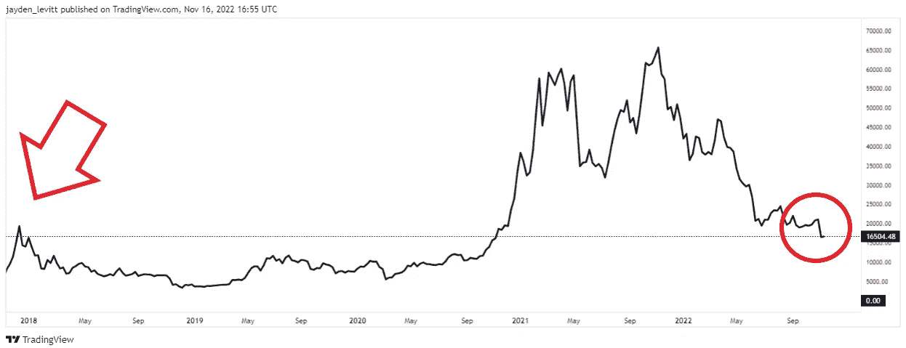

# 美国亿万富翁说如果可以，一定要以这些价格买比特币(马克·库班)

> 原文：<https://levelup.gitconnected.com/american-billionaire-says-if-you-can-you-must-buy-bitcoin-at-these-prices-mark-cuban-edc2cd02b421>

你需要明白为什么这不是比特币爆炸。

摄影:Gage Skidmore — Flikr

马克·库班是一个朴实的企业家，他被比特币迷住了。

他的成功和数十亿的净资产主要来自出售他的流媒体公司 Broadcast.com。

雅虎以令人垂涎的 57 亿美元收购了该公司，成为他们最昂贵的收购。

这笔交易发生在 1999 年，网络泡沫破裂之前。

Broadcast.com 当时有 57 万用户，购买价格相当于每个用户 1 万美元。

价格高得离谱。

雅虎给了古巴他们公司的股票期权，他在 1999 年卖掉了大部分股票，在股票市场暴跌之前，他净赚了 10 多亿美元。

雅虎在 2002 年关闭了 Broadcast.com。

他们高调收购流媒体服务，被那些记得这件事的人视为历史上最糟糕的互联网收购。

库班的销售技巧是他大半辈子精心打造的。当他还是个孩子的时候，他敲别人的门卖邮票赚外快。

有一个著名的故事，他在一家零售店做清洁工，在那里他完成了一笔软件销售。他以为拿着一张 15000 美元的支票回来就能弥补他无视老板不离职要求的事实。

库班的老板解雇了他。

自那以后，比特币牛市的职业生涯发展到了投资颠覆性技术。

他坚信比特币的“价值储存”功能，并说它比黄金更好。他表示，由于其算法的稀缺性和有限的供应，这种资产将随着需求的增加而升值。

> 马克·库班:
> 
> “我们都可以争论，直到我们脸色发青。
> 
> 我不在乎。
> 
> BTC 的一个巨大优势是，作为一种价值储存手段，它没有竞争。
> 
> 所有的智能合同链和所有的区块链都在为赢得这些应用程序而进行殊死战。
> 
> 许多人将会失败。"

库班认为，随着其他区块链在应用和网络效应方面相互竞争，这将是比特币的一大胜利。当大多数连锁店不可避免地倒闭时，人们会将比特币视为更安全的避风港。

> 马克·库班:
> 
> “这也将是 BTC 的巨大胜利。
> 
> 当数十亿美元的区块链变得不活跃时，许多人会将 BTC 视为避风港，而更保守的加密游戏将是 BTC。
> 
> 价值游戏的储存会加速它的价值。
> 
> 它将是加密的天堂。"

# 在牛市中每个人都是天才，在熊市中保持沉默。

你可以对任何事情这样说。

你会看到，如果英格兰赢得世界杯，我会变得多么大声，或者当我们不可避免地输掉比赛时，我会沉默一个月。

库班认为，在人们如何投资方面，Crypto 类似于股票市场。总会有一些投机者买入，因为他们相信价格会上涨。

他认为，随着利率上升和投机资金的枯竭，市场将失去投机者。

> 马克·库班:
> 
> “当借贷变得不那么容易时，人们就会减少投机。所以他们持有自己的钱，而不是投资。”
> 
> 加密和股票市场有很多相似之处。
> 
> 有句老话说，在牛市中，每个人都是天才。
> 
> 当股票价格下跌时，每个人都变得沉默。
> 
> 在 Crypto 里也是一样的。
> 
> 当以太坊、比特币和密码上涨时，每个人都会告诉你他们觉得自己有多聪明，但当它下跌时，没人会说一句话。"

# FTX 内爆和加密货币崩溃与加密货币的基本面无关。

除非你一直生活在岩石下，否则你会听说过 FTX，世界第三大密码交易所，几乎一夜之间从一个 320 亿美元的公司崩溃到零。

简而言之，他们的创始人利用客户存款进行交易。

另一家交易所和竞争对手币安看到了一份关于 FTX 杠杆率过高的报告，于是卖出了所有股份。

FTX 的崩溃导致了 Crypto 版的银行挤兑，每个人都想同时将存款从 FTX 取出。

FTX 有 90 亿美元的负债，只有 10 亿美元的资产来支付客户的提款。

他们已经申请破产，他们的客户和投资者遭受了巨大的损失，因为没有人来拯救他们。

库班认为，最近加密领域的爆发，包括 FTX 的内爆，都是银行和人员的失误，而不是加密。

他将其与银行业糟糕的放贷行为相提并论。

> 马克·库班:
> 
> “贷款给错误的实体，抵押品估值错误，傲慢的套利行为。
> 
> 这些都是同一个故事的不同版本。
> 
> 由银行家大量投资、由前银行家、前证券交易委员会、CFTC 政府运营的中央化的所谓加密公司，引发了加密领域所有最大的爆炸。"

# 如果可以的话，一定要买这些价格的比特币

郑重声明，我收到了读者的批评，他们认为我是为了自己的利益而抛出比特币。

最好是可疑的。

比特币的市值为 3230 亿美元。即使是世界上最富有的人对价格也没有什么影响。

我不在乎你买不买比特币。

你用你的钱做什么是你的事。我评论著名的商业人士对新兴技术的看法。

我看好比特币，但你必须下定决心。

库班表示，他仍在确定比特币是否会进一步下跌。他说，具有讽刺意味的是，他的股票投资比他在比特币和以太坊的投资下跌得更厉害，人们仍然称之为投机性投资。

他确实表示，现在是考虑购买的最佳时机，价格可能会进一步下跌，所以他很想知道我们是否已经触底。

他还考虑了 FTX 股市崩盘是否会产生多米诺骨牌效应，导致其他公司破产。

> 马克·库班:
> 
> “那么，这里有什么东西便宜到让我想好好看看并开始购买的吗？
> 
> 我已经开始买比特币了。
> 
> 很难预测它会跌到多低，所以我只是在这些价格上一次买一点点，还没有全部买进。"

# **最终想法**

你需要决定现在是否是投资和尝试的好时机。

在下面用红色箭头显示的 2018 年 ICO 崩盘后，比特币用了两年时间才恢复。

横盘两年。

来源— [交易视图](https://www.tradingview.com/symbols/XBT/)

如今的不同之处在于，散户投资者越来越多地采用比特币，第三世界国家越来越多地使用比特币作为他们的价值储存手段。

比特币可能还没有触底，但也远未触顶。

> *如果你想在 Web3 上读到更多我的观点，请考虑成为会员。你的会员费直接支持你读的作家。如果你用我的链接* [*注册，我会赚一小笔佣金。点击这里*](https://medium.com/@jayden_levitt/membership) *。*

*本文仅供参考；不应将其视为财务、税务或法律建议。在做出任何重大的财务决定之前，你可以咨询财务专家。*