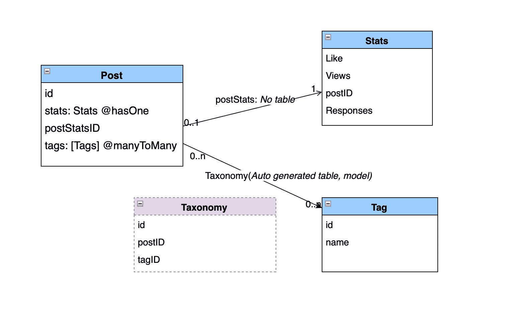

# 放大批量数据的创建、更新和迁移

> 原文：<https://levelup.gitconnected.com/amplify-bulk-data-create-update-migration-f178ab2a3e57>

让我们看看如何填充或修改为 Amplify GraphQL 设置提供支持的数据。DynamoDB 是 GraphQL API 或 AppSync 事实上的持久层。在 Amplify 中建立 GraphQL 模型是相当容易的，但是在高节奏的开发过程中修改模型是一件痛苦的事情。更有甚者，如果您的数据库已经填充了数据，那么您就需要自己将数据与新的模式模型进行协调。您需要考虑生产部署中的轻松过渡。

以下部分将使用两种方法解决数据协调问题:

**1。使用 GraphQL API。**

**2。在 DynamoDB 后端直接操作数据。**

让我们举一个例子。我正在 React Native framework 中开发一个移动应用程序。假设我已经用 Amplify 库设置了项目，下面是*‘schema . graph QL’*的一个片段

```
type Post @model @auth(rules: [{allow: public}]) {
  id: ID!
  title: String!
  comments: [Comment] @hasMany(indexName: "byPost", fields: ["id"])
  owner: String
  content: String
  status: String
  tags:[Tag] @manyToMany(relationName:"taxonomy")
  postTags: [PostTag] @hasMany(indexName: "byPost", fields: ["id"])
  likes: [Like] @hasMany(indexName: "byPost", fields: ["id"])
  stats: Stats @hasOne
  ...
}

type Tag @model @auth(rules: [{allow: public}]) {
  id: ID!
  name: String
  postTags: [PostTag] @hasMany(indexName: "byTag", fields: ["id"])
  count: Int
  posts: [Post] @manyToMany(relationName:"taxonomy")
  display: Boolean
}

type Stats @model @auth(rules: [{allow: public}]) {
  id: ID!
  likes: Int
  views: Int
  responses: Int
  postID: ID! @index(name: "byPost")
  post: Post @hasOne(fields: ["postID"])
}
```

数据模型如下图所示:



Post、Tags 和 Stats 的 GraphQL 模式数据模型

假设我们需要添加数据，我们需要大致按照以下顺序填充后端

1.  创建帖子
2.  创建统计数据
3.  用 Stats ID 更新帖子(postStatsId 字段)
4.  创建标签(如果不存在)
5.  填充分类模型(这是一个自动生成的模型)

## 1.使用 GraphQL API。

这是一个简单的例子。

1.  使用 Amplify CLI 生成查询和变异
2.  准备脚本文件(简单的 NodeJS 文件就足够了)
3.  导入 Amplify GraphQL API(当然，您将首先配置 Amplify)
4.  调用像 *createPost* 和 *updateStats* 这样的突变

如果修改相当简单，并且在更改模式模型之前已经提取了原始数据，那么使用 GraphQL API 方法是合适的。但是很快您将会手动编写大量 GraphQL 查询。您需要一种方法来读取提取的数据文件(CSV 或 TAB 或 EXCEL ),以迁移现有数据和新数据。

## 2.直接操作 DynamoDB。

这是我发现的批量修改数据的最简单的方法。它还可以作为 It 组的一部分进行扩展，用于管理或数据管理。

这种方法的核心是使用一个名为`dynamodb-toolbox`的包

将它安装在某个文件夹中，它可以在你的应用程序内，也可以在你的应用程序外。这真的取决于你的偏好:

```
npm i dynamodb-toolbox
```

从 GitHub 获得软件包的文档:[https://github.com/jeremydaly/dynamodb-toolbox](https://github.com/jeremydaly/dynamodb-toolbox)

对于每一个操作，您将大致执行以下操作:

1.  定义实体-您的模型
2.  定义 DynamoDB 表—实际的 DynamoDB 表表示
3.  调用实体上的方法来列出、创建、更新或删除数据上的操作

定义它们最好的部分是相当容易的，我们不需要完全编码模型。编写我们需要的代码。例如，如果我只需要操作一列，那么只需要在表中定义该列，在实体中定义属性。

使用时区格式更新“createdAt”日期的脚本文件如下所示:

```
const { Table, Entity } = require("dynamodb-toolbox");
const DynamoDB = require("aws-sdk/clients/dynamodb");
const DocumentClient = new DynamoDB.DocumentClient({region:"us-east-1"});

// Instantiate a table
const MyTable = new Table({
  // Specify table name (used by DynamoDB)
  name: "Post-xxxxxxxxxx-dev",

  // Define partition and sort keys
  partitionKey: "id",
  sortKey: "",
  entityField: false,

  // Add the DocumentClient
  DocumentClient,
});

const Post = new Entity({
  name: "Post",
  timestamps: false,

  attributes: {
    id: { partitionKey: true },
    createdAt: {type: "string"},

  },
  table: MyTable,
})

let item = {
  id: 32,

}

const updateTable = async () =>{
  let result = await MyTable.scan({
    limit :150,//No need to paginate, get everything
    execute: true,
    parse: true
  });

  result.Items.map( async (item) => {
    let createdDate = item.createdAt;
    createdDate = createdDate.replaceAll(" ","T");
    if(createdDate.lastIndexOf("Z") < 0 ) 
	createdDate = createdDate + ".001Z";

    const params = {
      id: item.id,
      createdAt: createdDate
    }

    let updateResult = await Post.update(
		params, 
		{execute: true, parse: true}
	);
    console.log("updateResult :", updateResult);
  })

  return "Completed";
} ;

updateTable().then(
    (data)=>console.log("Done", data),
    (err)=>console.log("err", err),
);
```

这里需要注意几件事:

1.  确保在表格定义中设置了`entityField: false,`。默认情况下，库添加类型名称列。我们不需要它，因为它已经由 Amplify GraphQL 生成。
2.  在实体定义中设置`timestamps: false,`。否则，库添加*创建的*和*修改的*时间戳。同样，这些信息已经被 Amplify GraphQL 库处理了。我们这里不需要他们。
3.  dynamo-db 的读取容量决定了您可以在“扫描”表中设置的限制。如果读取容量耗尽，请在查询中使用分页。`dynamodb-toolbox` 提供了一个简单的`.next()`方法来处理分页。

回到我们的例子，我们可以在一个脚本中定义所有的实体和表，并在一个事务中快速添加它们。

## 结论

Amplify GraphQL API 库最适合使用 DynamoDB 持久层启动移动应用后端。然而，我们需要使用额外的工具来管理数据。`dynamodb-toolbox` 将加速批量迁移和数据操作。

关注我@vadionline，了解更多使用由 AWS Amplify 支持的 React Native、Flutter 进行移动应用开发的发现。