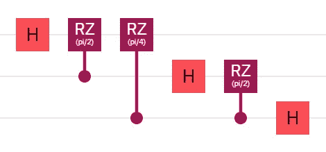
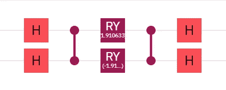
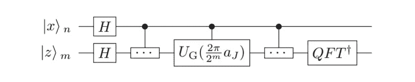
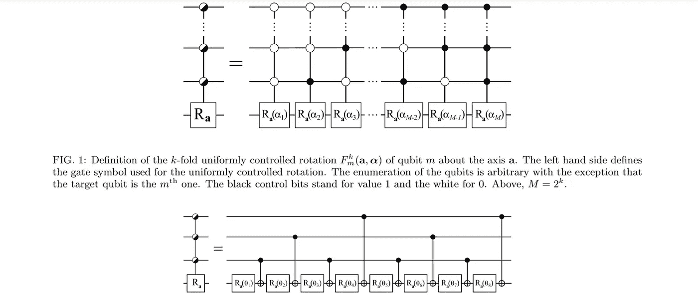

# 振幅编码

> 原文：<https://levelup.gitconnected.com/amplitude-encoding-dd89dc84170d>

[https://pix abay . com/photos/man-black-victory-joy-achieve-3483205/](https://pixabay.com/photos/man-black-victory-joy-achievement-3483205/)

# 成就解锁

在我运行我的第一个量子电路之前，我看了一个彻底让我震惊的视频。在这个视频中，Seth Lloyd 博士说，[将一万亿比特的数据映射到仅仅 40 个量子比特](https://youtu.be/OstyW7c0v48?t=261)是可能的。我又一次听到他说我们可以在仅仅 40 个量子比特上编码一万亿比特的经典信息，我重播了很多次以确保我没听错。我立即开始了一项长达数年的研究，试图弄清楚我究竟如何才能做到这一点。

这并不容易。事实上，有一个来自彼得·魏特克博士的视频，他说[还不清楚振幅编码实际上是如何实现的](https://youtu.be/LHzWAyT5rMI?t=136)。随着岁月的流逝，我遇到了一些书籍、论文和文章，它们继续解释相同的几种编码方法，但绝不会详细介绍幅度编码。大家都只是说“很难”，继续前进。

情况变得更糟了。我直接问了人。从来没有人推荐过单一的资源。有人说这是不可能的。至少有人说我一定是听错了劳埃德医生的话。有人甚至说也许劳埃德博士是唯一一个能弄清楚。

有一天，我终于有了转机。

量子傅立叶变换(QFT)

我发现量子傅立叶变换(QFT)作为振幅编码的参考。从那以后，我找到了更多这样的参考资料。我不知道是否对此存在分歧，或者对于物理学家和数学家来说，这是如此明显，以至于他们没有用回应来尊重这个问题，或者为什么，否则，没有人站出来用简单的英语说出来。迄今为止，我只有一个直接回复说这是正确的，没有直接回复说这是不正确的。

如果你跟随教程，并发现 QFT 由于其深度令人生畏，它已经随着时间的推移被大大简化。我记得看到的第一个简化是 Python 中的一个简单循环；它可能是一个嵌套循环。现在，有一些框架只需要一行代码就能帮你做到。Qiskit 教科书有一个算术旁路，你可以在适当的状态下初始化量子位，而完全不需要使用 QFT。尽管不包含纠缠，核方法发现状态是不可区分的，而反 QFT 验证了期望的初始状态。这个捷径在所有算法中都适用吗？好问题。

可重构分束器

我发现的另一种方法是使用一种叫做[可重构分束器(RBS)](https://www.nature.com/articles/s41534-021-00456-5) 的离子阱门。因为我不使用离子阱设备，我不得不研究[如何分解 RBS 门](https://www.arxiv-vanity.com/papers/2106.07198/)，这样我就可以在 IBM Quantum 中构建它。不幸的是，QC Ware 对问题没有反应，因为我的实验表明并非所有可用的振幅都被使用，这似乎有点低效。然而，也许这就是为什么提出了这个方法的一个未被证明的“密集”实现。此外，这种方法似乎需要 2 的 n 次方(2^n)数量的量子位，这不是其他方法的限制。

【https://arxiv.org/pdf/1912.04088.pdf 

还有一种方法是[对多项式](https://arxiv.org/pdf/1912.04088.pdf)进行编码。

[https://arxiv.org/pdf/quant-ph/0407010.pdf](https://arxiv.org/pdf/quant-ph/0407010.pdf)

你可以想象，我最喜欢的方法是我自己想出来的。*更新:自从我第一次发表这篇文章以来，*[*Danyal Maheshwari*](https://www.linkedin.com/in/danyal-maheshwari-67346169/)*让我注意到了一篇名为“* [*利用均匀受控旋转变换量子态*](https://arxiv.org/pdf/quant-ph/0407010.pdf) *”的论文，作者是莫托宁、瓦尔蒂艾宁、伯格霍尔姆和萨洛马，揭示了这种方法实际上是在 17 年前提出的。在不知道这篇论文的情况下，我还是想出了如何实现我很久以前听到劳埃德博士演讲时想要实现的目标。而且，尽管我后来发现这是不必要的，正如我将要解释的，这无疑是迄今为止我个人最满意的“量子”成就。我的工作得到验证也是值得的，因为一个由四名研究人员组成的团队提出了同样的方法，尽管比我早得多。*

[https://www.classiq.io/](https://www.classiq.io/)

这篇文章的灵感来自于我观察 [Classiq 的量子算法设计(QAD)平台](/demo-classiqs-qad-platform-f0bec3608549)的状态准备特性。简单地列出你想要的振幅，点击一个按钮，然后等待几分之一秒，让 QAD 产生你的电路。事实上，QAD 可以同时生成多个幅度编码寄存器，而不会出现明显的速度下降。因此，虽然我很高兴我们的电路深度大致相同，我更高兴的是我能够通过艰难的方式找到它，但我完全放心的是，有一种更简单的方式来完成它。

https://qiskit.org/

我也想到，既然 QAD 做振幅编码，也许齐斯基特也做？而且，[确实](https://qiskit.org/textbook/ch-states/representing-qubit-states.html)。我更喜欢 QAD 实现，因为我可以在 OpenQASM 编辑器中实现振幅编码，但 Qiskit 仍然可以完成这项工作。

对所有这些方法的研究揭示了两种截然不同的幅度编码方法。例如，你可以从一个量子态开始，应用 QFT；你不知道振幅。另一方面，你可以从振幅开始，反向计算旋转角度。这些方法本身有不同的应用。

总之，我喜欢从头开始编码。我喜欢深入理解我正在做的事情。但是，如果你问我哪一个更令人满意——找出振幅编码或再也不用手动编码——这是一个非常非常棘手的问题！

编码快乐！