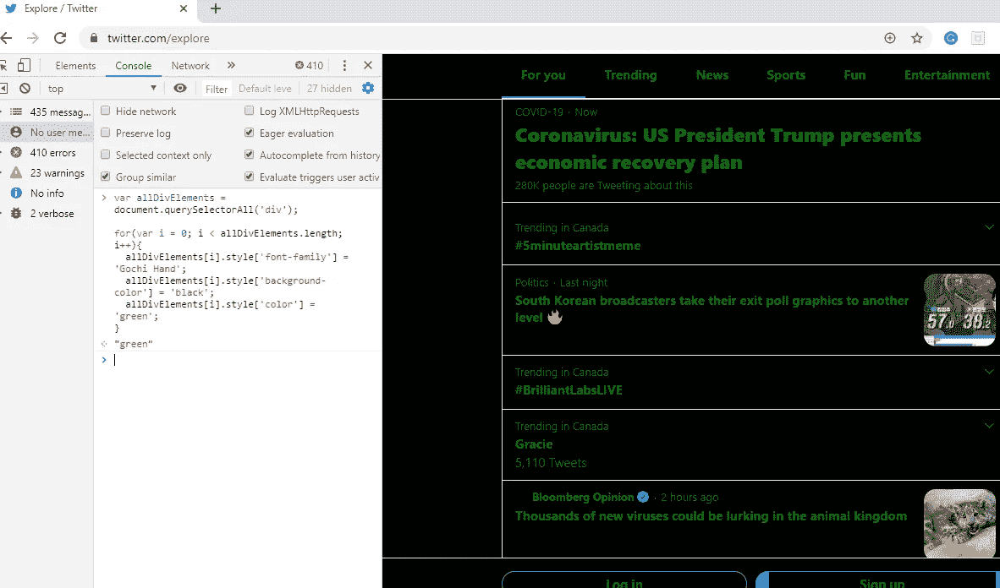

# 没有 JavaScript 教程教的有趣的浏览器技巧

> 原文：<https://levelup.gitconnected.com/amusing-browser-tricks-which-no-javascript-tutorials-teach-75d3ea0cc60>

纳赫尔·阿卜杜勒·哈迪在 [Unsplash](https://unsplash.com?utm_source=medium&utm_medium=referral) 上的照片

## 增强您的 web 体验，提高工作效率，并愉快地学习 JavaScript 中的浏览器技巧和窍门

开始编程最关键的挑战是选择 ***学什么*** 和 ***学哪里*** 。有如此多的编码语言、框架和库——以及许多相互矛盾的观点。在本文中，我将解释如何在浏览器中使用 JavaScript 函数，并在您喜欢的网站上试用这些脚本。

我已经花了六年的时间从事编码工作，尽管有时很令人兴奋，但这是一次非常愉快的经历。这篇文章对于新手或中级程序员来说是一个很好的演练，可以帮助您创建有用的浏览器技巧，增强您的 web 专业知识并提高生产率。

我偶尔会教我的弟弟妹妹们 web 开发，让他们感兴趣并参与进来的一个简单方法是让他们相信编码是适合他们的。我让他们的 ***创造力满足*** 的严格性，并教他们在现实世界的场景中编码。

我教他们如何在浏览器控制台上编码，因为使用现成的工具可以很容易地操纵网站。没有不寻常的设置，只有你、浏览器和编程语言让网页活起来——JavaScript。

> 注意:这些脚本不是我自己创作的，但是我编译了所有这些简单的技巧来享受学习 JavaScript 语言的乐趣。

您将把下面的脚本复制并粘贴到浏览器的控制台中，然后按 enter 键。我强烈建议你尝试一下，修改一下剧本，来一次令人兴奋的体验。

## ≋ 1 ≋让我们从学习如何使用 JavaScript 的 alert()函数开始

通过在浏览器中打开“控制台”选项卡，启动开发人员工具控制台。如果你使用的是火狐浏览器，按`Ctrl+Shift+J`(或者在 Mac 上按`Cmd+Shift+J`)。对于 Chrome 浏览器，按`Ctrl+Shift+I`(或者在 Mac 上按`Cmd+Shift+I`)。

在 JavaScript 中，`alert()`被广泛用于在浏览器中弹出一个小对话框的调试。修改下面的代码以包含您的消息，不要担心，您并没有真正地入侵网站。

作者提供的截图

## ≋ 2 ≋实现黑客配色方案和改变字体

用`.style`用 Javascript 改 CSS，让你的网站看起来像黑客的屏幕。随意修改这个脚本为你想要改变的任何 HTML 元素的字体颜色、系列和背景颜色。

Twitter 黑客配色方案。图片由作者提供

你有没有遇到过这样一个网站，在那里你发现了很棒的内容，但是因为不吸引人的字体而讨厌阅读。现在你甚至可以修改网站的字体。在这种情况下，转到**元素选项卡**并在样式部分下查找`body {}`样式。从[这里的](https://www.howtogeek.com/208552/how-to-change-the-default-fonts-in-your-web-browser/)选择字体，添加或修改字体系列属性。通过融入`font-family: ‘Chiller’;`风格，对网站的字体进行戏剧性的改变。使用下面的脚本修改任何网站的字体，并添加您选择的任何[字体。](https://fonts.google.com/)

改变维基百科页面的默认字体。作者提供的 GIF

使用脚本修改媒体的字体。图片由作者提供。

## ≋ 3 ≋创建一个简单的计算器在一个警告框！

您甚至可以在警告框中创建一个简单的计算器。很酷，不是吗？试试这段代码，并随时修改它。

警告框中的简单计算器。作者提供的 GIF。

## ≋ 4 ≋用任意图片替换页面上的所有图像

选择页面上的所有图像，并添加一个新的`src`或`srcset`标签。通过添加链接到您最喜爱的照片来修改此脚本。使用[下面的脚本](https://www.thinkful.com/blog/learn-javascript-fast-by-hacking-your-favorite-websites/)，我替换了个人资料中的所有图片。(我通过检查 Instagram 徽标并按下 Delete 键来删除它，如 GIF 中所示)

替换 Instagram 上的所有图片。作者提供的 GIF。 [Alexas_Fotos](https://pixabay.com/users/Alexas_Fotos-686414/) 在 [Pixabay](https://pixabay.com/photos/not-hear-not-see-do-not-speak-funny-3444212/) 上的青蛙图片。

## ≋ 5 ≋让所有的图像像蛇一样跳舞

这段代码将获取网页上的所有图片，并让它们以 8 字形追逐，每个图片像蛇一样追逐下一个图片。

跳舞的图像。作者提供的 GIF。

## ≋ 6 ≋删除网站上的所有图片

运行这个简单的脚本，删除页面上的所有图片，让你的朋友们挠头。您可以通过删除给定页面上的所有 HTML 标签来修改脚本。

删除网站上的所有图片。作者提供的 GIF。

## ≋ 7 ≋翻转图像 180 度！！！

如果你想找点乐子，想让你的浏览器替你干脏活，用下面的代码翻转网页上的所有图片。

翻转图像。作者提供的 GIF。

## ≋ 8 ≋恶作剧你的用户用硬编码文本替换搜索输入文本

给你的用户一个恐慌攻击来恶作剧怎么样？使用下面的脚本，在愚人节那天，在他们中间培养一种战斗或逃跑的反应和焦虑。

将任何文本替换为“你被黑了！!'。作者提供的 GIF。

## ≋ 9 ≋通过编辑任何网页上的任何内容来解锁特殊权力

许多青少年将“**黑**一个网站等同于以某种有趣的方式丑化它。他们可能会访问学校的网站，修改他们的科目成绩，并在父母、老师和朋友面前没完没了地吹嘘。使用[下面的脚本](https://www.thinkful.com/blog/learn-javascript-fast-by-hacking-your-favorite-websites/)使用内置的开发工具来完成这种破解。现在你只需点击网页上的任何地方(除了图片或 gif ),然后开始输入来改变网页的线条。这包括大多数导航菜单，以及正文文本！

编辑媒体上的任何文本。作者提供的 GIF。

## ≋ 10 ≋随便搞乱网站的定位

通过选择任何 HTML 标签并使用`Math.random()`,你可以给页面上的任何东西随机的方向，产生一个非常有趣的效果！

扭曲媒体网站的定位。图片由作者提供。

## ≋ 11 ≋用 JavaScript 为你的朋友设置了陷阱

学习一个简单的 JavaScript 技巧，通过简单地将页面旋转 180 度来吓唬你的朋友。试着运行下面的脚本把页面翻过来。

将网页旋转 180 度。图片由作者提供。

现在是时候使用 JavaScript 设置一个陷阱了——愚弄和吓唬你的朋友。使用 JavaScript 的`setTimeout`函数，这样[这个函数中的脚本](https://www.thinkful.com/blog/learn-javascript-fast-by-hacking-your-favorite-websites/)将不会运行，直到用户在网页上停留 4 秒钟。您可以在这组函数中包装我们在这里所做的任何修改，以产生相同的效果。

用 JavaScript 中的 setTimeout 函数诱捕你的朋友。gif 由作者提供。

## ≋ 12 ≋桶卷

没有学习过最流行的技巧——滚桶，任何 JavaScript 技巧都是不完整的。这个技巧可以让你将页面旋转 360 度。看看下面的脚本。

JavaScript 中最流行的技巧——桶形滚动。作者提供的 GIF。

## ≋ 13 ≋哈莱姆摇摆舞

应用 Harlem Shake“hack ”,观察页面上的所有元素开始随着音乐起舞。你现在就可以在这个页面上试试。只需复制下面的代码列表并将其粘贴到“控制台”选项卡上。打开你的声音，享受哈莱姆摇摆乐。

哈莱姆摇摆舞。作者提供的 GIF。

## 最后的想法

我希望你对这些 JavaScript 黑客有兴趣！

你有没有类似的有趣的“技巧”，可以很容易地应用于任何使用客户端 JavaScript 和/或开发工具的网站？

把细节留在评论里，我会把最好的放在帖子里，并附上适当的说明。

> 请不要在不理解控制台上的脚本的情况下简单地复制和粘贴任何 JavaScript 代码，因为它可能允许攻击者假冒您并使用称为自我 XSS 的攻击来窃取您的信息

**感谢阅读！
你可以在 Medium 上找到我其他作品的链接，关注我** [**这里**](https://medium.com/@faraazdhuka28) **。**

## 资源

1.  Jai 的酷 JavaScript 技巧。可用:[http://www.blogohblog.com/cool-javascript-tricks/](http://www.blogohblog.com/cool-javascript-tricks/)
2.  通过“入侵”你最喜欢的网站快速学习 Javascript。可用:[https://www . think ful . com/blog/learn-JavaScript-fast-by-hacking-your-favorite-websites/](https://www.thinkful.com/blog/learn-javascript-fast-by-hacking-your-favorite-websites/)
3.  有趣的浏览器 JavaScript 技巧和黑客史蒂夫·史密斯。可用:[https://ardalis.com/fun-browser-javascript-tricks-and-hacks](https://ardalis.com/fun-browser-javascript-tricks-and-hacks)
4.  Nick Vids 和 Brandon YT 的精彩 JavaScript Hacks。可用:[https://sites . Google . com/view/awesome JavaScript hacks/other-cool-hacks](https://sites.google.com/view/awesomejavascripthacks/other-cool-hacks)
5.  Rob Dawson 写的有点邪恶的 JavaScript。可用:[https://codebox . net/pages/monkey shine-JavaScript-practical-keys](https://codebox.net/pages/monkeyshine-javascript-practical-jokes)

