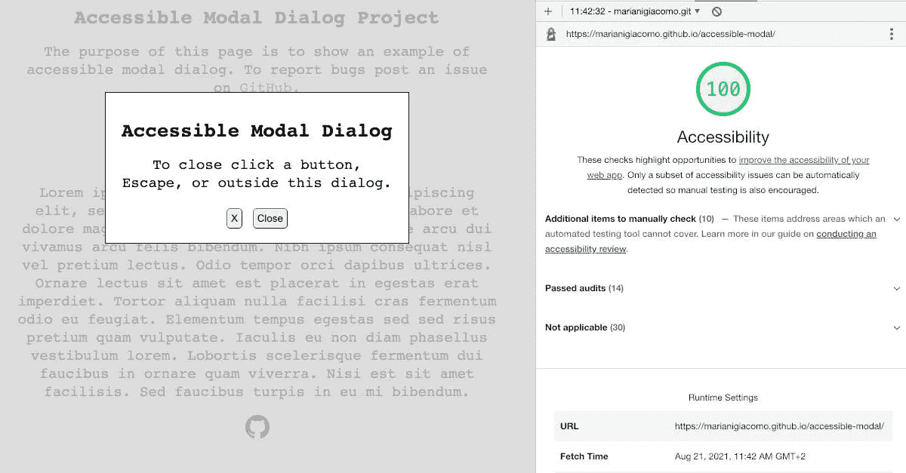

# 具有 HTML、CSS 和 JavaScript 的可访问模式对话框

> 原文：<https://levelup.gitconnected.com/an-accessible-modal-dialog-with-html-css-and-javascript-d885004d0b3a>

在这篇文章中，我想与社区分享一个我用 HTML、CSS 和 JavaScript 实现的模态对话框，它满足了由 W3C WCAG 工作组设置的测试:

1.  检查 role=dialog 是否是用作自定义对话框的容器(如 div)的属性。
2.  检查容器是否在用户交互或其他事件之后通过 JavaScript 被插入(或可见)。
3.  当对话框被激活时，检查焦点是否被设置到容器中的一个元素。
4.  当对话框处于活动状态时，检查焦点是否从未设置到不在容器中的元素。
5.  当对话框被停用时，检查焦点是否设置到最初激活该对话框的控件上。

除了这五点，我还希望模式对话框满足以下要求:

*   当用户单击 Escape 时，模式对话框关闭。
*   当用户在其可见部分之外单击时，模式对话框关闭。

# HTML 代码

在上面的 HTML 代码中，最相关的行是:

**第 12 行**:我们在 body 标签中将 [**aria-haspopup**](https://www.w3.org/TR/wai-aria-1.1/#aria-haspopup) 属性设置为“[对话框](https://www.w3.org/TR/wai-aria-1.1/#dialog)”。我也考虑过将它设置为“ [alertdialog](https://www.w3.org/TR/wai-aria-1.1/#alertdialog) ”，但是我认为这个弹出窗口并不意味着警告用户，所以“alert”角色似乎不太适合这种情况。我们设置这个属性来告诉屏幕阅读器 body 元素有一个弹出窗口。

**第 15–16 行**:这是模态的外部 div，这里:
——我们给**角色**属性“对话框”(本来可以是“alertdialog”)。
-我们将 [**aria-modal**](https://www.w3.org/TR/wai-aria-1.1/#aria-modal) 设置为 true，以便向屏幕读者表明这是一个模态元素。
-我们根据对话角色的需要指定 [aria-label](https://www.w3.org/TR/wai-aria-1.1/#aria-label) 。
-我们将 [aria-live](https://www.w3.org/TR/wai-aria-1.1/#aria-label) 设置为“assertive”，这样当对话框更新(出现)时，屏幕阅读器会立即宣布。

**第 45–46 行**:导入必要的脚本:
——模态的 JavaScript 代码(见下文)。
—[—**惰性 polyfill**](https://github.com/WICG/inert) ，将模态后面的所有内容设置为 [**惰性**](https://html.spec.whatwg.org/multipage/interaction.html#inert) ，这样不仅屏幕阅读器无法访问，键盘导航也无法访问。

# JavaScript 代码

我试图以一种不言自明的方式编写代码，但是有些部分可能需要一点解释:

**第 3 行**:我们保存当模式打开时有焦点的元素。一旦用户关闭模态(第 25 行)，这对于将焦点放回原来的位置是必要的。

**第 9 行**:我们想在用户点击模态框周围的“灰色”不透明部分(覆盖层)时关闭模态。

**第 45 行**:对于这个特殊的例子，我们可以只寻找按钮。为了提高代码的可重用性，我们还会寻找其他可以获得焦点的元素，这些元素可能位于模式对话框中。我们把焦点放在找到的第一个元素上。

**第 50 行**:这是我们需要惰性聚合填充物的部分。

# CSS 样式表

我认为 CSS 不需要太多的解释，但是我觉得应该选择 [CSS 显示属性](https://developer.mozilla.org/en-US/docs/Web/CSS/display)，而不是 [CSS 可见属性](https://developer.mozilla.org/en-US/docs/Web/CSS/visibility)，或者[隐藏属性](https://developer.mozilla.org/en-US/docs/Web/HTML/Global_attributes/hidden)。

在覆盖图中使用*可见性*，将需要(为了安全起见)设置*可见性*来“继承”子元素，因为如果元素的后代将*可见性*设置为*可见性*，那么它们将可见。另外，如果位置未设置为*固定*或*绝对*，即使不可见，元素仍会占用空间。所以使用*显示*属性感觉更安全，并且节省了一行代码。

使用*隐藏*属性的风险在于，在具有*隐藏*属性的元素上更改 CSS *显示*属性的值会覆盖*隐藏*属性的行为。所以我觉得使用 CSS *display* 属性会更安全。

在使用*显示:【无】*作为默认显示时，iOS Safari + VoiceOver 中的[似乎有一个 bug](https://www.tpgi.com/the-current-state-of-modal-dialog-accessibility/) ，但提到它的帖子已经超过两年了，我无法找到更多关于它的信息，在测试它时，我没有遇到提到的 bug。

你可以在 GitHub 上看到 [**完整项目或者在这里**](https://github.com/MarianiGiacomo/accessible-modal) 看到 [**。如果您发现了错误或改进方法，请发表评论，或者提交一个**](https://marianigiacomo.github.io/accessible-modal/)**[问题](https://github.com/MarianiGiacomo/accessible-modal/issues)。**

如果你觉得这篇文章有用，想感谢我，你可以[请我喝杯咖啡](http://buymeacoff.ee/jamomani)。