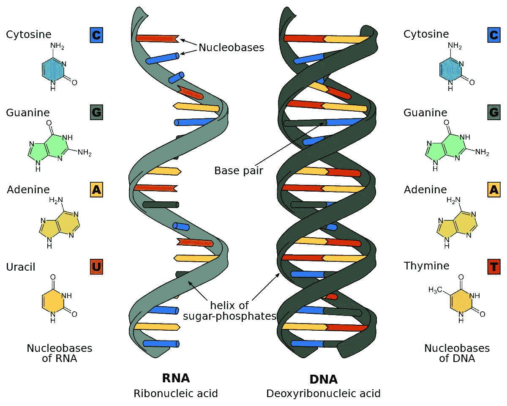

# 一种拯救了生物学并塑造了现代医学的算法

> 原文：<https://levelup.gitconnected.com/an-algorithm-that-saved-biology-shapes-modern-medicine-b242510949b8>

## 发现模式是生物学研究的重要组成部分。


照片由[飞:D](https://unsplash.com/@flyd2069?utm_source=medium&utm_medium=referral) 在 [Unsplash](https://unsplash.com?utm_source=medium&utm_medium=referral)

无论是在 DNA、RNA 或蛋白质中的一串氨基酸中寻找重复模式，模式匹配的应用都可以在许多地方找到。

让我们深潜吧！

# 人类的 DNA

细胞的遗传信息存在于细胞核中(也存在于线粒体中，但那是以后的事了)。

这些信息是以 DNA(脱氧核糖核酸)的形式存在的，它被构造成染色体。


沃伦·乌莫在 [Unsplash](https://unsplash.com?utm_source=medium&utm_medium=referral) 上拍摄的照片

人类 DNA 是一种聚合物，由称为核苷酸的单体形成的两条链组成。

这种聚合物非常长，含有数百万个核苷酸。

这些链相互缠绕，形成双螺旋结构。

每条链中有四种类型的核苷酸，它们是:

*   腺嘌呤(甲)
*   胸腺嘧啶
*   鸟嘌呤
*   胞嘧啶



图片来自维基百科(忽略图片的 RNA 部分)

# 开创性的研究

假设我们的研究小组发现，如果一个人的 DNA 中存在核苷酸(基因)序列，就会导致早期心脏病发作。

电视上都在播，人们聚集在一起做 DNA 测试。

如果我们对一个人的 DNA 进行测序，我们将得到一长串数百万个核苷酸。

```
ATCGATGCAAGGTCGATCGATGCGCGCTAGCGATCGGCATCGATCGAGTCGATCGATCGATCGA...
```

对于人类来说，搜索我们感兴趣的序列是一项耗时且乏味的任务，因此我们需要一台计算机来帮助完成这项任务。

# 程序员介入

假设我们的研究小组里有一个程序员。

我们要求他们编写一个算法，可以在我们的长串核苷酸中找到这种模式。

# 问题陈述

一个问题陈述被公式化，明确地提到我们需要我们的计算机做什么。

> *给定两个字符串:*
> 
> *-DNA 中所有核苷酸的字符串(* `*dna*` *)*
> 
> *-感兴趣基因的字符串(* `*gene*` *)*
> 
> *在* `*dna*`中找到所有出现的 `*gene*`

# *天真的解决方案*

*程序员开始用蛮力方法来解决这个问题。*

## *步伐*

*   *我们将`dna`的长度保存在`dna_length`变量中，将`gene`的长度保存在`gene_length`变量中。*
*   *我们将`pointer_1`设置为`dna`字符串的开头，并使用`for`循环递增，直到索引`dna_length — gene_length + 1`*
*   *我们将`pointer_2`设置为`gene`字符串的开头，并使用`while`循环递增它*
*   *`if`语句检查两个指针索引处的核苷酸是否相等。*
*   *如果是这种情况，`pointer_2`递增，否则`pointer_1`递增。*
*   *如果`pointer_2`横跨`gene`的整个长度，并且能够与最后一个核苷酸匹配，我们打印出已经找到匹配。*

*干得好！*

*但是这个算法有效率吗？*

*该算法运行于:*

*   *时间复杂度为 O ( `gene_length * (dna_length — gene_length + 1)`)，因为我们在两个字符串中循环。*
*   *O(1) 的空间复杂度，因为我们没有创建任何新的中间数据结构供我们的算法使用。*

# *一种有效的方法:Knuth–Pratt-Morris 算法*

*Knuth-Pratt-Morris 算法中的步骤**！***

*根据 Wikipedia 的定义，该算法通过观察当出现不匹配时，第一个字符串本身包含足够的信息来确定下一个匹配可以从哪里开始，从而绕过对先前匹配的字符的重新检查，来搜索一个字符串在另一个字符串中的出现。*

*这个搜索算法的时间复杂度是`O(dna_length + gene_length )`。*

*这个搜索算法的空间复杂度是`O(gene_length )`。*

*但是算法是如何在线性时间内做到这一点的？*

## *神奇的成分*

*为了在线性时间内执行模式搜索，该算法执行一个步骤，其中对`gene`字符串进行预处理，以构建包含最长固有前缀的中间数组，该前缀也是该字符串的固有后缀。*

*迷茫？让我们把事情弄清楚。*

***例 1***

*让我们取一个`gene`字符串，即`ATGA`*

*该字符串的前缀为`A`、`AT`、`ATG`、`ATGA`。*

*这个字符串的后缀是`A`、`GA`、`TGA`、`ATGA`。*

*当我们考虑适当的前缀和后缀时，我们分别排除整个字符串的前缀和后缀。*

*因此，这个字符串的正确前缀是`A`、`AT`、`ATG`(不包括`ATGA`)。*

*这个字符串合适的后缀是`A`、`GA`、`TGA`(不包括`ATGA`)。*

***例二***

*让我们取另一个`gene`字符串，即`ATATAGTA`。*

*让我们创建一个数组，它包含最长的前缀，也是字符串的后缀。*

```
*|A|T|A|T|A|G|T|A|[0,0,1,2,3,0,0,1]*
```

*查看子串，直到索引`2`，即`ATA`*

*它的正确前缀是`A`、`AT`*

*它的专有后缀是`A`、`TA`*

*最长的固有前缀也是该子串的固有后缀是`A`。它的长度是`1`。因此，我们将`1`放在数组的这个索引处。*

***例 3***

*查看子串，直到索引`4`，即`ATATA`*

*它的正确前缀是`A`、`AT`、`ATA`、`ATAT`*

*它的适当后缀是`A`、`TA`、`ATA`、`TATA`*

*也是该子串的适当后缀的适当前缀是`A`和`ATA`。*

*其中最长的`ATA`的长度为`3`。*

*因此，我们将`3`放在数组的这个索引处。*

## *创建中间数组*

*让我们写一个生成这个中间数组的函数。*

*该函数使用两个指针`i`和`j`，分别位于索引`1`和`0`处。*

*该函数将返回中间数组，即`[0,1,2,0,1,2,3,3]`。*

## *在 DNA 中寻找我们感兴趣的基因*

*为此，我们将使用两个指针。*

*`i`是`dna`字符串上的指针。*

*`j`是`gene`字符串上的指针。*

*在搜索时，我们试图将基因中的每个核苷酸与 DNA 中的核苷酸进行匹配。*

*但是这将使我们像在天真的方法中一样遍历两个字符串。*

*为了避免这种情况，我们使用中间数组来决定下一个要匹配的字符(避免匹配的字符)，即根据我们生成的中间数组`arr`改变`j`。*

*我们来试试吧！*

*这将输出到:*

```
*Gene found at index 0
Gene found at index 2
Gene found at index 4
Gene found at index 6
Gene found at index 8
Gene found at index 10
Gene found at index 12
Gene found at index 14*
```

*这就是 Knuth-Pratt-Morris 算法如何使事情变得简单并为生物学家节省时间！*

# ***资源***

*[](https://en.wikipedia.org/wiki/Knuth%E2%80%93Morris%E2%80%93Pratt_algorithm) [## 克努特-莫里斯-普拉特算法-维基百科

### 在计算机科学中，Knuth-Morris-Pratt 字符串搜索算法(或 KMP 算法)搜索一个…

en.wikipedia.org](https://en.wikipedia.org/wiki/Knuth%E2%80%93Morris%E2%80%93Pratt_algorithm)  [## 用我自己的话说就是 Knuth-Morris-Pratt 算法

### 在过去的几天里，我一直在阅读 Knuth-Morris-Pratt 字符串搜索算法的各种解释…

jakeboxer.com](http://jakeboxer.com/blog/2009/12/13/the-knuth-morris-pratt-algorithm-in-my-own-words/) [](https://www.geeksforgeeks.org/kmp-algorithm-for-pattern-searching/) [## 模式搜索的 KMP 算法

### 给定一个文本 txt[0..n-1]和模式 pat[0..m-1]，写一个函数 search(char pat[]，char txt[])打印所有…

www.geeksforgeeks.org](https://www.geeksforgeeks.org/kmp-algorithm-for-pattern-searching/) 

*感谢您阅读本文！*

*如果你是 Python 或编程的新手，可以看看我的新书《没有公牛**t 学习 Python 指南**’***下面:**

[](https://bamaniaashish.gumroad.com/l/python-book) [## 学习 Python 的无牛指南

### 你是一个正在考虑学习编程却不知道从哪里开始的人吗？我有适合你的解决方案…

bamaniaashish.gumroad.com](https://bamaniaashish.gumroad.com/l/python-book) [](https://bamania-ashish.medium.com/membership) [## 通过我的推荐链接加入 Medium——Ashish Bama nia 博士

### 阅读 Ashish Bamania 博士(以及 Medium 上成千上万的其他作家)的每一个故事。您的会员费直接…

bamania-ashish.medium.com](https://bamania-ashish.medium.com/membership)*