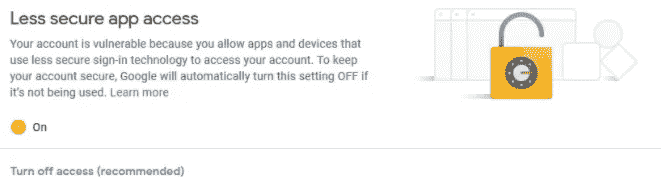
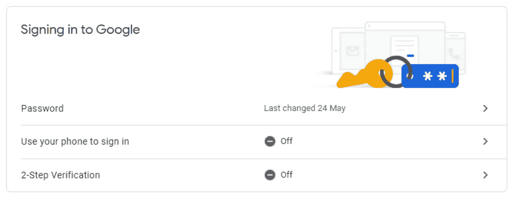
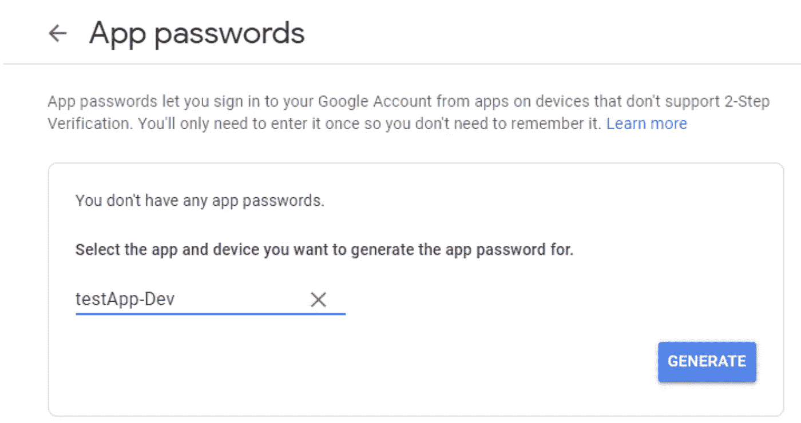

# 用 Python 发送电子邮件的另一种方式

> 原文：<https://levelup.gitconnected.com/an-alternative-way-to-send-emails-in-python-5630a7efbe84>

## 停止使用您的 Google 密码以编程方式登录，并在 Python 中发送电子邮件。

布雷特·乔丹在 [Unsplash](https://unsplash.com?utm_source=medium&utm_medium=referral) 上的照片

# 这篇文章有什么不同

在大多数教程中，建议的方法需要

1.  您的谷歌(Gmail)密码以编程方式登录
2.  在 Google 帐户上打开“不太安全的应用程序访问”

开启“不太安全的应用程序访问”是允许编程访问的“传统”方式

停止在你的代码中使用你的谷歌密码。即使使用了环境变量，也可能发生错误，泄露您的 Google 凭据可能是您最糟糕的噩梦。

随着安全意识的增强，强烈建议在你的谷歌账户中设置两步验证，如果还没有的话。但是，启用两步验证后，您会发现:

*   “不太安全的应用程序访问”选项在谷歌中不再可见
*   使用您的 Google 密码进行程序化登录只需满足两步验证中的一步

本质上，你现在被禁止以编程方式访问你的谷歌账户。那么，我们如何从这里着手呢？

介绍 **App 密码。**应用程序密码是一个生成的 16 字符密码，允许您从不支持两步验证的应用程序(在我们的例子中，是电子邮件程序)登录您的 Google 帐户。

# 结构

本教程分为两个部分:

1.  从 Google 生成应用程序密码
2.  编程:用 Python 发送电子邮件

# 生成应用程序密码

首先，我建议设置一个新的 Google 帐户作为本教程的开发环境，而不是直接在您想要的(生产/个人)Google Gmail 帐户中实现。让我们开始吧。

1.  建立一个谷歌账户。如果您使用的是现有的 Gmail 帐户，请跳过这一步；如果帐户启用了两步验证，请跳到第 4 步。
2.  登录您的 Google 帐户后，导航至"*管理您的 Google 帐户* t" > " *安全* " > " *隐私设置*

启用两步验证来保护您的 Google 帐户。一旦完成，应用程序密码应该是可见的。

3.按照屏幕上的说明设置两步验证。启用两步验证后，应该可以看到**应用程序密码**选项。

> ❗ **App 密码**只能在两步验证开启后生成

4.在应用程序密码下，从“*选择应用程序*”下拉列表中选择“*其他(自定义名称)*”。给它一个名字作为你自己的标识。点击“*生成*”，应生成一个 16 位字符的代码(格式为`xxxx-xxxx-xxxx-xxxx`)。

输入自定义名称作为应用程序密码的标识符

> ❗将这 16 个字符的代码复制到剪贴板/记事本中，因为这是它唯一一次显示。否则，你必须重复这一步，以获得另一组密码

# 编程:用 Python 发送电子邮件

我们将使用内置模块通过 SMTP ( `smtplib`)发送电子邮件。你可能会问，什么是 SMTP？

类似于 HTTP 是用于通过互联网发送网页的协议，*简单邮件传输协议* (SMTP)是用于在邮件服务器之间发送电子邮件和路由电子邮件的协议。

## 第 1 部分:设置 SMTP 配置

因为我们使用 Gmail，Gmail 的 SMTP 服务器域名，所以使用`smtp.gmail.com`。其他常见电子邮件提供商如 Outlook 和 Yahoo Mail 的域名分别为`smtp-mail.outlook.com`和`smtp.mail.yahoo.com`。

我们将使用`SMTP()`和 TLS 加密(`starttls()`)。因此，我们将连接到 SMTP 服务器上的端口`587`。如果您使用 SSL ( `SMTP_SSL()`)，您将改为连接到端口`465`，但这超出了本教程的范围。

设置发送电子邮件的 SMTP 服务器配置

这里，`password`应该是之前复制的 16 个字符的密码(没有连字符`—`)。我还建议使用环境变量(或者使用`export`命令，或者将其存储在`.env`文件中)。

***有用的招数:***

假设用来设置(`sender_email`)的谷歌邮箱地址是`test@gmail.com`。Gmail 有一个很酷的功能，你可以在`@`前添加`+`来修改你的电子邮件地址，但邮件仍然会在`test@gmail.com`时出现在你的收件箱里。

例如，`test@gmail.com`也会收到发送给`test+user1@gmail.com`、`test+user2@gmail.com`的电子邮件。

## 第 2 部分:构建电子邮件

这里，我们使用了来自`email`包的 MIME(多用途互联网邮件扩展)模块`mime`。初始步骤包括:

*   通过创建一个`MIMEMultipart`对象来初始化消息。
*   向电子邮件提供信息，如`Subject`、`From`、`To`字段。

初始化消息实例并提供电子邮件信息，如主题、发件人和收件人。

**邮件内容:**

通常，这是电子邮件中三种常见的内容类型。

1.  纯文本和 HTML 内容
2.  图像(PNG、JPEG)
3.  PDF、图像、CSV 文件(任何其他附件)

让我们从简单的纯文本开始。我们将使用`MIMEText()`，以纯文本作为第一个参数，以`'plain'`作为第二个参数。在创建这个主体之后，我们需要将这个部分附加到我们的`msg`对象上。

如果你正在考虑电子邮件中的文本格式(**粗体**、*斜体、*、[超链接](https://linkedin.com/in/jia-wei-teh))，HTML 内容会很方便。为此，我们也将使用`MIMEText(),`，但将`'html'`作为第二个参数传递。

将纯文本和 HTML 内容作为正文附加到邮件中

如果我想附上一张图片怎么办？我们可以使用如下所示的`MIMEImage`:

将图像文件附加到邮件正文

然而，通常您会想要附加多种类型的附件，决定使用哪种 MIME 类型可能会令人困惑。为了克服这一点，我们将使用`MIMEApplication`，而不管附件的类型。它的一般实现如下:

将常规附件文件附加到邮件正文

现在我们已经将所有相关信息附加到`msg`中，是时候实际发送电子邮件了。

## 第 3 部分:发送电子邮件

类似于在界面上使用 Gmail，在*‘点击’*`Send`按钮之前，需要一系列步骤，例如建立到 Gmail 的连接并登录。

*   **连接到 SMTP 服务器。**`server`变量是一个 SMTP 对象，表示与已配置的 SMTP 服务器的连接。
*   **确认连接。**`ehlo()`是问候 SMTP 电子邮件服务器的传统方式，类似于你“打招呼”以确认你已连接并能听到他们。
*   **开始 TLS 加密。**要为您的连接启用加密，您需要调用`starttls()`方法。

*   **登录服务器。**一旦建立了到 SMTP 服务器的安全加密连接，您就可以通过调用`login()`使用您的用户名和密码登录。
*   **(实际上)发送邮件。**登录 Gmail 的 SMTP 服务器后，调用`sendmail()`发送邮件内容(之前编译的邮件正文)。
*   **断开与服务器的连接。**发送邮件后，一定要呼叫`quit()`断开与 SMTP 服务器的连接。

# 将这些点连接起来

就是这样。我们已经剖析了这个过程的每一个部分。请参考下面的完整代码。我还包括了字符串格式，以演示如何创建动态消息。

感谢阅读！我希望这篇文章对你正在从事的任何项目都有帮助。如果您有任何问题或反馈，请随时发表评论。

您可以在 [Medium](https://jiaweiteh.medium.com) 上关注我即将发布的帖子，并在 [Twitter](https://twitter.com/jia_wei_teh) 上找到我。