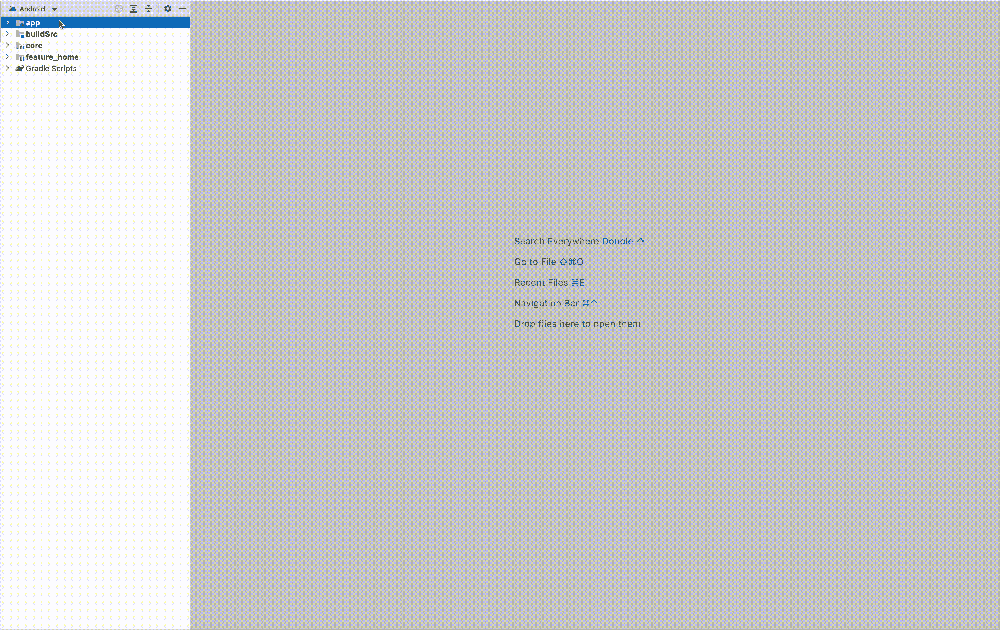

# 一个 Android Studio 模板项目，用于您的 Android 应用程序

> 原文：<https://levelup.gitconnected.com/an-android-studio-template-project-for-your-android-apps-ca9ed9002f5>

## 一个已经配置了模块化和库的项目，这样你就不需要每次想构建一个新的应用程序时都重新开始

由 [Diana Polekhina](https://unsplash.com/@diana_pole?utm_source=medium&utm_medium=referral) 在 [Unsplash](https://unsplash.com?utm_source=medium&utm_medium=referral) 上拍摄的照片

当申请 Android 开发人员的新工作时，公司通常要求他们的技术面试有三项任务。

解决两三个编码挑战，回答几个理论问题，最后，构建一个小应用程序，包括从 API 获取数据，并根据面试的其他要求在 UI 中显示数据。

在申请了几份工作后，我意识到我正在使用相同的库和架构构建相同的应用程序，我厌倦了一遍又一遍地编写相同的代码。

如果我想尝试新的想法或引起我注意的 Android 库，我必须重新做同样的配置。这就是为什么我决定创建一个可以用作模板的 Android Studio 项目。

今天，我想与你分享这个项目，这样每个人都可以使用它，并建议我可以改善它的变化。

> 如果你想从一个高度模块化的项目中获得一些灵感，而不是仅仅使用一个模板，我建议你看看谷歌的这个 [GitHub 仓库](https://github.com/android/nowinandroid)，但在我看来这有点太多了。

我试图保持简单，不要太疯狂，使用一个简单的模块化架构和我经常使用的 3-5 个库。

现在我们要看看这个项目附带了什么，以及在使用它之前你需要考虑什么。

# 特征

在这个项目中，我认为有三个特性是最有价值的。

## 模块化

该项目由三个主要模块和数量可变的功能模块组成。

*   **app:** 是安卓应用，app 的入口。想法是这个模块重定向到你想要的任何东西。在本例中，我们将从这里启动在`feature_home`模块中实现的屏幕。
*   **core:** 是一个 android 库，包含该应用程序的每个其他模块使用的代码，例如我们希望从功能模块中使用的自定义视图，或者翻新或房间的特定实现。
*   **buildSrc:** 这个模块有一些变量，我们将使用 Kotlin DSL 在 Gradle 文件中使用这些变量。在这种情况下，它带有一些函数，可以增加应用程序的`versionCode`和`versionName`以及所使用的库的版本号。
*   这将是我们为应用程序的每个功能提供的众多 android 库之一。在这个功能模块内部，想法是应用某种形式的轻型[清洁架构](https://medium.com/android-dev-hacks/detailed-guide-on-android-clean-architecture-9eab262a9011)。在我的例子中，我使用了数据层、域层、依赖注入层和表示层，您可以在核心模块中查看，以获得一个示例来指导您。

## 格雷尔·科特林 DSL

我更喜欢在 Gradle 中使用 Kotlin 而不是 Groovy，这只是我喜欢与 buildSrc 模块匹配的个人偏好。老实说，这没什么大不了的。只是使用的库，它们的版本…

我还应用了收缩和模糊来减少应用程序的大小和配置，以签署应用程序的`release`构建变体，但我把它留了下来。这是因为当我使用这个项目来尝试一些东西时，我并不真的需要它，而目前这将是模板对我的主要用途。

> 这里我有一个[帖子](https://medium.com/gitconnected/simple-tips-to-optimize-android-apps-334355a318d5)，在那里我深入探讨了收缩和模糊，以及如果你对这个话题感兴趣，它如何改进你的应用。

## 图书馆

我已经为我经常使用的基本东西添加了项目库。

我们有**房间**来存储本地数据。在我的例子中，我通常使用它来保持缓存与我正在使用的任何 API Rest 同步，这样我就不必在每次需要不需要定期更新的数据时都进行调用。

从**室**或 API 中检索数据的决策逻辑是我通常在存储库类或任何[用例](https://proandroiddev.com/why-you-need-use-cases-interactors-142e8a6fe576)中实现的，我真的看不出这两个选项之间有什么区别。

为了管理 API，我设置了**改进**服务实例。它包含在一个文件中，基本配置是用 **Gson** 解析对象，并从`local.properties`文件中读取 API 密钥。

您可以将调用 API 的函数提取到另一个文件中，如果您计划添加许多调用，我建议您这样做。

对于视图，我决定使用 **Jetpack Compose** ，因为我想开始抛弃传统的 XML。尽管如此，我也设置了 **ViewBinding** ，但是我把它留了注释，稍后会详细介绍。

对于依赖注入，我使用**手柄**，因为我觉得它比匕首更容易使用。我也想过使用 Koin，但我更喜欢保留一个由 Google 团队直接支持的库。

> 在未来，我想加入这个项目的测试，所以如果你有兴趣，请继续关注。

# 设置

对于设置，我们将了解如何启用 ViewBinding，如何配置`local.properties`文件，以及如何在项目中添加更多功能模块(如果您还没有这样做的话)。

## 视图绑定设置

让我们从 ViewBinding 开始。该项目默认为 compose，但如果您喜欢 ViewBinding，您必须转到应用程序的`build.gradle.kts`文件，删除`compose = true`子句，并取消注释文件底部的`viewBinding = true`和依赖项。

之后，转到`MainActivity.kt`，取消注释您看到的代码。我也把说明留在那个文件里了。然后，您可以删除 Compose 的所有依赖项和代码。

## 本地属性和功能模块

该项目读取`local.properties`文件来读取 API 密钥，因此向该文件添加一个`API_KEY`变量，或者如果您不打算使用它，只需删除改型。我更喜欢添加东西，尽管它们不会被使用，因为删除一些东西总是比试图记住如何配置它更容易。

最后，为了创建新的功能模块，你可以在下面的 GIF 中看到如何做，以防你从未做过。重要的是要注意，这些是 Android 库，而不是 Android 应用程序或其他类型的模块。

# GitHub 知识库

如果你喜欢你读到的，这里我分享了一个 GitHub repo 的链接和模板，如果你想用的话。

不要忘记留下你认为可以改进模板的任何意见或建议，或者你想分享的评论😅。

 [## GitHub-moli dev 8/Android-模板

### 此时您不能执行该操作。您已使用另一个标签页或窗口登录。您已在另一个选项卡中注销，或者…

github.com](https://github.com/molidev8/android-template) 

如果你想阅读更多这样的内容，并支持我，不要忘记检查我的个人资料，或给媒体一个机会，成为会员，以获得我和其他作家的无限故事。这只是 5 美元一个月，如果你使用这个链接，我会得到一小笔佣金。

 [## 通过我的推荐链接加入 Medium—Miguel

### 阅读米格尔的每一个故事(以及媒体上成千上万的其他作家)。你的会员费直接支持米盖尔…

medium.com](https://medium.com/@molidev8/membership)