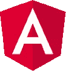
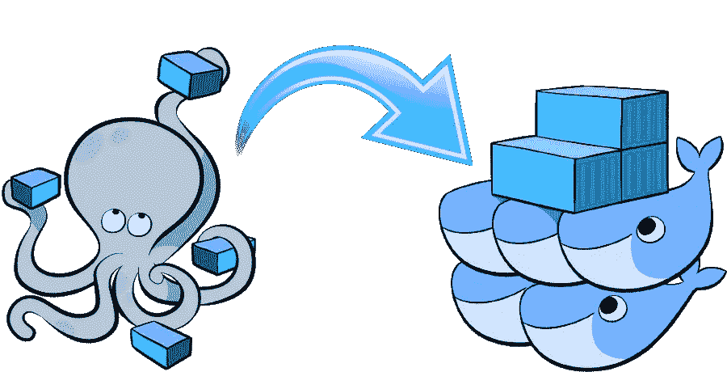
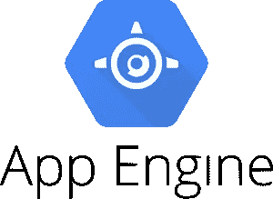
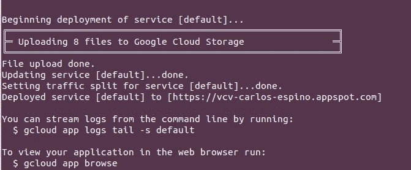

# 一个角度模板来创建您的虚拟简历

> 原文：<https://levelup.gitconnected.com/an-angular-template-to-create-your-virtual-curriculum-vitae-587f8700247d>

一段时间以来，我一直在考虑建立自己的个人网站，类似于虚拟简历，在那里我可以谈论我自己、我的经历或我的个人项目。剧透警告，[我做到了](https://carlos.espino.codes)！


我开始工作是为了提高我的前端技能，这个小项目可以作为培训。然而，随着时间的推移，我改变了主意。我意识到我可以扩展它的潜力，并将其作为模板分享给其他人，这样任何人都可以通过在一些文件中填写信息来使用我的代码创建他们自己的虚拟简历。

听起来很酷，不是吗？让我向你解释你如何能做到这一点，但首先，让我们开始谈论一点关于技术和如何应用程序的结构。

网站是用 Angular 开发的，Angular 是 Google 开发的一个开源的 web 应用框架，更具体的说， **Angular 7** 。



作为一名全栈开发人员，在最近的项目中，我一直使用 Angular 作为前端的主要工具。也许这么说听起来我应该已经掌握了框架，但是，在我们之间，我会告诉你真相。我是一个后端的家伙，所以在这个项目中，我打算做更多的后端工作，而我的同事(前端家伙)做前端的事情。我并不是说我没有在前面做任何事情，我已经创建了许多组件、服务、接口、测试……但是所有复杂的事情，如在模块中构建应用程序、路由、拦截器……都是我的同事做的，所以我决定是时候学习如何做了，所以我来了。

# 是如何构建的

该应用程序分为 7 个模块(关于，培训，经验，技能，项目，文章和联系)，每个模块都包含自己的模型，服务，组件和作为最重要的功能之一，以创建一个模块，一个路由和一个模块文件。我知道这是一个非常简单的应用程序，我可以把所有东西都放在同一个模块中，应用程序就可以流畅地运行了。然而，由于我只是想练习和学习如何做，我就这样做了。

将您的应用程序分成模块是一种简洁的方式，它有助于您组织应用程序，并使您的代码可共享和可重用(因为模块包含了它们需要的所有逻辑)，但这还不是全部，如果您使用延迟加载(一种根据需要加载模块的设计模式)来加载您的模块，它将保持初始捆绑包较小，这反过来有助于减少加载时间，因为它只在需要时加载模块，而不是在应用程序启动时加载。

> 默认情况下，NgModules 会被急切地加载，这意味着应用程序一加载，所有 NgModules 也会加载，不管它们是否是立即需要的。对于有很多路由的大型应用程序，考虑延迟加载——一种按需加载 NgModules 的设计模式。惰性加载有助于保持较小的初始包大小，从而有助于减少加载时间。
> 
> 摘自[角度指南](https://angular.io/guide/lazy-loading-ngmodules#lazy-loading-feature-modules)。

如果你想学习怎么做，可以访问[官方文档](https://angular.io/guide/lazy-loading-ngmodules)。

正如我在帖子开头提到的，这个项目改为可共享虚拟简历的主要原因，所以让我告诉你如何才能做到这一点。

# 您想将其用作模板吗？

克隆项目后，要将它用作您的虚拟 CV，您只需更改 3 件事:

1.  信息:
    在`vcv_client/src/assets`文件夹中，你会找到所有你必须修改的 JSON 文件，以便显示你的个人信息。一旦模块被加载，它就被加载到每个模块的服务中。
2.  标题:
    如果你不想让我的名字出现在浏览器标签中(我不介意你把它留在那里呵呵)，你必须去`index.html`把你想显示的任何标题放在`<title>`标签中。
3.  关于我的部分:
    这是你必须自己做更多事情的地方，因为你必须创建你自己的关于我的部分。

关于样式，你有两种可能性，你可以使用主分支作为你的模板，使用我的，或者你可以使用`feature/cv_template`，它没有应用样式，自己做所有的花哨的东西。

有了这些更改，您就可以开始部署并准备好接受访问了:)但是…我想您会希望在部署应用程序之前先看看它，所以让我向您解释一下如何在本地进行尝试。

# 在本地试用该应用程序

在这一部分，我想谈谈我的开发环境。

我没有太多的经验(仅仅 2 年)，但是我意识到当你在更多的项目中工作时，你最终会在你的计算机中有许多不同版本的 Java、Python、Angular……有时选择你想要使用的确切版本来正确运行特定的应用程序是很乏味的。

这就是为什么我喜欢用 **Docker** 将我的环境容器化，用 **docker-compose** 协调一切，然后我只需运行一个命令，我就可以让应用程序在我想要的环境中运行，没有任何依赖性问题。更重要的是，这很容易与您的同事分享，帮助团队专注于开发，并促进新开发人员的进入。



在[仓库](https://github.com/CarlosEspinoTimon/vcv)中，有一个名为`local_environment`的文件夹。在这个文件夹中，你会发现一个 **Makefile** ，它将帮助你与容器通信，一个**脚本**，它创建一个。env "文件，其中包含您的用户 ID 和组 ID(我将解释为什么我们需要它)以及一个帮助您运行容器的 **docker-compose** 文件。

要在本地运行应用程序，您必须位于 local_environment 文件夹中并运行:

1.  `make create-env`
2.  `make build`
3.  `make init`

前两个说明只是第一次。

make create-env 生成一个。包含您的用户 ID 和组 ID 的 env 文件。这些变量在 docker-compose.yaml 中使用，然后在构建映像时传递给 Dockerfile。

> 默认情况下，运行容器中所有内容的用户是 root，因此如果您在容器中创建新组件或服务之类的东西，它将作为 root 拥有的文件在您的主机文件系统中创建。由于我们正在传递您的用户的用户 ID 和组 ID，因此在构建映像时，我们将在运行应用程序的容器内创建一个非 root 用户，这将允许您在文件系统中创建将由您的用户拥有的文件。

`make build`从 Dockerfile 文件构建图像。

`make init`启动在`docker-compose.yaml`中声明的服务，共享一些端口(4200 用于应用程序，9876 用于测试)和卷(将您计算机中的代码与容器内的代码共享)。一旦你运行这个命令，你将开始看到服务器日志，在应用程序完成编译后，你可以进入[你的网络浏览器](http://localhost:4200/)并看到应用程序运行。

如果您需要生成一个新的组件或者安装一些依赖项，您必须访问容器并运行其中的命令。您可以通过运行以下命令来访问:

```
make access-frontend
```

一旦进入容器，就可以像在非容器化环境中一样创建组件或安装依赖项。

# 如何在 Google App Engine 中部署应用



我已经准备好了项目，很容易在谷歌应用引擎部署。一旦你决定你的应用已经准备好被部署，你只需要从`local_environmet`文件夹运行下一个命令(当服务正在运行的时候):

```
make build-prod
```

该命令构建项目并生成在生产中部署所需的所有文件。我更改了 angular.json 文件以在`vcv_client/GAE_deployment`目录中构建项目，使用这种方法可以很容易地控制将要上传的文件数量，因为 Google App Engine 对每个版本(10.000)允许的文件数量有限制。在`vcv_client/GAE_deployment`文件夹中你也会找到一个`app.yaml`。

> 您可以在 app.yaml 文件中配置 App Engine 应用程序的设置。该文件指定 URL 路径如何对应于请求处理程序和静态文件。app.yaml 文件还包含有关应用程序代码的信息，如运行时和最新版本标识符。
> 
> 摘自[谷歌云文档](https://cloud.google.com/appengine/docs/standard/python/config/appref)。

一旦生成了代码，就可以部署应用程序了。为此，您必须转到`vcv_client/GAE_deployment`文件夹并运行下一个命令:

```
gcloud app deploy
```

> *请记住，您必须在谷歌云上有一个项目，并且配置了谷歌云 SKD，您可以使用:*
> 
> g 云初始化

你必须等到上传完成，一旦结束，终端会显示如下信息:



您将能够在[https://NAME _ OF _ YOU _ project . appspot . com](https://NAME_OF_YOU_PROJECT.appspot.com)中看到您的虚拟简历

你可以在我的回购中看到代码:

[https://github.com/CarlosEspinoTimon/vcv](https://github.com/CarlosEspinoTimon/vcv)