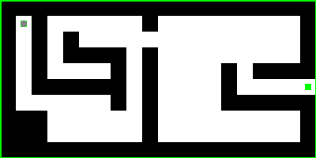
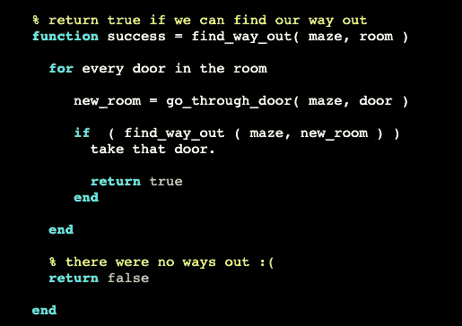

# Python 中深度优先搜索路径的动画指南

> 原文：<https://levelup.gitconnected.com/an-animated-guide-to-implementing-dfs-in-python-to-find-a-path-1e939b7b8599>

## 深度优先搜索教程。递归算法介绍。



寻找路径的方法之一是一种称为“深度优先搜索”的递归算法。如果你认为递归只在寻找阶乘时需要，你会感到惊讶。

因为我们动画化了我们的算法，所以我们不会遍历所有组合并找到最短路径。我们至少会找到一条路，并且会很开心。但是你当然可以继续下去，找到所有可能的组合，但是你最好在一个正常的图形中，而不是在一个迷宫中。

## 我们什么时候需要它？

好问题，谢谢提问。

用它在迷宫中寻找路径并不是一个好主意，但我们在这里这样做是为了简化可视化。

如果你需要寻找不同的路径组合，使用这个算法是很好的。例如，如果您有 5 栋房子，并且您想要查看哪条路径最适合访问每栋房子。广度优先搜索算法只会显示到每个房子的最短路径，而不是穿过所有房子的路径。

## 复杂吗？

嗯。你什么意思？

从复杂性的角度来说，的确非常复杂。它甚至不是多项式，而是指数。使用之前请三思:)有时，我们没有其他选择。而且是 NP 完全的。

从实施起来有多复杂的意义上来说，不，它很简单。但是你需要理解递归。

## 很好。什么是递归？

递归函数是调用自身的函数。

让我们看看犹他大学网站上的一个 Matlab 例子:



来源:https://www.cs.utah.edu/

这里可以看到第 4 行又在调用“find_way_out”了。慢慢看这个例子，写的很好，应该很清楚。

## 初始化迷宫

这是我们的迷宫，我取自[我的另一篇文章，在那里我们使用广度优先搜索找到一条路径](/solve-a-maze-with-python-e9f0580979a1):

```
a = [
    [1, 1, 1, 1, 1, 1, 1, 1, 1, 1, 1, 1, 1, 1, 1, 1, 1, 1, 1, 1],
    [1, 0, 1, 0, 0, 0, 0, 0, 0, 1, 0 ,0, 0, 0, 0, 0, 0, 0, 0, 1],
    [1, 0, 1, 0, 1, 0, 0, 0, 0, 0, 0 ,0, 0, 0, 0, 0, 0, 0, 0, 1],
    [1, 0, 1, 0, 1, 1, 1, 1, 0, 1, 0 ,0, 0, 0, 0, 0, 0, 0, 0, 1],
    [1, 0, 1, 0, 0, 0, 0, 1, 0, 1, 0 ,0, 0, 0, 1, 0, 1, 1, 1, 1],
    [1, 0, 1, 1, 1, 1, 1, 1, 0, 1, 0 ,0, 0, 0, 1, 0, 0, 0, 0, 0],
    [1, 0, 0, 0, 0, 0, 0, 1, 0, 1, 0 ,0, 0, 0, 1, 1, 1, 1, 1, 1],
    [1, 1, 1, 0, 0, 0, 0, 0, 0, 1, 0 ,0, 0, 0, 0, 0, 0, 0, 0, 1],
    [1, 1, 1, 0, 0, 0, 0, 0, 0, 1, 0 ,0, 0, 0, 0, 0, 0, 0, 0, 1],
    [1, 1, 1, 1, 1, 1, 1, 1, 1, 1, 1, 1, 1, 1, 1, 1, 1, 1, 1, 1],
]
start_i, start_j = 1,1
end_i, end_j = 5,19
```

我们想找到一条从左上角到右边界中间出口的路径。

## 主要功能

下面是查找路径的递归函数:

```
**def** go_to(i, j):
    **global** path_so_far, end_i, end_j, a
    **if** i < 0 **or** j < 0 **or** i > len(a)-1 **or** j > len(a[0])-1:
        **return** *# If we've already been there or there is a wall, quit* **if** (i, j) **in** path_so_far **or** a[i][j] > 0:
        **return** path_so_far.append((i, j))
    a[i][j] = 2
    **if** (i, j) == (end_i, end_j):
        print(**"Found!"**, path_so_far)
        path_so_far.pop()
        **return
    else**:
        go_to(i - 1, j)  *# check top* go_to(i + 1, j)  *# check bottom* go_to(i, j + 1)  *# check right* go_to(i, j - 1)  *# check left* path_so_far.pop()
    **return**
```

这个函数相对简单:

1.  检查我们是否在边界之外
2.  检查我们是否已经去过那里
3.  如果没有，将这个单元格添加到我们的路径中(我们将在函数的末尾删除它):path_so_far.append((i，j))
4.  将此单元格标记为已访问(a[i][j] = 2)
5.  检查我们是否到达了终点，如果是，显示路径，移除此单元格并返回
6.  否则，对所有相邻单元格调用此函数
7.  从路径中移除此单元格并返回

## 不行，太复杂了。有简单的版本吗？

当然可以。这叫做广度优先搜索。

请看这里:

[](/solve-a-maze-with-python-e9f0580979a1) [## 如何在 Python 中使用 BFS 解决迷宫

### 广度优先搜索算法

levelup.gitconnected.com](/solve-a-maze-with-python-e9f0580979a1) 

如果您想要可视化的完整代码，这里有: