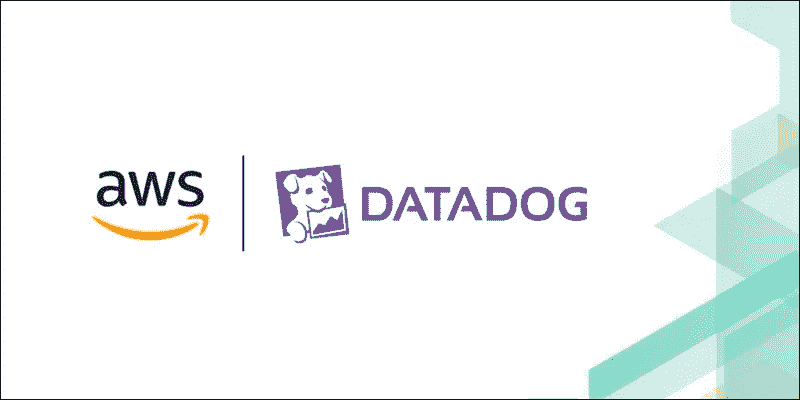
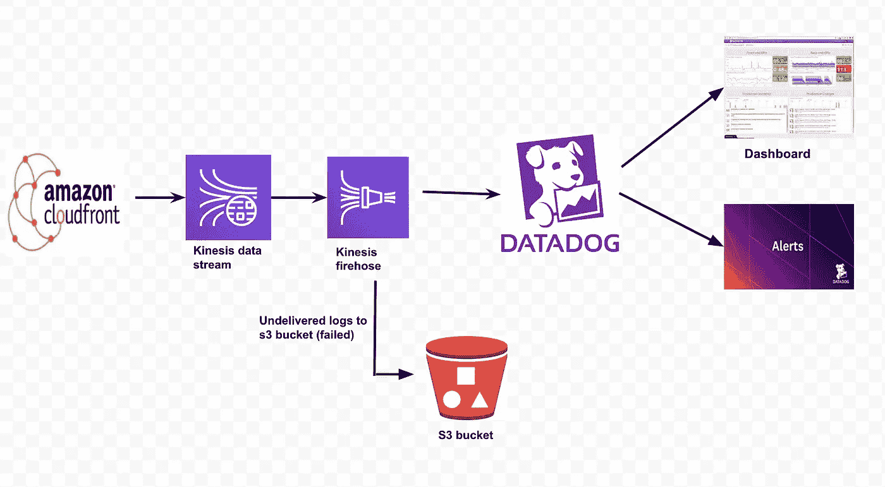
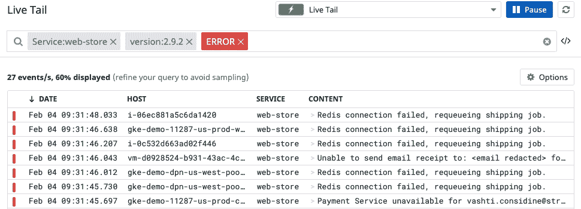

# 一种基于 Datadog 的自动气象站 CloudFront 日志分析和监控方法

> 原文：<https://levelup.gitconnected.com/an-approach-to-analyse-and-monitor-aws-cloudfront-logs-on-datadog-dacab0ca45e6>

在本文中，我们将讨论在 Datadog 上分析和监控日志所需遵循的体系结构和步骤。

亚马逊网络服务(AWS)是世界上最全面、最广泛采用的云平台，从全球数据中心提供 200 多种全功能服务。CloudFront 就是他们提供的服务之一。CloudFront 是一个内容交付网络，帮助组织/客户向他们的消费者交付内容。

另一方面，Datadog 是信息技术(IT)和 DevOps 团队的监控和分析工具，可用于确定性能指标以及基础架构和云服务的事件监控。

现在，有人可能会问，既然可以通过 Cloudwatch 实现，他们为什么还需要 Datadog？是的，你说得对。“监控 AWS 资源”是开发者考虑 Amazon CloudWatch 优于竞争对手的主要原因，而“监控许多应用程序(数据库、web 服务器等)”被认为是选择 Datadog 的关键因素。如果您正在使用或希望使用 Datadog 来监控您的各种应用程序(数据库、web 服务器等)，您也希望利用 Datadog 的惊人功能来监控您的 AWS 日志。

# 体系结构

下面是为我们的目的而设计的架构。

Cloudfront 日志到 Datadog 架构

在继续之前，让我们了解一下这个架构中使用的服务。

## AWS 云锋

Amazon CloudFront 是由 Amazon Web Services 运营的内容交付网络。内容传送网络提供了代理服务器的全球分布式网络，这些代理服务器将内容(例如网络视频或其他大容量媒体)缓存在消费者本地，从而提高了下载内容的访问速度。
对于 CloudFront 标准日志文件字段，请参考此处的。

## 自动气象站运动学数据流

亚马逊 Kinesis 数据流(KDS)是一个大规模可扩展和持久的实时数据流服务。收集的数据可在数毫秒内获得，以支持实时分析用例，如实时仪表盘、实时异常检测、动态定价等。

## AWS Kinesis 消防软管

Amazon Kinesis Data Firehose 是一项完全托管的服务，可自动供应、管理和扩展处理和加载流数据所需的计算、内存和网络资源。一旦设置完成，Kinesis Data Firehose 会在数据流到达目的地时将其持续加载到目的地。

## AWS S3 铲斗

亚马逊 S3 存储桶是亚马逊网络服务(AWS)简单存储服务(S3)中可用的公共云存储资源，这是一种对象存储产品。亚马逊 S3 存储桶类似于文件夹，存储由数据及其描述性元数据组成的对象。

## 数据狗

Datadog 是面向信息技术(IT)和 DevOps 团队的监控和分析工具，可用于确定性能指标以及基础架构和云服务的事件监控。

我们正在设置一个 Kinesis 数据流来传输 CloudFront 日志，然后使用 Kinesis firehose 将数据流加载到 DataDog。如果在向 Datadog 发送日志时出现任何故障，它们可以存储在 S3 存储桶中。在 Datadog 端，我们需要解析这些日志，提取对我们有用的字段，并在它们之上创建定制的度量。然后，这些自定义指标将用于在仪表板上创建时间序列图，从而创建监视器和警报。下面是建立上述架构的详细步骤。

# 流程步骤

## 将 CloudFront 日志推送到 Datadog

1.  确定我们想要监控其流量的 Cloudfront 分布。
2.  配置 CloudFront 发送实时日志:-
    一个 CloudFront [实时日志配置](https://docs.aws.amazon.com/AmazonCloudFront/latest/DeveloperGuide/real-time-logs.html#understand-real-time-log-config)指定日志的来源和目的地，以及它们包含的字段。要创建您的日志配置，请为配置提供一个名称，并指定它的日志采样率——由 CloudFront 生成的、您想要发送到 Kinesis 的日志的百分比。接下来，选择要包含在日志中的字段。默认情况下，您的日志配置将包括所有可用的 [CloudWatch 日志字段](https://docs.aws.amazon.com/AmazonCloudFront/latest/DeveloperGuide/real-time-logs.html#understand-real-time-log-config-fields)。
3.  创建 Kinesis 流:-
    指定一个 [Kinesis 数据流](https://aws.amazon.com/kinesis/data-streams/)作为 CloudFront 将日志发送到的端点。如果您已经有了一个想要使用的流，请在 Endpoint 字段中输入它的 [Amazon 资源名称(ARN)](https://docs.aws.amazon.com/general/latest/gr/aws-arns-and-namespaces.html) 。或者创建新的流。
4.  导航回“创建实时日志配置”页面，并将 ARN 粘贴到端点字段中。
5.  创建一个 [Datadog API 键](https://www.datadoghq.com/blog/cloudfront-real-time-logs/#configure-cloudfront-to-send-real-time-logs)，当我们创建 AWS Kinesis firehose 时将需要它。
6.  通过 Kinesis Data Firehose 将日志发送到 Datadog:-
    要将日志发送到 Datadog，请创建一个 Kinesis Data Firehose [交付流](https://docs.aws.amazon.com/firehose/latest/dev/what-is-this-service.html#key-concepts)，并选择上面创建的 Kinesis 数据流作为源。接下来，指定 Datadog 作为您的交付流的目的地。最后，输入您的 Datadog API 密钥，选择适当的 HTTP 端点 URL，并提供所需的[附加配置细节](https://docs.datadoghq.com/logs/guide/send-aws-services-logs-with-the-datadog-kinesis-firehose-destination/?tab=kinesisfirehosedeliverystream)。参见 AWS 文档，了解如何[将 Datadog 配置为 Kinesis 数据消防软管目的地](https://docs.aws.amazon.com/firehose/latest/dev/create-destination.html#create-destination-datadog)。
7.  确保在 AWS kinesis firehose 中添加键值参数，这将有助于轻松找到 Datadog 上的日志。

完成上述步骤后，您可以看到日志被发送到 DataDog，并且可以通过搜索上述步骤中创建的参数在 [Live Tail](https://docs.datadoghq.com/logs/explorer/live_tail/) 上看到。

随机活尾样本

Datadog 的后续步骤

****索引整个日志不划算，我们应该采用** [**无限制日志记录**](https://www.datadoghq.com/blog/logging-without-limits/) **的方法。创建自定义指标将为我们节省大量成本。**

## 从 Datadog 上的 CloudFront 日志中解析和创建定制指标

1.  在 Datadog 中创建一个[管道](https://docs.datadoghq.com/logs/log_configuration/pipelines/)来处理接收到的日志。
2.  [添加 Grok 解析器](https://docs.datadoghq.com/logs/log_configuration/parsing/?tab=matchers)解析日志，从日志中提取有用的字段。
3.  [在管道中添加 URL 解析器、类别处理、重映射器](https://docs.datadoghq.com/logs/log_configuration/processors/?tab=ui)来修改上面提取的字段或添加新的字段。
4.  [使用参数(在 Kinesis firehose 中添加)创建一个自定义指标](https://docs.datadoghq.com/metrics/custom_metrics/)作为过滤器，其尺寸符合要求/使用案例。

现在，我们已经准备好使用上面创建的自定义指标来创建我们的控制面板、监视器和警报。
下面是实现相同的一些参考链接:- [仪表盘](https://docs.datadoghq.com/dashboards/) & [监控器](https://docs.datadoghq.com/monitors/monitor_types/)

我希望你喜欢这篇文章，并帮助你完成你的任务。

## 如果你觉得这篇文章有用，给我倒杯咖啡:-[buymeacoffee.com/rushabh](http://buymeacoffee.com/rushabh)