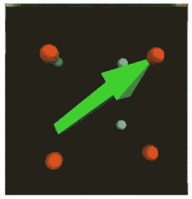
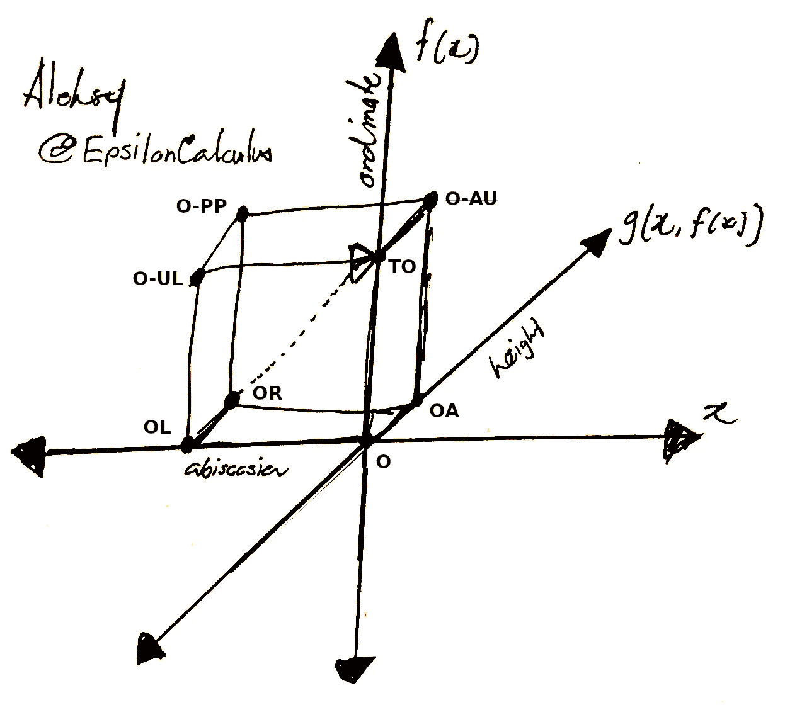
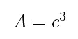
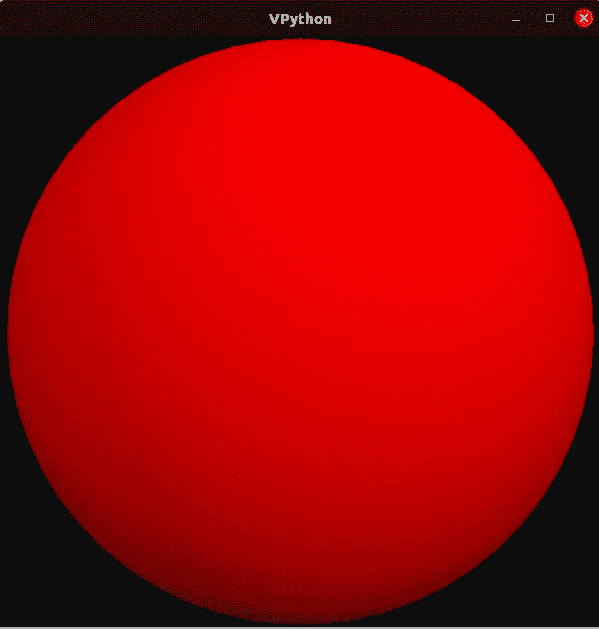
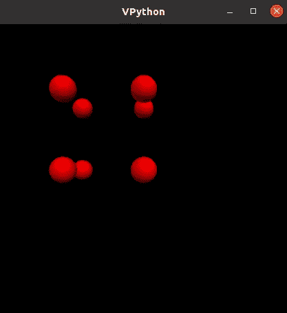
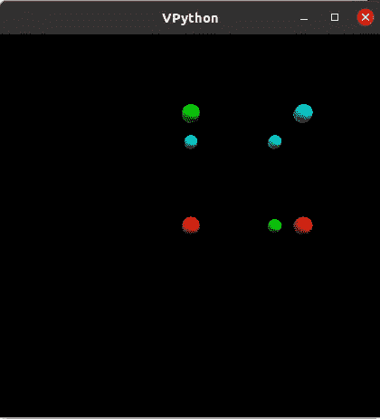
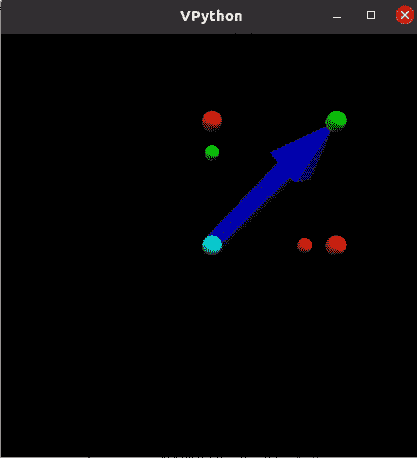
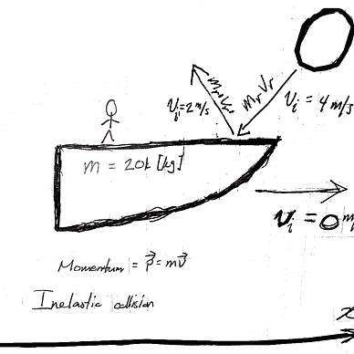
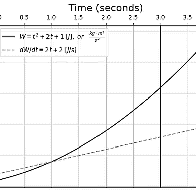
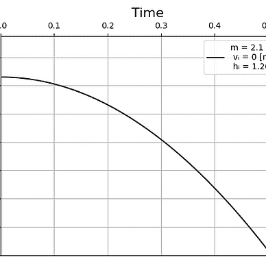

# 一个箭头和一个带有 VPython 的奇怪立方体

> 原文：<https://levelup.gitconnected.com/an-arrow-and-a-weird-cube-with-vpython-b78c818d9d39>

## 用 VPython 6 渲染一个三维箭头的不完整解决方案

M *互动*是一本物理学和计算机科学学生都能欣赏的教科书。前者可以向后者学习，反之亦然。在这篇文章中，我将讨论一个失败的解决方案，它涉及到渲染球体来表示一个立方体的边，立方体上有一个箭头。我可能会在将来重新考虑这个问题，并提出一个解决方案。

# 目录一览

1.  问题设置
2.  解决方案综述
3.  结论
4.  参考

# 问题设置

> " **(a)** 写一个创建八个球体的 VPython 程序，每个球体放置在以原点为中心的立方体的一个角上。立方体的边长应为六(6)个单位，每个球体的半径应为 0.5。为球体使用至少两种不同的颜色。给程序添加一个箭头，其尾部在立方体的一个角上，其尖端在对角的角上。下图(图 1)显示了这个问题的一个可能的解决方案。”— [查巴伊&舍伍德(2015 年，第 42 页)](https://www.wiley.com/en-us/Matter+and+Interactions%2C+4th+Edition-p-9781119080817)



图 1 —改编自 [Chabay & Sherwood (2015 年，第 42 页)](https://www.wiley.com/en-us/Matter+and+Interactions%2C+4th+Edition-p-9781119080817)

特别是，我将在 [VPython 6 (n.d.)](https://vpython.org/index6.html) 中编写这个程序，它有点过时，可能很难安装。我将只讨论我写代码的过程和头脑风暴的过程。

# 解决方案综述

我解决这个问题的方法是用传统的纸笔勾画出来——不需要计算绘图。图 2 描绘了一个类似立方体的形状，上面有一个箭头，就像问题中描述的那样，以帮助我形象化这个问题:



图 2

我的三维几何形状(在这种情况下是立方体和箭头)，强加在三维笛卡尔空间上，可能很难阅读。此外，我可能把定义“高度”的轴标错了，而纵坐标应该在这里，反之亦然。我也应该把“高度”叫做海拔高度。对此我很抱歉，但是图 2 确实给了我一个如何继续的想法。

立方体可以被口头定义为“*由六个正方形面、小平面或侧面界定的三维固体，每个顶点有三个交汇点*”([维基百科 2022 年 12 月 20 日修订](https://en.wikipedia.org/w/index.php?title=Cube&oldid=1128489792))。立方体的体积“A”是系数“c”的三次幂，系数“c”定义了立方体应该由多少个单元组成，如等式 1 所示:



情商。一

这相当简单:体积完全取决于单位的数量，我决定它是立方体长度的量级——这可以给我一个如何进行的想法。

我从导入 *VPython* 库开始，然后继续定义一个函数`render_cubedge`，它取立方体的长度和代表其边的球体的半径:

```
from visual import *

def render_cubedge(mag, rad):
    edge_coefficients = (
        vector(0, 0, 0) # O
    )

    for n, k in enumerate(edge_coefficients):
        sphere(pos=k, radius=rad, color=color.red)
```

`edge_coefficients`是一个包含`vector`对象的元组，这些对象将用于将`sphere`定位到将形成要呈现的立方体边缘的位置。继续图 2，我将在“O”点，即“原点”渲染一个球体，从坐标`(0, 0, 0)`开始。图 3 描述了我的脚本的输出:



图 3

这只是一个放大的边缘点，因为没有其他边缘可以显示。我将通过渲染更多的球体来表示边缘来处理这个问题，这将导致工具“缩小”以包括所有的球体。

我决定在`edge_coefficients`中填充`vector`对象( [GlowScript n.d.](https://www.glowscript.org/docs/VPythonDocs/vector.html) )，在不考虑第三维度的情况下制作一个正方形。下面是我写的做一个正方形的图案:

```
 edge_coefficients = (
        vector(0, 0, 0), # O
        vector(-1 * mag, 0, 0), # OL
        vector(0, +1 * mag, 0), # TO
        vector(-1 * mag, +1 * mag, 0), # O-UL
    )
```

然后，我用`vector`对象表示“OL”、“TO”和“O-UL ”,并将向量的 z 值加-1，如图 4 所示:



图 4

为了与图 1 更加一致，我决定改变`vector`对象的“x”轴上的-1 系数。我还决定添加一个`colours`列表，并在决定球体的渲染颜色时从中随机选择。以下是进行这些更改后的`edge_coefficients`:

```
edge_coefficients = (
    vector(0, 0, 0), # O
    vector(+1 * mag, 0, 0), # OL
    vector(0, +1 * mag, 0), # TO
    vector(+1 * mag, +1 * mag, 0), # O-UL

    vector(0, +1 * mag, 0), # OA
    vector(+1 * mag, 0, -1 * mag), # OR
    vector(0, +1 * mag, -1 * mag), # O-AU
    vector(+1 * mag, +1 * mag, -1 * mag) # O-PP
) 
```

我用一个`mag=6`和一个`rad=0.5`调用了`render_cubedge()`函数，结果如图 5 所示:



图 5

请注意，因为球体的颜色是从元组中随机选取的，所以每次运行的输出都是不同的。以下是`render_cubedge`函数的完成代码:

```
def render_cubedge(mag, rad):
    """
    mag = magnitude of the cube
    rad = radius of the rendered spheres

    Note that in reference to my Figure 2:
        vector(ax, ay, az) = E[ax, f(x), g(x, f(x))]

    """

    colours = (
        color.red,
        color.cyan,
        color.green
    )

    edge_coefficients = (
        vector(0, 0, 0), # O
        vector(+1 * mag, 0, 0), # OL
        vector(0, +1 * mag, 0), # TO
        vector(+1 * mag, +1 * mag, 0), # O-UL

        vector(+1 * mag, 0, -1 * mag), # OR
        vector(0, +1 * mag, -1 * mag), # O-AU
        vector(+1 * mag, +1 * mag, -1 * mag) # O-PP
    ) 

    for n, k in enumerate(edge_coefficients):
        sphere(pos=k, radius=rad, color=pyrand.choice(colours))
```

不幸的是，代表立方体边缘的球体并不完全符合图 1。我以后可能会再讨论这个问题，但是现在我会“继续”这个渲染。

我现在将尝试渲染一个蓝色的箭头刻在立方体状的结构上。我首先定义了一个带有参数`mag`的`render_arrow()`函数，其中我将指示该函数使用以下参数呈现一个`arrow`对象( [GlowScript，n.d.-b](https://www.glowscript.org/docs/VPythonDocs/arrow.html) ):

```
def render_arrow(mag, ax):
    arrow(pos = vector(
            0, 0, -1 * mag
        ), axis = vector(
            +1 * mag, +1 * mag, +1 * mag
        ), color = color.blue)
```

图 6 导致用`mag=6`调用`render_arrow`函数



图 6

图 6 与图 1 的不同之处在于立方体的可视化方式。我不能“抓取”呈现的图像并旋转它，所以很难调试为什么图 6 与图 1 不完全(或至少大部分)相似。

要处理的脚本是:

来源:[《阿列克谢》(2022)](https://gist.github.com/Alekseyyy/a621a72c2cf9b6487cf8313ccc2908eb?file=medium-12222022-matterint-c1p69-py)

# 结论

在本文中，我记录了 *VPython* 代码，我用它对一本物理教科书中的一个问题做了一个不完整的解决方案，这可能会吸引计算机科学的学生，以及任何对编码或业余物理感兴趣的人。我稍微讨论了一下我在编写解决方案脚本时的思维过程，并呈现了一个不完整的解决方案，如图 6 所示。

由于时间和资源的限制，我无法找到解决这个问题的合适方法。我希望将来能解决这个问题。

## 行动呼吁

对于任何喜欢这篇文章并希望阅读我对教科书数学问题的更多解决方案(完整、正确、错误或其他)的读者，我邀请他们查看我的系列文章[数学杂事](https://medium.com/@EpsilonCalculus/list/maths-sundries-b5366eed435b)，在那里我讨论了我对解决任意数学问题的想法:


阿列克谢

## 数学杂物

[View list](https://medium.com/@EpsilonCalculus/list/maths-sundries-b5366eed435b?source=post_page-----b78c818d9d39--------------------------------)22 stories

另外，看看我的 [GitHub 文件夹](https://github.com/Alekseyyy)，里面有我正在做的各种有趣的软件项目！

[](https://github.com/Alekseyyy) [## Alekseyyy -概述

### 此时您不能执行该操作。您已使用另一个标签页或窗口登录。您已在另一个选项卡中注销，或者…

github.com](https://github.com/Alekseyyy) 

# 参考

《阿列克谢》(2022)。*我的 Medium 代码片段的要点*。GitHub Gist。2022 年 12 月 22 日检索自:[https://gist . github . com/Alekseyyy/a 621 a 72 C2 cf 9 b 6487 cf 8313 CCC 2908 EB？file = medium-12222022-matter int-c1p 69-py](https://gist.github.com/Alekseyyy/a621a72c2cf9b6487cf8313ccc2908eb?file=medium-12222022-matterint-c1p69-py)

Chabay，R. W .和 Sherwood，文学学士(2015 年)。*物质与互动*【第四版，精装】。约翰·威利的儿子们。

GlowScript(未注明)。*矢量*。2022 年 12 月 22 日检索自:[https://www.glowscript.org/docs/VPythonDocs/vector.html](https://www.glowscript.org/docs/VPythonDocs/vector.html)

GlowScript(未注明)。*箭头*。2022 年 12 月 22 日检索自:[https://www.glowscript.org/docs/VPythonDocs/arrow.html](https://www.glowscript.org/docs/VPythonDocs/arrow.html)

VPython 6(未标明)。2022 年 12 月 21 日检索自:[https://vpython.org/index6.html](https://vpython.org/index6.html)

维基百科(2022 年 12 月 20 日修订)。*立方体*。2022 年 12 月 21 日检索自:[https://en.wikipedia.org/w/index.php?title=Cube&oldid = 1128489792](https://en.wikipedia.org/w/index.php?title=Cube&oldid=1128489792)