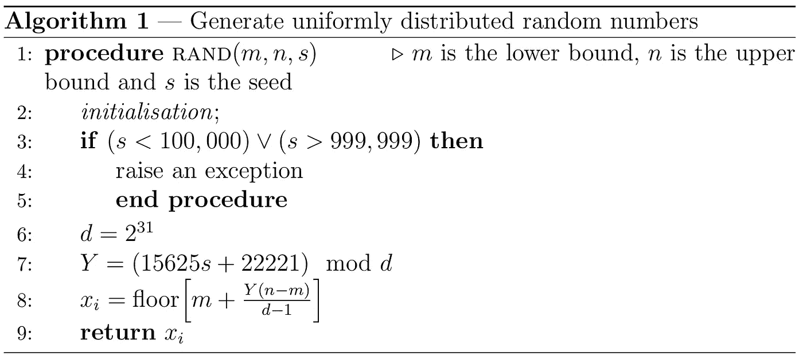
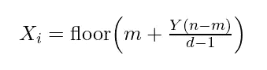
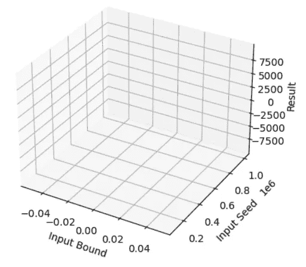
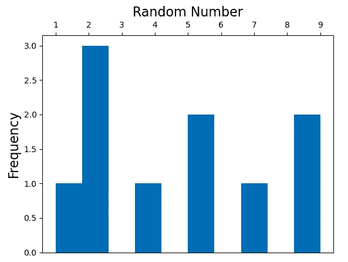
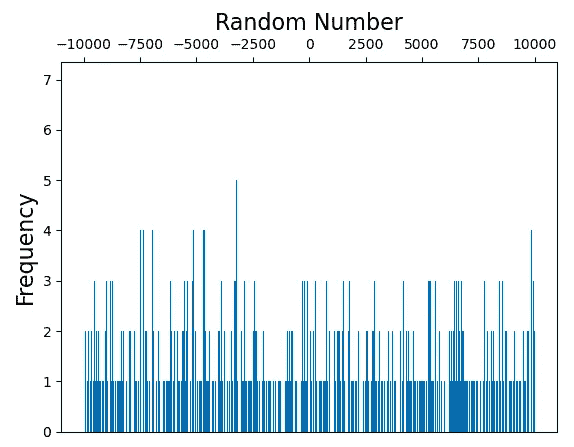
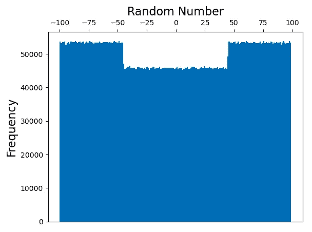

# 用 Python 生成均匀分布的随机整数的尝试

> 原文：<https://levelup.gitconnected.com/an-attempt-to-generate-uniformly-distributed-random-integers-in-python-e2e6c88465c1>

A *数学建模第一课* ( [Giordano 等人，2013](https://isbnsearch.org/isbn/9781285050904) )是一本旨在向理工科学生介绍正式数学建模的教科书。书中的一章讨论了模拟的计算方法([第 185–223 页](https://isbnsearch.org/isbn/9781285050904))，并提出了一个项目构想，即实现一个程序，用于在某些界限之间生成随机整数的均匀分布([第 194–195 页，问题 3](https://isbnsearch.org/isbn/9781285050904) )。在本文中，我将讨论我在 [Python (n.d.)](https://www.python.org/) 编程语言中对他们的方法的有缺陷的实现——并测试它。


部分图片组件来自:[英雄维基词条(2022 年 8 月 25 日修订)](https://hero.fandom.com/wiki/Death_the_Kid?oldid=2725249)

# 该方法

图 1，或*算法 1* ，描述了教科书中描述的程序的修改版本的正式处理( [Giordano 等人，2013，第 194-195 页，问题 3](https://isbnsearch.org/isbn/9781285050904) ):



图 1

作为参考，`*Xᵢ*`定义为:



情商。一

其中`floor`是一个将产生的实数向下舍入为整数的函数。我稍微“改变了一下配方”,只返回了一个随机整数，而不是许多随机整数。我相信如果需要许多随机整数，可以使用`for`或`while`循环，我打算在讨论部分进一步阐述。

## 履行

我使用 Jupyter 实验室桌面应用程序( [Bektas，2021](https://blog.jupyter.org/jupyterlab-desktop-app-now-available-b8b661b17e9a) )用 Python 实现了该过程，并从以下内容开始:

```
from math import floor
```

这将专门从 Python 的`math`库中导入 Python 的`floor`函数(参见 [Tuckfield，2021，第 18 页](https://isbnsearch.org/isbn/9781718500686))，我打算稍后使用。然后我定义了一个函数，并引入了简单的异常处理( [Lancaster & Webster，2019，PP . 67–70](https://isbnsearch.org/isbn/9781484245224))来处理任何可能的错误输入:

```
[... snip ...]def rand(m, n, seed=100001):
    if (seed < 100000) or (seed > 999999):
        raise Exception("The seed must be greater than 100000 or less than 999999")
```

`m`和`n`参数将取各自的下限和上限，而`seed`是一个将最终决定结果随机整数的参数。接下来，我将初始化`d`和`Y`常量，如步骤 2 和 3 所述:

```
[... snip ...] d = 2**31
    Y = (15625 * seed + 22221) % d[... snip ...]
```

最后，我将为等式 1 设计一个实现，并将其结果作为随机整数返回:

```
[... snip ...] x_i = floor(m + (Y * (n - m)/(d - 1)))
    return x_i[... snip ...]
```

以下是我实现的随机整数生成器的最终版本:

我将粗略地测试一下`rand`函数，看看我能得到什么样的结果。我编写了一个简单的脚本来测试它:

```
candidate_parameters = [
    [1, 10, 123456],
    [-3, 0, 195929],
    [7, 148, 295829],
    [-90, -40, 385820]
]for k in candidate_parameters:
    print ("Lower bound: {0}, upper bound: {1}, result: {2}."
           .format(k[0], k[1], rand(k[0], k[1], k[2])))
```

运行它会打印以下结果:

```
Lower bound: 1, upper bound: 10, result: 9.
Lower bound: -3, upper bound: 0, result: -2.
Lower bound: 7, upper bound: 148, result: 28.
Lower bound: -90, upper bound: -40, result: -50.
```

这看起来不错，但如果能看到我的脚本如何处理更全面的下限和上限以及不同种子值的情况，那就更好了。我打算用数据可视化测试我的随机整数生成器——特别是直方图。

## 使用多次运行和直方图测试`rand`

给定许多试验，我最初尝试可视化随机整数生成器的输出，包括使用三维直方图。图 2 显示了我想要的东西:



图 2

然而，这种方法失败了，因为我无法找到一种方法将数据集分解到这个三维笛卡尔系统中，代码由于奇怪的运行时或逻辑错误而无法运行，我意识到，如果不能与三维图形交互，解释三维图形可能会更加困难。

因此，我决定用二维直方图来可视化输出。我用来生成直方图的代码是:

我承认，代码有点低效(需要一段时间来执行)，但尽管如此，它对于测试`rand`函数来说已经足够好了。它定义了一个存储在`bounds`中的下界和上界对的列表，然后以 Python 的`random`模块提供的随机整数 a(参见 [Payne，2019，PP . 29–33](https://doi.org/10.1007/978-1-4842-4550-7))作为种子运行`rand`函数。

运行这段代码(在 Jupyter 笔记本中，其中已经实现了`rand`函数)将打印出不同下限和上限的大量直方图。图 3 描述了 rand 函数的直方图，其参数下限为 0，上限为 10:



图 3

图 4 描述了 rand 函数的直方图，其参数下限为-10000，上限为 10000:



图 4

看起来*这个代码没有产生均匀的分布。但是，出于某种背景考虑，我多次运行这个脚本，得到的结果略有不同。这给了我一个想法，让我专注于一个固定的下限和上限，不同的种子值，以及固定的大量试验。下面是我下一批测试的代码:*

它们都返回了(几乎)一致的直方图。图 5 显示了在多次测试了`rand`函数后，直方图符合的典型形状:



图 5

从这个直方图看来，我的随机整数生成器并不是完全一致的(我不确定为什么)。可以说，这个伪随机整数发生器不应该**用于密码学或者任何其他需要尽可能接近纯随机性的情况——我将在后面详述。**

# 讨论

## 作者的实现

正如我在前面一节中简要讨论的，我的技术与建模教科书中介绍的技术略有不同。以下是对教科书的逐字引用( [Giordano et al .，2013，PP . 194–195，问题 3](https://isbnsearch.org/isbn/9781285050904) ):

> 编写一个计算机程序，根据以下算法，生成区间`m < x < n`内均匀分布的随机整数，其中`m`和`n`为整数:
> 
> **第一步:**让`d = 2³¹`，选择`N`(要生成的随机数的个数)。
> 
> **第二步:**选择任意种子整数`Y`，使得`100000 < Y < 999999.`
> 
> **第三步:** `Let i = 1.`
> 
> **第四步:**让`Y = (15625Y + 22221) mod(d).`
> 
> **第五步:**让`*Xᵢ = floor([(n - m + 1)Y / d].*`
> 
> **第六步:**将`i`增加`1` : `i = i + 1`
> 
> **第 7 步:**转到第 4 步，除非`i = N + 1.`
> 
> 这里，`floor[p]`表示不超过`p`的最大整数。对于`Y`的大多数选择，数字`X₁, X₂, …`根据需要形成一个(伪)随机整数序列。一个可能的推荐选择是`Y = 568,731`。

我决定稍微修改一下通用过程，因为我认为生成许多随机整数是多余的，因为`for`或`while`循环可以多次使用 rand 函数。随机整数分布缺乏均匀性可能就是因为这个原因。将作者的原始过程与我对它的修改进行比较，将成为一个有趣的未来项目。

## 同行评议和严格测试的优越性:一个与密码学领域类比的论点

正如我前面说过的，我制作的伪随机整数生成器不应该在要求纯随机性的生产环境中使用。我的伪随机整数生成器没有经过同行评审或广泛的故障测试，也不具有均匀分布的形状，因此它的序列很可能被熟练的黑客预测到。

为了借鉴密码学相关领域的智慧，像 [Tobias (2020)](https://www.ubiqsecurity.com/never-roll-your-own-cryptography/) 和 [van Flyman (2020，第 83 页)](https://doi.org/10.1007/978-1-4842-5171-3_6)这样的专家认为，设计定制的加密实现可能会导致危险，因为细微的错误会导致加密系统更容易被黑客攻击。定量研究表明，那些不对自己的加密解决方案进行同行评审或严格测试的人往往会犯一些小错误，而这些小错误会带来严重后果。

[Blessing 等人(2021)](https://arxiv.org/abs/2107.04940) 进行了一项正式的、定量驱动的研究，以证明定制解决方案在同行评审、严格测试的情况下并不安全。他们估计**27.2%的**漏洞与加密系统的实施有关，**37.2%的**漏洞与内存安全问题有关。他们的研究方法是调查各种 CVE 数据库(见 [Red Hat，n.d.](https://www.redhat.com/en/topics/security/what-is-cve) )，设计评估加密漏洞的指标，将它们输入一个公共数据库，并对它们进行数据分析。

[Blessing 等人(2021)](https://arxiv.org/abs/2107.04940) 指出[国家漏洞数据库(n.d.)](https://nvd.nist.gov/) (他们汇集了一些数据的来源)存在*报告偏差*和*质量偏差。*他们还报告说，他们的研究特别关注开源软件，这意味着这不能推广到所有软件。关于估计误差，作者没有报告置信区间。尽管如此，我确实认为这项研究提供了很好的证据，证明自主开发的加密技术不如经过同行评审和严格测试的加密解决方案。

由 [Egele (2013)](https://doi.org/10.1145/2508859.2516693) 进行的一项关于 [Android (n.d.)](https://www.android.com/intl/en_hk/what-is-android/) 密码术的早期研究进一步表明，许多软件工程师在实施定制密码术时会犯致命的错误。作者给出了加密系统的正式定义，列出了实现良好加密的六个基本规则，调查了已经向公众发布的 Android 应用程序，通过统计和逆向工程对它们进行了分析，最后估计 88%的 Android 应用程序开发者在使用加密时至少会犯一个错误。

与 [Blessing 等人(2021)](https://arxiv.org/abs/2107.04940) 一样，这项研究的作者没有报告置信区间。作者还指出， *CryptoLint* 工具——他们用来检测 Android 中加密解决方案实现错误的工具——本身也有局限性。然而，就像 [Blessing et al. (2021)](https://arxiv.org/abs/2107.04940) 的研究一样，我确实认为这项研究提供了足够的证据，证明经过同行评审、严格测试的加密解决方案优于其本土同行。

伪随机数发生器的正确使用对密码学至关重要。使用一个*类比论证*(参见 [Bartha，2022](https://plato.stanford.edu/entries/reasoning-analogy/) )，我将推断出一个经过适当的同行评审、严格测试的均匀分布随机整数生成器就像一个经过适当的同行评审、严格测试的密码系统，在这个意义上，经过同行评审和严格测试的有问题的东西优于没有经过同行评审和严格测试的东西。知道了这一点，我可以推荐**而不是**在生产系统中使用自制的随机数生成器，比如我介绍的那个。

## 软件评估的局限性

我的伪随机整数生成器的另一个限制是关于它的测试阶段。我只是运行了随机整数生成器，并将其结果绘制到直方图上。在软件工程领域有更严格的软件测试方法——Barnes 和 klling(2009，第 169-200 页)讨论了这些方法。

例如，*单元测试*指的是“*对一个应用*”[(第 170 页](https://www.abebooks.com/products/isbn/9780137005628))的单个部分的测试。这种测试在测试用面向对象编程语言编写的软件和测试单个功能时非常有用。可以用潜在的输入和它们各自适当的输出来生成测试用例，如果被测试的组件没有返回适当的输出，就可以发现代码中的错误。

软件评估中另一个有用的概念是*回归测试，*，这本书将其定义为“*重新运行先前已经通过的测试，以确保新版本仍然通过它们*”([第 178 页](https://www.abebooks.com/products/isbn/9780137005628))。我没有对我的`rand`函数使用单元测试，并且对它做了最小的回归测试。我只是查看了它生成的随机整数直方图。这意味着*更有可能*代码中存在逻辑错误——但*不一定*。

# 结束事项

在本文中，我创建了一个 Python 版本的随机整数生成器，它是由 Giordano 等人(2013 年，第 194-195 页，问题 3 )指定的。我对它进行了测试，发现了它的缺陷——至少与其他更精确的伪随机数生成器相比是这样。我还讨论了我没有使用的不同种类的测试(或者至少没有充分发挥其潜力)，希望在未来的文章或项目中能够使用它们！

对于任何对用于开发和测试 rand 函数以及生成本文中使用的大部分图形的 Jupyter 笔记本感兴趣的人，我邀请他们在这里查看:

[](https://www.kaggle.com/code/lambdacalculus/notebook-for-prng-project-01-nov-2022) [## PRNG 项目笔记本(2022 年 11 月 1 日)

### 使用 Kaggle 笔记本探索和运行机器学习代码|使用来自无附加数据源的数据

www.kaggle.com](https://www.kaggle.com/code/lambdacalculus/notebook-for-prng-project-01-nov-2022) 

## 插头

首先，我想分享一份名为 [The Techlife](https://medium.com/the-techlife) 的新媒体出版物。它讨论软件工程、人工智能和技术新闻。我最近在 *Techlife* 上发表了一篇评论文章，讨论黑客用的 Jupyter 笔记本——读者可以在这里查看:

[](https://medium.com/the-techlife/op-ed-hackers-should-use-jupyter-notebook-when-taking-notes-fcf1ef46d0b0) [## 专栏:黑客记笔记时应该用 Jupyter 笔记本

### 关于《黑客星球》的随想

medium.com](https://medium.com/the-techlife/op-ed-hackers-should-use-jupyter-notebook-when-taking-notes-fcf1ef46d0b0) 

其次，LGBTQ+群体正受到政治机会主义者和骗子的攻击，比如迈特·沃尔什和“libsoftiktok”我敦促读者对他们采取行动，因为他们的行为伤害了无辜的 LGBTQ+人群。读者可以这样做:

— **举报** **他们的推特账号** ( [@MattWalshBlog](https://twitter.com/MattWalshBlog) 和 [@libsoftiktok](https://twitter.com/libsoftiktok) )潜在的违规行为。参见以下文章:[https://help . Twitter . com/en/safety-and-security/report-abuse-behavior](https://help.twitter.com/en/safety-and-security/report-abusive-behavior)

— **通过签署请愿书来提高人们的意识，让他们永远被禁止出现在社交媒体和大学演讲活动中。社交媒体和大学可能不会对请愿书做出回应，但它将有助于引起对问题的关注！**

[](https://www.change.org/p/ban-libsoftiktok-and-chaya-from-social-media) [## 在请愿书上签名

### Libsoftiktok 和 Chaya，臭名昭著的反 LGBT 社交媒体账户背后的女人，已经被允许留在…

www.change.org](https://www.change.org/p/ban-libsoftiktok-and-chaya-from-social-media) [](https://www.change.org/p/baylor-universitt-student-activities-stop-matt-walsh-conservative-blogger-from-delivering-anti-lgbtq-speech-at-baylor) [## 在请愿书上签名

### 贝勒大学的保守派学生团体“贝勒青年美国人争取自由”邀请了保守派博客作者…

www.change.org](https://www.change.org/p/baylor-universitt-student-activities-stop-matt-walsh-conservative-blogger-from-delivering-anti-lgbtq-speech-at-baylor) 

# 参考

安卓(未标明)。*安卓是什么？*2022 年 11 月 1 日检索自:[https://www.android.com/intl/en_hk/what-is-android/](https://www.android.com/intl/en_hk/what-is-android/)

巴恩斯和科林(2009 年)。*对象优先用 Java:使用 BlueJ 的实用介绍*【第四版】。皮尔逊教育国际。

Bartha，P. (2022 年)。类比和类比推理。*斯坦福哲学百科全书*。2022 年 10 月 30 日检索自:[https://plato.stanford.edu/entries/reasoning-analogy/](https://plato.stanford.edu/entries/reasoning-analogy/)

贝克塔斯，M. (2021)。 *JupyterLab 桌面应用现已推出*！Jupyter 博客。2022 年 10 月 29 日检索自:[https://blog . jupyter . org/jupyterlab-desktop-app-now-available-b8b 661 b 17 e 9 a](https://blog.jupyter.org/jupyterlab-desktop-app-now-available-b8b661b17e9a)

祝福，j .，斯佩克特，硕士，和魏茨纳，D. J. (2021)。你真的不应该推出自己的密码:一项关于密码库中漏洞的实证研究。arXiv。[https://doi.org/10.48550/ARXIV.2107.04940](https://doi.org/10.48550/ARXIV.2107.04940)

m .埃格尔、d .布鲁姆利、y .弗拉安东尼奥和 c .克鲁格(2013 年)。android 应用程序中密码滥用的实证研究。*2013 年 ACM SIGSAC 计算机会议论文集&通信安全— CCS '13。2013 年 ACM SIGSAC 大会*。ACM 出版社。https://doi.org/10.1145/2508859.2516693

佐丹奴、福克斯、W. P .和霍顿公司(2013 年)。*数学建模第一课*【第五版】。Cengage 学习。

英雄维基(2022 年 8 月 25 日修订)。*死亡小子*。2022 年 11 月 1 日检索自:[https://hero.fandom.com/wiki/Death_the_Kid?oldid=2725249](https://hero.fandom.com/wiki/Death_the_Kid?oldid=2725249)

兰卡斯特公司和韦伯斯特公司(2019 年)。用于生命科学的 Python:面向生命科学家的 Python 简明介绍。阿普瑞斯。

国家脆弱性数据库(未标明)。国家标准与技术研究所。2022 年 11 月 1 日检索自:[https://nvd.nist.gov/](https://nvd.nist.gov/)

佩恩，J. R. (2019)。*适合青少年的 Python*。阿普瑞斯。[https://doi.org/10.1007/978-1-4842-4550-7](https://doi.org/10.1007/978-1-4842-4550-7)

Python(未注明日期)。2022 年 10 月 29 日检索自:[https://www.python.org/](https://www.python.org/)

红帽(2021)。什么是 CVE？2022 年 11 月 1 日检索自:[https://www.redhat.com/en/topics/security/what-is-cve](https://www.redhat.com/en/topics/security/what-is-cve)

Tobias，E. (2020 年)。 *Zerologon:为什么永远不要“推出自己的”加密技术*。Ubiq 安全。2022 年 10 月 30 日检索自:[https://www . ubiqsecurity . com/never-roll-your-own-cryptography/](https://www.ubiqsecurity.com/never-roll-your-own-cryptography/)

塔克菲尔德湾(2021)。深入算法:无畏初学者的 Pythonic 冒险。没有淀粉压机。

范·弗莱明博士(2020)。密码学 101。*在《通过构建一个来学习区块链》(第 83–94 页)*。阿普瑞斯。[https://doi.org/10.1007/978-1-4842-5171-3_6](https://doi.org/10.1007/978-1-4842-5171-3_6)

# 分级编码

感谢您成为我们社区的一员！在你离开之前:

*   👏为故事鼓掌，跟着作者走👉
*   📰查看[升级编码出版物](https://levelup.gitconnected.com/?utm_source=pub&utm_medium=post)中的更多内容
*   🔔关注我们:[Twitter](https://twitter.com/gitconnected)|[LinkedIn](https://www.linkedin.com/company/gitconnected)|[时事通讯](https://newsletter.levelup.dev)

🚀👉 [**加入升级达人集体，找到一份惊艳的工作**](https://jobs.levelup.dev/talent/welcome?referral=true)