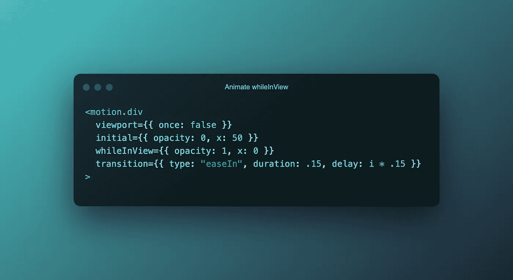
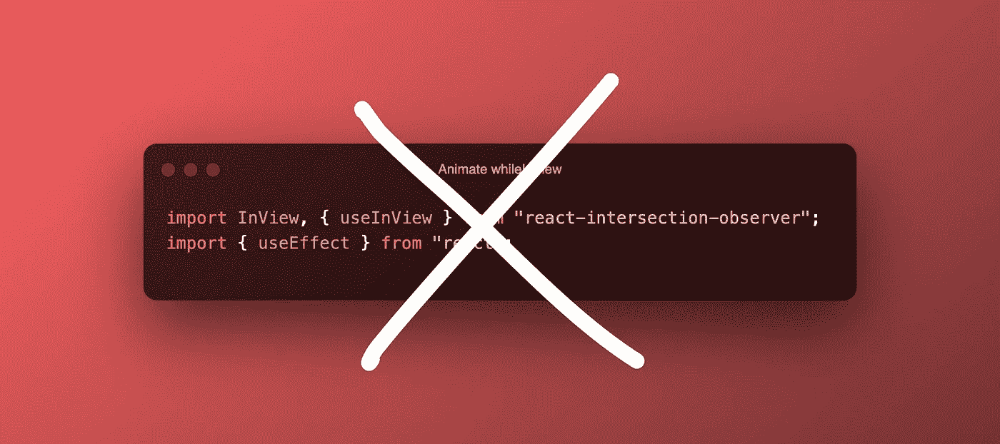
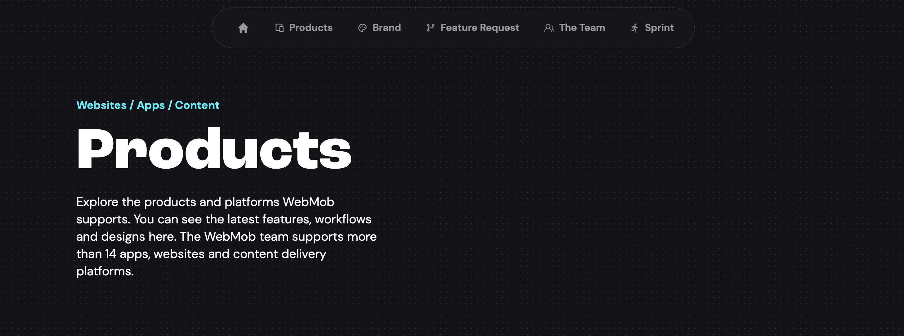

# 使用 Framer + React 在视图中创建动画的更简单方法

> 原文：<https://levelup.gitconnected.com/an-easier-way-to-create-scroll-triggered-animations-with-framer-react-bcc16e26005f>

**前言:**这不是对[成帧器动作](https://www.framer.com/motion/)或[反应](https://reactjs.org/)的介绍。它假设你已经熟悉了 Framer 和 React，并且可能已经在视图中滚动动画元素上做了比需要更多的工作。我要补充的是，我自己仍在学习，并希望分享这一点，因为很高兴发现了一种更简单的方法来完成这一点。

成帧器动作—代码片段

当我第一次使用 Framer Motion 时，我想在一个元素进入视口时制作它的动画。我以为这很简单，但在看了一些 YouTube 视频和浏览了谷歌的博客后，我意识到这将会是一个更大的麻烦…直到它不是。

我看到的每个视频和博客都建议用`react-intersection-observer`和`useEffect`

React 代码片段

原来，当元素进入视图时，Framer Motion 有一个可以使用的道具。用`whileInView`代替`animate`将使你的动画在进入你的视窗时触发。瞧啊。事实上就是这么简单。用`initial`设置你的开始位置，用`whileInView`设置结束位置，并加入其他动画属性

## 像魔术一样！

感谢阅读！如果你在手机上点击社交图标的诱惑中挣扎，那么看看我关于限制社交媒体消费的建议。

 [## 限制你在 iOS 上日常社交媒体消费的简单方法

### 这是一个简单易行的方法来限制你的社交媒体消费(或者任何你发现自己也在放弃的应用/游戏…

levelup.gitconnected.com](/a-simple-way-to-limit-your-daily-social-media-consumption-on-ios-a5aa3627d3e9)