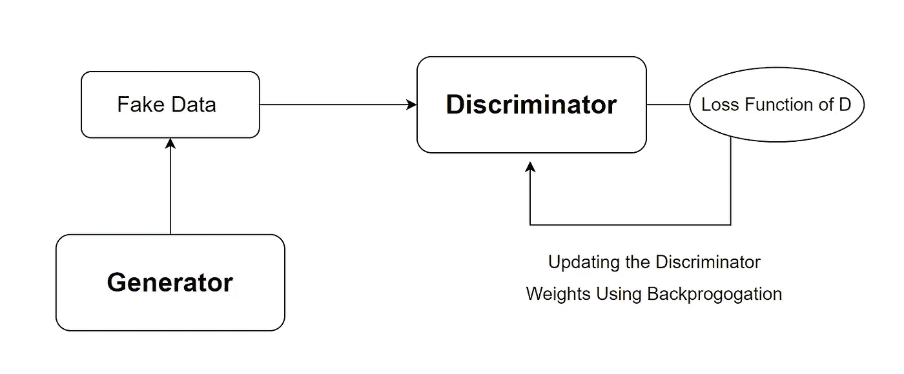

# 甘斯的简单介绍

> 原文：<https://levelup.gitconnected.com/an-easy-introduction-to-gans-5c83a5eb49ba>

生成性对抗网络世界的简单介绍

# 什么是甘？

GAN 或生成对抗网络是一种神经网络架构，由 Ian Goodfellow 等人在 2014 年首次提出。

想法是训练神经网络来学习训练数据的概率分布(例如图像、音频波形等的概率分布)。)

然后，该模型可以通过对其学习的概率分布进行采样来生成新数据。

简而言之，如果网络在图像数据集上进行训练，它可以从训练数据集的概率分布中获得更新的图像。

## 一个例子

要亲自看到这一点，请查看下面的网站。

 [## 这个人是不存在的——随机人工智能生成了假的人的照片

### 生成随机人脸的系统基于 NVIDIA 的 StyleGAN 算法，以及软件…

this-person-does-not-exist.com](https://this-person-does-not-exist.com/algorithm/en) 

该网站根据英伟达的 **StyleGAN** 算法随机生成人脸。

# 这些是如何工作的？:一个类比

让我们考虑一个有趣的类比。

有一个小偷偷了蒙娜丽莎。

由[卡尔文·克雷格](https://unsplash.com/@_calvincraig?utm_source=medium&utm_medium=referral)在 [Unsplash](https://unsplash.com?utm_source=medium&utm_medium=referral) 上拍摄的照片

这个人被警察抓住并被审问。

为了给警察的工作增加难度，小偷已经多次复制了蒙娜丽莎。

让我们检查一下这次审问中双方的目标。

## 小偷的目标

目标是不断复制蒙娜丽莎，并在被要求出示真迹时将赝品交给警方。

## 警察的目标

他们的目标是从赝品中鉴别出真正的蒙娜丽莎。

## 审判

假设这个审判会持续 100 集。

每集得 1 分，也就是说，如果小偷愚弄了警察，他们就得 1 分。另一方面，如果警察能够辨别真伪，他们在记分牌上得 1 分。

在第一集中，小偷向警察展示了一个随机的图像。

伯明翰博物馆信托基金会在 [Unsplash](https://unsplash.com?utm_source=medium&utm_medium=referral) 上拍摄的照片

这绝对不是蒙娜丽莎，警察在记分牌上得了 1 分。

小偷必须做得更好！

他用下面的图片再试了一次，警察仍然能够发现假货。

伯明翰博物馆信托基金会在 [Unsplash](https://unsplash.com?utm_source=medium&utm_medium=referral) 上拍摄的照片

小偷一次又一次地尝试，最终，小偷能够通过展示一幅类似蒙娜丽莎的图像来愚弄警察。

[达巴斯](https://unsplash.com/@dabbas?utm_source=medium&utm_medium=referral)在 [Unsplash](https://unsplash.com?utm_source=medium&utm_medium=referral) 上拍照

艺术警察真是倒霉的一天！

谢天谢地，这在现实世界中永远不会发生！

但这正是 GAN 被训练的方式！

# GAN 架构

GAN 由两个神经网络模型组成:

*   一个**发生器**(**G**)在类比中为‘小偷’
*   一个**鉴别器**(类比中的“艺术警察”)( **D** )

这些人在一个叫做**对抗训练**的过程中同时相互对抗训练。

赫耳墨斯·里维拉在 [Unsplash](https://unsplash.com?utm_source=medium&utm_medium=referral) 拍摄的照片

生成器(G)的目标是捕获训练数据分布并生成新样本。

鉴别器(D)的目标是估计样本来自训练数据而不是 g 的概率。

生成器旨在生成使 D 出错概率最大化的样本。

另一方面，歧视者(D)反对这一点，因此称之为对抗性训练。

在此过程中，生成器变得更好，并达到鉴别器无法区分假样本(来自生成器)和真样本(训练数据)的程度。

# GAN 训练的步骤

GAN 培训包括 3 个主要步骤:

1.  在真实数据上训练鉴别器

步骤 1: D 在真实数据上输出 1(图片由作者提供)

2.用生成器生成的假数据训练鉴别器

步骤 2: D 在虚假数据上输出 0(图片由作者提供)

3.训练生成器用假数据骗过鉴别器

步骤 3: D 在虚假数据上输出 1，但是其权重没有更新。而是更新 G 的权重。(图片由作者提供)

两个网络都以平衡的方式被训练，使得在训练过程中没有一个网络变得比另一个更强大。

最后，我们得到了一个生成器，它可以通过使用鉴别器的损失函数并更新其权重，从训练分布中生成欺骗数据，而无需暴露训练数据本身！

很神奇，不是吗？

我希望这能让你了解 GANs 是如何工作的。

# 资源

要了解更多关于 GANs 的信息，请查看 Ian Goodfellow 等人的原始研究论文。艾尔。，描述了甘背后的数学思想。

 [## 生成对抗网络

### 我们提出了一个新的框架，通过一个对抗的过程来估计生成模型，在这个过程中，我们同时…

arxiv.org](https://arxiv.org/abs/1406.2661) 

*感谢您阅读这篇文章！*

 [## 通过我的推荐链接加入 Medium-Ashish Bama nia 博士

### 阅读 Ashish Bamania 博士(以及 Medium 上成千上万的其他作家)的每一个故事。您的会员费直接…

bamania-ashish.medium.com](https://bamania-ashish.medium.com/membership)