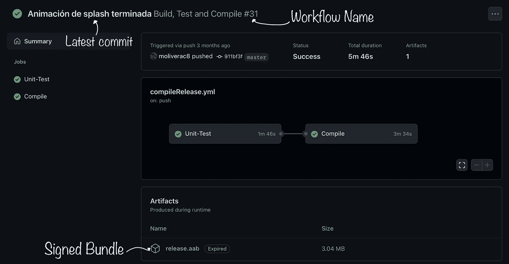
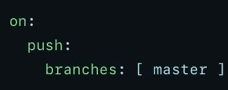
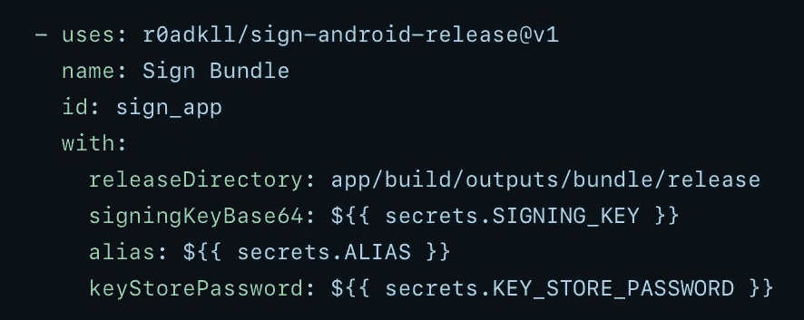

# 在 GitHub Actions 中设置 Android CI/CD 工作流的简单方法

> 原文：<https://levelup.gitconnected.com/an-easy-method-to-set-up-android-ci-cd-workflows-in-github-actions-bfff5f197d2b>

## 今天我分享我是如何在 GitHub Actions 中为一个 Android 项目实现 CI/CD 工作流的

由[罗曼·辛克维奇·🇺🇦](https://unsplash.com/@synkevych?utm_source=medium&utm_medium=referral)在 [Unsplash](https://unsplash.com?utm_source=medium&utm_medium=referral) 上拍摄

当开发软件时，测试的价值是不可估量的。不仅在更改了小部分代码或整个组件后更容易找到 bug，而且有了代码覆盖率，它给了开发团队额外的信心，带来了所有的好处。

最近在我的工作中，我被分配了一些特别适合 DevOps 职位的任务，虽然我专门从事移动开发，但了解每个领域都是有好处的。

我一直在与 Jenkins 一起开发一些 CI/CD 管道，以便在 Firebase 测试实验室中运行单元和仪器测试，并生成不同的应用程序变体，aab 和 apk，准备发布到商店或通过 Firebase 应用程序分发功能自动上传。

Jenkins 虽然很棒，但是主要用的是 bash 脚本，大家都知道，网上到处都有资源。这提供了很多定制，但我想为我的个人项目尝试 GitHub 动作，因为我真的不需要太大的东西，大多数时候我更喜欢简单。

# 让我们从一些重要的信息开始

GitHub Actions 是一个允许开发人员更容易实现 CI/CD 管道的系统，特别是对于初学者，例如，与前面提到的 Jenkins 相比。

它提供已经配置为使用 Linux、Windows 和 Mac 的机器，但根据机器的不同，免费时间有限。对于较小的项目，我认为这是一个很好的起点，特别是如果你只需要 Linux，这是最便宜的。

它的基本工作原理是使用一个 YAML 文件来指示机器将要执行什么操作。该文件存储在项目存储库中，位于存储库根目录下的`.github/workflows`文件夹中。

GitHub 还为 GitHub 操作可以访问的密钥提供存储。例如，在一个 Android 项目中，如果需要对 APK 或 AAB 文件进行签名，并且密钥需要被混淆并且在存储库文件中不可用，那么这一点就很重要，这样就没有人能够窃取它们。

# 代码

如前所述，我们需要一个主要由三部分组成的 YAML 文件。

*   工作流名称
*   触发条件
*   要做的工作

工作流名称将显示在 GitHub 存储库的 Actions 选项卡中的工作流摘要中，如下图所示，位于触发工作流的提交消息下方。

工作流摘要

触发器可以配置为在不同的情况下工作。在这个例子中，我展示了如果我们想要对主分支上的推送进行操作，它是如何完成的，但是它是超级可配置的。你可以在这里勾选所有选项[。](https://docs.github.com/en/github-ae@latest/actions/using-workflows/events-that-trigger-workflows)

触发条件

作业部分是我们指定要使用的机器和要做的工作的地方。您可以同时运行两个作业，也可以按顺序运行它们，以便一个作业依赖于另一个作业。

在下面的示例中，您可以看到我如何配置一个构建 Android 应用程序并运行单元测试的作业。如果这些成功了，一个发布的 AAB 将被编译并作为一个可下载的工件更新到存储库中。

对于作业，您可以直接在机器上运行 Gradle 命令，或者使用其他用户开发的 GitHub 操作。在本例中，我使用这两个选项向您展示这是可能的，有时这样做比我们自己运行整个命令更容易。

其他用户开发的 GitHub 动作从我们可以在 GitHub 配置文件中设置的秘密中获取密钥来签署应用程序，并输出准备发布到商店的文件。如果你知道 GitHub 的秘密，设置起来超级容易，但是如果你不知道，你可以查看[这个库](https://github.com/r0adkll/sign-android-release)来学习如何实现这个。

签署 AAB

如果你想快速复制粘贴，我会在这里留下 GitHub 的要点和完整的代码。

# 结论

根据我的经验，我认为我更喜欢 Jenkins，因为我不需要专门在 GitHub 中拥有存储库，我也喜欢 bash 脚本来定义 CI/CD 管道的步骤，并且我不局限于 GitHub 为机器提供的价格，我可以评估其他选项。

但如果项目较小，我不会考虑如何扩展它，我也不想考虑 Docker 和 Jenkins 配置，这可能会令人头痛，GitHub Actions 是最佳选择。

如果你想阅读更多这样的内容，并支持我，不要忘记检查我的个人资料，或给媒体一个机会，成为会员，以获得我和其他作家的无限故事。每月只有 5 美元，如果你使用这个[链接](https://medium.com/@molidev8/membership)，我会得到一小笔佣金。

 [## 通过我的推荐链接加入 Medium—Miguel

### 阅读米格尔的每一个故事(以及媒体上成千上万的其他作家)。你的会员费直接支持米盖尔…

medium.com](https://medium.com/@molidev8/membership) 

感谢您成为我们社区的一员！在你离开之前:

*   👏为故事鼓掌，跟着作者走👉
*   📰查看[级编码出版物](https://levelup.gitconnected.com/?utm_source=pub&utm_medium=post)中的更多内容
*   🔔关注我们:[推特](https://twitter.com/gitconnected) | [LinkedIn](https://www.linkedin.com/company/gitconnected) | [时事通讯](https://newsletter.levelup.dev)

🚀👉 [**加入升级人才集体，找到一份惊艳的工作**](https://jobs.levelup.dev/talent/welcome?referral=true)