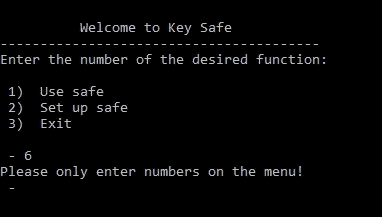

# 用 Python 实现的电子保险箱

> 原文：<https://levelup.gitconnected.com/an-electronic-safe-with-python-e07e3f75a36>

在本文中，我们将使用 Python 构建一个简单的保险箱。这是一个适合初学者的 CLI 应用程序。

# 设置保险箱

保险箱的管理员将首先设置保险箱的 6 位密码和一个人为了打开保险箱可以尝试的最大次数。

# 使用保险箱

保险箱需要 6 位数的密码才能打开。每个输入都必须一个接一个地接受。当第一次输入与相应密码不匹配的数字时，程序必须显示“对不起，密码错误”，并显示剩余的尝试次数(例如“剩余 5 次尝试”)。它应该做同样的错误密码输入。

当所有尝试失败时，程序应显示“紧急报警激活”并结束程序。当所有密码输入正确后，程序应显示“安全打开”并结束程序。

# 如何开始

首先我们导入 python 定义的 native exit 函数和系统，并读取表达式和操作系统模块。然后我们定义“startMenu()”函数。在“startMenu()”函数中，我们声明了要使用的全局变量。然后我们调用' clr()'函数。

然后我们对追溯限制进行分类。最后，我们打印程序标题和程序信息。

然后我们定义一个新的循环。然后我们做下面的事情，直到一个异常发生。然后我们定义用户输入选择的功能，1，2 或 3。如果选择是 1、2 或 3，那么我们就跳出循环。如果是一个数字，而不是 1、2 或 3，我们打印“请在菜单上只输入数字！”。

如果输入一个字符串，我们打印“请只输入菜单上的数字！”。

如果用户输入“2”我们就调用‘clr()’函数。用户输入他们的登录密码(函数将返回)。

用户输入他们的登录用户尝试次数(函数将返回)。

然后我们调用导出数据函数。

它打开一个名为“password.txt”的文件，用户密码和用户尝试被加密并写入该文件。

然后文件被关闭。我们显示用户密码和用户指定的用户尝试次数。

最后，用户被带回到主菜单。

如果用户输入“1 ”,我们就调用 read data 函数。

然后，我们打开名为“password.txt”的文件，从该文件中解密并读取用户密码。

我们称之为用户登录功能。

每个输入都必须一个接一个地接受。当第一次输入与相应密码不匹配的数字时，程序必须显示“对不起，密码错误”，并显示剩余的尝试次数(例如“剩余 5 次尝试”)。对于以下错误的密码输入也应该如此。当所有尝试失败时，程序应显示“紧急报警激活”并结束程序。

当所有密码输入正确后，程序应显示“安全打开”并结束程序。

如果用户输入 3，我们清除屏幕并通过执行 endProgram()函数结束程序。

下面给出了 keySafe.py 脚本的完整代码。

您可以通过在终端上执行以下代码来运行这个应用程序。

我希望这篇文章通过用 python 构建一个电子安全应用程序，帮助您开始使用 python。更多文章保持联系。谢谢你。