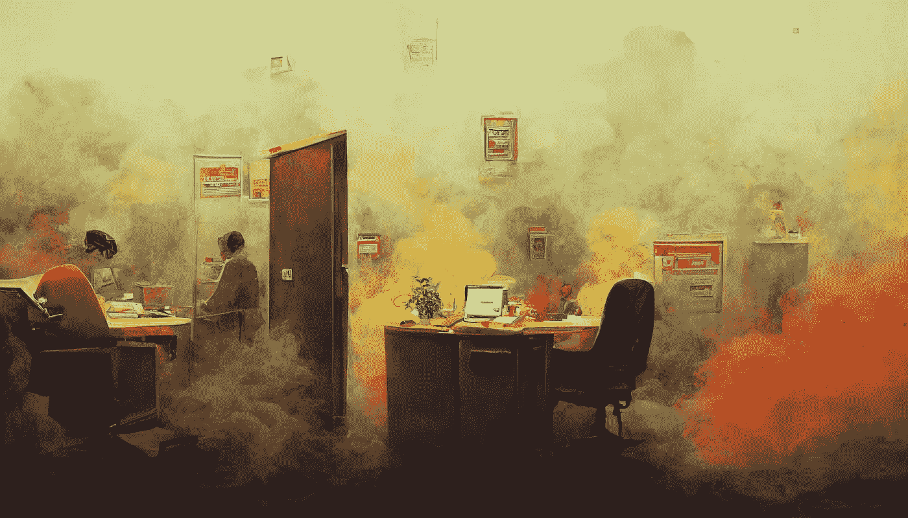

# 一个员工因为难闻的气味被解雇了…！？

> 原文：<https://levelup.gitconnected.com/an-employee-got-fired-because-of-bad-smells-c35ae2714785>

## 关于工作场所的一个基本教训

作者用**中途**做的艺术

首先…什么鬼！昨天，我收到了 Quora 关于一个奇怪问题的通知！

> 一名前员工发帖质疑自己因为气味被解雇。但他说，他的经理告诉他，他是一名优秀的员工。他想知道为什么气味如此重要！！

起初，我很震惊有人会问这种问题。我是说，你闻起来很糟糕，现在你还在做广告？我知道作者是匿名发布的，但还是…！

气味重要吗？是啊！你不需要闻起来很香。(尽管你应该)但是人们绝对不应该在你的工作场所或任何地方闻到你身上的臭味。

通常，你不能从其他人身上闻到任何气味，除非你的鼻子很灵敏，或者他们有一些特殊的医疗条件😄。

几乎每个问题的答案都在说同样的事情。我们来详细讨论一下这个。

# 为什么气味很重要

人们不在乎你闻起来怎么样(可能没有你的爱人)😄).

但事实是，当你因为你的气味而被解雇时，这表明你在激怒你的同事。相反，我应该用“骚扰”这个词。和在工作场所当着一些不抽烟的同事的面抽烟没太大区别。

管理层是如何对他采取行动的？最有可能的是，他的几个同事抱怨他。但是我心里有一个疑问。管理层或者 HR 在解雇他之前没有警告过他吗？他们至少应该警告他一次。

帖子没有澄清关于它的困惑。但我认为他们警告过他。

# 重要的部分

这个问题最重要的一部分是…他明确表示他是一名优秀的员工。他所有的经理都向他承认。教训是，你对公司有多重要并不重要；你不能成为不负责任的员工。

你应该永远遵守公司的规则。但是有些规则没有包括在员工协议中，因为这些规则是普遍的，来自常识。

就像你不应该闻起来那么臭，以至于你的同事不得不投诉你。我在工作中学到的最有价值的一课是:

> 不管你有多优秀，你总是可以被替换的

失去工作的人应该已经吸取了这个教训。但是我很困惑。他有吗？因为如果他有，他就不应该问这个问题。

我希望你不是那个给你的同事带来麻烦的人。任何人都不应该成为那样的人。还有一件事…如果你发现同事有任何不良行为/问题，你应该在投诉前警告他们。

*感谢阅读！当然，请与我们分享您的观点。如果你想支持我，* [***加入我吧！***](https://thefemaleprogrammer.medium.com/membership)