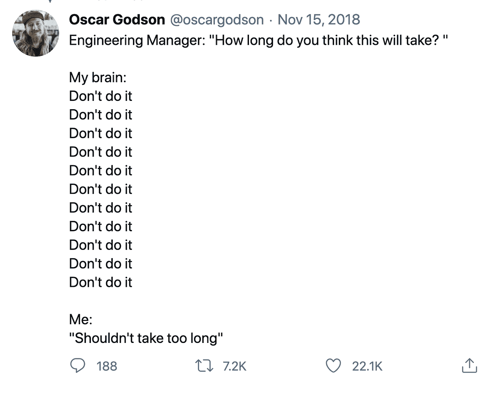
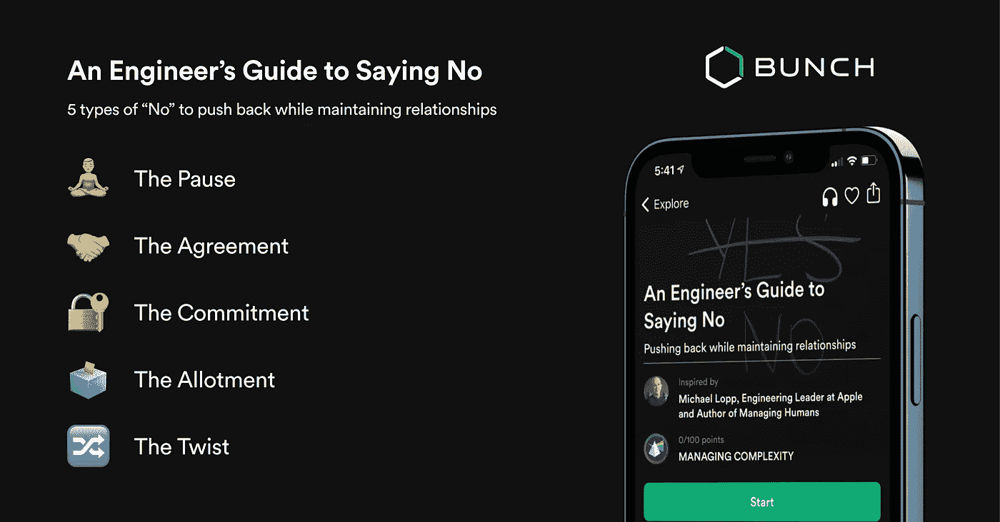

# 拒绝的工程师指南

> 原文：<https://levelup.gitconnected.com/an-engineers-guide-to-saying-no-3b2dba385c66>

# 这听起来像你吗？

给你:最可靠的工程师。您以闪电般的速度编写代码，快速发布补丁，应付大量的会议，轻松消灭 bug。你的团队已经学会了依赖你，谁又能责怪他们呢？

# 但是如果最近事情看起来太像这样呢？

*   当你出去的时候，东西似乎会坏掉
*   你在工作时间之外继续编码
*   你被拉去参加会议，但你并不真的需要出席
*   你的产品团队正等着你开发新的功能，但是你从上周就开始工作了

很可能早在管理成为问题的一部分之前，你就已经学会了取悦团队。现在，你说“不”的困难阻碍了你。

# 说“不”可以是革命性的

“不”常常被等同于卑鄙或无益。但事实并非如此。

让我们来看看工程师面临的一些主要问题:

*   落后于路线图
*   被给予一个没有很多细节的项目
*   和不知道自己想要什么的人打交道
*   承诺做某事，然后却不能做到，因为它实际上比预期的要花更长的时间
*   被告知要在质量上妥协，然后被指责为错误

“不”不是要关闭项目和人。事实上，使用“不”是支持你的团队、管理你的工作量和实现你的目标的最好方法之一。

# 你需要的 5 个不

这里列出了你可以在工作中更多使用的 5 个不，何时使用它们，以及它们为什么有用。

顺便说一下，你可以保留这个框架，并通过[在 App Store](https://apps.apple.com/app/apple-store/id1500872908?pt=121075759&ct=How%20to%20say%20no&mt=8) 下载 BUNCH，发现其他人来帮助你成为一名优秀的技术领导者。

## 暂停

**下面是如何做的:“**让我们后退一步，规划出需要做的事情。在我们对任务有清晰的认识之前，我不能做出任何承诺。”

当人们争先恐后地想把事情做完，但还没想清楚到底需要什么时，就用它。

**奏效原因:**根据作者迈克尔·洛普的《管理人类》 ,这种策略迫使每个人放慢脚步，思考:“说不就是说‘停’，在一个到处都是热衷于无休止运动的人的山谷里，有能力战略性地选择什么时候停下来是一个管理者愿意挑战传统的标志。”

## 协议

**以下是如何做到的:**“让我们对这个项目进行优先排序，对我们上周讨论过的项目取消优先排序。我们不能同时满足两者，这将产生更大的影响。”(您基本上是在说:如果我们做 X，就必须做 Y)。

**当:**核心思想是好的，但是项目时间表需要改变。

**成功的原因:**卡米尔·福尼尔,《经理之路:技术领导者管理增长和变化的指南》 的作者解释道:“积极回应，同时清晰地表达现实的界限，将会让你进入高层领导的大联盟”。如果你想站在利益相关者的角度，这就是方法！

## 承诺

**以下是如何做到的:**“现实地说，我不能接受这个，因为我不会公正地对待它。我已经在进行迁移了。”

**当:**你手头的事情太多，无法腾出时间时使用。

**为什么管用:**表明你信守诺言表明别人可以信任你。来自 CGO N26 的亚历克斯·韦伯(Alex Weber)“意识到自己能做什么和不能做什么，并且从不承诺更多，这样才能建立与团队的信任。”

***想要更多这样的提示吗？下载*** [***帮艾领导蔻驰***](https://apps.apple.com/app/apple-store/id1500872908?pt=121075759&ct=How%20to%20say%20no&mt=8) ***应用程序。***

## 分配

**操作如下:**“我正在处理的功能请求还需要 3 个小时。我还有一个需要 45 分钟的 bug 修复，以及一个需要 4 小时的重构。正如您所看到的，您要求我做的事情不合适。”

**当:**你时间紧迫，新的项目/任务不适合时使用它。

**工作原理:**展示每项任务需要多长时间会提高你的可信度，并展示你的主人翁意识。这让您的利益相关者和团队深入了解所涉及的内容，并向他们表明，当您拒绝时，您有时间估计来证明其合理性。

## 扭曲

**操作方法如下:**“我认为这是一个好主意，但它不符合当前的路线图。如果它看起来像{这个}呢？

**当:**被要求做的事不切实际，并且你想找到问题的根源时，可以使用它。

**成功原因:**这有助于你的团队看到新的可能性，而不是陷入一刀切的解决方案。 [Stever Robbins](https://www.steverrobbins.com/about/) ，连续创业者和 FTP 软件的联合创始人，说问题[吸引他人](https://leadingwithquestions.com/leadership/how-leaders-use-questions/)并揭示更多创新的解决方案。

# 让“不”成为你遗产的一部分

我们越有效地使用“不”,而不是消极或贬低的方式，我们就越有能力赶上最后期限，建立对团队的信任，并实现我们的目标。所以，下次有人让你做某件事的时候，不要跳起来迁就它，可能会把其他事情置于危险之中，记住“不”的力量。

***想要 10x 自己冲击？下载*** [***一帮艾领导蔻驰***](https://apps.apple.com/app/apple-store/id1500872908?pt=121075759&ct=How%20to%20say%20no&mt=8) ***app。***

[在推特上关注我](https://bit.ly/3qwwVNB)或[查看我们的 YouTube 频道](https://bit.ly/3uaB8ZH)了解更多关于科技领导力的内容。

你也可以订阅每周简报，这是我们的周日领导时事通讯。