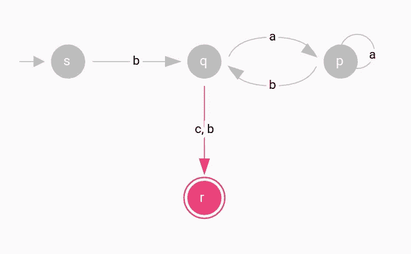

# 基于示例的有限状态机介绍

> 原文：<https://levelup.gitconnected.com/an-example-based-introduction-to-finite-state-machines-f908858e450f>

这个银色的时间片是时间自动机的完美例子，时间自动机是用有限组实值时钟扩展的有限状态机。—[伊莎贝拉·克里斯蒂娜](https://unsplash.com/@christina?utm_source=unsplash&utm_medium=referral&utm_content=creditCopyText)在 [Unsplash](https://unsplash.com/s/photos/pocket-watch?utm_source=unsplash&utm_medium=referral&utm_content=creditCopyText) 上拍摄的照片

如果你注册了一个计算机科学课程，或者碰巧对理论计算机科学感兴趣，你很可能会在某个时候接触到有限状态机。也可能是你被他们的原则所压倒。但是考虑到这个简单的计算模型是如此普遍，是时候一劳永逸地揭开它的神秘面纱了！

# 日常例子

照片由[szűcs·拉斯洛](https://unsplash.com/@szucslaszlo?utm_source=unsplash&utm_medium=referral&utm_content=creditCopyText)在 [Unsplash](https://unsplash.com/s/photos/traffic-lights?utm_source=unsplash&utm_medium=referral&utm_content=creditCopyText) 拍摄

现在是星期六早上。今天你会早早醒来，享受沿着海边散步的好处。闹钟在早上 8 点响。你的眼睛睁开了，但是你的身体在被单下感觉很放松。在接下来的几分钟里，闹钟的秒针会有节奏地在你耳边滴答作响。

你最终决定离开床，做好准备。该走了，你把钥匙插在前门上锁，但是钥匙不匹配。你用错了钥匙！只需几秒钟就能找到正确的钥匙，轻轻一转，你就可以把钥匙向右转动。

照片由[布伦丹·格林威](https://unsplash.com/@brendangreenway?utm_source=unsplash&utm_medium=referral&utm_content=creditCopyText)在 [Unsplash](https://unsplash.com/s/photos/beach-town?utm_source=unsplash&utm_medium=referral&utm_content=creditCopyText) 上拍摄

海滩离家不远，但足以让你迅速将头转向驾驶座并启动引擎。警报器发出嘟嘟声，提醒你系好安全带。您成功地满足了车辆的要求。

前往你最喜欢的地方，海风在空气中留下温柔、流动的感觉，远离你居住的拥挤区域，交通灯的黄色建议你放慢速度。两秒钟后，交通灯变成红色，命令你停下来。在你的左边，两个人正在咖啡店附近的自动售货机买东西，一对夫妇正在玩棋盘游戏。灯变成绿色，你继续骑到想要的位置。

当你最终到达时，所有之前的画面开始在你脑海中闪过:

*   闹钟
*   钥匙孔
*   汽车命令你系好安全带
*   交通灯
*   自动售货机
*   棋盘游戏

你突然发现了其中的联系！它们都代表某种有限状态机。

# 有限状态机

想象一台内存容量极其有限的计算机。一个资源如此有限的设备乍一看似乎效率很低，但不要急于下结论。在一个每台计算机都趋于庞大、复杂和花哨的世界里，这样一台机器的特别之处在于其设计的简单性。

你看，现代计算机极其复杂，以至于我们无法直接创建一个可行的数学理论。有时科学家只需要一些基础知识就能找到解决方案。为此，我们创造了一台理想化的计算机，一台 [**计算模型**](https://en.wikipedia.org/wiki/Computational_model) 。最简单的模型叫做**有限状态机**。

我们可以用 [**状态图**](https://en.wikipedia.org/wiki/State_diagram) 来形象化一个。请看下图:

表示有限状态机的状态图。圆圈代表状态，箭头代表转换。—截图来自 [graph IT](https://graphit.web.app/) 编辑器。

对于了解图论基础的人来说，这显然是一个[有向图](https://en.wikipedia.org/wiki/Directed_graph)。我们可以看到用圆圈表示的节点和用箭头表示的边。但与图形不同，在状态图中，我们分别称它们为**状态**和**转换**。

**状态**代表一个系统的状态。例如，超市中的自动滑动门有两种状态:关闭或打开。交通灯包含三种状态:红、黄、绿。更复杂的例子可以包含相当多的状态，但绝不会是无限个。没有状态也没有意义。

当有限状态机运行时，每个执行步骤中有一个或多个状态是活动的。这些活动状态代表系统的当前值。

在第一执行步骤中，被称为**开始状态的默认状态**被激活。在状态图中，这些状态由指向它们的箭头指示。在上图中，状态`s`是开始状态。

有限状态机也可以包含一个或多个**接受状态**。接受状态由一个双圆圈表示，比如状态`p`和`r`。有限状态机**不需要**具有接受状态；它可能被设计成无限期运行。接受状态的目的非常简单:当处理结束时，根据我们是否处于任何接受状态，有限状态机的输出是*接受*或*拒绝*。

状态通过**转换**相互连接。每个过渡包含一组**符号。**FSM 中所有符号的集合被称为**字母表**。当源状态是活动的并且执行转换时，只有当当前输入与转换的符号匹配时，它才会将活动状态从源状态更改为目的状态。

这就像使用自动售货机一样:

自动售货机——照片由[斯蒂芬·瓦伦丁](https://unsplash.com/@valentinsteph?utm_source=unsplash&utm_medium=referral&utm_content=creditCopyText)在 [Unsplash](https://unsplash.com/s/photos/vending-machine?utm_source=unsplash&utm_medium=referral&utm_content=creditCopyText) 上拍摄

第一次接近机器时的活动状态是`idle`，恰好也是启动状态。通过投入硬币，你进入下一个州`choose product`。

概括一下，有限状态机:

*   有一组**状态**和**转换**
*   至少有一个状态
*   **不能有无限的**个状态
*   有一个**起始状态**，这是它们执行时激活的第一个状态
*   可能有也可能没有**接受状态**
*   对于每个过渡有一组**符号**，
*   有一个**字母表**，它是所有转换符号集的并集

有限状态机有两种类型:**确定性**和**非确定性**。基于这些类型，执行会有不同的处理方式。请记住，有限状态机是一个计算模型:它们根据提供的输入计算输出。下面我们讨论这两种类型，并为每种类型提供一个完整的运行示例。

# 确定性有限自动机

第一种有限状态机是**确定性有限自动机(DFA)。**确定性这个词在这里颇有价值。这意味着您可以从一个状态转换到下一个状态，而不会同时处于多个状态。想想交通信号的例子:它们不可能同时处于绿色和红色状态。

让我们来看看贝娄自动机:

具有四个状态和五个转移的确定性自动机。—截图来自 [graph IT](https://graphit.web.app/) 编辑器。

上述 DFA 包含 4 个状态。开始状态为`s`，接受状态为`r`。字母表包含符号`a`、`b`和`c`。

注意，对于每个状态，每个符号只有一个转换箭头。在某些情况下，一个过渡箭头可以包含多个符号，如从`q`到`r`的符号，但这并不违反要求，因为没有其他从`q`开始的过渡具有相同的符号(`b`和`c`)。

在确定性有限自动机中，从一个状态到另一个状态的转换只有在输入匹配转换的符号时才会发生。例如，只有当输入的当前符号是`b`时，我们才能从`s`移动到`q`。

## 连续的例子

但是理论已经够了！让我们看看上面的 DFA 对于输入 **baabb** 输出了什么。

运行确定性自动机。—截图来自 [graph IT](https://graphit.web.app/) 编辑器。

当执行开始时，起始状态被激活。要运行自动机，对于输入中的每个符号，从左到右，我们将查看是否有与该符号匹配的活动状态的退出转换。

输入 **baabb** 的第一个符号是`b`。当前活动状态为`s`。从`s`出发是否有包含符号`b`的退出过渡？是的，就是连接`s`和`q`的那个。

运行确定性自动机。—截图来自 [graph IT](https://graphit.web.app/) 编辑器。

当前活动状态为`q`。输入 **baabb** 的下一个符号是`a`。从`q`开始是否有任何与符号`a`匹配的退出转换？对，就是连接`q`和`p`的那个。

运行确定性自动机。—截图来自 [graph IT](https://graphit.web.app/) 编辑器。

当前活动状态为`p`。输入 **baabb** 的下一个符号是`a`。从`p`开始是否有与符号`a`匹配的退出过渡？对，就是连接`p`和自身的那个。

运行确定性自动机。—截图来自 [graph IT](https://graphit.web.app/) 编辑器。

当前活动状态为`p`。输入 **baabb** 的下一个符号是`b`。从`p`开始是否有与符号`b`匹配的退出过渡？是的，就是连接`p`和`q`的那个。

运行确定性自动机。—截图来自 [graph IT](https://graphit.web.app/) 编辑器。

当前活动状态为`q`。输入 **baabb** 的下一个符号是`b`。从`q`开始是否有与符号`b`匹配的退出过渡？对，就是连接`q`和`r`的那个。

运行确定性自动机。—截图来自 [graph IT](https://graphit.web.app/) 编辑器。

此时，我们已经遍历了输入的所有符号。最终的活动状态是`r`。`r`是受理状态吗？是的，它是！这意味着输出是*接受*。如果遍历输入后，最终状态不是接受状态，输出将是*拒绝*。

## 形式定义

如果不提及 DFA 的正式定义，那就太遗憾了，因为我们已经讨论了所有需要讨论的细节。

确定性自动机是五元组⟨ **Q** ，**σ**， **δ** ， **q₀** ， **F** ⟩，其中

1.  Q 是所有状态的有限集
2.  **σ**是字母表中所有符号的有限集
3.  **δ**:**Q**×**σ**→**Q**为过渡函数
4.  **q₀** ∈ **Q** 是启动状态
5.  **F** ⊆ **Q** 是接受状态的集合

在上面的定义中，可能困扰你的是转移函数。请记住，只有当当前输入与转换的符号匹配时，我们才能从一个状态转换到另一个状态。例如，考虑一个有限自动机有一个从状态`p`到状态`q`的标记为`1`的转移，那么我们可以用转移函数 *δ(p，1) = q* 来表示同样的事情。这个概念只是一种数学上的速记。

# **非确定性有限自动机**

第二种有限状态机是**非确定性有限自动机(NFA)。**与确定性有限自动机相比，存在一些主要差异。

考虑以下自动机:

具有五个状态和八个转移的非确定性自动机。—截图来自 [graph IT](https://graphit.web.app/) 编辑器。

上述 NFA 包含 5 个州。开始状态为`s`，接受状态为`v`和`d`。字母表包含符号`a`、`b`和`c`。

但是等一下！这个奇怪的标签`ε`是什么？这是一个名为**ε**的希腊字符，不属于字母表的一部分。在非确定性自动机中，转换可以用字母表中的符号或`ε`来标记。

在非确定性自动机中，存在不止一个转换适用的情况。在这些情况下，自动机分裂成自己的多个副本，并像以前一样继续以非确定性的方式运行。我们可以将这种行为视为一种并行计算，机器将[分成几个子进程，每个子进程独立处理。](https://en.wikipedia.org/wiki/Fork%E2%80%93join_model)

标签`ε`是确定性和非确定性自动机的第一个区别。第二个区别是使用了多个过渡箭头，这些箭头包含 NFA 每个州的相同符号。例如，状态`s`有两个用符号`a`标记的退出转换。这与 DFA 相反，DFA 对于每个状态的每个退出转换只有一个符号。

## 连续的例子

一个运行的例子将澄清任何误解。

具有五个状态和八个转移的非确定性自动机。——截图来自 [graph IT](https://graphit.web.app/) 编辑。

当执行开始时，起始状态被激活。我们将检查是否有来自`s`的`ε`转换。

*   从`s`有没有`ε`过渡？对，就是连接`s`和`w`的那个。激活状态`w`。

对于新的状态，我们将执行相同的过程，直到不再有`ε`转换存在。

*   从`w`有没有`ε`过渡？不，没有。

初始活动状态为`s`和`w`。

运行非确定性自动机。—截图来自 [graph IT](https://graphit.web.app/) 编辑器。

对于输入的每个符号，从左到右，我们将检查是否有与该符号匹配的活动状态的退出转换。然后，我们将遵循前面的过程，激活所有与*ε转换*相关的状态。

输入 **aabc** 的第一个符号是`a`。当前活动状态为`s`和`w`。

*   从包含符号`a`的`s`开始的任何退出转换？是的，就是连接`s`到`w`和`a`的那些。
*   包含符号`a`的`w`的任何退出转换？不，没有。

对于新的激活状态`w`和`a`，我们将遵循所有的*ε转换*并重复，直到我们用完它们:

*   从`w`开始的任何`ε`转换？不，没有。
*   从`a`开始的任何`ε`转换？是的，就是连接`a`和`v`的那个。
*   从`v`开始的任何`ε`转换？对，就是那个把`v`连到自己身上的。因为这个转换形成了一个自循环，所以我们不再测试`v`。

新的活动状态是`w`、`a`和`v`。

运行非确定性自动机。——截图来自 [graph IT](https://graphit.web.app/) 编辑。

输入 **aabc** 的下一个符号是`a`。当前活动状态为`w`、`a`和`v`。

*   包含符号`a`的`w`的任何退出转换？号码
*   包含符号`a`的`a`的任何退出转换？是的，连接`a`到`d`和`v`的那些。
*   包含符号`a`的`v`的任何退出转换？号码

对于新的激活状态`d`和`v`，我们将遵循所有的*ε转换*并重复，直到我们用完它们:

*   从`d`开始的任何`ε`转换？号码
*   从`v`开始的任何`ε`转换？是的，就是连接`v`和它自己的那个。因为这个过渡形成了一个自循环，我们就不再测试`v`了。

新的活动状态是`d`和`v`。

运行非确定性自动机。——截图来自 [graph IT](https://graphit.web.app/) 编辑。

输入 **aabc** 的下一个符号是`b`。当前活动状态为`d`和`v`。

*   包含符号`b`的`d`的任何退出转换？是的，连接`d`和`s`的那个。
*   包含符号`b`的`v`的任何退出转换？是的，连接`v`和`a`的那个。

对于新的激活状态`s`和`a`，我们将遵循所有的*ε转换*并重复，直到我们用完它们:

*   从`s`开始的任何`ε`转换？是的，连接到`w`的那个。
*   从`w`开始的任何`ε`转换？号码
*   从`v`开始的任何`ε`转换？是的，就是连接`v`和`a`的那些。
*   从`a`开始的任何`ε`转换？对，就是连接`v`的那个。因为我们已经测试过`v`了，所以不会再测试了。

新的活动状态是`s`、`w`、`a`和`v`。

运行非确定性自动机。—截图来自 [graph IT](https://graphit.web.app/) 编辑器。

输入 **aabc** 的最后一个符号是`c`。当前活动状态为`s`、`w`、`a`和`v`。

*   从包含符号`c`的`s`开始的任何退出转换？号码
*   任何包含符号`c`的`w`的退出过渡？号码
*   包含符号`c`的`a`的任何退出过渡？号码
*   包含符号`c`的`v`的任何退出转换？对，就是接`a`的那个。

对于新的激活状态`a`，我们将遵循所有的*ε转换*并重复，直到用完它们:

*   从`a`开始的任何`ε`转换？是的，连接到`v`的那个。
*   从`v`开始的任何`ε`转换？没错，就是那个把`v`连到自己身上的。

运行非确定性自动机。——截图来自 [graph IT](https://graphit.web.app/) 编辑器。

最终激活状态是`a`和`v`。其中有接受国吗？是的，状态`v`是接受状态。这意味着输出是*接受*。如果遍历输入后，最终状态不是接受状态，输出将是*拒绝*。

## 形式定义

非确定性自动机的形式定义类似于确定性自动机的定义。它由状态、转换、转换函数、字母表和一些接受状态组成。唯一的区别是转换函数的种类。

非确定性自动机是五元组⟨ **Q** ，**σ**， **δ** ， **q₀** ， **F** ⟩，其中

1.  Q 是所有状态的有限集
2.  **σ**是字母表中所有符号的有限集
3.  **δ**:**Q**×**σε**→**P(Q)**是过渡函数
4.  **q₀** ∈ **Q** 是启动状态
5.  **F** ⊆ **Q** 是接受状态的集合

在确定性自动机中，转移函数将一个状态(一个符号)作为输入，并将下一个状态作为输出返回。在非确定性自动机中，转移函数将一个状态、一个符号或`ε`作为输入，并将所有可能的下一个状态的集合作为输出返回。

# 结论

本文旨在为您提供所有必需的细节和示例，以便更好地理解有限状态机。谢谢你花时间阅读它。🙏