# 自行车共享数据集上 Python 中的数据科学管道示例

> 原文：<https://levelup.gitconnected.com/an-example-of-a-data-science-pipeline-in-python-on-bike-sharing-dataset-d5efc2fe495a>

## 自行车共享机器学习项目


[Unsplash](https://images.unsplash.com/photo-1455641374154-422f32e234cd?ixid=MnwxMjA3fDB8MHxwaG90by1wYWdlfHx8fGVufDB8fHx8&ixlib=rb-1.2.1&auto=format&fit=crop&w=889&q=80) 上的图像

[](https://jorgepit-14189.medium.com/membership) [## 用我的推荐链接加入媒体-乔治皮皮斯

### 阅读乔治·皮皮斯(以及媒体上成千上万的其他作家)的每一个故事。您的会员费直接支持…

jorgepit-14189.medium.com](https://jorgepit-14189.medium.com/membership) 

我们将提供一个关于“数据科学管道”的演练教程，可用作数据科学项目的指南。我们将考虑以下阶段:

1.  数据收集/管理
2.  数据管理/表示
3.  探索性数据分析
4.  假设检验和机器学习
5.  参加见解交流

对于这个项目，我们将考虑一个[监督的机器学习](https://en.wikipedia.org/wiki/Supervised_learning)问题，尤其是一个[回归模型](https://en.wikipedia.org/wiki/Regression_analysis)。

回归模型包括以下组件:

*   未知参数通常表示为标量或向量β。
*   在数据中观察到的独立变量，通常表示为向量 Xi
*   因变量，在数据中观察到，通常用标量 Yi 表示。
    数据中无法直接观察到的误差项，通常用标量 e 表示

本教程基于 Python 编程语言，我们将使用不同的库，如 pandas、numpy、matplotlib、scikit-learn 等。最后，在本教程中，我们以超链接的形式提供参考和资源。

# 数据收集/管理

[加州大学欧文分校机器学习库](https://archive.ics.uci.edu/ml/index.php)是一个机器学习库，它维护 *585 个数据集*作为对机器学习社区的服务。您可以通过我们的可搜索界面查看所有数据集。关于这个库的概述，请访问我们的“关于”页面。有关在出版物中引用数据集的信息。对于我们的项目，我们选择使用[自行车共享数据集数据集](https://archive.ics.uci.edu/ml/datasets/bike+sharing+dataset)。

# 自行车共享数据集

该数据集包含 2011 年至 2012 年首都自行车共享系统中每小时出租自行车的数量，以及相应的天气和季节信息。我们的目标是建立一个能够预测租赁自行车数量的机器学习模型。

# 数据管理/表示

我们数据集的字段如下:

```
- instant: record index
- dteday : date
- season : season (1:springer, 2:summer, 3:fall, 4:winter)
- yr : year (0: 2011, 1:2012)
- mnth : month ( 1 to 12)
- hr : hour (0 to 23)
- holiday : weather day is holiday or not (extracted from [http://dchr.dc.gov/page/holiday-schedule](http://dchr.dc.gov/page/holiday-schedule))
- weekday : day of the week
- workingday : if day is neither weekend nor holiday is 1, otherwise is 0.
+ weathersit : 
    - 1: Clear, Few clouds, Partly cloudy, Partly cloudy
    - 2: Mist + Cloudy, Mist + Broken clouds, Mist + Few clouds, Mist
    - 3: Light Snow, Light Rain + Thunderstorm + Scattered clouds, Light Rain + Scattered clouds
    - 4: Heavy Rain + Ice Pallets + Thunderstorm + Mist, Snow + Fog
- temp : Normalized temperature in Celsius. The values are divided to 41 (max)
- atemp: Normalized feeling temperature in Celsius. The values are divided to 50 (max)
- hum: Normalized humidity. The values are divided to 100 (max)
- windspeed: Normalized wind speed. The values are divided to 67 (max)
- casual: count of casual users
- registered: count of registered users
- cnt: count of total rental bikes including both casual and registered
```

让我们从加载数据开始分析。

```
df = pd.read_csv("hour.csv") # get the first rows df.head()
```

## 特征泄漏

如果我们仔细观察我们的数据，我们会发现添加的`casual`和`registered`列会让位于`cnt`列。这就是我们所说的[泄漏](https://en.wikipedia.org/wiki/Leakage_(machine_learning)，因此，我们将把它们从我们的数据集中删除。原因是，当我们想要预测总自行车租赁量`cnt`时，我们将拥有作为“已知”独立变量的“临时”和“注册”,这是不真实的，因为到预测时我们将缺乏这些信息。

```
# drop the 'casual' and 'registered' columns
df.drop(['casual', 'registered'], axis=1, inplace=True)### Remove the instant column
We will also remove the `instant` from our model since is not an explanatory variable.
```

## 将列转换为正确的数据类型

我们将更改以下列的数据类型:

*   `dteday`:转换到日期
*   `season`:转换为分类
*   `weekday`:转换成分类
*   `mnth`:将其转换为分类

```
# let's convert them df['dteday'] = pd.to_datetime(df['dteday']) df['season'] = df['season'].astype("category") df['weekday'] = df['weekday'].astype("category") df['mnth'] = df['mnth'].astype("category") # check the data types df.dtypes
```

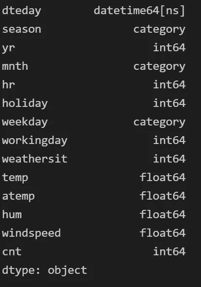

## 检查缺少的值

此时，我们将检查数据中是否有任何缺失的值。

```
df.isna().sum()
```

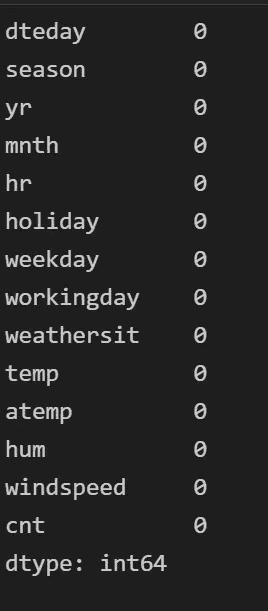

正如我们所看到的，任何字段都没有缺失值。

## 检查重复值

此时，我们将检查是否有重复的值，正如我们在下面看到的，没有重复的值。所以，我们可以继续了。

```
df.duplicated().sum()
```

## 数据集的描述

让我们通过显示平均值、标准差、最小值、最大值和 Q2 Q3 来查看连续变量的数据字段汇总。

```
df.describe()
```

最后，让我们得到目前为止数据集的行数和列数。

```
df.shape
```

# 探索性数据分析

此时，我们运行一个 [EDA](https://en.wikipedia.org/wiki/Exploratory_data_analysis) 。让我们来看看不同时期的自行车租赁情况。

## 时租自行车的时间序列图

```
df.plot(x='dteday', y='cnt', figsize=(20,12), title = 'Hourly Rental Bikes') 
plt.ylabel('cnt')
```

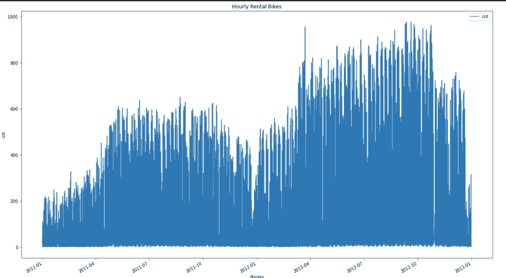

## 出租自行车的分配

```
df['cnt'].plot.hist(bins=20, figsize=(12,8))
```

## 自行车租赁箱线图

```
df.boxplot(by='mnth', column='cnt', figsize=(12,8)) plt.title("Rental Bikes by Month")df.boxplot(by='yr', column='cnt', figsize=(12,8)) 
plt.title("Rental Bikes by Year")
```

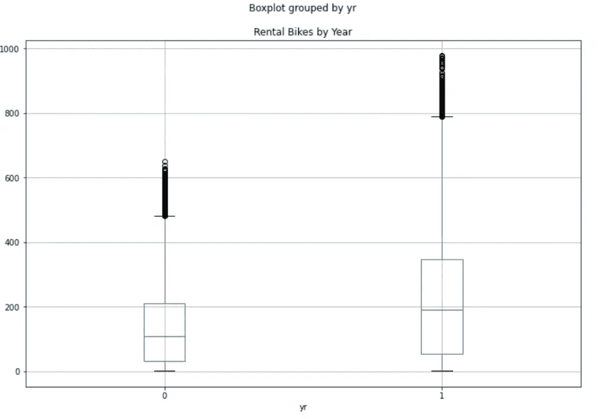

```
df.boxplot(by='season', column='cnt', figsize=(12,8)) plt.title("Rental Bikes by Season")
```

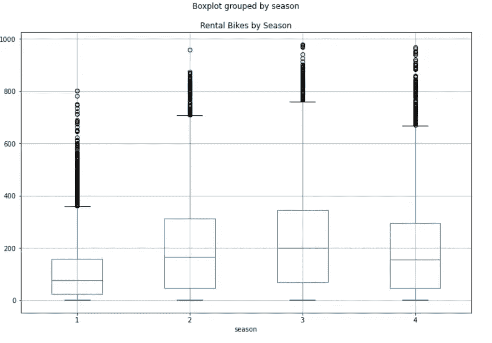

```
df.boxplot(by=['season','yr'], column='cnt', figsize=(12,8)) plt.title("Rental Bikes by Season and Year")
```

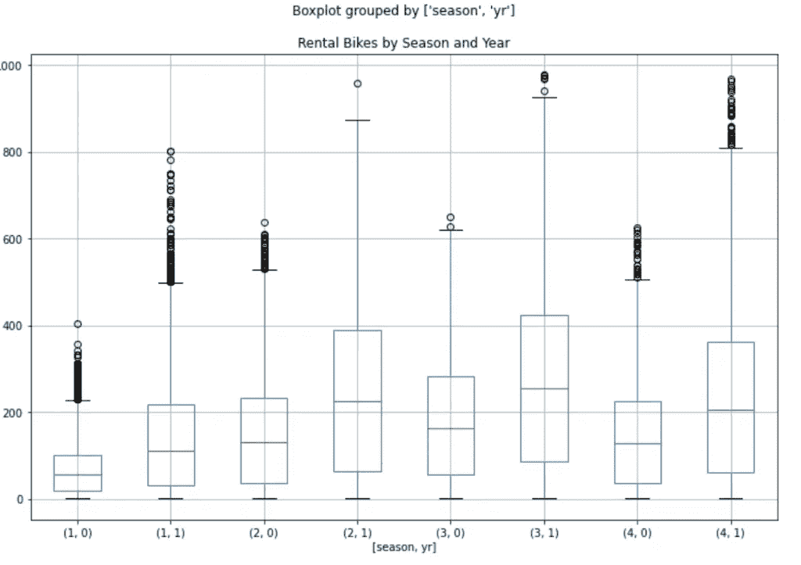

```
df.boxplot(by=['hr'], column='cnt', figsize=(12,8)) plt.title("Rental Bikes by Hour")
```

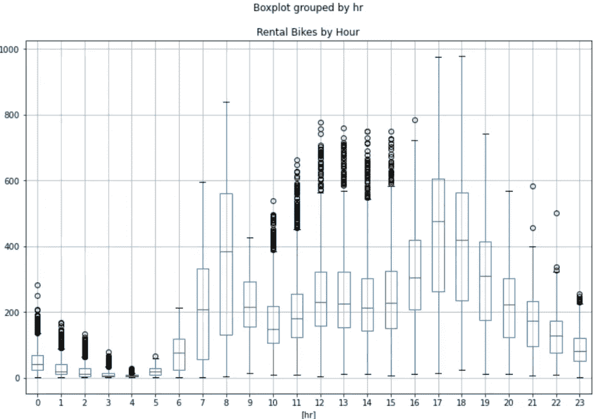

```
df.boxplot(by=['weekday'], column='cnt', figsize=(12,8)) plt.title("Rental Bikes by Weekday")
```

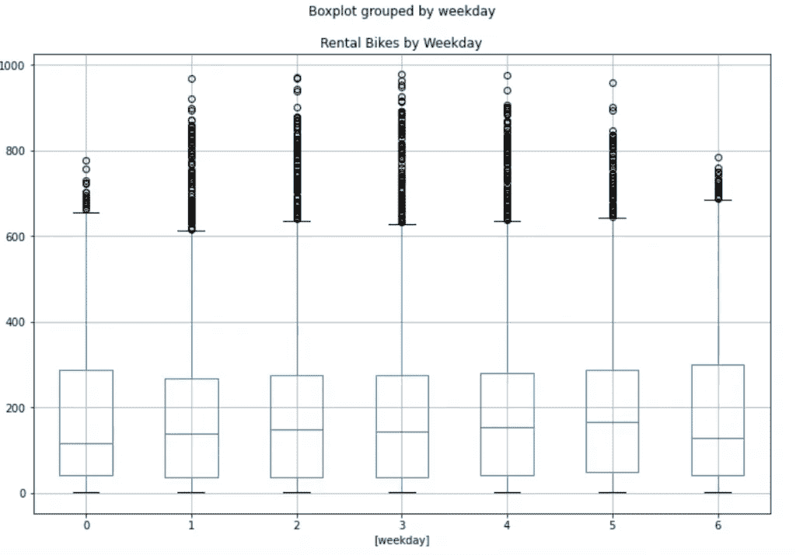

## 关联和关联热图

我们将返回数值变量的[相关皮尔逊系数](https://en.wikipedia.org/wiki/Correlation_coefficient)。

```
# get the correlation df.corr()
```

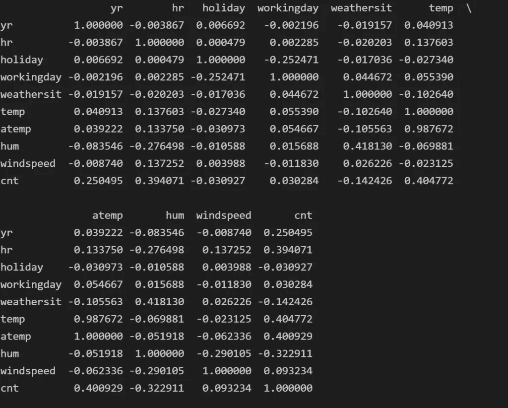

```
# correlation of Rental Bikes vs the rest variables df.drop('cnt', axis=1).corrwith(df.cnt)
```

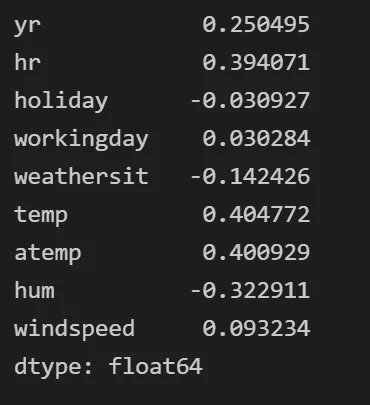

```
plt.figure(figsize=(12,8)) sns.heatmap(df.corr(), annot=True, cmap="YlGnBu")
```

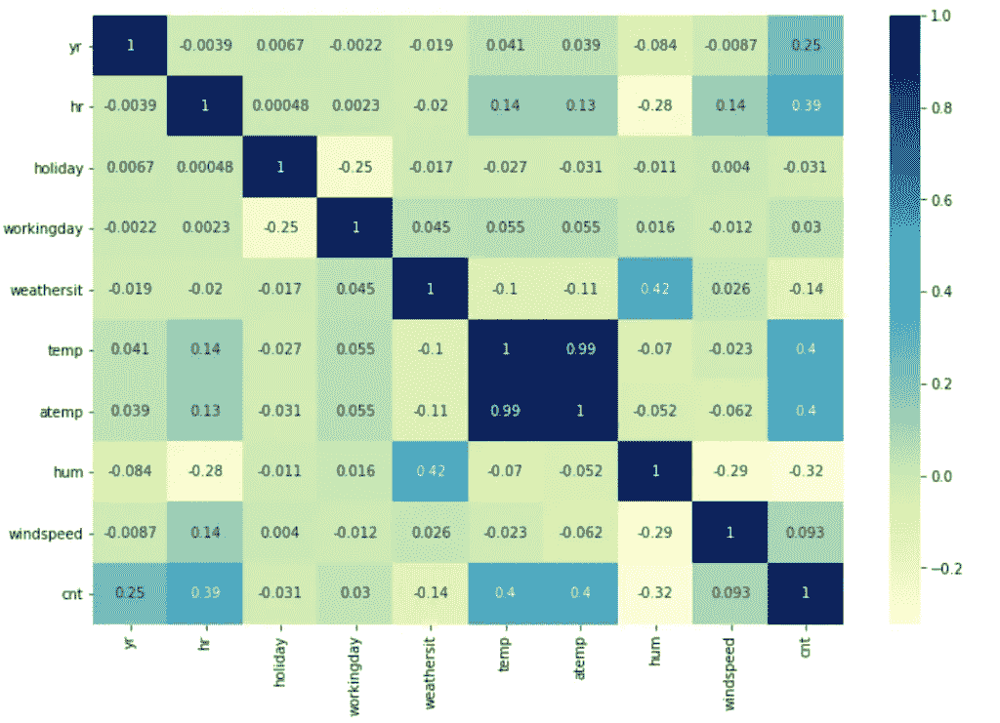

## 多重共线性

正如所料,`temp`和`atemp`高度相关，导致了[多重共线性](https://en.wikipedia.org/wiki/Multicollinearity#:~:text=Multicollinearity%20refers%20to%20a%20situation,equal%20to%201%20or%20%E2%88%921.)的问题，这就是为什么我们只保留一个。我们将移除`temp`。

```
df.drop('temp', axis=1, inplace=True) # remove also the date column since we will not use it for the machine learning modelling df.drop('dteday', axis=1, inplace=True)
```

在我们开始分析我们的模型之前，我们需要[对分类变量应用一次性编码](https://en.wikipedia.org/wiki/One-hot)。我们将通过应用 [get_dummies](https://pandas.pydata.org/docs/reference/api/pandas.get_dummies.html_) 函数来实现。

## 一键编码

```
df = pd.get_dummies(df)
```

## 训练测试数据集

对于我们的分析，我们将数据集分为训练和测试(75% -25%)，以便在训练数据集上构建模型，并在测试数据集上评估它们。

```
X_train, X_test, y_train, y_test = train_test_split(df.drop('cnt', axis=1), df.cnt, test_size=0.25, random_state=5)
```

## 机器学习模型

我们将尝试不同的机器学习模型

*   线性回归
*   随机森林
*   梯度增强

我们会选择 RMSE 最低的那个。

**线性回归**

```
from sklearn.metrics import mean_squared_error
from sklearn.linear_model import LinearRegressionreg = LinearRegression().fit(X_train, y_train)# Get the RMSE for the train dataset
print(np.sqrt(mean_squared_error(y_train, reg.predict(X_train))))# Get the RMSE for the test dataset
print(np.sqrt(mean_squared_error(y_test, reg.predict(X_test)))) # results:139.63173269641877 141.72019878710364
```

**随机森林**

```
from sklearn.ensemble import RandomForestRegressorrf = RandomForestRegressor().fit(X_train, y_train)# Get the RMSE for the train dataset
print(np.sqrt(mean_squared_error(y_train, rf.predict(X_train))))# Get the RMSE for the test dataset
print(np.sqrt(mean_squared_error(y_test, rf.predict(X_test)))) # results:16.301139181478824 42.60910391839956
```

**梯度提升**

```
from sklearn.ensemble import GradientBoostingRegressorgb = GradientBoostingRegressor().fit(X_train, y_train)# Get the RMSE for the train dataset
print(np.sqrt(mean_squared_error(y_train, gb.predict(X_train))))# Get the RMSE for the test dataset
print(np.sqrt(mean_squared_error(y_test, gb.predict(X_test))))# results69.83046975214577 69.94424353189753
```

## 选择最佳型号

基于训练和测试数据集上的 **RMSE** ，最佳模型是**随机森林**。

## 统计分析

基于统计分析和基尼系数，我们将定义随机森林模型中最重要的变量。

```
feat_importances = pd.DataFrame(rf.feature_importances_, index=X_train.columns, columns=["Importance"])
feat_importances.sort_values(by='Importance', ascending=False, inplace=True)feat_importances
```

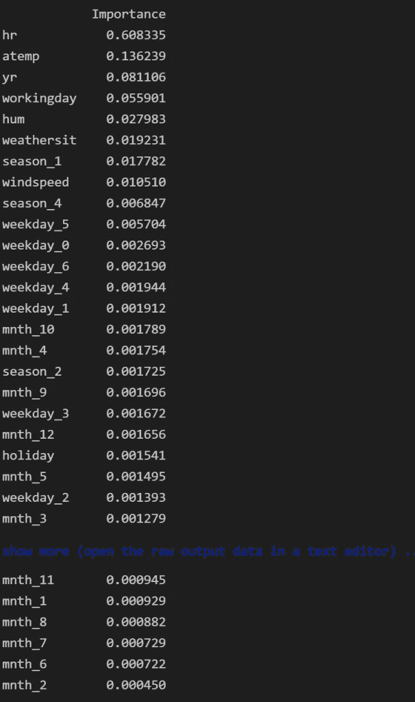

```
feat_importances.plot(kind='bar', figsize=(12,8))
```

我们可以看到，最重要的变量是:

*   60%的时间
*   气温下降了 14%
*   8%的年份

我们发现自行车租赁的数量取决于时间和温度。此外，变量之间似乎存在交互作用，如一周中的小时和天，或月份和年份等，因此，基于树的模型(如梯度增强和随机森林)比线性回归表现得好得多。此外，基于树的模型能够捕捉非线性关系，因此，例如，时间和温度不具有线性关系，因此，例如，如果天气非常热或冷，则自行车租金会下降。我们的模型在测试数据集中的 RMSE 为 42，这似乎是有希望的。

# 进一步分析

当我们建立机器学习模型时，总是有改进的空间。例如，我们可以尝试以下方法:

*   将`cnt`列转换为`cnt`的对数
*   使用网格搜索尝试不同的模型
*   模型超参数的微调

# 导出预测

```
# the name of my model is rf - this is how I called it before# now I re-train my model on the whole dataset
rf = RandomForestRegressor().fit(df.drop('cnt', axis=1), df.cnt)# I get the predictions
df['Predictions'] = rf.predict(df.drop('cnt', axis=1))df.to_csv("my_analysis.csv", index=False)
```

*原载于 https://predictivehacks.com*[](https://predictivehacks.com/an-example-of-a-data-science-pipeline-in-python-on-bike-sharing-dataset/)**。**