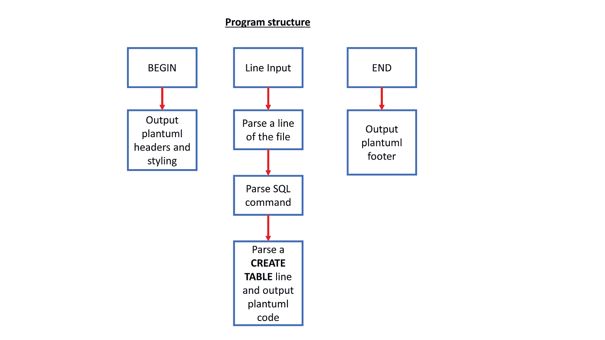
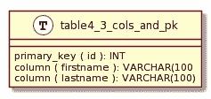
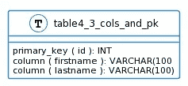
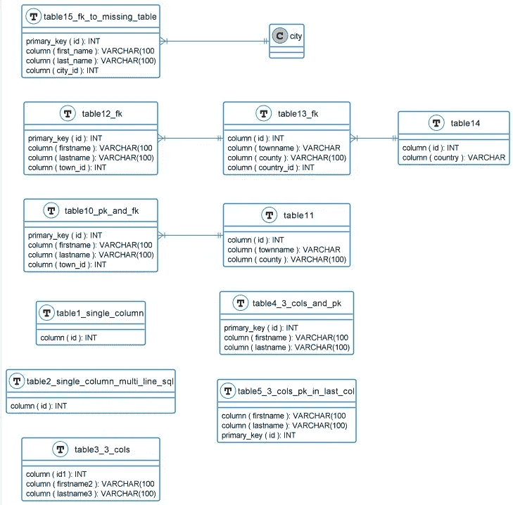
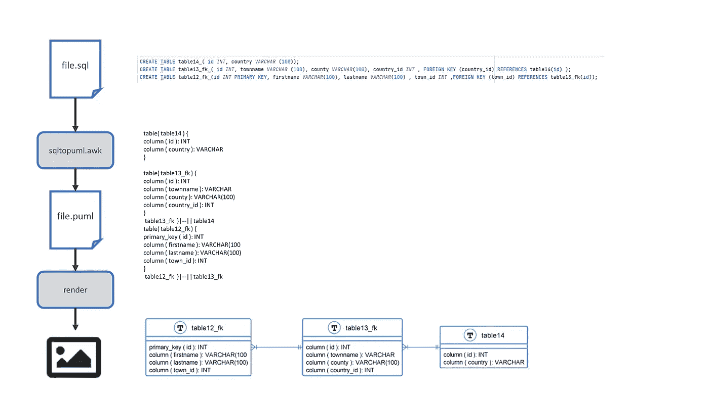

# 使用 plantUML 将数据库逆向工程为 ERD 的实验

> 原文：<https://levelup.gitconnected.com/an-experiment-to-reverse-engineer-a-database-into-an-erd-using-plantuml-9606bd08f961>

## 活文档在实践中有多容易？


由 [Unsplash](https://unsplash.com?utm_source=medium&utm_medium=referral) 上的 [CHUTTERSNAP](https://unsplash.com/@chuttersnap?utm_source=medium&utm_medium=referral) 拍摄

[live documentation](https://medium.com/geekculture/living-documentation-brief-history-and-evolution-of-the-concept-4492fafb5d7)是一个用来描述软件实现、设计及其代表性文档之间的强耦合的术语。这通常是通过使用工具包中的各种部件来自动解析信息并将其从一种格式转换为另一种格式，从而可以将其呈现为图表来实现的。

问题是:

> 在实践中有多容易做到？

因此，我决定通过对数据库(而不是代码)进行逆向工程的实验来了解这些复杂性和问题。

# 目标

绘制一个[实体关系图](https://www.visual-paradigm.com/guide/data-modeling/what-is-entity-relationship-diagram/) (ERD)显示 SQL 数据库的模式，使用现有的标准和脚本，并根据需要添加一些定制的粘合代码。


文章作者图片

# 建还是买？

第一步是看看我能找到什么工具来完成整个工作或部分工作。

一次互联网搜索发现了一些工具，它们可以连接到一个正在运行的数据库(一个非常特殊的类型)并生成一个图表，但是我想从模式中生成一个图表。这将允许在数据库实现之前记录设计，并且在数据库创建之后记录数据库。这开启了未来全往返工程的可能性。

将 [SQL DDL](https://en.wikipedia.org/wiki/Data_definition_language) 从数据库中转储出来以获得模式是相对简单的，因此这将是一个起点。

假设 SQL 可以被解析成某种类型的 [markdown](https://www.markdownguide.org/basic-syntax/) 并存储为一个文件，那么可以使用可用的脚本和[工具](https://doctoolchain.github.io/docToolchain/)之一将其呈现为一个图像或富文档。

有几个常见的降价标准可供选择:

*   [降价](https://www.markdownguide.org/basic-syntax/)以文本格式显示一组**基本**表格信息
*   markdown 带有 [**人鱼**](https://mermaid-js.github.io/mermaid/#/) 扩展支持显示图表
*   用 [**plantUML**](https://plantuml.com/) 扩展支持显示图表

因为我想创建一个实体关系图来显示表、它们的列以及与其他表的关系，所以我选择了 [plantUML](https://plantuml.com/) 。


文章作者图片

# 设计方法和原则

**决策 1** :用哪种语言编写软件来解析 SQL？

我决定使用模式处理语言，假设输入文件到输出文件的映射很简单，几乎是 1:1 的转换。

[**awk**](https://en.wikipedia.org/wiki/AWK) 是一种脚本语言，即使用任何文本编辑器或 IDE 进行解释以创建文件。它是为文本处理而设计的，是 unix/linux 系统的标准特性，类似于 C。

**决策 2** :解决方案设计

由于这是一个简单的实验，我提出了一个非常简单的结构，它基于这样一个假设，即一个 SQL 命令可以一次性处理到相应的一行或多行降价文本。



文章作者图片

# 准备

通过检查版本(-V 标志)来检查 awk 是否已安装/可用

```
awk -V
```

在 Windows 上使用 WSL，看看结果

```
awk -V
GNU Awk 5.0.1, API: 2.0 (GNU MPFR 4.0.2, GNU MP 6.2.0)
Copyright (C) 1989, 1991-2019 Free Software Foundation.This program is free software; you can redistribute it and/or modify
it under the terms of the GNU General Public License as published by
the Free Software Foundation; either version 3 of the License, or
(at your option) any later version.This program is distributed in the hope that it will be useful,
but WITHOUT ANY WARRANTY; without even the implied warranty of
MERCHANTABILITY or FITNESS FOR A PARTICULAR PURPOSE.  See the
GNU General Public License for more details.You should have received a copy of the GNU General Public License
along with this program. If not, see [http://www.gnu.org/licenses/](http://www.gnu.org/licenses/).
```

或者在 windows 上使用 Gnu 版本，[呆呆](http://gnuwin32.sourceforge.net/packages/gawk.htm)

# 履行

awk 文件写得很快，在一个文件中只包含几个函数( *sql2puml.awk* )，代码可以被重构为更压缩、更易读的格式，但这一步没有完成。

这段代码处理了一个 SQL 命令，间隔了几行，但只是为了处理 sqlite 格式的 SQL 而构建的，因为这只是一个原则测试。

为了使最终图像的样式更加简单，使用了 plantuml 函数，所有的样式元素都在一个地方预先定义好了。

然后，解析 SQL 命令只需将命令分解成组成部分。主要重点是扫描 CREATE TABLE 命令支持 plantuml 格式的输出文本:

```
define_primary_key(x)- to style a column that holds a primary key
define foreign_key(x) - to style a column that holds a foreign key
define_column(x) - to define a column in a table
define_table(x) - to define a table
```

因此，在 plantuml 中，单个表可以描述为:

```
table( table4_3_cols_and_pk ) { 
primary_key ( id ): INT
column ( firstname ): VARCHAR(100
column ( lastname ): VARCHAR(100)
}
```

然后将呈现为:



通过使用 [*skinparam*](http://plantuml.com/guide) 命令应用样式规则，渲染图像可以从默认颜色改变:

```
skinparam roundcorner 5
skinparam linetype ortho
skinparam shadowing false
skinparam handwritten false
skinparam class {
 BackgroundColor white
 ArrowColor #2688d4
 BorderColor #2688d4
}
```

因此，它呈现为:



两个表之间的关系将用 plantuml 语法描述如下:

```
table1  }|--|| table2
```

完整的文件可以在 https://github.com/gbmav/sql2puml的 github 上获得

# 试验

为了确保代码可以处理一些基本的图表，我创建了一个测试向量文件，显示各种表格组合。

```
CREATE TABLE table1_single_column (id *INT* );
CREATE TABLE table2_single_column_multi_line_sql (
id *INT* );

CREATE TABLE table3_3_cols (id1 *INT* , firstname2 *VARCHAR*(100), lastname3 *VARCHAR*(100) );
CREATE TABLE table4_3_cols_and_pk (id *INT* PRIMARY KEY, firstname *VARCHAR*(100), lastname *VARCHAR*(100) );
CREATE TABLE table5_3_cols_pk_in_last_col ( firstname *VARCHAR*(100), lastname *VARCHAR*(100), id *INT* PRIMARY KEY );

CREATE TABLE table11 ( id *INT*, townname *VARCHAR* (100), county *VARCHAR*(100) );
CREATE TABLE table10_pk_and_fk (id *INT* PRIMARY KEY, firstname *VARCHAR*(100), lastname *VARCHAR*(100) , town_id *INT*, FOREIGN KEY (town_id) REFERENCES table11(id));

CREATE TABLE table14 ( id *INT*, country *VARCHAR* (100));
CREATE TABLE table13_fk ( id *INT*, townname *VARCHAR* (100), county *VARCHAR*(100), country_id *INT* , FOREIGN KEY (country_id) REFERENCES table14(id) );
CREATE TABLE table12_fk (id *INT* PRIMARY KEY, firstname *VARCHAR*(100), lastname *VARCHAR*(100) , town_id *INT* ,FOREIGN KEY (town_id) REFERENCES table13_fk(id));

CREATE TABLE table15_fk_to_missing_table (id *INT* PRIMARY KEY,first_name *VARCHAR*(100) NOT NULL,last_name *VARCHAR*(100) NOT NULL,city_id *INT* ,FOREIGN KEY (city_id) REFERENCES city(id) );
```

# 执行

该软件是使用

```
awk -f sql2puml.awk sql-test-vectors.sql > sql-test-vectors.puml
```

# 实验结果

然后，通过在带有相关插件(例如 pycharm、Visual Studio)的 IDE 中打开文件或使用 plantuml 网站，可以将输出文件作为渲染图像进行查看。

下面的[命令](http://www.plantuml.com/plantuml/proxy?cache=no&src=https://raw.githubusercontent.com/gbmav/sql2puml/master/sql-test-vectors.puml)发送输出文件(。puml 扩展)到 plantuml 服务器，以作为图像呈现。

```
[http://www.plantuml.com/plantuml/proxy?cache=no&src=https://raw.githubusercontent.com/gbmav/sql2puml/master/sql-test-vectors.puml](http://www.plantuml.com/plantuml/proxy?cache=no&src=https://raw.githubusercontent.com/gbmav/sql2puml/master/sql-test-vectors.puml)
```

plantuml 站点 laso 有一个[交互式在线编辑器](http://www.plantuml.com/plantuml/uml/pLLTQzim57tthxYZC19OQPoF4eenpVgolUoXbBqAnP8J4LdAf1iSq_I_JugJr8uCtc259I_nlUVeV0ZYHulKuAwGaUGv0cemOhL6OCBm38LMaTq8jQM65c3qJh5C6yKDp1fpAHJ7Qij16rphniAkATEbK2l8gRIyiLbJnKeZ4BaATfcari9h15zfjbaTHP-qr0RAjK0UmS8ONTQJc_7zVCwc3geDuwOzV8i-CPuxRx0reg2c8XjU3VP3I9PfaddemyroFh-FtUDdjqgJk-CqXNrojqmlx5mRBbRgp3vJwV4JK2yqDzWLgidWkVywHi6PeBUkOEUwYufqARbdSeK2AzX3ai3WvKlTm13IDAeXDJ8crdKiEQabOGYl49r-3q0m63x0znylhf0MRTocaM8dKH1_cSJ-adzwoeHC_04smCTdmcMM2sDHqOAF_Uhduldfs-9v48z6xn19QyJa2Z6ybfsUP0bLZ6mtjNhZdbkMGmUz1lhqPoTzfqs48fxcdsiV_qAlEqjGVnm7nGUfKPVgIkDzcUcTmgelRZpoGNtN-STttNPEcjaxtC3RuVRsS3ZNqROzxMsdBi0q6mZ2JxpEHzGSkEWAEmbJJjl-nl_7hOn3ezvxs-lCJGXgKWZh_tx8SVetvacF-m0HL2smg-TkPvSydXKzSiNyk_8t)，用于输入降价文本并显示相应的图像，这对于在将样式更改编码到软件中之前测试样式更改非常有用。

[](http://www.plantuml.com/plantuml/uml/pLLTQzim57tthxYZC19OQPoF4eenpVgolUoXbBqAnP8J4LdAf1iSq_I_JugJr8uCtc259I_nlUVeV0ZYHulKuAwGaUGv0cemOhL6OCBm38LMaTq8jQM65c3qJh5C6yKDp1fpAHJ7Qij16rphniAkATEbK2l8gRIyiLbJnKeZ4BaATfcari9h15zfjbaTHP-qr0RAjK0UmS8ONTQJc_7zVCwc3geDuwOzV8i-CPuxRx0reg2c8XjU3VP3I9PfaddemyroFh-FtUDdjqgJk-CqXNrojqmlx5mRBbRgp3vJwV4JK2yqDzWLgidWkVywHi6PeBUkOEUwYufqARbdSeK2AzX3ai3WvKlTm13IDAeXDJ8crdKiEQabOGYl49r-3q0m63x0znylhf0MRTocaM8dKH1_cSJ-adzwoeHC_04smCTdmcMM2sDHqOAF_Uhduldfs-9v48z6xn19QyJa2Z6ybfsUP0bLZ6mtjNhZdbkMGmUz1lhqPoTzfqs48fxcdsiV_qAlEqjGVnm7nGUfKPVgIkDzcUcTmgelRZpoGNtN-STttNPEcjaxtC3RuVRsS3ZNqROzxMsdBi0q6mZ2JxpEHzGSkEWAEmbJJjl-nl_7hOn3ezvxs-lCJGXgKWZh_tx8SVetvacF-m0HL2smg-TkPvSydXKzSiNyk_8t) [## PlantUML Web 服务器

### 借助 PlantUML Web 服务器，从浏览器中简单自由地创建 UML 图。只需输入一个文本图表，然后…

www.plantuml.com](http://www.plantuml.com/plantuml/uml/pLLTQzim57tthxYZC19OQPoF4eenpVgolUoXbBqAnP8J4LdAf1iSq_I_JugJr8uCtc259I_nlUVeV0ZYHulKuAwGaUGv0cemOhL6OCBm38LMaTq8jQM65c3qJh5C6yKDp1fpAHJ7Qij16rphniAkATEbK2l8gRIyiLbJnKeZ4BaATfcari9h15zfjbaTHP-qr0RAjK0UmS8ONTQJc_7zVCwc3geDuwOzV8i-CPuxRx0reg2c8XjU3VP3I9PfaddemyroFh-FtUDdjqgJk-CqXNrojqmlx5mRBbRgp3vJwV4JK2yqDzWLgidWkVywHi6PeBUkOEUwYufqARbdSeK2AzX3ai3WvKlTm13IDAeXDJ8crdKiEQabOGYl49r-3q0m63x0znylhf0MRTocaM8dKH1_cSJ-adzwoeHC_04smCTdmcMM2sDHqOAF_Uhduldfs-9v48z6xn19QyJa2Z6ybfsUP0bLZ6mtjNhZdbkMGmUz1lhqPoTzfqs48fxcdsiV_qAlEqjGVnm7nGUfKPVgIkDzcUcTmgelRZpoGNtN-STttNPEcjaxtC3RuVRsS3ZNqROzxMsdBi0q6mZ2JxpEHzGSkEWAEmbJJjl-nl_7hOn3ezvxs-lCJGXgKWZh_tx8SVetvacF-m0HL2smg-TkPvSydXKzSiNyk_8t) 

文章作者图片

*   输出减价被渲染成可视图像。
*   表示表格的图表框可以使用 plantUMl 命令进行样式化。
*   ERD 的基础-表、列和关系可以使用这种方法来表示。
*   样式的使用使得图表更容易阅读。

# 实验总结



文章作者图片

# 反思和后续步骤

在建立了这个模型并证明了这个概念的可行性之后，我很想开始用更多的改进来更新它，但是我决定是时候停下来回顾一下到目前为止的结果和选择了。

*   当表有关系，并且关系与另一个还没有定义的表相关时，将单行作为原子单位的简单处理是不够的。
*   SQL 中的错误(如与缺失表的关系)可以得到更好的处理，并清楚地显示在结果输出中。
*   该软件并没有真正使用 awk 的模式处理能力，因此可能更适合用不同的语言编写。
*   产生各种各样的输出格式(markdown tables、mermaid 或 plantuml)将是相当直接的，这将给软件带来更多的吸引力和灵活性。
*   该软件仅使用针对 [**sqlite 数据库**](https://www.sqlite.org/index.html) 格式化的 SQL 进行了测试，因此需要针对其他风格的 SQL 进行测试和功能增强，以使其更加通用。
*   代码没有进行重构，也没有用非常清晰的变量命名来编写，并且包含了大量注释掉的代码片段和调试，这些代码在实验结束时没有被删除。
*   作者没有花很长时间就得到一个可以实现这个实验目标的工作软件。

总的来说，编写软件来处理 SQL 文件并生成 ERD 是非常容易的，该软件可以显示为图像，或者基于 markdown 格式进一步转换为其他文档格式(例如 Microsoft Word)来描述表格和关系。考虑到像这样的工具的好处，令人惊讶的是还没有可以执行这项任务的东西，这表明活文档没有被广泛地实现。脚本和工具包的可用性表明，爱好者或积极的个人可以快速组装必要的解决方案，但它还没有下架。

# 进一步阅读

*   本文中的代码和测试文件可以在 https://github.com/gbmav/sql2puml[的 github 上获得](https://github.com/gbmav/sql2puml)

[](https://medium.com/geekculture/are-there-any-living-documentation-tools-for-databases-220cee7dc8f6) [## 有没有什么活的数据库文档工具？

### 如何记录新的设计和逆向工程现有的数据库和表格

medium.com](https://medium.com/geekculture/are-there-any-living-documentation-tools-for-databases-220cee7dc8f6) [](https://medium.com/geekculture/code-as-diagrams-whats-the-point-13dbe6053738) [## 以图表形式编码——有什么意义？

### 活文档—第 3 部分

medium.com](https://medium.com/geekculture/code-as-diagrams-whats-the-point-13dbe6053738) [](https://medium.com/geekculture/living-documentation-brief-history-and-evolution-of-the-concept-4492fafb5d7) [## 活文档——概念的简史和演变

### 第一部分

medium.com](https://medium.com/geekculture/living-documentation-brief-history-and-evolution-of-the-concept-4492fafb5d7) 

# 关于作者的更多信息

**Greg** 是一名经验丰富的软件专业人士，也是[**outsource . dev**](https://outsource.dev/)**，**的首席技术官，他曾在多家公司工作过，现在热衷于帮助他人在软件开发、管理和外包方面取得成功。他刚刚写了一本名为“[](https://www.amazon.co.uk/dp/B09CRXYK36/ref=as_sl_pc_qf_sp_asin_til?tag=osduk0a-21&linkCode=w00&linkId=d2a648c5bb793e3ed7b3bd6f5290f329&creativeASIN=B09CRXYK36)**”的短篇小说。**

**如果你喜欢这篇文章，请鼓掌👏和**关注**我或者 [**订阅**](https://greg-billington.medium.com/subscribe) 一封邮件✉️。**