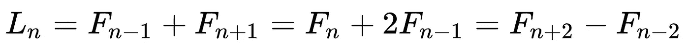
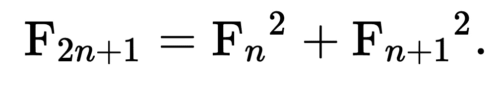
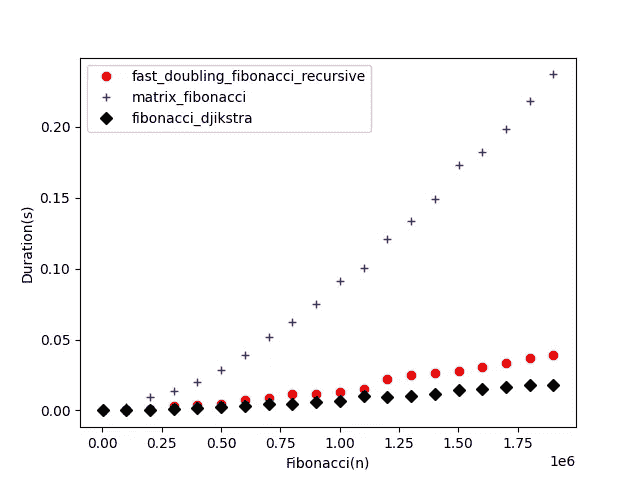

# 用 Python 探索斐波那契公式

> 原文：<https://levelup.gitconnected.com/an-exploration-of-fibonacci-in-python-ac4e7df40d55>


螺旋楼梯的蠕虫眼景观[https://www . pexels . com/photo/worms-Eye-View-of-Spiral-colored-glass-decors-through-the-roof-161154/](https://www.pexels.com/photo/worms-eye-view-of-spiral-stained-glass-decors-through-the-roof-161154/)

让我们探索使用 Python 计算斐波那契数列的许多不同方法和技术。

斐波那契数列[是美丽的，迷人的，神秘的！数列的定义如下:每个数都是前面两个数的和。简单:](https://en.wikipedia.org/wiki/Fibonacci_number)

```
0, 1, 1, 2, 3, 5, 8, 13, 21, 34, 55, 89, 144, ...
```

## 迭代计算斐波那契

计算斐波那契数(n)最简单的方法就是从起点开始，向前迭代。该解决方案计算所有以前的值，使其运行时间呈指数增长—数字越大，计算时间越长。

## 递归计算斐波那契

寻找斐波那契数的递归方法有时被用作计算机科学课堂的教学辅助。您可以在这里看到该函数在第 14 行调用了自己——使其成为递归的。

此方法从起始位置向后工作，直到到达 1 或 0。否则，它会计算所有先前递归的总和。

递归之所以有效，是因为计算机会跟踪我们在哪里使用了一种叫做*堆栈内存*的内存结构。这是有限的！试图寻找大的斐波那契数会耗尽堆栈空间。

此外:递归算法与迭代算法有着相同的时间复杂性问题——它必须计算所有的值。

## 使用记忆化进行有效的递归

对于`i`的一些值，重复调用前面的递归函数。我们可以使用一种称为记忆化的技术，而不是重新计算这个值。

记忆就是简单地记下以前计算的输出值。然后我们返回备忘录，而不是重新计算价值。

如果我们使用装饰函数，Python 可以很好地支持记忆化。装饰器包装算法，拦截所有调用和所有返回值。通过截取调用和返回值，我们可以将它们存储在本地缓存中，并在将来使用缓存的答案。

我们现在可以将`memo`装饰器应用于函数 fibonacci_wrapped，并看到速度有了很大的提高。不幸的是，递归限制仍然适用。

Python 有一个内置的内存化装饰器，最近最少使用的缓存`lru_cache`:

```
@functools.lru_cache(maxsize=None)
```

我们可以省去自己编写代码的麻烦(低效！)memoization decorator，而不是使用`@functools.lru_cache.`如果你想用这个的话，别忘了使用`import functools`。

## 用矩阵乘法计算斐波那契数

前面的例子都有同样的问题:序列中所有前面的值都需要计算。我们可以通过使用矩阵乘法来直接计算序列的值，而无需计算前一个值，从而避免这种低效率。

你可以在这里阅读更多关于矩阵乘法的内容:

[](https://en.wikipedia.org/wiki/Matrix_multiplication) [## 矩阵乘法

### 在数学中，更确切地说是线性代数中，矩阵乘法是一种二元运算，它产生一个矩阵…

en.wikipedia.org](https://en.wikipedia.org/wiki/Matrix_multiplication) 

因为斐波纳契数列是线性的和可预测的，所以可以使用线性代数有效地计算它。

该公式需要恒定的内存空间才能完成，并且随着 n 值的增加，所需的时间也呈线性增长。

## 使用黄金分割率计算斐波纳契数

包含此方法是为了完整起见！

[](https://en.wikipedia.org/wiki/Golden_ratio#/media/File:Golden_ratio_line.svg) [## 黄金比例

### 在数学中，如果两个量的比值等于它们的和与它们的和的比值，那么这两个量就是黄金比例

en.wikipedia.org](https://en.wikipedia.org/wiki/Golden_ratio#/media/File:Golden_ratio_line.svg) 

斐波那契数列完美地代表了黄金分割率，所以我们可以用比奈公式来计算它:

你可以看到我在这里作弊。如果我们要搜索的序列号大于 71，这个函数就会悄悄地作弊，转而使用矩阵乘法。

比奈公式是精确的代数。然而，计算机必须使用浮点数的不精确表示。随着 n 值的增加，舍入误差也会累积。

## 用位运算计算斐波那契数列

在以前的一篇文章中，我描述了一些对整数执行位运算的常用公式。我的长期订户可能一直想知道为什么，但现在一切都揭晓了！

在我们探索以下计算斐波那契数的方法之前，理解二进制算术是很重要的。

[](/6-pythonic-bit-manipulation-recipes-ebdbd630e5ef) [## 6 种 Pythonic 比特操作方法

### 一些可重用的 python 方法，用于操作位来执行快速运算。

levelup.gitconnected.com](/6-pythonic-bit-manipulation-recipes-ebdbd630e5ef) 

## 卢卡斯序列

在处理斐波那契数列时，我还想展示卢卡斯数列。像斐波那契一样，卢卡斯数字是它们的两个前任的总和——它们只是从不同的地方开始:

```
2, 1, 3, 4, 7, 11, 18, 29, 47, 76, 123, 199, ....
```

因此，卢卡斯数与斐波那契数非常接近:



卢卡斯和斐波那契数是相关的

让我们用`n=6`来解决这个问题。

```
F(n-1) = F(5) = 3
F(n+1) = F(7) = 8
F(n-1) + F(n+1) = (3 + 8) = **11**L(6) = **11**
```

## 用吉克斯特拉公式计算斐波那契数

Edsgar Djikstra 可能是现代史上最杰出的理论计算机科学。他提出了一种算法，利用卢卡斯数的幂来导出相关的斐波那契数。

真的很棒。完整的算法如下:

函数`fibonacci_djikstra`可识别地使用了我之前展示的卢卡斯数和斐波纳契数之间的关系:`L(n) = F(n-1) + F(n+1)`。

它更进了一步，使用卢卡斯幂函数来利用比奈公式的一部分——看那里的整数 5，你从黄金分割的讨论中认出来了吗？

关于 Djikstra 算法的更深入的讨论，可以随意参考[这个信息](https://www.cs.utexas.edu/users/EWD/ewd06xx/EWD654.PDF)。

## Karatsuba 快速乘法

继我们对二进制算术的讨论之后，有一种非常有趣的方法来计算**非常**大的乘积——Karatsuba 乘法。

根据[维基百科](https://en.wikipedia.org/wiki/Karatsuba_algorithm)的说法，Karatsuba 算法是第一个渐近快于二次“小学”算法的乘法算法，对于足够大的值，它提供了 17.75 倍于传统二次公式的加速。

我们将在下一个也是最后一个计算斐波那契数列的公式中使用这个算法！

## 递归快速加倍计算斐波那契

下面的快速加倍公式使用了前面解释的四种工具:递归、记忆、二进制算术和 Karatsuba 乘法。你应该能猜到我为什么选择把这个公式放在最后！

这个公式非常快。它在我的 MacBook Pro 上以微秒为单位计算斐波那契到 80000 位。

接下来，我将使用迭代变体解释这是如何工作的。

## 迭代快速加倍计算斐波那契

我们可以很容易地改变算法的形式:从递归到迭代或者从迭代到递归。看看下面的迭代版本与前面的有何不同:

它包含两个循环。第一个连续将我们要找的序列号减半。第二个在回来的路上连续加倍。迭代版本显然更慢，但避免了堆栈溢出。

这个算法使用了数论者确定的一个重要性质:“减半性质”。它还通过利用以下公式极大地简化了矩阵乘法方法:



有很多平方在计算，这就是 Karatsuba 乘法有用的地方。

## 计时结果

我想你可能会对计时结果感兴趣。我决定比较矩阵乘法算法、快速加倍算法和 Djikstra 算法。很明显，黄金分割、简单的迭代和递归算法会慢一些。

下面是收集计时数据的代码:

这是计时结果的图表:



我希望你喜欢这篇文章！我想邀请您关注我，以便在我发布下一篇文章时通知您！