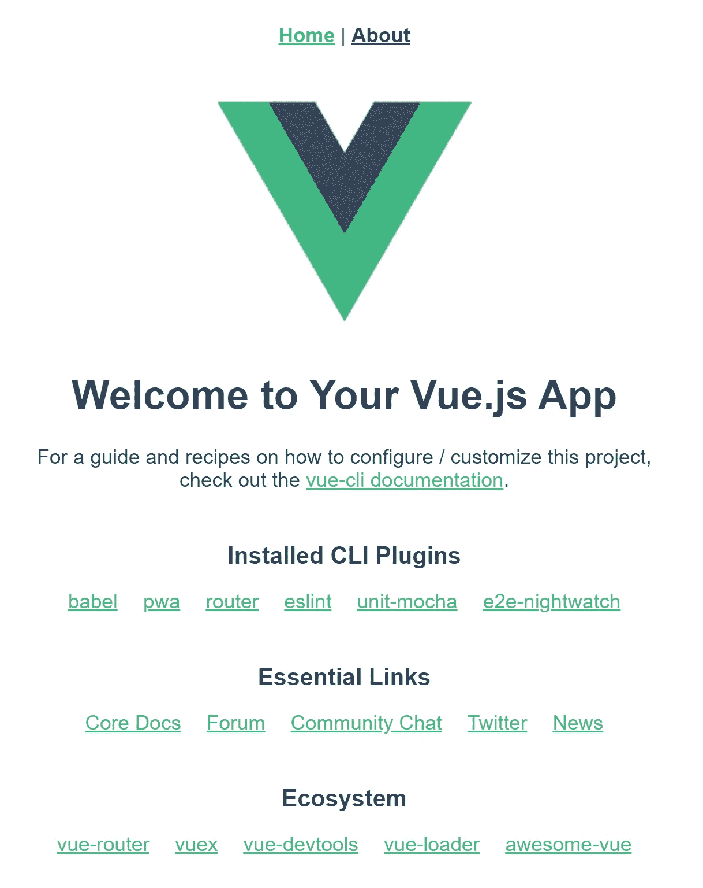
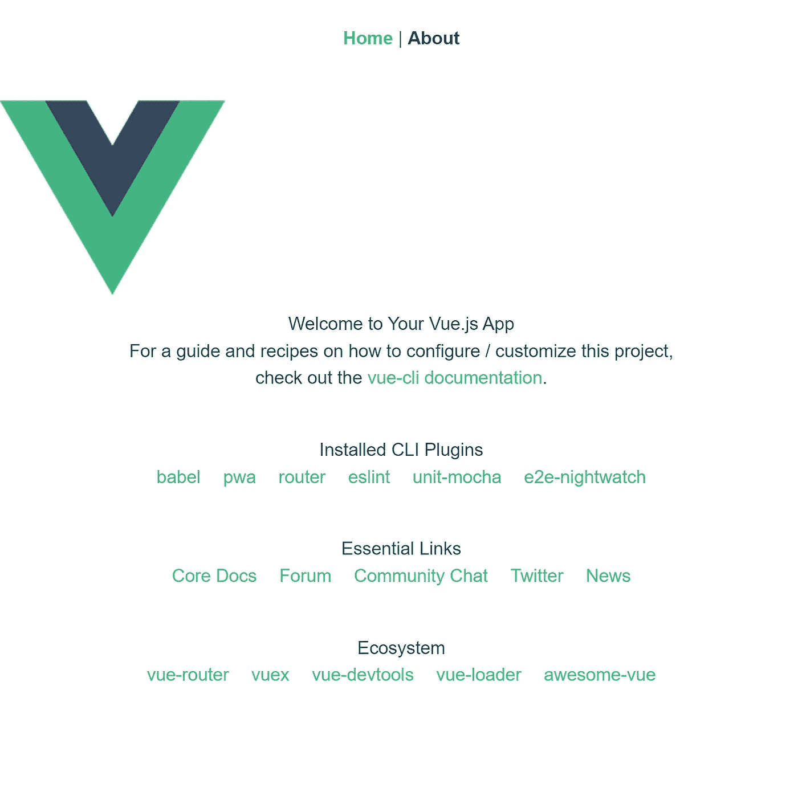
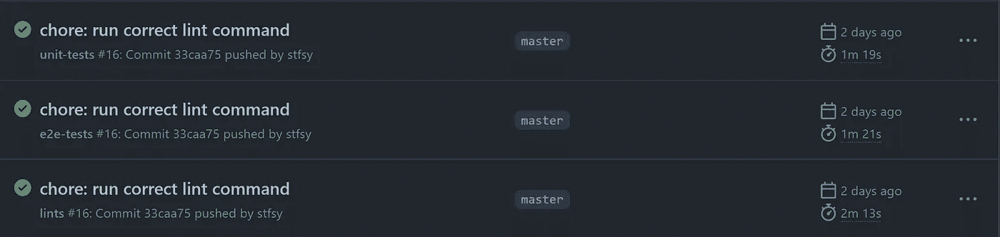

# Vue 的全面安装指南。带有 Tailwindcss 和 GitHub 操作的 JS

> 原文：<https://levelup.gitconnected.com/an-extensive-setup-guide-for-vue-js-with-tailwindcss-and-github-actions-786bc03c8e95>

## 包括您快速入门所需的一切


[Jared Rice](https://unsplash.com/@jareddrice?utm_source=medium&utm_medium=referral) 在 [Unsplash](https://unsplash.com?utm_source=medium&utm_medium=referral) 上拍摄的照片

转换到新技术或新框架从来都不容易。虽然像`@vue/cli`这样的工具提供了很多现成的功能，但是也有一些不能事先知道的警告。这篇文章应该会让任何人更容易开始使用 Vue.js、tailwindcss 和 GitHub 操作。

**这个故事将涵盖 Vue.js 应用程序的设置和 tailwindcss** 的集成，以及**单元测试、端到端测试、内衬和发布的设置。**

所以请坚持到最后，因为您最终将获得一个 Vue.js 应用程序，可用于本地开发、远程 CI/CD 和在任何云提供商上的部署。

在我们开始之前，让我们检查一下需求。

# 先决条件

在开始实际设置之前，我们需要安装的运行时和工具:

*   NodeJS
*   节点程序包管理器(NPM)
*   Visual Studio 代码(或您选择的 IDE)

让我们通过运行`node -v`来验证配置；您应该能够看到与下面类似的输出:

```
**[~] node -v**
v16.5.0
```

并通过运行命令`npm -v`检查 NPM 的设置。

```
**[~] npm -v**
7.19.1
```

# 搭建新的 Vue.js 项目

我们将利用 Vue.js CLI 来设置我们的默认项目结构。命令行界面(CLI)可通过 NPM 和`@vue` scope 获得。

让我们先运行带有`help`标志的`create`命令，再次验证我们的设置是否正确。

```
**[~] npx** [**@vue/cli**](http://twitter.com/vue/cli) **create --help**
Usage: create [options] <app-name>create a new project powered by vue-cli-serviceOptions:
  -p, --preset <presetName>       Skip prompts and use saved or remote preset
  -d, --default                   Skip prompts and use default preset
  -i, --inlinePreset <json>       Skip prompts and use inline JSON string as preset
  -m, --packageManager <command>  Use specified npm client when installing dependencies
  -r, --registry <url>            Use specified npm registry when installing dependencies (only for npm)
  -g, --git [message]             Force git initialization with initial commit message
  -n, --no-git                    Skip git initialization
  -f, --force                     Overwrite target directory if it exists
  --merge                         Merge target directory if it exists
  -c, --clone                     Use git clone when fetching remote preset
  -x, --proxy <proxyUrl>          Use specified proxy when creating project
  -b, --bare                      Scaffold project without beginner instructions
  --skipGetStarted                Skip displaying "Get started" instructions
  -h, --help                      output usage information
```

之后，我们可以在 CLI 的帮助下创建实际的项目结构。我们将建立一个包含文件和脚本的项目

*   跑步，
*   建筑，
*   林挺，
*   本地和远程单元测试，
*   本地和远程端到端测试，以及
*   释放。

使用`create`命令再次运行`@vue/cli`。这一次，不是用`create`标志传递一个项目名，比如说`my-vue-app`。请选择如下图所示的`vue-preset`。

```
**[~] npx** [**@vue/cli**](http://twitter.com/vue/cli) **create my-vue-app**
Vue CLI v4.5.15
? Please pick a preset:
> vue-preset ([Vue 3] babel, pwa, router, eslint, unit-mocha, e2e-nightwatch) 
  Default ([Vue 2] babel, eslint)
  Default (Vue 3) ([Vue 3] babel, eslint)
  Manually select features
```

然后，CLI 将使用所有必需的文件和依赖项设置项目结构，并运行`npm install`。

```
Vue CLI v4.5.15
✨  Creating project in ~/my-vue-app.
🗃  Initializing git repository...
⚙️  Installing CLI plugins. This might take a while...added 1495 packages, and audited 1496 packages in 1m
```

在写这篇文章的时候，`npm install`实际上失败了，因为`@vue/cli`选择了一个不存在的`chromedriver`版本。所以我们必须从软件包的主页[这里](https://www.npmjs.com/package/chromedriver?activeTab=versions)选择软件包的最新发布版本。

```
npm ERR! code ETARGET
**npm ERR! notarget No matching version found for chromedriver@97.** npm ERR! notarget In most cases you or one of your dependencies are requesting
npm ERR! notarget a package version that doesn't exist.npm ERR! A complete log of this run can be found in:
npm ERR!     C:\Users\spfaf\AppData\Local\npm-cache\_logs\2021-12-29T10_54_19_014Z-debug.log
 ERROR  command failed: npm install --loglevel error --legacy-peer-deps
```

目前，`chromedriver`的最新版本是`96.0.0`版本。让我们安装这个确切的版本。但是，在我们这样做之前，我们需要切换到创建的项目目录

```
**[~] cd my-vue-app
[~/my-vue-app] npm i -D chromedriver@96.0.0**
added 69 packages, and audited 70 packages in 5s10 packages are looking for funding
  run `npm fund` for detailsfound 0 vulnerabilities
```

然后，我们可以运行、测试和构建项目。在我们项目的`package.json`文件中，您应该看到由 CLI 设置的现在可用的脚本。

*   **发球** : `vue-cli-service serve`
*   **构建** : `vue-cli-service build`
*   **测试:单位** : `vue-cli-serice test:unit`
*   **测试:e2e** : `vue-cli-service test:e2e`
*   **皮棉** : `vue-cli-service lint`

构建命令`npm run build`应该产生以下输出:

```
**[~/my-vue-app] npm run build**> my-vue-app@0.1.0 build
> vue-cli-service build|  Building for production...DONE  Compiled successfully in 39774ms                                                                                                                              12:08:44 PMFile                                                          Size                                                   Gzippeddist\js\chunk-vendors.f15ab242.js                             115.82 KiB                                             42.80 KiB
  dist\js\app.19f07ad8.js                                       7.33 KiB                                               2.61 KiB 
  dist\service-worker.js                                        1.04 KiB                                               0.61 KiB 
  dist\precache-manifest.0ab44bd87f181c2e437d02831d6ab832.js    0.75 KiB                                               0.35 KiB 
  dist\js\about.735cd4fa.js                                     0.38 KiB                                               0.29 KiB 
  dist\css\app.4bfb0c90.css                                     0.42 KiB                                               0.26 KiBImages and other types of assets omitted.DONE  Build complete. The dist directory is ready to be deployed.
 INFO  Check out deployment instructions at [https://cli.vuejs.org/guide/deployment.html](https://cli.vuejs.org/guide/deployment.html)
```

命令`npm run serve`应该输出以下内容:

```
**[~/my-vue-app] npm run serve**> my-vue-app@0.1.0 serve   
> vue-cli-service serveINFO  Starting development server...
98% after emitting CopyPluginDONE  Compiled successfully in 6862ms                                                                                                                               12:16:12 PMApp running at:
  - Local:   [http://localhost:8080/](http://localhost:8081/)
  - Network: [http://192.168.2.105:8080/](http://192.168.2.105:8081/)Note that the development build is not optimized.
  To create a production build, run npm run build.
```

正如您在上面的输出中看到的，您可以通过`http://localhost:8080`访问应用程序。下面是它的样子:



脚手架上的 Vue.js 应用程序——作者截图

在我们继续 IDE 设置之前，我们将对`package.json`文件再做两处修改。

首先，我们需要为无头端到端测试添加一个脚本。默认情况下，端对端测试在浏览器窗口中运行，这是不必要的，并且——如果没有进一步的定制——在 GitHub 操作上是不可能的。

所以让我们给我们的`package.json`添加一个额外的脚本:

*   **测试:e2e-无头**:vue-CLI-服务测试:e2e-无头

然后，我们还安装了`standard-version`模块，我们将使用它来创建发布版本和变更日志。

```
**[~/my-vue-app] npm i standard-version -D**added 117 packages, and audited 1850 packages in 17s
```

如果你也喜欢一些包含杂务和重构的更详细的变更日志，你可以将这个`.versionrc.json`添加到你的项目的根文件夹中。

```
my-vue-app/
│   .versionrc.json
```

最后，我们向我们的`package.json`添加了另一个脚本，以便更容易地创建一个发布。

*   **发布**:标准版& & git 推送——跟随标签原点主

有了这两个附加命令，您的`package.json`应该看起来像这样:

# 为 Vue.js 设置 Visual Studio 代码

到目前为止，`@vue/cli`不仅已经为应用程序创建了必要的文件，还创建了一个`.editorconfig`。各种各样的编辑器识别这个文件。但是，VSCode 不在其中。

> 什么是 EditorConfig？
> 
> EditorConfig 有助于为在不同编辑器和 ide 中处理同一项目的多个开发人员保持一致的编码风格。EditorConfig 项目由**一个用于定义编码样式的文件格式**和一组**文本编辑器插件**组成，这些插件使编辑器能够读取文件格式并遵循定义的样式。EditorConfig 文件易于阅读，并且它们与版本控制系统配合得很好。
> [编辑配置](https://editorconfig.org/)

不过，没什么大不了的。我们将安装 [Vetur](http://Vetur - Visual Studio Marketplace) 扩展，它包括对 Vue.js 格式的支持。

[Vetur — Visual Studio 市场](https://marketplace.visualstudio.com/items?itemName=octref.vetur)

在内部，Vetur 将使用[更漂亮的](https://prettier.io/)格式化程序，这意味着我们可以用一个`.prettierrc.js`文件配置格式化。我们可以把这个文件放在项目的根目录下。

```
my-vue-app/
│   .prettierrc.js
```

此外，我们在项目根目录下创建一个`jsconfig.json`文件。这个文件将配置 Vetur 来解析一个 webpack 别名，比如 imports 中的`@`。如果您计划使用 TypeScript，请遵循安装指南[和](https://vuejs.github.io/vetur/guide/setup.html#vs-code-config)。

# 添加对 TailwindCSS 的支持

就在几周前， **tailwindcss 3** 发布了。不幸的是，版本 3 放弃了对 **PostCSS 7、**的支持，这是 Vue.js 3 目前支持的版本。**因此，我们暂时需要使用** **tailwindcss 的 PostCSS 7 兼容版本。**

此外，我们还将安装`cssnano`来最小化我们的 CSS，在它被 tailwindcss 处理后。

```
**[~/my-vue-app] npm i** [**@tailwindcss/postcss7-compat**](http://twitter.com/tailwindcss/postcss7-compat) **cssnano -D**added 64 packages, and audited 1733 packages in 10s
```

在我们项目的根部，我们创建了`postcss.config.js`和`tailwind.config.js`文件。

```
my-vue-app/
│   postcss.config.js
│   tailwind.config.js
```

## TailwindCSS 配置

下面的要点展示了一个简单的 **tailwindcss** 配置，它添加了一些变体并清除了未使用的 css 类——那些在源文件中找不到的类。将其放在项目文件夹的根目录下。

## PostCSS 配置

这种配置在**后链**链**上增加了**尾链**、**自动前置器、**和 **cssnano** 。将它放在你的项目文件夹的根目录下。**

最后，我们需要创建一个 CSS 文件，然后**将 CSS 文件导入**到我们的 **Vue.js** 应用程序中。该 CSS 文件必须导入 **tailwindcss 组件**和**实用程序**。在项目的 **src** 文件夹中创建这个文件。

```
my-vue-app/
├── src/
│   ├── styles.css
```

我们 Vue.js app 的入口点是`src/main.js`文件。为了确保我们的 **tailwind CSS** 包含在应用程序构建中，我们需要导入 CSS。

```
my-vue-app/
├── src/
│   ├── main.js
```

之后的`src/main.js`文件应该是这样的:

然后我们可以通过`http://localhost:8080`重新访问我们的页面，看到布局已经改变，因为 **tailwindcss 已经覆盖了浏览器的基本样式。**



带有 tailwindcss 的脚手架 Vue.js 应用程序—作者截图

到目前为止，我们已经使用 CLI 创建了一个 Vue.js 应用程序，使用相应的 CLI 命令运行并构建了该应用程序，并集成了 tailwindcss。让我们继续设置 GitHub 操作。

# 添加 Github 操作工作流程

我们将把 GitHub 动作用于我们的持续部署/持续集成(CI/CD)工作流。因此，我们将为每个所需的过程创建一个文件:

*   单元测试，
*   端到端测试，
*   林挺

所有工作流都配置了 10 分钟的超时，以确保它们不会运行更长时间，也不会耗尽宝贵的 Github 操作配额。

以下所有工作流文件都需要放在`.github/workflows`文件夹中。

```
my-vue-app/
├── .github/
│   ├── workflows/
│   │   ├── e2e-tests.yml
│   │   ├── lints.yml
│   │   ├── tests.yml
│   │   ├── stale.yml
```

## 使用 Github 动作对 Vue.js 应用程序进行单元测试

在每次推送之后，该工作流将克隆存储库，安装必要的依赖项，并运行单元测试命令。

## 使用 GitHub 操作对 Vue.js 应用程序进行端到端测试

在每次推送之后，该工作流将克隆存储库，安装必要的依赖项，并使用无头浏览器运行 e2e 测试命令。

## 使用 GitHub 操作的 Vue.js 应用程序的林挺

在每次推送之后，这个工作流将检查存储库，安装 NodeJS 的当前 LTS 版本，并运行 lint 命令。

## 通过 GitHub 操作关闭过期问题和 PRs

此工作流将在每天午夜检查过时问题并提取请求。此操作将使您的存储库免于出现问题，并且拉取显示很少或没有活动的请求。过时的问题和 PRs 将自动关闭。

## 可选:接收过期依赖项和 GitHub 操作的 PRs

此外，我们可以指示 GitHub 检查我们的依赖关系树，并为安全建议和**新的次要和主要版本的依赖关系以及我们正在使用的 GitHub 操作**创建拉请求。

不过，我们必须小心:如前所述，Vue.js 3 与 PostCSS 8 不兼容，在版本升级中可能会出现其他不兼容问题。这取决于您是希望尽早、经常、自动地收到通知，还是希望手动检查依赖关系更新。

如果您感兴趣，请将`dependabot.yml`文件放在项目的`.github`文件夹中。

```
my-vue-app/
├── .github/
│   ├── dependabot.yml
```

现在让我们**提交**和**推送**一切到我们的 GitHub 远程仓库。接下来，访问你的 GitHub 库，点击**动作**标签。

在那里你会发现 GitHub 之前执行的工作流列表。就像下面的截图一样，您应该能够看到**单元测试、e2e 测试和 lint** 工作流在推送到远程 repo **后完成。**



GitHub 操作—作者截图

# 摘要

仅此而已。我们已经成功搭建了一个 Vue.js 应用，集成了 tailwindcss，并为测试和林挺添加了 GitHub 动作工作流。有了这个设置，您可以开始构建下一个最好的东西。我敢肯定，它唾手可得。

如果我遗漏了什么或者你想让我补充什么，请告诉我。

感谢阅读。如果您有任何反馈或进一步的想法，您可以通过 Twitter [@stfs](https://twitter.com/stfsy?lang=en) y 联系我