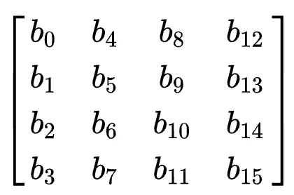
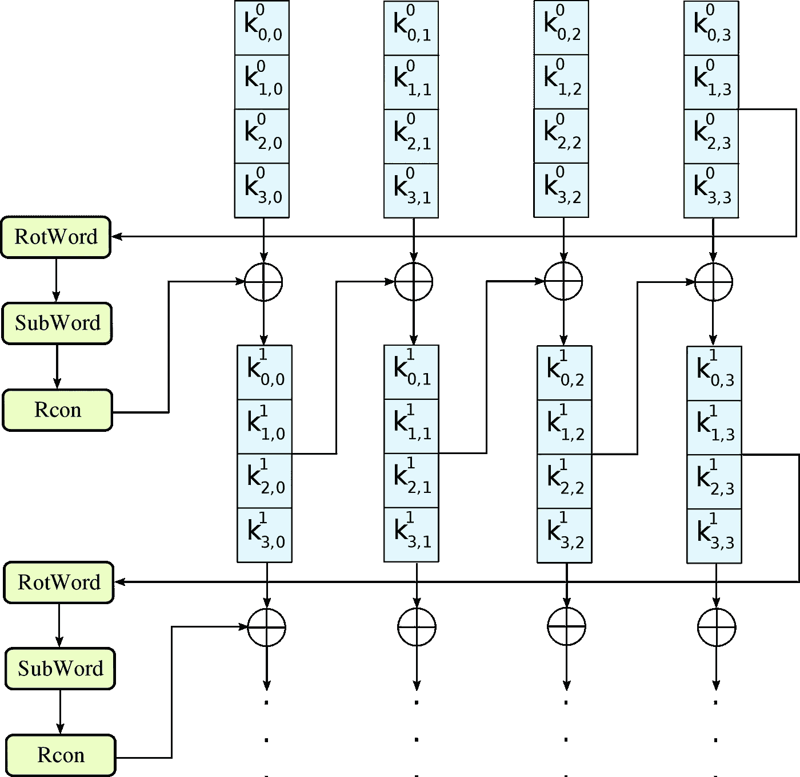
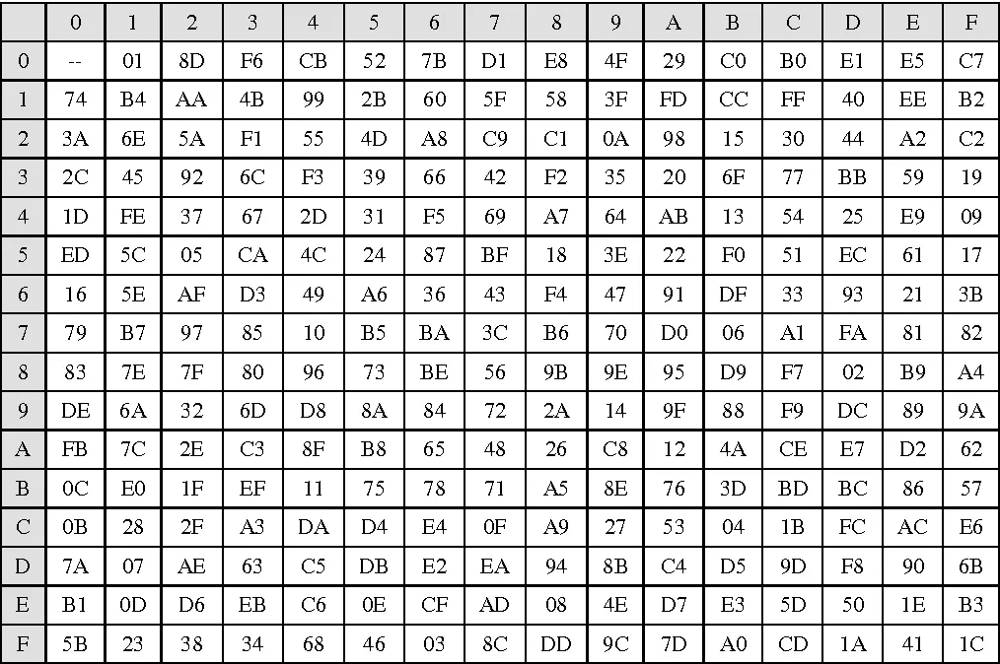
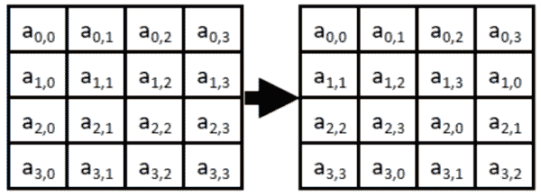
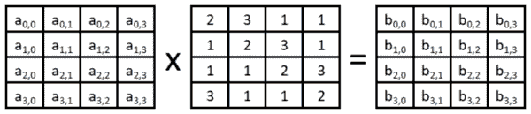
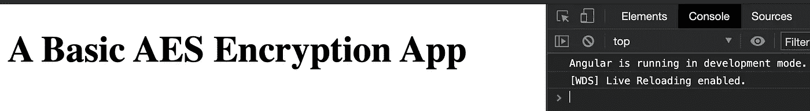
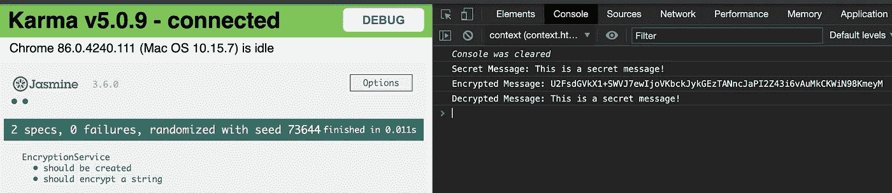

# AES 加密与角度服务实现的深入指南

> 原文：<https://levelup.gitconnected.com/an-in-depth-guide-to-aes-encryption-with-angular-service-implementation-ebfeec3d6c63>

包括一些历史、机械理论和工作代码示例。


本文将介绍 JavaScript 中的高级加密标准(AES)。这篇文章是全面的，包括基本的历史，力学和工作代码的例子。

您可以自由地向下滚动到代码，而不需要阅读文章的其余部分，尽管我要说研究涉及的步骤将极大地提高您的理解！

我们开始吧。

# 关于 AES 的快速历史课

你听说过 Rijndael 吗？嗯，它不是一个人——它是一套加密算法(但你当然知道)。在国家标准与技术研究所(NIST)的领导下，顶尖的科学家和数学家承担了提供确保数据传输完整性的数据传输方法的任务。

**Rijndael** **算法**是由比利时密码学家 Vincent Rijman 和 Joan Daemon 开发的——不知何故，Rijman+Daemon=Rijndael。

加密算法的主要目标是:

1.  保持对所有已知攻击的抵抗力
2.  各种计算平台上的速度和性能
3.  **设计简单**

2001 年 11 月，美国商务部长批准 Rijndael 算法在*联邦信息处理标准出版物*中合法化。虽然多年来许多加密算法已被弃用，但 AES 一直保持着强大的标准，通常用于工业和政府安全领域。

考虑到世界已经随着大数据和机器学习发生了多大的变化，AES 仍然是高级加密标准，这是一个令人印象深刻的壮举。

# 了解 AES 的基本步骤

**免责声明:**这些步骤大部分都是缩写的，意在传达重要的想法。如果你想要一个数学上严谨的解释，维基百科在这个话题上有很棒的解释。

AES 是一种对称算法，这意味着您可以加密和解密信息。AES 由用作分组密码的 128 位数据块组成。回想一下，比特是信息的单一单位，通常是 0 或 1。然后，这 128 位被分组为 16 个字节(每个字节 8 位)。然后，这 16 个字节被表示为一个二维数组，也称为矩阵表示。对于 AES，这被称为当前“状态”。



代表 16 字节信息的 4x4 矩阵

AES 允许密钥长度为 128、192 或 256 位。密钥只是一个随机生成的值。你可以用一整本书来讲述密钥是如何随机生成的，所以我们将跳过这里的细节。

**第一步是获取我们的消息并将其转换成字节表示。**

明文“这是一条秘密消息。”将由下面的标准 UTF 8 字节编码来表示。那就是用 25 个字节代表 25 个字符。

54 68 69 73 20 69 73 20 61 20 73 65 63 72 65 74 20 6d 65 73 73 73 61 67 65 2e

加密密钥也将以字节格式表示。

下面列出了 AES 加密算法的五个主要步骤。

1.  **密钥扩展** —我们的秘密密钥的一种派生，称为循环密钥，是使用 AES 密钥表从密码密钥中派生出来的。
2.  **添加轮密钥** —矩阵的每个字节与轮密钥的一个字节使用按位异或进行组合。
3.  **替换字节** —一个替换步骤，根据查找表用另一个字节替换每个字节。
4.  **移位行** —转置步骤，状态的最后三行循环移位一定的步数。
5.  **混合列** —对矩阵的列进行混合操作，组合每列中的四个字节。

第一步在算法开始时只发生一次。AES 要求每轮加一个单独的 128 位轮密钥块。

根据密钥的长度，步骤二到步骤五会重复多次。128 位密钥有 10 轮，192 位密钥有 12 轮，256 位密钥有 14 轮。在最后一轮中，无论密钥大小如何，步骤 5 都被跳过，因为它不会给计算增加任何进一步的随机性(不要问我为什么)。

这在很高的层面上描述了 AES 是如何工作的。接下来描述每个步骤的进一步细节。

**如果你不熟悉 XOR:** 两组字节之间的“异或”是一种逐位运算。如果在两次比较之间只有一位是值 1，那么结果位也是值 1。否则，它的值为 0。例如:

```
An example XOR operation
1 0 1 1 0 0 1 0
0 1 0 1 0 0 1 1 XOR
---------------
1 1 1 0 0 0 0 1 Result
```

## 密钥扩展

从最复杂的一步开始。在这里，我们实际上是将我们的秘密密钥进行扩展，这样密钥的一部分可以在每一轮中使用。这种情况只发生一次，然后根据密钥大小重复以下步骤若干轮。

给定我们的秘密密钥，我们以矩阵形式 K 得到它，元素 k(0，0)到 k(3，3)。下图中的上标代表我们处于哪一轮。对于第一轮，我们采用具有元素 k(0，3)到 k(3，3)的密钥矩阵的第四列，并将元素 k(0，3)翻转到列(RotWord)的底部。所以我们得到的列是 k(1，3)，k(2，3)，k(3，3)，k(0，3)。

然后，我们从表中替换该列的字节(子字，参见替换字节)。我们还有一个被称为 Round Constants 表(Rcon)的表，我们将把它与 key 列进行 XOR 运算。最后，我们与左边的第三列进行 XOR 运算，在本例中包含 k(0，0)到 k(3，0)。

所以现在我们有一列的加扰字节。我们的密钥矩阵 K 有四列，所以接下来的三列通过 XOR 与它左边的第三列进行加扰。

这个过程重复所需的回合数。



来自[维基百科](https://en.wikipedia.org/wiki/AES_key_schedule#/media/File:AES-Key_Schedule_128-bit_key.svg)

## 添加圆形密钥

深呼吸，因为这一步很容易！在这里，我们使用上一步计算出的循环密钥，并将其与当前的分组密码进行异或运算。仅此而已！

## 替代字节

唷，简单的一步！我们在这里所做的就是从状态矩阵中取出每个单独的块，并从表中进行替换。给定 128 位分组密码，

54 68 69 73 20 69 73 20 61 20 73 65 63 72 65 74 20 6d 65 73 73 73 61 67 65 2e

我们要替换的第一个字节是 54。根据这个表，我们将简单地转到第 5 行和第 4 列来得到替换 4C。



这个表的方向的推理是由于一些概率魔术，我们将跳过。我们将用状态矩阵的所有 16 个字节来代替这一步。

## 移动行

这一步也很简单。我们只需根据每行的位置来移动它。第一行没有移位。第二行将每个元素向左移动一个块。第三行将每个元素向左移动两个块，第四行将每个元素向左移动三行。



## 混合列

在这一步，我们使用一点矩阵数学和模运算。我们有一个状态矩阵 A，它包含元素 a(0，0)到 a(3，3 ),将它乘以我们给定的矩阵，矩阵中充满了数字，意在将所有东西混在一起。得到的矩阵 B 将是混合列步骤的最终结果。



哇，你成功了！如果你更喜欢视觉学习，我发现下面的视频对理解 AES 加密算法非常有帮助。

# 使用 TypeScript 和 Crypto-JS 实现 AES

好吧，这就是你一直在等待的。没有更多的历史和理论，让我们得到一些代码！

开始一个新的角度项目。

```
$ ng new aes-app
```

继续操作，删除 src/app/app.component.html 下的所有模板代码。您可以在那里放置一个占位符，因为我们将重点关注服务实现。我们将把流程输出到控制台。我知道，有点脏——但我们只是要专注于 AES。



创建一个新的 Angular 服务并安装 crypto-js。

```
$ ng generate service encryption
$ npm install crypto-js
```

我们的加密服务将具有以下代码:

在以字节格式执行 AES 后，我们必须在第 17 行用标准的 UTF-8 编码转换回字符串。

然后，我们可以进行一个简单的测试来输出我们的结果。

执行我们的测试，并在控制台日志中查看 AES 加密。

```
$ ng test --include='**/encryption.service.spec.ts'
```



您应该注意到，代码很简单！这就是为什么我认为至少了解通用加密库的基本机制是值得的。crypto-js 库还包括一个可能的参数来包含一个初始化向量(IV ),尽管它在这里是自动包含的。如果你想看一个 IV 使用 crypto-js 的例子，请在下面留下评论，我很乐意发表一篇文章详细介绍如何做。感谢阅读！