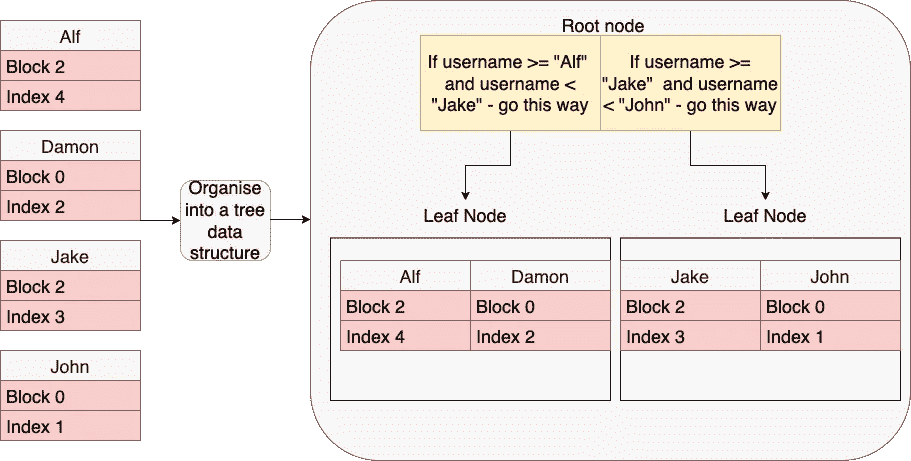

# 深入了解数据库索引的性能，以及使用它们的利弊

> 原文：<https://levelup.gitconnected.com/an-in-depth-look-at-database-indexing-for-performanceand-what-are-the-trade-offs-for-using-them-e2debd4b5c1d>

## 通过 PostgreSQL 示例了解如何充分利用索引

照片由 [XPS](https://unsplash.com/@xps) 在 [Unsplash](https://unsplash.com/photos/dpbXgTh0Lac) 上拍摄

在我们开始讨论索引之前，我将尝试了解 PostgreSQL 的内部，它在哪里存储数据，以及当我们编写查询时如何检索数据。关于使用索引的优点和缺点，这将更有意义。因此，不要在介绍上浪费更多的时间，喝杯咖啡，让我们开始吧。

## Postgres 如何存储数据

首先，我们要记住上面的定义，这很重要。例如，如果我们有一个表，这意味着我们也将有一个包含该表所有数据的堆文件。并且根据表本身的大小，数据将被分别划分成多个块。

因此，让我们以一种更加结构化的方式来看一下堆文件:

因此，在这种情况下，我们有 3 个块，每个块的大小通常在 8kb 左右，有许多行(项)。在较低层次上，这些都以二进制形式存储在您的物理驱动器上，但是我建议您在业余时间深入研究这些内容，因为我不想让您感到厌烦，也不想让这篇文章永远流传下去。

## 从数据库中检索数据

所以现在的问题是，Postgres 不像我们，看不到 Matt 的确切位置，所以发生的事情是，来自块的所有不同行被合并到我们的内存(RAM)中的一个大列表中。

加载完所有行后，Postgres 将开始遍历数据，尝试查找用户名为“Matt”的客户，如果该名称更靠前，速度可能会稍快一些，但这对我们来说并不重要，因为将所有数据放入内存的过程本身的性能开销就很大。但是最重要的是，如果我们有成千上万的行，我们想要检索最后一行中的一行，你可以想象性能会有多差。

## 什么是指数

想象一下，我们实际上知道我们正在寻找的客户的确切位置，而不是将所有这些文件加载到内存中。这就是指数的含义。它存储一个记录的确切位置，并允许我们只加载该记录所在的 1 个块，并很快找到它(是的，它确实加载了整个块，但由于块的大小有限，无论如何它总是非常快)。

## 索引是如何工作的

当创建一个索引时，我们需要选择哪个字段是我们真正想要的索引。根据需要实现的目标，可以在多个属性上建立索引，但是为了简单起见，我将只使用一个索引。

在我们的示例中，对用户名进行了查询，因此我们希望对该属性进行索引。

第一步是从具有准确位置的记录中提取该属性。为了简单起见，我只提取了 4 条记录。提取所有记录后，我们需要以某种有意义的方式对它们进行排序——按字母顺序或数字值。

现在，最后一步是将所有数据组织成某种树形数据结构。

根节点是第一步，它将帮助我们消除大量不包含我们正在寻找的数据的叶节点。这个例子相当简单，但是你可以想象，如果我们有成百上千的行，这个索引会给我们很大帮助。

因此，如果我们在根节点中寻找 John，我们知道我们必须向右走，那么当我们检索“John”的位置时，我们可以转到特定的块并获得与该客户相关联的其余数据，从而在这个过程中节省大量时间。

## 使用索引的缺点

尽管索引具有所有的性能优势，但是我们不应该在表中的每个属性上使用它们，因为这样会有一些缺点。

1.  存储成本—因为创建索引也创建了保存记录位置的数据树结构，这也意味着我们需要存储该索引。一个文件被创建并存储在硬盘上，所以每当我们创建一个索引，我们使用更多的存储。
2.  索引降低了插入、更新和删除的速度——每次我们对数据库进行更改时，Postgres 也需要更新索引，这意味着它本身会有一些性能成本。因此，如果表要非常频繁地更新，您可能应该考虑索引是否是正确的解决方案。
3.  可能不使用索引—一些查询在没有索引的情况下可以运行得更快，因此您最终会使用更多的存储空间，而性能却丝毫没有提高。

## 结论

索引非常强大，可以极大地提高性能，但我们在使用它们之前需要三思，因为如果使用不当，它们会有一些缺点。但是知道它们如何在较低层次上工作是很好的，所以当我们编写/设计代码时，我们也知道数据将如何被处理。

 [## 通过我的推荐链接加入 Medium-Ivan Stoev

### 作为一个媒体会员，你的会员费的一部分会给你阅读的作家，你可以完全接触到每一个故事…

medium.com](https://medium.com/@ivan.zstoev/membership)