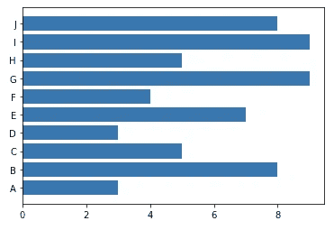
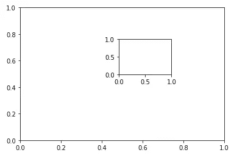

# Python Matplotlib 介绍，包含 40 个基本示例

> 原文：<https://levelup.gitconnected.com/an-introduction-of-python-matplotlib-with-40-basic-examples-5174383a6889>


照片由 [Isaac Smith](https://unsplash.com/@isaacmsmith?utm_source=medium&utm_medium=referral) 在 [Unsplash](https://unsplash.com?utm_source=medium&utm_medium=referral) 上拍摄

Matplotlib 是 Python 中最流行的库之一。虽然还有其他库，如 Seaborn 和 Plotly，它们在各种风格和易用性方面更先进，但 Matplotlib 是经典的，并且已经存在了很长时间。因此，它支持更多类型的图形，并有更多的可能性，可以满足任何要求。

“基于 Python”的数据科学家/分析师需要掌握至少三个库:

*   熊猫—数据输入/输出和转换
*   数字计算—数据计算
*   Matplotlib —数据可视化

一旦你搞定了 Matplotlib，其他的数据可视化库比如 Plotly 也将变得更容易学习。

让我们开始举例吧！

## 1.导入库

```
import matplotlib.pyplot as plt
```

一般来说，用别名`plt`导入`matplotlib`是很常见的。当然，你可以定义任何你想要的别名，但是你会发现几乎每个人都使用`plt`。因此，如果您使用相同的方法来提高代码的可读性，将会更容易。

## 2.在一个范围内画一条正弦函数曲线

```
x = np.linspace(0, 10, 30)
plt.plot(x, np.sin(x))
plt.show()
```


## 3.强调曲线上的点

```
plt.plot(x, np.sin(x), '-o')
plt.show()
```


注意:破折号`—`告诉绘图显示线条，而`o`告诉绘图显示散点图。

## 4.用虚线画出正弦函数

```
plt.plot(x, np.sin(x), '--')
plt.show()
```


## 5.将 y 轴的范围配置为(-2，2)

```
plt.plot(x, np.sin(x))
plt.ylim(-2, 2)
plt.show()
```


## 6.设置 x 轴和 y 轴的标签

```
plt.plot(x, np.sin(x))
plt.xlabel('variable')
plt.ylabel('value')
plt.show()
```


## 7.设置图表的标题

```
plt.plot(x, np.sin(x))
plt.title('sin function')
plt.show()
```


## 8.显示网格

```
plt.plot(x, np.sin(x))
plt.grid()
plt.show()
```


## 9.在 y=0.5 处画一条水平线

```
plt.plot(x, np.sin(x))
plt.axhline(y=0.5, ls='--', c='r')
plt.show()
```


注意:`ls='--'`告诉`plt`画一条虚线，`c='r'`表示使用红色。

## 10.在图上绘制参考空间

```
plt.plot(x, np.sin(x))
plt.axvspan(xmin=np.pi, xmax=np.pi*2, facecolor='r', alpha=0.2)
plt.axhspan(ymin=-1, ymax=0, facecolor='b', alpha=0.2)
plt.show()
```


## 11.特定坐标处的文本注释地块

```
plt.plot(x, np.sin(x))
plt.text(np.pi, 0, 'y=0', weight='bold', c='r')
plt.show()
```


## 12.使用箭头指出最高点的更复杂的注释

```
plt.plot(x, np.sin(x))
plt.annotate(
    '1st-highest', xy=(np.pi/2, 1), xytext=(np.pi/2 + 1, 1), c='r',
    arrowprops=dict(arrowstyle='->', connectionstyle='arc3', color='r')
)
plt.annotate(
    '2nd-highest', xy=(np.pi*2.5, 1), xytext=(np.pi*2.5 + 1, 1), c='r',
    arrowprops=dict(arrowstyle='->', connectionstyle='arc3', color='r')
)
plt.xlim(-0.2, 12)
plt.show()
```


## 13.在散点图中绘制正弦函数

```
plt.scatter(x, np.sin(x))
plt.show()
```


## 14.用图例在一个图中显示多条线

```
plt.plot(x, np.sin(x), label='sin')
plt.plot(x, np.cos(x), label='cos')
plt.legend()
plt.show()
```


## 15.调整图例位置并禁用框架

```
plt.plot(x, np.sin(x), label='sin')
plt.plot(x, np.cos(x), label='cos')
plt.legend(loc='upper right', frameon=False)
plt.show()
```


## 16.在底部中间位置的列中显示图例

```
plt.plot(x, np.sin(x), label='sin')
plt.plot(x, np.cos(x), label='cos')
plt.ylim(-1.5, 1.2)
plt.legend(loc='lower center', frameon=False, ncol=2)
plt.show()
```


## 17.仅显示部分图例

```
plt.plot(x, np.sin(x))
plt.plot(x, np.cos(x))
plt.legend(['sin'])
plt.show()
```


## 18.为地块使用不同的样式显示图例

```
lines = []
line_styles = ['-', '-.', '--', ':']
line_colors = ['red', 'blue', 'green', 'black']x = np.linspace(0, 10, 1000)for i in range(4):
    line, = plt.plot(
        x, 
        np.sin(x - i * np.pi / 2), 
        line_styles[i], 
        color=line_colors[i]
    )
    lines.append(line)legend1 = plt.legend(lines[:2], ['part A', 'part B'], loc='upper right')
legend2 = plt.legend(lines[2:], ['part C', 'part B'], loc='lower right')
plt.gca().add_artist(legend1)
plt.gca().add_artist(legend2)plt.show()
```


注意:我们需要使用`gca()`方法来获取当前图形上的所有轴，因为需要在轴上使用`add_artist()`方法。

## 19.显示二维常规栅格

```
x = np.linspace(0, 10, 1000)
matrix = np.sin(x) * np.cos(x[:, np.newaxis])plt.imshow(matrix)
plt.show()
```


## 20.用自定义颜色显示二维常规光栅

```
plt.imshow(matrix, cmap='hot')
plt.show()
```


## 21.在定义的范围内显示带有离散颜色和比例尺的二维常规栅格

```
plt.imshow(matrix, cmap=plt.cm.get_cmap('hot', 10))
plt.colorbar()
plt.clim(-1, 1)
plt.show()
```


## 22.4 维数据集的可视化

```
x = np.random.randn(100)
y = np.random.randn(100)
colors = np.random.rand(100)
sizes = 100 * np.random.rand(100)plt.scatter(x, y, c=colors, s=sizes, alpha=0.5, cmap='viridis')
plt.colorbar()
plt.show()
```


注:这 4 个维度由 x 轴、y 轴、点大小和色标表示。

## **23。用 y 轴上的误差(例如 0.8)画一个散点图**

```
x = np.linspace(0, 10, 50)
yerr = 0.8
y = np.sin(x) + yerr * np.random.randn(50)plt.errorbar(x, y, yerr=yerr, fmt='.k')
plt.show()
```


## 24.画一个条形图

```
x = [1,2,3,4,5,6,7,8,9,10]
y = np.random.randint(10, size=10)
label = ['A', 'B', 'C', 'D', 'E', 'F', 'G', 'H', 'I', 'J']plt.bar(x, y, tick_label=label)
plt.show()
```


## 25.画一个水平条形图

```
plt.barh(x, y, tick_label=label)
plt.show()
```



## 26.用随机数画一个直方图

```
rd_nums = np.random.randn(1000)
plt.hist(rd_nums)
plt.show()
```


## 27.指定直方图的箱数

```
plt.hist(rd_nums, bins=50)
plt.show()
```


## 28.用 alpha 在同一个图中绘制 3 个直方图

```
h1 = np.random.normal(0, 0.8, 1000)
h2 = np.random.normal(-3, 1.2, 1000)
h3 = np.random.normal(4, 0.5, 1000)kwargs = dict(bins=40, alpha=0.5)plt.hist(h1, **kwargs)
plt.hist(h2, **kwargs)
plt.hist(h3, **kwargs)
plt.show()
```


## 29.绘制二维直方图(热图)

```
x, y = np.random.multivariate_normal([0,0], [[1,1],[1,2]], 10000).Tplt.hist2d(x, y, bins=30)
plt.show()
```


## 30.用 30x30 的六边形网格画一个二维直方图(有点花哨)

```
plt.hexbin(x, y, gridsize=30)
plt.show()
```


## 31.显示嵌入父图中的图

```
ax1 = plt.axes()
ax2 = plt.axes([0.5, 0.5, 0.2, 0.2])
plt.show()
```



## 32.在支线剧情中显示 2 条不同的线

```
fig = plt.figure()
ax1 = fig.add_axes([0.1, 0.5, 0.8, 0.4], ylim=(-2, 2))
ax2 = fig.add_axes([0.1, 0.0, 0.8, 0.4], ylim=(-2, 2))x = np.linspace(0, 10)
ax1.plot(np.sin(x))
ax2.plot(np.cos(x))plt.show()
```


## 33.显示更多同等大小的支线剧情

```
for i in range(1, 5):
    plt.subplot(2, 2, i)
    plt.text(0.5, 0.5, str((2, 2, i)), fontsize=15, ha='center')plt.show()
```


## 34.创建共享 x 轴和 y 轴的网格子图

```
plt.subplots(2, 2, sharex='all', sharey='all')
plt.show()
```


## 35.根据索引定制每个支线剧情

```
_,axes = plt.subplots(2, 2, sharex='all', sharey='all')for i in range(2):
    for j in range(2):
        axes[i][j].text(0.5, 0.5, str((i,j)), fontsize=15, ha='center')plt.show()
```


## 36.不同大小的网格中的支线剧情

```
grid = plt.GridSpec(2, 3, wspace=0.4, hspace=0.3)
plt.subplot(grid[0,0])
plt.subplot(grid[0,1:])
plt.subplot(grid[1,:2])
plt.subplot(grid[1,2])
plt.show()
```


## 37.用分开的 x 轴和 y 轴频率直方图绘制二维数据集

```
# Generate normal distributed sample points in 2-D
x, y = np.random.multivariate_normal([0, 0], [[1, 1], [1, 2]], 3000).T# Define subplot styles
fig = plt.figure(figsize=(10, 10))
grid = plt.GridSpec(4, 4, hspace=0.2, wspace=0.2)
ax = fig.add_subplot(grid[:-1, 1:])
ax_x = fig.add_subplot(grid[-1, 1:])
ax_y = fig.add_subplot(grid[:-1, 0])# Plot the data to subplots
ax.scatter(x, y, s=3, alpha=0.5)
ax_x.hist(x, 40, orientation='vertical')
ax_y.hist(y, 40, orientation='horizontal')
ax_x.invert_yaxis()
ax_y.invert_xaxis()plt.show()
```


## 38.创建三维画布

```
from mpl_toolkits import mplot3dax = plt.axes(projection='3d')
```


注意:需要使用另一个工具包`mplot3d`在三维空间绘图

## 39.绘制三维扭曲曲线

```
ax = plt.axes(projection='3d')
z = np.linspace(0, 50, 3000)
x = np.sin(z)
y = np.cos(z)
ax.plot3D(x, y, z)
plt.show()
```


## 40.绘制三维散点图

```
ax = plt.axes(projection='3d')
z = np.random.random(100)
x = np.sin(z) + np.random.randn(100)
y = np.cos(z) + np.random.randn(100)
ax.scatter3D(x, y, z)
```


介绍到此结束。我将在以后的文章中继续探索更多的 python 库。

[](https://medium.com/@qiuyujx/membership) [## 通过我的推荐链接加入 Medium 克里斯托弗·陶

### 作为一个媒体会员，你的会员费的一部分会给你阅读的作家，你可以完全接触到每一个故事…

medium.com](https://medium.com/@qiuyujx/membership) 

如果你觉得我的文章有帮助，请考虑加入 Medium 会员来支持我和成千上万的其他作者！(点击上面的链接)

# 资源

matplotlib:[https://matplotlib.org/](https://matplotlib.org/)