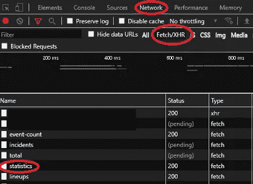
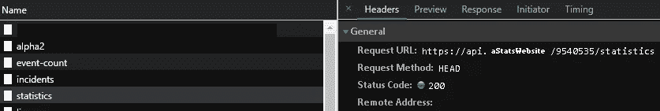
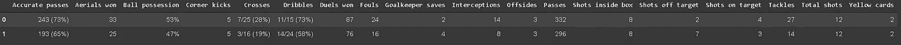

# 用 Python 从 API 中收集数据的介绍

> 原文：<https://levelup.gitconnected.com/an-introduction-on-collecting-data-from-apis-with-python-c132376b0132>


Vishnu R Nair 在 [Unsplash](https://unsplash.com?utm_source=medium&utm_medium=referral) 上的照片

当人们想到从网上收集数据时，通常会想到直接在网站的 HTML 中查找数据。实际上，这就是许多人用 Python 开始他们的 web 爬行之旅的原因。至少我是这么做的。

您发送一个 GET 请求，用 BeautifulSoup 解析 HTML 并找到您需要的数据。或者，您可能需要设置 Selenium 来与网站交互，单击一个按钮，加载 JavaScript 呈现的内容，然后查找数据。

如果你问我，我会说这是一个有趣的过程，但它并不总是必要的，因为它经常可以被 API 的使用所取代。你在网站上看到的数据很可能来自一个 API。您的浏览器向端点发送请求，接收信息，然后加载前端。

这些 API 通常是公共的，这意味着您可以自己向它们发送请求，而无需使用浏览器。在本文中，我们将看到一个关于如何识别网站上的 API 以及如何直接从代码中访问它们的数据的快速介绍。

# 识别 API

作为本文的一个例子，我们将从一个非常著名的体育统计网站收集数据。姑且称之为“一个统计网站”。

因此，一旦您进入了想要获取数据的页面，在本例中是一个匹配页面，按 F12 键打开浏览器的开发工具。然后转到网络选项卡，选择获取/XHR。

一旦你这样做了，你将会看到一些 API 响应。只是找到你需要的那一个的问题。



在这个特殊的例子中，当我们寻找比赛的统计数据时，很容易找到 API。一旦我们点击它，就会显示更多关于 API 的信息。

如果找到合适的 API 不那么容易，那么就有必要一个一个地尝试，直到找到为止。通过点击“Response”选项卡，可以看到 API 返回的信息，从而帮助我们找到正确的信息。



这里重要的是请求 URL。这是我们需要发送请求的地方。如果您在浏览器中打开 URL，您已经能够在 JSON 中看到数据。

如果您是新手，并且不熟悉 JavaScript 对象表示法— JSON，那也没关系。它基本上是一个 Python 字典，它是你从 API 接收数据的方式。在这里阅读更多。

回到网址，你看到的那个数字是网站为此匹配创建的唯一 ID。所以这就是你需要改变的，从几个不同的匹配中收集数据。

# 收集数据

既然我们已经成功地确定了我们需要的 API 以及如何与之交互，那么这个过程中最困难的部分就完成了。

从现在开始，我们要做的就是发送 GET 请求并接收我们想要的数据。这里的过程非常简单。我们所需要的就是从请求库中导入 get 函数，发送请求和 JSON 模块。

完成后，我们只需要在 API URL 中插入它需要的信息，在本例中是匹配 ID，发送请求，然后用`loads`函数解析响应的文本。

```
from requests import get
import jsonurl = f'https://api.aStatsWebSite.com/{id}/statistics'
page = get(url).text
data = json.loads(page)
```

这是数据现在的样子:

```
{
  "statistics": [
    {
      "period": "ALL",
      "groups": [
        {
          "groupName": "Possession",
          "statisticsItems": [
            {
              "name": "Ball possession",
              "home": "58%",
              "away": "42%",
              "compareCode": 1
            }
          ]
        },
        {
          "groupName": "Shots",
          "statisticsItems": [
            {
              "name": "Total shots",
              "home": "7",
              "away": "14",
              "compareCode": 2
            },
            {
              "name": "Shots on target",
              "home": "2",
              "away": "4",
              "compareCode": 2
            }
...
```

到目前为止，我们已经成功地识别了 API 并收集了数据。现在剩下要做的就是将数据转换成表格格式并存储起来。对于这个任务，Pandas 的 json_normalize 函数可能会有所帮助，但是在处理更复杂的 json 文件时，使用起来有点棘手。

一个好的方法是将 JSON 简化成一个一层字典，然后使用 pandas DataFrame.from_dict()函数。我们需要做的就是遍历“Groups”键中的列表，然后获得每个 stat 的“name”、“home”和“away”值。

```
all_stats = {}
for group in j['statistics'][0]['groups']:
    for stat in group['statisticsItems']:
        all_stats[stat['name']] = [stat['home'], stat['away']]
```

这是现在的数据:

```
{'Accurate passes': ['243 (73%)', '193 (65%)'],  
'Aerials won': ['33', '25'],  
'Ball possession': ['53%', '47%'], 
'Corner kicks': ['5', '5'],  
'Crosses': ['7/25 (28%)', '3/16 (19%)'],  
'Dribbles': ['11/15 (73%)', '14/24 (58%)'],  
'Duels won': ['87', '76'],  
'Fouls': ['24', '16'],  
'Goalkeeper saves': ['2', '4'],  
'Interceptions': ['14', '8'],  
'Offsides': ['3', '3'],  
'Passes': ['332', '296'],  
'Shots inside box': ['8', '8'],  
'Shots off target': ['2', '7'],  
'Shots on target': ['4', '3'],  
'Tackles': ['27', '14'],  
'Total shots': ['12', '12'],  
'Yellow cards': ['2', '2']}
```

现在转换成数据帧:

```
df = pd.DataFrame.from_dict(all_stats)
```

这是我们刚刚收集的数据的最终版本，可以按照您的喜好存储:



# 最终注释

当然，从单个游戏收集数据意义不大。我的意思是，如果这就是你所需要的，谷歌搜索就可以了。

要从大量游戏中收集数据，只需在本文的第一个代码片段之前使用 for 循环遍历匹配 id 列表，以便根据需要重复这个过程。

但是，如果您选择使用这种方法，那么使用机制来避免代码引发异常就变得更加重要了。因此，确保在需要时使用 try 和 except 子句，在代码中插入尽可能多的暂停，以避免服务器过载和被服务器阻止，并利用代理提供商，如 [Infatica](https://infatica.io/) ，因为他们能够为您提供更好的 IP 地址基础设施，这样您就可以确保您的代码将继续运行。

感谢您的阅读！