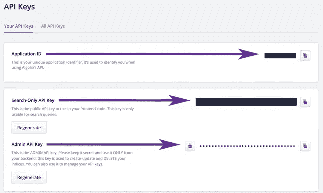
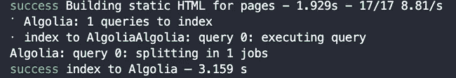
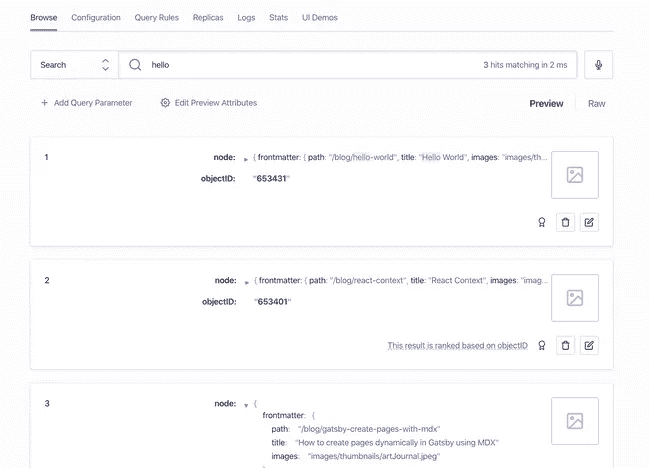
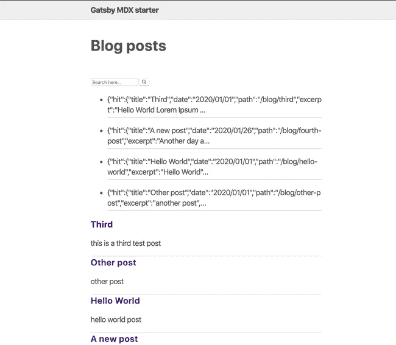
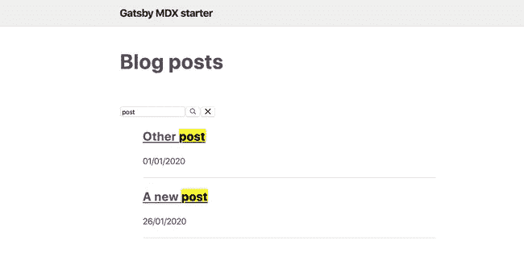

# 将 Algolia 搜索添加到您的 Gatsby 站点的介绍

> 原文：<https://levelup.gitconnected.com/an-introduction-to-adding-algolia-search-to-your-gatsby-site-part-1-2a0295cfdf1b>


安东尼·马蒂诺[的照片](https://unsplash.com/@amartino20)

在本帖中，我们将探讨如何将 Algolia 搜索添加到我们的 gatsby 网站。我们将看到如何在 Gatsby 中配置 Algolia，并添加 Algolia 的内置组件。

# 设置

要设置 algolia 搜索，首先我们需要:

*   在 algolia 网站[这里](https://www.algolia.com/users/sign_up)创建一个账户
*   一旦完成，我们可以创建一个索引，我们可以命名任何我们想要的(如博客)

之后，我们可以获取 API 键，并把它们放在我们的`.env`中，我们可以在这里找到它们



```
// .env
GATSBY_ALGOLIA_APP_ID="xxxx"
GATSBY_ALGOLIA_INDEX_NAME="test"
ALGOLIA_API_KEY="xxx"
GATSBY_ALGOLIA_SEARCH_KEY="xxx"
```

# 装置

现在我们可以回到代码上，安装一些我们需要的插件

```
npm install algoliasearch dotenv gatsby-plugin-algolia react-instantsearch-dom
```

安装 gatsby 插件后，它将允许我们用 GraphQL 获取数据并将其发送到 algolia。

# 配置

现在我们已经安装了插件，我们可以开始在`gatsby-config`文件中添加配置，从构建中获取数据，并将其插入到 algolia 的索引中。

为此，我们需要创建如下查询

```
const blogQuery = `
  {
   posts: allMdx(
    filter: { fileAbsolutePath: { regex: "/posts/" } }
  ) {
    edges {
      node {
        objectID: id
        frontmatter {
          title
          date
          path
        }
        excerpt(pruneLength: 5000)
      }
    }
  }
  }
`;
```

然后添加 transformer 方法，它只是映射数据

```
const settings = { attributesToSnippet: [`excerpt:20`] };
const queries = [
  {
    query: blogQuery,
    transformer: ({ data }) =>
      data.posts.edges.map(({ node: { frontmatter, ...rest } }) => {
        return {
          ...frontmatter,
          ...rest,
        };
      }),
    indexName: process.env.GATSBY_ALGOLIA_INDEX_NAME,
    settings,
  },
];
```

基本上，上面的代码片段所做的是，`queries`对象将获取 GraphQL JSON 数据，并将它们分别转换为我们希望 algolia 从 Gatsby GraphQL 层索引的单独对象。

这将包含 GraphQL 查询、可选的索引名称、转换器函数和设置对象。

下一步将如下配置`gatsby-plugin-algolia`

```
require('dotenv').config();
// we can pass an object with a property of path to config method which would look
// like this for example {path: '.env.production'} in case if you want to configure for different modesmodule.exports = {
  plugins: [
    {
      resolve: `gatsby-plugin-algolia`,
      options: {
        appId: process.env.GATSBY_ALGOLIA_APP_ID,
        apiKey: process.env.ALGOLIA_API_KEY,
        indexName: process.env.GATSBY_ALGOLIA_INDEX_NAME, // for all queries
        queries,
        chunkSize: 10000, // default: 1000
      },
    },
  ],
};
```

该插件接受一个`options`对象，该对象带有我们之前在 env 文件中添加的键和包含我们的查询的查询对象(我们可以向其传递多个查询。

例如，一个针对文章的查询和一个针对页面的不同查询)以及用于映射、索引名称和我们希望传递的任何设置的转换方法。

一旦配置完成，我们就可以在生产模式下运行项目，将数据发送到 algolia，这样我们就可以通过运行`gatsby build`来测试它，它将如下所示



如果您在构建完成后查看仪表板，我们也应该能够看到数据



现在，在配置和索引部分完成后，我们可以移动到前端部分。

# 前端

在这一节中，我们将研究如何在 gatsby 站点上安装 algolia search。

# 安装 Algolia 搜索组件

为此，首先，我们可以创建一个新组件，并将其命名为`Search.js`，它将利用 algolia 的即时搜索组件(您可以查看[文档](https://www.algolia.com/doc/guides/building-search-ui/installation/react/)了解更多信息)

```
import algoliasearch from 'algoliasearch/lite';
import { InstantSearch, SearchBox, Hits } from 'react-instantsearch-dom';
import React from 'react';const appId = process.env.GATSBY_ALGOLIA_APP_ID;
const searchKey = process.env.GATSBY_ALGOLIA_SEARCH_KEY;
const searchClient = algoliasearch(appId, searchKey);const Search = () => (
  <InstantSearch
    searchClient={searchClient}
    indexName={process.env.GATSBY_ALGOLIA_INDEX_NAME}
  >
    <SearchBox />
    <Hits />
  </InstantSearch>
);export default Search;
```

正如我们在上面的片段中看到的，首先我们添加了由 algolia 在[文档](https://www.algolia.com/doc/guides/building-search-ui/what-is-instantsearch/react/)中定义的`InstantSearch`组件，作为与 Algolia 的 API 交互的组件，以轻松构建即时搜索应用程序。

`InstantSearch`有两个属性，`searchClient`包含你的应用 id，搜索关键字(在之前的 env 文件中定义)和我们在 algolia 的帐户中定义的 indexName。

该组件有两个子组件，顾名思义是`SearchBox`组件，带有搜索和删除图标的输入字段和一个`Hits`组件(点击是查询的返回结果)。

搜索组件的结果将如下所示



我们可以用实际点击量替换截图中的 HTML，这是突出显示搜索关键词的好地方。

为此，我们可以添加一个属性`hitComponent`，它将把从`Hits`接收的数据传递给我们传递给它的组件。例如事后审查。

```
import PostPreview from './PostPreview';
<Hits hitComponent={PostPreview} />;
```

我们的`PostPreview`可以看起来像下面这样，我们添加了一个链接到帖子，并显示了关于帖子的摘录。

```
import React from 'react';
import { Link } from 'gatsby';
import { Highlight } from 'react-instantsearch-dom';
import { css } from '[@emotion/core](http://twitter.com/emotion/core)';
const PostPreview = ({ hit }) => {
  return (
    <article>
      <h3>
        <Link to={hit.path}>
          <Highlight hit={hit} attribute="title" tagName="mark" />
        </Link>
      </h3>
      <small>{new Date(hit.date).toLocaleDateString()}</small>
      <p>
        <Highlight hit={hit} attribute="excerpt" tagName="mark" />
      </p>
    </article>
  );
};export default PostPreview;
```

完成后，我们可以添加另一个小部件来突出显示。默认情况下，添加到`Highlight`组件的属性`attribute`将在所有可搜索的属性上启用，但是您可以将其限制为您想要使其可搜索的特定属性。

`Highlight`小部件将寻找要突出显示的属性，这将在内容中的搜索项周围创建一个范围，并突出显示该范围。

添加`Highlight`小部件的示例

```
<Highlight hit={hit} attribute="title" tagName="mark" />
```

通过添加上面的内容，如果属性 title 与搜索查询匹配，它将高亮显示，如下所示



因此，现在我们有了使用 algolia `InstantSearch`作为基础组件的`Search`组件。

**在这篇文章之后，你可以在这里找到一个启动器回购**[](https://github.com/gabroun/gatsby-mdx-starter)****显示了 Algolia 搜索组件的用法****

# **最后**

**我希望第一部分展示了如何在 Gatsby 站点上安装和添加 algolia 搜索组件。第二部分将介绍如何用 Algolia 创建一个定制的搜索组件。**