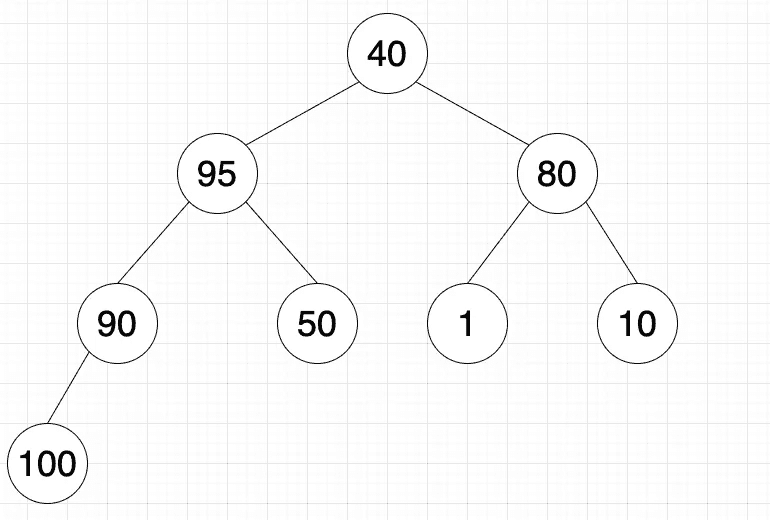

# 二进制堆介绍

> 原文：<https://levelup.gitconnected.com/an-introduction-to-binary-heaps-c95b3025977>

# 背景

是时候介绍另一种利基数据结构了！对于这个博客，这将是二进制堆。如果你熟悉二分搜索法树，这个数据结构看起来会很熟悉。如果没有，不要担心，我们将一步一步地学习二进制堆的概念。

# 什么是堆？

在我们深入研究二进制堆之前，我们应该理解什么是堆。堆是一种类似树的数据结构，其中父节点和子节点之间存在关系。下图是一个堆的例子。


堆示例

在这个堆示例中，父和子之间的关系是父总是大于它的所有子。父节点 100 有两个子节点 90 和 80。100 大于 90 和 80。父节点 90 有三个子节点 40、50 和 1。90 大于 40，50，1。

不同父母的孩子之间的关系并不重要。我们来看看家长 80。它只有一个孩子，10 岁。虽然 10 大于 1，但 1 是父 90 的子，这在技术上还是堆。我们只关心父母和孩子之间的直接关系。

堆示例也可以称为最大堆。这意味着父代比所有子代更伟大。由于这种含义，最大的数字总是在堆的顶部，也称为根。在本例中，100 将是这个最大堆的根。

类似地，最小堆意味着父堆小于它的所有子堆。由于这个暗示，最小的数字总是在堆的顶部。

现在我们已经对堆有了基本的了解，我们可以深入二进制堆了。

# 什么是二进制堆？

二进制堆是这样一种堆，其中每个父堆最多有两(2)个子堆(因此在二进制堆中称为“二进制”)。在前面的堆示例中，这将是一个标准堆，因为父堆 90 有三个子堆，父堆 80 有一个子堆。

使用和以前一样的数字，下图显示了二进制堆的样子。


二进制堆示例

在二进制堆示例中，每个父级有两个子级。这位 100 岁的父母有两个孩子，一个 90 岁，一个 80 岁。这位 90 岁的父母有两个孩子，一个 40 岁，一个 50 岁。这位 80 岁的父母有两个孩子，一个 1 岁，一个 10 岁。

父子关系是父堆大于所有子堆，这使得它成为最大二进制堆。

一个主要的约束是，二进制堆是完全 T2 的。完成意味着树的所有级别都被正确填充。从形状的角度来看，这意味着每一层的空间都是从左到右填满的。

下面的截图显示了堆不完整意味着什么。


不完整的堆示例

在第三层有一个空位，50、1 和 10 被填充。40 岁的人开始了一个新的层次，第四个层次，这时有一个空位让它成为 90 岁的第二个孩子。

通常对于树，我们会使用链表来表示数据结构(例如，二分搜索法树)。然而，由于二进制堆是完整的这一重要约束，我们可以将这种数据结构表示为一个数组。

在二进制堆示例中，它可以由下面的数组表示:

```
[100, 90, 80, 40, 50, 1, 10]
```

但是等等，你怎么确定数组形式中哪个父有哪个子呢？

# 作为数组的二进制堆

秘密在于索引。

让我们用同样的二进制堆例子来分解。


在上图中，我使用的是同一个二进制堆。红色背景代表我们正在查看的当前父代，绿色背景代表当前父代的子代。这里，父索引位于 0，而子索引位于 1 和 2。似乎还没有太多的模式可循，但让我们继续追踪它。

```
Parent-Child Tracker
0 => 1, 2
```

让我们看下一个家长，90 岁。


父节点在索引 1 上，子节点在索引 3 和 4 上。

```
Parent-Child Tracker
0 => 1, 2
1 => 3, 4
```

现在，让我们做最后一个家长，80。


父节点在索引 2 上，子节点在索引 5 和 6 上。

```
Parent-Child Tracker
0 => 1, 2
1 => 3, 4
2 => 5, 6
```

嗯，看起来父母和孩子的关系是:

```
childIndex = 2n+1 or 2n+2
```

其中`n`表示父节点的索引。左边的孩子会使用`2n+1`，而右边的孩子会使用`2n+2`。

但是，如果我们的索引是一个子索引，而我们想找到它的父索引，该怎么办呢？

从孩子到父母的关系是:

```
parentIndex = Math.floor((n-1)/2)
```

其中`n`代表孩子的索引。

现在我们理解了数组形式的二进制堆的子堆和父堆之间的关系！

# 插入

虽然我不会深入研究代码，但我想解释一下二进制堆的插入和提取的概念。

对于插入，您可以将新节点插入到现有的二进制堆中。插入后，二进制堆可能需要重新组织自己，以保持父子关系。

为了给人一种插入感，我们把 95 插入到例子中。


将 95 插入二进制堆

回想一下，二进制堆是完整的。当我们插入一个新节点时，堆从左到右被填充。由于在第三层的最右边没有空位，我们将为 95 层开始一个新的层。

接下来我们需要检查父和子之间的关系是否得到了维护。这就是重组开始的时候。因为这是一个最大二进制堆，所以关系是父堆必须大于它的所有子堆。95 是 40 的子代，大于其父代。因此，我们需要交换 40 和 95 的位置。


交换 40 和 95

现在，95 是 40 的父母。接下来，我们检查 95 的新父代，在本例中是 90。如果新父母少于 95，交换他们的位置。如果没有，那么我们就完成了二进制堆的重组。我们不断重复这个过程，直到父节点大于我们插入的节点，或者它一直到达根节点，成为新的根节点。

由于 90 小于 95，我们需要交换他们的位置。


交换 90 和 95

95 的新父代是 100，大于 95。我们终于可以停止重组堆了。上图现在是我们更新后的二进制堆。有了这个更新的二进制堆，数组现在应该如下所示:

```
[100, 95, 80, 90, 50, 1, 10, 40]
```

作为快速检查，让我们使用父子公式，以 95 为例，看看这个数组是否准确。

如果 95 是父代，那么它的子代是 90 和 50。如果 95 是子节点，那么它的父节点就是 100。95 在索引 1 处。

```
Reference Index: n = 1
Left Child Index: 2n+1 = 2(1)+1 = 3
Right Child Index: 2n+2 = 2(1)+2 = 4
Parent Index: Math.floor((1-1)/2) = Math.floor((1-1)/2) = Math.floor(0/2) = 0
```

看起来一切正常！

# 提取，血统

根据二进制堆的性质，最小数量(即最小二进制堆)或最大数量(即最大二进制堆)将是根。二进制堆或一般堆的主要目的是找到最大值或最小值。因为这个数总是根，所以时间复杂度为 O(1)。

在使用这个数字之后，应该从二进制堆中提取或删除它。然而，现在旧的根已经被移除了，我们如何知道堆中的哪个数应该是新的根呢？这与插入的工作原理非常相似。

在插入时，我们从堆的底部“冒泡”到适当的位置，保持适当的父子关系。在提取中，我们将从堆的顶部“传播”到适当的位置。我们将使用与插入相同的方法，只是方向相反。

为了提供视觉效果，让我们从示例中提取 100。在提取过程中，我们将在通过堆传播之前用根交换最后一个节点。最后使用的数字将是我们开始的地方。



交换了 40 和 100

上图中，100 这个老根，被换成了 40。接下来，我们将从堆中提取 100。我们这样做有两个原因:

1.  这保证了二进制堆仍然是完整的。
2.  从数组中删除最后一个节点的时间复杂度为 O(1)。


移除旧根(100)

接下来，我们使用与插入相同的方法。我们将从根开始比较父节点，并确认父节点和子节点之间的关系是否保持。如果是，则不需要执行任何操作。如果没有，那么我们需要交换父节点和子节点的位置，并使用新的位置重新开始这个过程。

如果两个孩子都比父母大，那么与大的孩子交换。

从 40 的新根开始，这个父节点比它的两个子节点 95 和 80 都小。这意味着 40 应该与 95 交换。


交换了 40 和 95

现在，40 的新子女是 90 和 50。两个孩子仍然大于 40，这意味着 40 和 90 需要交换。


交换了 40 和 90。最终更新的堆。

现在，如果我们检查这个更新的堆中的每一个父子关系，它满足父大于子的关系。更新后的数组现在应该如下所示:

```
[95, 90, 80, 40, 50, 1, 10]
```

作为一个快速的检查，95 是整个堆中最大的数字，它位于根中，这是应该的。

# 结论

恭喜您，现在您已经了解了二进制堆及其实现！您了解了如何在维护父子关系的同时将节点/值插入到二进制堆中，以及如何在提取其根之后更新二进制堆。

如果您想要一个挑战，尝试用插入和提取方法创建您自己的二进制堆类。