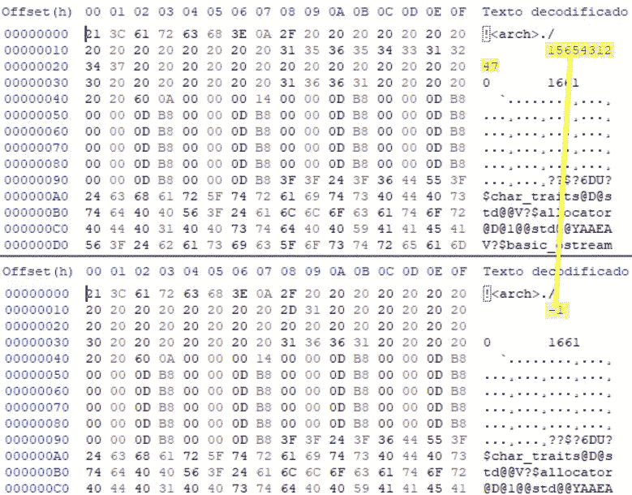

# C/C++确定性构建简介

> 原文：<https://levelup.gitconnected.com/an-introduction-to-deterministic-builds-with-c-c-ab03cda36499>

# 什么是确定性构建？

确定性构建是用相同的构建环境和构建指令构建相同的源代码的过程，在两个构建中生成相同的二进制文件，即使它们是在不同的机器上、构建目录下以不同的名称构建的。如果即使从不同的文件夹编译也能保证产生相同的二进制文件，那么它们有时也被称为可复制的或密封的构建。

确定性构建不是自然发生的事情。正常的项目不会产生确定性的构建，并且对于每个操作系统和编译器，不产生确定性构建的原因可能是不同的。

对于给定的*构建环境*，应该保证确定性的构建。这意味着某些变量，如*操作系统*、*构建系统版本*和*目标架构*在不同的构建之间保持不变。

在过去的几年里，不同的组织做出了很多努力来实现确定性的构建，比如 [Chromium](https://www.chromium.org/developers/testing/isolated-testing/deterministic-builds) 、[可重现的构建](https://reproducible-builds.org/)或者 [Yocto](https://wiki.yoctoproject.org/wiki/Reproducible_Builds) 。

# 确定性构建的重要性

确定性构建之所以重要，有两个主要原因:

*   **安全**。修改二进制文件而不是上游源代码会使原始作者看不到更改。这在医疗、航空和汽车等安全关键环境中可能是致命的。承诺给定输入的相同结果允许第三方就正确的*结果达成共识。*
*   **可追溯性和二进制管理**。如果您希望有一个存储库来存储您的二进制文件，那么您不希望从相同版本的源代码中生成带有随机校验和的二进制文件。这可能导致存储库系统将不同的二进制文件存储为不同的版本，而它们应该是相同的。例如，如果您在 Windows 或 MacOs 上工作，最简单的库将导致具有不同校验和的二进制文件，因为这些操作系统的库格式中包含时间戳。

# C/C++构建过程中涉及的二进制文件

根据操作系统的不同，在 C/C++的构建过程中会创建不同类型的二进制文件。

*   **微软视窗**。最重要的文件是扩展名为`.obj`、`.lib`、`.dll`和`.exe`的文件。它们都遵循可移植可执行格式(PE)的规范。这些文件可以用 [dumpbin](https://docs.microsoft.com/en-us/cpp/build/reference/dumpbin-reference?view=vs-2019) 等工具进行分析。
*   **Linux** 。扩展名为`.o`、`.a`、`.so`和`none`(用于可执行二进制文件)的文件遵循可执行可链接格式(ELF)。ELF 文件的内容可以通过 [readelf](https://sourceware.org/binutils/docs/binutils/readelf.html) 进行分析。
*   **Mac OS** 。扩展名为`.o`、`.a`、`.dylib`和`none`(用于可执行二进制文件)的文件遵循 Mach-O 格式规范。这些文件可以通过 MacOs 中 XCode 工具链中的 [otool](https://opensource.apple.com/source/cctools/cctools-921/otool/) 应用程序进行检查。

# 变异的来源

许多不同的因素会使你的构建*不确定*。不同的操作系统和编译器会有不同的因素。每个编译器都有特定的选项来修复不确定性的来源。到目前为止，`gcc`和`clang`是合并了更多选项来修复变异源的版本。对于`msvc`,您可以尝试一些未记录的选项，但最终，您可能需要修补二进制文件以获得确定性版本。

# 编译器/链接器引入的时间戳

我们的二进制文件最终可能包含时间信息，这将使它们不可再现，这有两个主要原因:

*   在源代码中使用`__DATE__`或`__TIME__`宏。
*   当文件格式的定义强制在目标文件中存储时间信息时。Windows 中的*可移植可执行文件*格式和 MacOs 中的`Mach-O`就是这种情况。在 Linux 中，`ELF`文件不编码任何类型的时间戳。

让我们举一个例子，用一个链接 MacOs 中静态库的基本 hello world 项目来说明这些信息在哪里结束。

```
*.* ├── CMakeLists.txt
├── hello_world.cpp
├── hello_world.hpp
├── main.cpp
└── run_build.sh
```

库在终端中打印一条消息:

```
**#include "hello_world.hpp"
#include <iostream>
void** HelloWorld**::**PrintMessage(**const** std**::**string **&** message)
{
    std**::**cout **<<** message **<<** std**::**endl;
}
```

应用程序将使用它来打印“Hello World！”消息:

```
**#include <iostream>
#include "hello_world.hpp"
int** **main**(**int** argc, **char**** argv)
{
    HelloWorld hello;
    hello.PrintMessage("Hello World!");
    **return** 0;
}
```

我们将使用 CMake 来构建项目:

```
cmake_minimum_required(VERSION 3.0)
project(HelloWorld)
set(CMAKE_CXX_STANDARD 11)
set(CMAKE_CXX_STANDARD_REQUIRED ON)
add_library(HelloLibA hello_world.cpp)
add_library(HelloLibB hello_world.cpp)
add_executable(helloA main.cpp)
add_executable(helloB main.cpp)
target_link_libraries(helloA HelloLibA)
target_link_libraries(helloB HelloLibB)
```

我们用完全相同的源代码构建了两个不同的库，并用相同的源代码构建了两个二进制文件。如果我们构建项目并执行 md5sum 来显示所有二进制文件的校验和:

```
mkdir build && cd build
cmake ..
make
md5sum helloA
md5sum helloB
md5sum CMakeFiles/HelloLibA.dir/hello_world.cpp.o
md5sum CMakeFiles/HelloLibB.dir/hello_world.cpp.o
md5sum libHelloLibA.a
md5sum libHelloLibB.a
```

我们得到这样的输出:

```
b5dce09c593658ee348fd0f7fae22c94  helloA
b5dce09c593658ee348fd0f7fae22c94  helloB
0a4a0de3df8cc7f053f2fcb6d8b75e6d  CMakeFiles/HelloLibA.dir/hello_world.cpp.o
0a4a0de3df8cc7f053f2fcb6d8b75e6d  CMakeFiles/HelloLibB.dir/hello_world.cpp.o
adb80234a61bb66bdc5a3b4b7191eac7  libHelloLibA.a
5ac3c70d28d9fdd9c6571e077131545e  libHelloLibB.a
```

这很有趣，因为可执行文件`helloA`和`helloB`以及中间 Mach-O 对象文件`hello_world.cpp.o`具有相同的校验和，但`.a`文件却不是这样。这是因为它们将中间对象文件的信息存储在`archive format`中。这种格式的头定义包括一个名为`st_time`的字段，由一个`stat`系统调用设置。如果我们使用`otool`显示接头来检查`libHelloLibA.a`和`libHelloLibB.a`:

```
> otool -a libHelloLibA.a   
Archive : libHelloLibA.a
0100644 503/20    612 1566927276 #1/20
0100644 503/20  13036 1566927271 #1/28
> otool -a libHelloLibB.a   
Archive : libHelloLibB.a
0100644 503/20    612 1566927277 #1/20
0100644 503/20  13036 1566927272 #1/28
```

我们可以看到，该文件包括几个时间字段，这将使我们的构建不确定。请注意，这些字段没有传播到最终的可执行文件，因为它们具有相同的校验和。如果用 Visual Studio 在 Windows 中构建，但用的是`Portable Executable`而不是`Mach-O`，也会出现这个问题。

在这一点上，我们可以试着让事情变得更糟，并强迫我们的二进制文件也是非确定性的。如果我们改变`main.cpp`文件以包含`__TIME__`宏:

```
**#include <iostream>
#include "hello_world.hpp"
int** **main**(**int** argc, **char**** argv)
{
    HelloWorld hello;
    hello.PrintMessage("Hello World!");
    std**::**cout **<<** "At time: " **<<** __TIME__ **<<** std**::**endl;
    **return** 0;
}
```

再次获取文件的校验和:

```
625ecc7296e15d41e292f67b57b04f15  helloA
20f92d2771a7d2f9866c002de918c4da  helloB
0a4a0de3df8cc7f053f2fcb6d8b75e6d  CMakeFiles/HelloLibA.dir/hello_world.cpp.o
0a4a0de3df8cc7f053f2fcb6d8b75e6d  CMakeFiles/HelloLibB.dir/hello_world.cpp.o
b7801c60d3bc4f83640cadc1183f43b3  libHelloLibA.a
4ef6cae3657f2a13ed77830953b0aee8  libHelloLibB.a
```

我们看到现在我们也有不同的二进制文件。我们可以使用诸如 [diffoscope](https://diffoscope.org/) 这样的工具来分析可执行文件，向我们展示两个二进制文件之间的区别:

```
> diffoscope helloA helloB
--- helloA
+++ helloB
├── otool -arch x86_64 -tdvV {}
│┄ Code for architecture x86_64
│ @@ -16,15 +16,15 @@
│  00000001000018da	jmp	0x1000018df
│  00000001000018df	leaq	-0x30(%rbp), %rdi
│  00000001000018e3	callq	0x100002d54 #*# symbol stub for: __ZNSt3__112basic_stringIcNS_11char_traitsIcEENS_9allocatorIcEEED1Ev*
│  00000001000018e8	movq	0x1721(%rip), %rdi #*# literal pool symbol address: __ZNSt3__14coutE*
│  00000001000018ef	leaq	0x162f(%rip), %rsi #*# literal pool for: "At time: "*
│  00000001000018f6	callq	0x100002d8a #*# symbol stub for: __ZNSt3__1lsINS_11char_traitsIcEEEERNS_13basic_ostreamIcT_EES6_PKc*
│  00000001000018fb	movq	%rax, %rdi
│ -00000001000018fe	leaq	0x162a(%rip), %rsi #*# literal pool for: "19:40:47"*
│ +00000001000018fe	leaq	0x162a(%rip), %rsi #*# literal pool for: "19:40:48"*
│  0000000100001905	callq	0x100002d8a #*# symbol stub for: __ZNSt3__1lsINS_11char_traitsIcEEEERNS_13basic_ostreamIcT_EES6_PKc*
│  000000010000190a	movq	%rax, %rdi
│  000000010000190d	leaq	__ZNSt3__1L4endlIcNS_11char_traitsIcEEEERNS_13basic_ostreamIT_T0_EES7_(%rip), %rsi #
```

这表明`__TIME__`信息被插入到二进制文件中，使其具有不确定性。让我们看看我们能做些什么来避免这种情况。

## Microsoft Visual Studio 的可能解决方案

Microsoft Visual Studio 有一个链接器标志`/Brepro`，这是 Microsoft 没有记录的。该标志将时间戳从`Portable Executable`格式设置为`-1`值，如下图所示。



要使用 CMake 激活该标志，如果创建一个`.exe`，我们必须添加这些行:

`**add_link_options**("/Brepro")`

还是这个为`.lib`

```
set_target_properties(
    TARGET
    PROPERTIES STATIC_LIBRARY_OPTIONS "/Brepro"
)
```

问题是，这个标志使得二进制文件是可复制的(关于文件格式中的时间戳),在我们的最终二进制文件中是一个`.exe`,但不会从`.lib`中删除所有时间戳(与我们在上面讨论的 Mach-O 对象文件的问题相同)。`.lib`文件的 [COFF 文件头](https://docs.microsoft.com/en-us/windows/win32/debug/pe-format#file-headers)中的`TimeDateStamp`字段将保留。从`.lib`二进制文件中删除该信息的唯一方法是用任何已知值替换对应于`TimeDateStamp`字段的字节来修补`.lib`。

## GCC 和 CLANG 的可能解决方案

*   `gcc`检测`SOURCE_DATE_EPOCH`环境变量的存在。如果设置了该变量，其值指定了一个 UNIX 时间戳，用于替换`__DATE__`和`__TIME__`宏中的当前日期和时间，以便嵌入的时间戳可重复。该值可以设置为已知的时间戳，例如源或包的最后修改时间。
*   `clang`利用`ZERO_AR_DATE`，如果设置则重置`archive files`中引入的时间戳，将其设置为`epoch 0`。考虑到这不会修复`__DATE__`或`__TIME__`宏。如果我们想修复这些宏的影响，我们应该要么修补二进制文件，要么伪造系统时间。

让我们继续我们的 MacOs 示例项目，看看设置`ZERO_AR_DATE`环境变量时的结果。

`export ZERO_AR_DATE=1`

现在，如果我们构建我们的可执行文件和库(省略源代码中的`__DATE__`宏)，我们会得到:

```
b5dce09c593658ee348fd0f7fae22c94  helloA
b5dce09c593658ee348fd0f7fae22c94  helloB
0a4a0de3df8cc7f053f2fcb6d8b75e6d  CMakeFiles/HelloLibA.dir/hello_world.cpp.o
0a4a0de3df8cc7f053f2fcb6d8b75e6d  CMakeFiles/HelloLibB.dir/hello_world.cpp.o
9f9a9af4bb3e220e7a22fb58d708e1e5  libHelloLibA.a
9f9a9af4bb3e220e7a22fb58d708e1e5  libHelloLibB.a
```

所有校验和现在都是一样的。并分析`.a`文件头:

```
> otool -a libHelloLibA.a
Archive : libHelloLibA.a
0100644 503/20    612 0 #1/20
0100644 503/20  13036 0 #1/28
> otool -a libHelloLibB.a
Archive : libHelloLibB.a
0100644 503/20    612 0 #1/20
0100644 503/20  13036 0 #1/28
```

我们可以看到库头的时间戳字段被设置为零值。

# 传播到二进制文件的构建文件夹信息

如果相同的源代码在不同的文件夹中编译，有时文件夹信息会传播到二进制文件中。发生这种情况主要有两个原因:

*   使用包含当前文件信息的宏，如`__FILE__`宏。
*   创建存储源代码位置信息的调试二进制文件。

继续我们的 hello world MacOs 示例，让我们分离源代码，这样我们可以显示最终二进制文件的效果。项目结构如下所示。

```
*.* ├── run_build.sh
├── srcA
│   ├── CMakeLists.txt
│   ├── hello_world.cpp
│   ├── hello_world.hpp
│   └── main.cpp
└── srcB
    ├── CMakeLists.txt
    ├── hello_world.cpp
    ├── hello_world.hpp
    └── main.cpp
```

如果我们以`Debug`模式构建我们的二进制文件。

```
cd srcA/build
cmake -DCMAKE_BUILD_TYPE=Debug ..
make
cd .. && cd ..
cd srcB/build
cmake -DCMAKE_BUILD_TYPE=Debug ..
make
cd .. && cd ..
md5sum srcA/build/hello
md5sum srcB/build/hello
md5sum srcA/build/CMakeFiles/HelloLib.dir/hello_world.cpp.o
md5sum srcB/build/CMakeFiles/HelloLib.dir/hello_world.cpp.o
md5sum srcA/build/libHelloLib.a
md5sum srcB/build/libHelloLib.a
```

我们得到以下校验和:

```
3572a95a8699f71803f3e967f92a5040  srcA/build/hello
7ca693295e62de03a1bba14853efa28c  srcB/build/hello
76e0ae7c4ef79ec3be821ccf5752730f  srcA/build/CMakeFiles/HelloLib.dir/hello_world.cpp.o
5ef044e6dcb73359f46d48f29f566ae5  srcB/build/CMakeFiles/HelloLib.dir/hello_world.cpp.o
dc941156608b578c91e38f8ecebfef6d  srcA/build/libHelloLib.a
1f9697ef23bf70b41b39ef3469845f76  srcB/build/libHelloLib.a
```

文件夹信息从目标文件传播到最终的可执行文件，使得我们的构建不可复制。我们可以使用 diffoscope 显示二进制文件之间的差异，以查看文件夹信息嵌入的位置。

```
> diffoscope helloA helloB
--- srcA/build/hello
+++ srcB/build/hello
@@ -1282,20 +1282,20 @@
*...
* 00005070: 5f77 6f72 6c64 5f64 6562 7567 2f73 7263  _world_debug/src
-00005080: 412f 006d 6169 6e2e 6370 7000 2f55 7365  A/.main.cpp./Use
+00005080: 422f 006d 6169 6e2e 6370 7000 2f55 7365  B/.main.cpp./Use
 00005090: 7273 2f63 6172 6c6f 732f 446f 6375 6d65  rs/carlos/Docume
 000050a0: 6e74 732f 6465 7665 6c6f 7065 722f 7265  nts/developer/re
 000050b0: 7072 6f64 7563 6962 6c65 2d62 7569 6c64  producible-build
 000050c0: 732f 7361 6e64 626f 782f 6865 6c6c 6f5f  s/sandbox/hello_
-000050d0: 776f 726c 645f 6465 6275 672f 7372 6341  world_debug/srcA
+000050d0: 776f 726c 645f 6465 6275 672f 7372 6342  world_debug/srcB
 000050e0: 2f62 7569 6c64 2f43 4d61 6b65 4669 6c65  /build/CMakeFile
 000050f0: 732f 6865 6c6c 6f2e 6469 722f 6d61 696e  s/hello.dir/main
 00005100: 2e63 7070 2e6f 005f 6d61 696e 005f 5f5a  .cpp.o._main.__Z
*...* @@ -1336,15 +1336,15 @@
*...
* 000053c0: 6962 6c65 2d62 7569 6c64 732f 7361 6e64  ible-builds/sand
 000053d0: 626f 782f 6865 6c6c 6f5f 776f 726c 645f  box/hello_world_
-000053e0: 6465 6275 672f 7372 6341 2f62 7569 6c64  debug/srcA/build
+000053e0: 6465 6275 672f 7372 6342 2f62 7569 6c64  debug/srcB/build
 000053f0: 2f6c 6962 4865 6c6c 6f4c 6962 2e61 2868  /libHelloLib.a(h
 00005400: 656c 6c6f 5f77 6f72 6c64 2e63 7070 2e6f  ello_world.cpp.o
 00005410: 2900 5f5f 5a4e 3130 4865 6c6c 6f57 6f72  ).__ZN10HelloWor
*...*
```

## 可能的解决方案

同样，解决方案取决于所使用的编译器:

*   `msvc`无法设置选项以避免此信息传播到二进制文件。获得可再现的二进制文件的唯一方法是在构建步骤中再次使用修补工具来去除这些信息。请注意，当我们修补二进制文件以获得可复制的二进制文件时，用于不同构建的文件夹应该具有相同的字符长度。
*   `gcc`有三个编译器标志来解决这个问题:
*   `-fdebug-prefix-map=OLD=NEW`可以从调试信息中去除目录前缀。
*   `-fmacro-prefix-map=OLD=NEW`从`gcc 8`开始可用，解决了因使用`__FILE__`宏而导致的不可再现性。
*   `-ffile-prefix-map=OLD=NEW`从`gcc 8`开始可用，是`-fdebug-prefix-map`和`-fmacro-prefix-map`的联合
*   `clang`从 3.8 版本开始支持`-fdebug-prefix-map=OLD=NEW`，并且正在为将来的版本支持另外两个标志。

解决这个问题的最好方法是在编译器选项中添加标志。如果我们使用`CMake`:

```
target_compile_options(target PUBLIC "-ffile-prefix-map=${CMAKE_SOURCE_DIR}=.")
```

# 向构建系统提供文件顺序

如果通过读取目录来列出它们的文件，文件排序可能会有问题。例如，Unix 没有确定的顺序，即`readdir()`和`listdir()`应该返回目录的内容，因此信任这些函数来提供构建系统可能会产生不确定的构建。

例如，如果您的构建系统将链接器的文件存储在一个可以以不确定的顺序返回元素的容器(如常规 python 字典)中，也会出现同样的问题。这将使得每次文件以不同的顺序链接，并产生不同的二进制文件。

我们可以通过改变 CMake 中文件的顺序来模拟这个问题。如果我们修改前面的示例，使库有不止一个源文件:

```
*.* ├── CMakeLists.txt
├── CMakeListsA.txt
├── CMakeListsB.txt
├── hello_world.cpp
├── hello_world.hpp
├── main.cpp
├── sources0.cpp
├── sources0.hpp
├── sources1.cpp
├── sources1.hpp
├── sources2.cpp
└── sources2.hpp
```

我们可以看到，如果我们改变`CMakeLists.txt`中文件的顺序，编译的结果是不同的:

```
cmake_minimum_required(VERSION 3.0)
project(HelloWorld)
set(CMAKE_CXX_STANDARD 11)
set(CMAKE_CXX_STANDARD_REQUIRED ON)
add_library(HelloLib hello_world.cpp 
                     sources0.cpp 
                     sources1.cpp 
                     sources2.cpp)
add_executable(hello main.cpp)
target_link_libraries(hello HelloLib)
```

如果我们在文件列表中创建两个名为`A`和`B`的连续构建，交换`sources0.cpp`和`sources1.cpp`，那么结果校验和将是:

```
30ab264d6f8e1784282cd1a415c067f2  helloA
cdf3c9dd968f7363dc9e8b40918d83af  helloB
707c71bc2a8def6885b96fb67b84d79c  hello_worldA.cpp.o
707c71bc2a8def6885b96fb67b84d79c  hello_worldB.cpp.o
694ff3765b688e6faeebf283052629a3  sources0A.cpp.o
694ff3765b688e6faeebf283052629a3  sources0B.cpp.o
0db24dc6a94da1d167c68b96ff319e56  sources1A.cpp.o
0db24dc6a94da1d167c68b96ff319e56  sources1B.cpp.o
fd0754d9a4a44b0fcc4e4f3c66ad187c  sources2A.cpp.o
fd0754d9a4a44b0fcc4e4f3c66ad187c  sources2B.cpp.o
baba9709d69c9e5fd51ad985ee328172  libHelloLibA.a
72641dc6fc4f4db04166255f62803353  libHelloLibB.a
```

目标文件`.o`是相同的，但是`.a`库和可执行文件不是。这是因为库中的插入顺序取决于文件列出的顺序。

# 编译器产生的随机性

例如，在`gcc`中，当[链接时间优化](https://gcc.gnu.org/wiki/LinkTimeOptimization)被激活(带有`-flto`标志)时，这个问题就会出现。该选项在二进制文件中引入随机生成的名称。避免这个问题的唯一方法是使用`-frandom-seed`标志。该选项提供了一个种子，供`gcc`在使用随机数时使用。它用于生成某些符号名，这些符号名在每个编译后的文件中必须是不同的。它还用于在覆盖率数据文件和生成它们的对象文件中放置唯一的戳记。对于每个源文件，该设置必须不同。一种选择是将它设置为文件的校验和，这样冲突的可能性非常低。例如，在 CMake 中，可以使用如下函数:

```
set(LIB_SOURCES
    ./src/source1.cpp
    ./src/source2.cpp
    ./src/source3.cpp)

foreach(_file ${LIB_SOURCES})
    file(SHA1 ${_file} checksum)
    string(SUBSTRING ${checksum} 0 8 checksum)
    set_property(SOURCE ${_file} APPEND_STRING PROPERTY COMPILE_FLAGS "-frandom-seed=0x${checksum}")
endforeach()
```

# 使用柯南的一些技巧

柯南[钩子](https://docs.conan.io/en/latest/extending/hooks.html)可以在使我们的构建可复制的过程中帮助我们。这个特性使得在确定的点上定制客户端的行为成为可能。

钩子的一个用途是在`pre_build`步骤中设置环境变量。下面的例子是调用一个函数`set_environment`，然后用`reset_environment`恢复`post_build`步骤中的环境。

```
**def** **set_environment**(self):
    **if** self**.**_os **==** "Linux":
        self**.**_old_source_date_epoch **=** os**.**environ**.**get("SOURCE_DATE_EPOCH")
        timestamp **=** "1564483496"
        os**.**environ["SOURCE_DATE_EPOCH"] **=** timestamp
        self**.**_output**.**info(
            "set SOURCE_DATE_EPOCH: {}"**.**format(timestamp))
    **elif** self**.**_os **==** "Macos":
        os**.**environ["ZERO_AR_DATE"] **=** "1"
        self**.**_output**.**info(
            "set ZERO_AR_DATE: {}"**.**format(timestamp))

**def** **reset_environment**(self):
    **if** self**.**_os **==** "Linux":
        **if** self**.**_old_source_date_epoch **is** None:
            **del** os**.**environ["SOURCE_DATE_EPOCH"]
        **else**:
            os**.**environ["SOURCE_DATE_EPOCH"] **=** self**.**_old_source_date_epoch
    **elif** self**.**_os **==** "Macos":
        **del** os**.**environ["ZERO_AR_DATE"]
```

钩子对于在`post_build`步骤中修补二进制文件也很有用。有不同的二进制文件分析和修补工具，如 [ducible](https://github.com/jasonwhite/ducible) 、 [pefile](https://github.com/erocarrera/pefile) 、 [pe-parse](https://github.com/trailofbits/pe-parse) 或[strip-non-determinism](https://salsa.debian.org/reproducible-builds/strip-nondeterminism)。使用 *ducible* 为`PE`二进制文件打补丁的挂钩示例如下:

```
**class** **Patcher**(object):
**...**
    **def** **patch**(self):
        **if** self**.**_os **==** "Windows" **and** self**.**_compiler **==** "Visual Studio":
            **for** root, _, filenames **in** os**.**walk(self**.**_conanfile**.**build_folder):
                **for** filename **in** filenames:
                    filename **=** os**.**path**.**join(root, filename)
                    **if** ".exe" **in** filename **or** ".dll" **in** filename:
                        self**.**_patch_pe(filename)

    **def** **_patch_pe**(self, filename):
        patch_tool_location **=** "C:/ducible/ducible.exe"
        **if** os**.**path**.**isfile(patch_tool_location):
            self**.**_output**.**info("Patching {} with md5sum: {}"**.**format(filename,md5sum(filename)))
            self**.**_conanfile**.**run("{} {}"**.**format(patch_tool_location, filename))
            self**.**_output**.**info("Patched file: {} with md5sum: {}"**.**format(filename,md5sum(filename)))
**...**

**def** **pre_build**(output, conanfile, ******kwargs):
    lib_patcher**.**init(output, conanfile)
    lib_patcher**.**set_environment()

**def** **post_build**(output, conanfile, ******kwargs):
    lib_patcher**.**patch()
    lib_patcher**.**reset_environment()
```

# 结论

确定性构建是一个复杂的问题，与所使用的操作系统和工具链高度相关。这个介绍应该有助于理解不确定性最常见的原因以及如何避免它们。更多 C++博客文章，请访问 [Conan.io 博客](https://blog.conan.io)或了解更多关于 C++的 [Conan 包管理器](https://conan.io)。

# 参考

# 一般信息

*   [https://www . chromium . org/developers/testing/isolated-testing/deterministic-builds](https://www.chromium.org/developers/testing/isolated-testing/deterministic-builds)
*   [https://reproducible-builds.org/](https://reproducible-builds.org/)
*   [https://wiki.yoctoproject.org/wiki/Reproducible_Builds](https://wiki.yoctoproject.org/wiki/Reproducible_Builds)
*   [https://stack overflow . com/questions/1180852/deterministic-builds-under-windows](https://stackoverflow.com/questions/1180852/deterministic-builds-under-windows)
*   [https://docs . Microsoft . com/en-us/windows/win32/debug/PE-format # archive-library-file-format](https://docs.microsoft.com/en-us/windows/win32/debug/pe-format#archive-library-file-format)
*   [https://devblogs.microsoft.com/oldnewthing/20180103-00/?p=97705](https://devblogs.microsoft.com/oldnewthing/20180103-00/?p=97705)
*   [https://www . geoffchappell . com/studies/msvc/link/link/options/bre pro . htm？tx=37 & ts=0，267](https://www.geoffchappell.com/studies/msvc/link/link/options/brepro.htm?tx=37&ts=0,267)

# 工具

## 比较二进制文件的工具

*   [https://diffoscope.org/](https://diffoscope.org/)
*   [https://docs . Microsoft . com/en-us/windows-server/administration/windows-commands/fc](https://docs.microsoft.com/en-us/windows-server/administration/windows-commands/fc)

## 修补文件的工具

*   [https://salsa . debian . org/reproducible-builds/strip-non determinism](https://salsa.debian.org/reproducible-builds/strip-nondeterminism)
*   [https://github.com/erocarrera/pefile](https://github.com/erocarrera/pefile)
*   [https://github.com/trailofbits/pe-parse](https://github.com/trailofbits/pe-parse)
*   [https://github.com/smarttechnologies/peparser](https://github.com/smarttechnologies/peparser)
*   [https://github.com/google/syzygy](https://github.com/google/syzygy)
*   [https://github.com/nh2/ar-timestamp-wiper](https://github.com/nh2/ar-timestamp-wiper)

## 用于分析文件的工具

*   [https://docs . Microsoft . com/en-us/CPP/build/reference/dumpbin-reference？view=vs-2019](https://docs.microsoft.com/en-us/cpp/build/reference/dumpbin-reference?view=vs-2019)
*   [https://sourceware.org/binutils/docs/binutils/readelf.html](https://sourceware.org/binutils/docs/binutils/readelf.html)
*   [https://github.com/llvm-mirror/llvm/tree/master/tools](https://github.com/llvm-mirror/llvm/tree/master/tools)
*   [https://github.com/lief-project/LIEF](https://github.com/lief-project/LIEF)

*最初发布于*[https://blog . Conan . io/2019/09/02/Deterministic-builds-with-C-c++。html](https://blog.conan.io/2019/09/02/Deterministic-builds-with-C-C++.html)