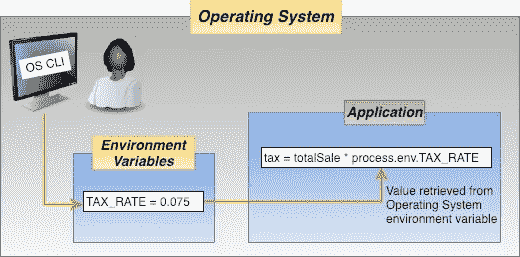
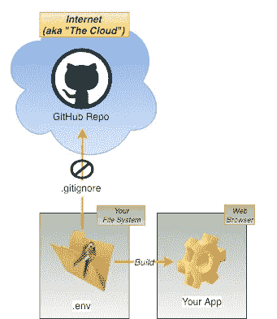

# 环境变量及其使用方法介绍

> 原文：<https://levelup.gitconnected.com/an-introduction-to-environment-variables-and-how-to-use-them-c72e8653c0ee>

从应用程序中分离配置


照片由[安托万·道特里](https://unsplash.com/photos/05A-kdOH6Hw?utm_source=unsplash&utm_medium=referral&utm_content=creditCopyText)在 [Unsplash](https://unsplash.com/search/photos/math?utm_source=unsplash&utm_medium=referral&utm_content=creditCopyText) 上拍摄

# 什么是环境变量？

任何计算机编程语言的两个基本组成部分是 [*变量*](https://en.wikipedia.org/wiki/Variable_(computer_science)) 和 [*常量*](https://en.wikipedia.org/wiki/Constant_(computer_programming)) 。就像数学方程中的独立变量一样，这些变量的值会改变程序的结果。变量和常量都代表包含程序在计算中使用的数据的唯一内存位置。两者的区别在于变量值可能在执行过程中改变，而常量值不能被重新赋值。

[*环境变量*](https://en.wikipedia.org/wiki/Environment_variable) 是其值在程序外设置的变量，通常通过操作系统或微服务内置的功能来设置。环境变量由一个名称/值对组成，可以创建任意数量的名称/值对，并在某个时间点提供引用。

```
# Meteorite dataset from Nasa Open Data Portal
REACT_APP_METEORITE_LANDING_HOMEPAGE="https://data.nasa.gov/Space-Science/Meteorite-Landings/gh4g-9sfh"
REACT_APP_METEORITE_STRIKE_DATASET="https://data.nasa.gov/resource/y77d-th95.json"
```

在应用程序初始化期间，它们被加载到`process.env`中，并通过在环境变量的名称后面加上后缀来访问，如下所示。

```
fetch(process.env.REACT_APP_METEORITE_STRIKE_DATASET)
.then((response) => {
  return response.json();
})
.then((strikesJSON) => {
  this.setState({ meteoriteStrikes: strikesJSON });
  this.setState({ isDataLoaded: true});
});
```

在运行时，对环境变量名的引用被替换为其当前值。在这种情况下，`process.env.REACT_APP_METEORITE_STRIKE_DATASET`被它的值`"https://data.nasa.gov/resource/y77d-th95.json".`代替

环境变量的主要用例是限制由于配置数据的变化而修改和重新发布应用程序的需要。从上面的例子来看，当`REACT_APP_METEORITE_STRIKE_DATASET`的 URL 改变时，不需要修改源代码、测试和部署修改后的应用程序。

修改和发布应用程序代码相对复杂，并且增加了在生产中引入不良副作用的风险。当 URL 由环境变量而不是应用程序定义时，更改过程包括检查新 URL 的有效性、使用操作系统命令更新相应的环境变量或更新配置文件，以及测试受影响的应用程序功能以确保应用程序仍按预期工作。

环境变量的用例包括但不限于以下数据:

*   执行模式(例如，生产、开发、试运行等。)
*   域名
*   API URL/URI 的
*   公钥和私钥(仅在服务器应用程序中是安全的)
*   群组邮件地址，例如营销、支持、销售等邮件地址。
*   服务帐户名称

它们的共同点是它们的数据值很少改变，应用程序逻辑将它们视为常量，而不是可变变量。

接下来，让我们看看如何使用本机操作系统、NPM 包 dotenv 和 webpack 来利用环境变量。

# 节点中的环境变量



图 1 —操作系统环境变量

在后端应用程序中使用环境变量依赖于操作系统命令来定义环境变量及其值。系统管理员可以使用命令行界面来定义这些，但是通过 shell 脚本来定义通常更有意义。环境变量通常不能在整个操作系统中全局访问，它们通常是特定于会话的。例如，使用 Linux 命令行:

```
setenv REACT_APP_METEORITE_LANDING_HOMEPAGE = "https://data.nasa.gov/Space-Science/Meteorite-Landings/gh4g-9sfh"
```

在运行时，NodeJS 自动将环境变量加载到`process.env`中，使它们对应用程序可用。比如`fetch(process.env.REACT_APP_METEORITE_STRIKE_DATASET)`。

环境变量的管理和操作因操作系统而异。此外，这在不同的微服务环境中也有所不同，比如 [Heroku](https://www.heroku.com/) ，在那里使用管理面板来管理环境变量。因此，在应用程序中使用环境变量之前，理解特定于平台的因素是至关重要的。

最小化这些差异的一个方法是使用[跨环境](https://www.npmjs.com/package/cross-env) NPM 包，它提供了一个独立于操作系统的 [POSIX](https://en.wikipedia.org/wiki/POSIX) 兼容命令来设置环境变量..

# dotenv 包中的环境变量

支持在前端应用程序中使用环境变量不是浏览器或 Javascript 的“现成”特性；需要像 [*dotenv*](https://www.npmjs.com/package/dotenv) 这样的包才能启用。根据记录，前端和后端应用程序都可以使用 dotenv。

使用这个包非常简单，

```
**import** dotenv **from** 'dotenv';dotenv.config();
console.log(process.env.REACT_APP_METEORITE_STRIKE_DATASET);
```

这种技术通过将数据从源代码移动到一个`.env`文件中的环境变量来实现数据的外部化。将`.env`文件名添加到`.gitignore`可以防止`git push`命令将其上传到 GitHub repo，在那里，对于公共回购，任何人都可以使用它。



图 2-。环境文件使用

`.env`中的环境变量被格式化为`name=value`，以`#`开头的行被视为注释，空行被忽略。举个例子，

```
# Meteorite dataset from Nasa Open Data Portal
REACT_APP_METEORITE_LANDING_HOMEPAGE="https://data.nasa.gov/Space-Science/Meteorite-Landings/gh4g-9sfh"
REACT_APP_METEORITE_STRIKE_DATASET="https://data.nasa.gov/resource/y77d-th95.json"
```

然而，许多流行的软件包如 Create React App (react-scripts)、Gatsby、GraphQL CLI、Node Lambda 和 [more](https://www.npmjs.com/browse/depended/dotenv) 已经包含 dotenv。如果您已经使用了这些软件包中的一个，dotenv 可能已经可以在您的应用程序中使用了。例如，上面的代码片段来自 Create React App 生成的一个应用程序，它要求环境变量以`REACT_APP_`为前缀。

在创建 React 应用程序的情况下，不需要调用`dotenv.config()`，因为`node_modules/react-scripts/config/env.js`会在应用程序启动时自动用`.env`文件的内容填充`process.env`。关于 Create React 应用程序的示例，请参考 GitHub 上的[陨石浏览器报告](https://github.com/jdmedlock/meteorite/tree/feature/07-create-issue)。

由于浏览器环境不安全，应用程序必须特别小心，不要暴露敏感信息，如应用程序机密。有关如何保护前端环境的更多信息，请查看“[保护应用程序资产:如何保护您的秘密](https://medium.com/chingu/protect-application-assets-how-to-secure-your-secrets-a4165550c5fb)”。

# webpack 中的环境变量

[webpack](https://webpack.js.org/) 是一个捆绑器，它将应用程序中许多不同的模块、资源和资产转换、捆绑或打包在一起，以便在浏览器中使用。webpack 的一个常见用途是为生产部署准备应用程序。例如，Create React App 的`build`脚本使用 webpack 创建包含应用程序生产版本的`build`目录。

尽管 webpack 实现了对使用环境变量的支持，但它是作为 webpack 命令的一个[选项](https://webpack.js.org/guides/environment-variables/)出现的。举个例子，

```
webpack --env.NODE_ENV=local
```

通过在 webpack 命令中指定多个`--env`选项，可以支持多个环境变量。这些在 webpack 配置文件(如`webpack.config.js`)中被称为`env.`，其后缀是环境变量名称。例如，`console.log(env.NODE_ENV).`

webpack 配置文件也可能引用由操作系统使用`process.env`定义的环境变量，就像任何其他 Javascript 模块一样。考虑 Create React 应用程序中`webpack.config.prod.js`的这个例子。

```
// Source maps are resource heavy and can cause out of memory issue for large source files.const shouldUseSourceMap = process.env.GENERATE_SOURCEMAP !== 'false';
```

# 包装它

> “抽象将世界带入更复杂、可变的关系；它可以从看似虚无的事物中提取美、另类的地形、丑和强烈的现实。”—杰瑞·萨尔茨

使用环境变量是一种通过从代码中分离不经常改变的数据来使你的应用程序更容易配置的技术。尽管这种技术可能很简单，但它的使用受到应用程序类型(前端或后端)和操作环境(操作系统或微服务)等因素的影响。

利用环境变量很容易，但是理解它们的细微差别并能够有效和安全地利用它们是将有经验的 Web 开发人员与没有经验的开发人员区分开来的一个因素。与任何技术一样，诀窍不在于知道如何使用某样东西，而在于知道何时使用它。

## 什么是 Chingu？

请加入我们的远程航行项目团队，构建应用程序，完善“硬”技能，学习新的“软”技能，从而走出“教程炼狱”。我们帮助开发人员在他们所学的知识和雇主寻找的技能之间架起一座桥梁。