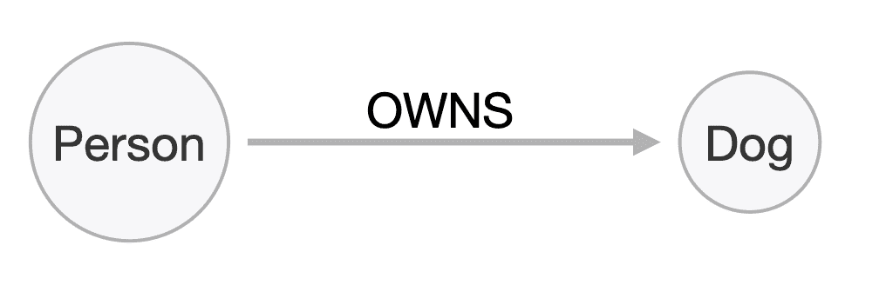
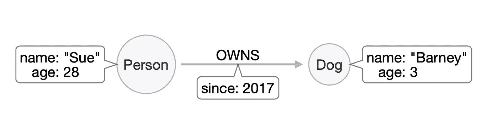
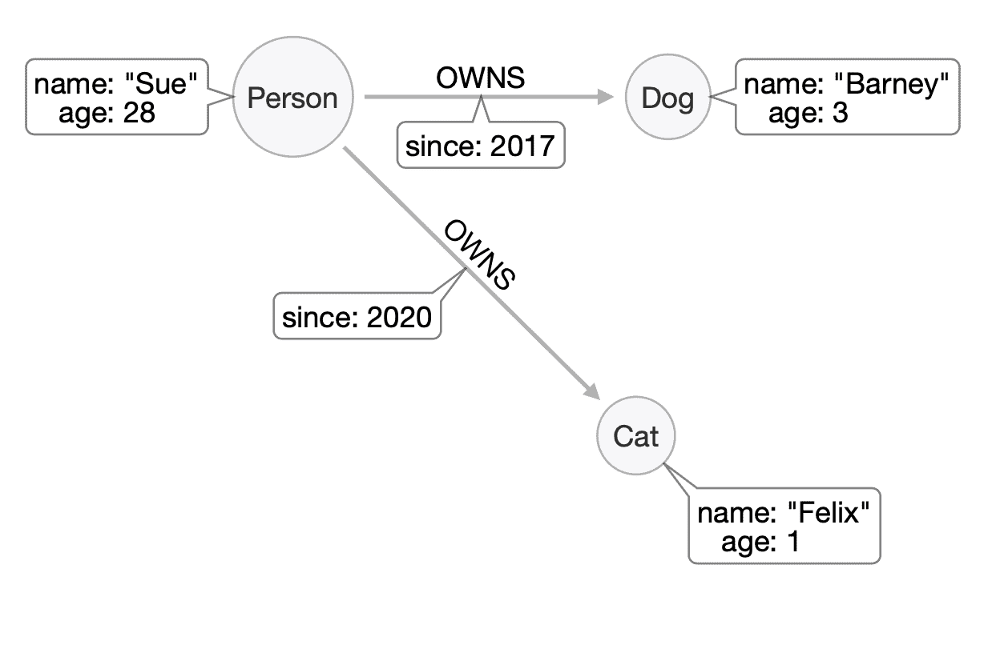
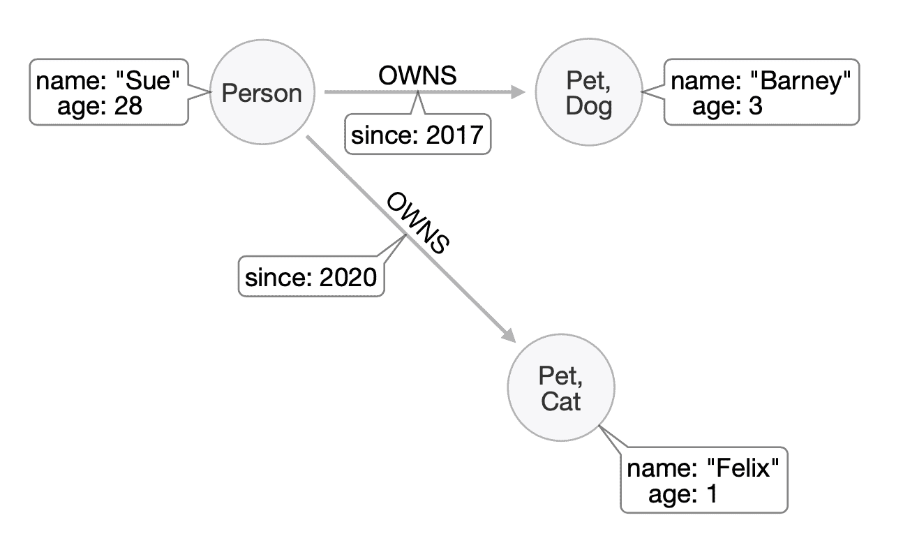
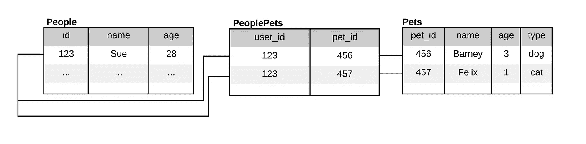

# 图形数据库简介:连接数据的力量

> 原文：<https://levelup.gitconnected.com/an-introduction-to-graph-databases-the-power-of-connected-data-739d9e02f1ed>

在今天的经济中，越来越多的公司主要存在于网上。虽然围绕放弃传统实体业务的后果有很多讨论，但人们较少关注的一个方面是这些公司现在管理数据的方式发生了重大变化。越来越多的企业试图了解他们的客户，以及如何以月度报告和 KPI 图表无法解决的方式最好地满足他们的需求。许多围绕提供引人注目的在线购物体验的现代理念，如“*经常一起购买”*推荐和“*购买这种产品的人也对“*感兴趣，因为在今天使用的许多数据库系统最初设计出来时，它们根本不存在。这意味着在这些情况下试图使用它们有时会感觉有点像试图将一个方形的钉子放入一个圆孔中。

举个简单的例子，比如网上宠物用品店。他们可以走上建立一个由关系数据库支持的传统网站的道路，接收订单并尽最大努力快速发货。偶尔，他们甚至可能通过电子邮件与客户联系，发送每月特价商品，希望增加他们的营业额。但这种方法不太可能在拥挤的市场中表现得特别好，因为它没有提供任何个性化的东西。企业并不真正了解他们的客户如何在个人层面上与他们的网站进行交互，因为他们选择的数据库，以及它所支持的网站，并不是为处理和解释这种数据而构建的。要正确理解这种类型的数据，需要一种强调实体如何真正相互交互，并捕获每个交互的完整上下文的方法。简而言之，它需要一个图形数据库。

**图形数据库**

图形数据库代表了一种创新的、强大的方法来解决连接数据的问题，这种方法更接近于我们人类思考数据的方式。这项技术相对较新，但不应被视为边缘技术。数据大学最近的一项调查表明，近 25%的公司打算在未来两年内使用图形数据库。它们被称为 21 世纪 20 年代的“首选”数据库，但是为什么呢？在本文中，我们将研究图形数据库是如何工作的，是什么使它们与众不同，以及它们能给你的应用带来什么好处。

**什么是图形数据库？**

图形数据库代表了一种更加灵活和直观的数据存储方法。虽然大多数数据库引擎只支持可以用逻辑连接(例如，通过外键约束)连接在一起的一系列表来表示的数据，但是图数据库采用了一种基于两个简单但非常强大的概念的方法—节点和关系。节点表示领域中的事物或对象(通常是名词)，而关系表示它们如何相互作用和相互关联(通常是动词)。假设我们的在线宠物店希望更好地了解他们的客户，并开始记录每个客户拥有的宠物类型。这是他们如何从图表开始的:

开始时只需要两个节点，人和狗，以及它们之间的关系 OWNS。图形数据库中的关系是*指向*的，用箭头表示——狗是人的，而不是相反。有了这个基本事实，我们可以开始添加更多的上下文:

现在，我们的 Person 和 Dog 节点都有 name 和 age 属性，关系记录了 Sue 拥有 Barney 的时间。注意我们是如何以同样的方式将属性附加到节点和关系上的。这是可能的，因为与关系数据库不同，图将关系视为*一等公民—* 它们在数据库中的角色与它们所连接的节点一样重要，有时甚至更重要。

图形的伟大之处在于，即使是像这样简单的例子，它不仅是数据存储的方式，也可能是您在开始设计数据模型时描绘的方式。图表天生对*白板友好*，当与非技术团队合作时，或者当您需要从简单开始并不断添加上下文时，这是一个很好的选择。

如果苏也决定养只猫呢？这将只需要添加另一个节点，并使用新的 OWNS 关系将其连接到 Sue。现在，Sue 有了一只猫和一只狗，可以通过相同的方式访问它们:

我们可能还想一起检索 Sue 的宠物，也许是为了了解每个客户平均拥有多少只宠物。节点可以根据需要被赋予任意多的标签，因此虽然我们可以将它们标记为 *Dog* 和 *Cat* 以将它们分开，但是我们也可以将它们标记为 *Pet* 以将它们组合在一起:

# 比较图形数据库和关系数据库

在保持清晰逻辑的同时不断添加更多数据的过程表明，随着需求的变化，发展一个图形数据库来满足您的需求是多么容易。与之相比，您可以在一个关系数据库中对上述场景建模，该数据库可以用相同的方式处理多个主人、宠物及其关系:

实际上，您至少需要三个表，每个表都有一个外键来将它们连接在一起。要检索任何有意义的事实，您必须一次从所有这些事实中加载数据，每次都指定您的连接逻辑。所有这些都是为了达到我们的图表只用三个节点和两个关系所能达到的相同的上下文。这种差异非常明显，而且随着数据模型的规模和复杂性的增加，这种差异会变得更加明显。

与关系数据库相比，使用图形数据库的其他方式包括:

1.*更具描述性的查询—* 不同平台的实现各不相同，但大多数图形数据库都配备了高度描述性的命令式查询语言，让您可以解释您想要什么，而不是您如何想要它。 [Cypher](https://neo4j.com/developer/cypher-query-language/) ，Neo4j 中使用的查询语言，可以简单地使用下面的代码为 Sue 和她的宠物检索数据:

> MATCH(s:Person { name:" Sue " })--(r:OWNS)->(p:Pet)

这个简单、易于理解的查询提供了人、每只宠物以及联系它们的关系的所有属性。如果我们以后向其中任何一个添加更多的属性，它们也会自动返回。任何尝试过 ASCII 艺术的人都会欣赏这种语法内在传达的清晰性(节点被包装在普通的括号中，关系在方括号中)。与关系查询相比，关系查询需要类似以下的内容:

> 选择人员。*，宠物。* FROM People 在 People.id = PeoplePets.id 上加入 PeoplePets.pet_id = Pets.pet_id 其中 People.id = 123

每次你想穿越这段关系的时候，你都必须把它的本质说清楚。如果这些列的名称或数据类型由于某种原因发生了变化，您还需要更新连接语法。在图数据库中可以避免这种问题，因为关系只是连接两个节点，不需要连接语义。

2.*更灵活地调整您的模型*——没有哪个真实世界的数据模型会长期保持静态。企业可能会改变他们的目标，或者想要测试新的想法，而不需要长时间的数据库重建。使用图形数据库，很容易向节点添加标签，向关系添加属性，或者重构图形的大部分。没有外键约束需要考虑，就像在关系数据库或表中那样，当数据丢失时需要清理。您将花更多的时间关注数据本身，而不是数据基础架构。

3.*遍历数据关系时更高的性能—* 原生图形数据库经过优化，以符合数据所代表的概念的方式存储数据。这意味着 Sue 和她的两个宠物，虽然是完全独立的节点，可能是在几年后创建的，但将被写入文件，并且彼此尽可能接近。这允许比关系数据库更快地检索相关数据，关系数据库通常根据创建时间将表数据分割到磁盘的不同区域。

# 什么样的数据在图形数据库中工作得最好？

当处理包含具有重要关联上下文的关系的数据时，图形数据库最有用。网上商店了解他们的客户群并与之互动是一个很好的例子，但是图表可以做得更多。其他应用包括:

*   *知识图表—*[NASA](https://neo4j.com/users/nasa/)等组织使用图表数据库来记录他们的实验和项目之间的逻辑联系，这意味着未来的努力可以利用已经完成的工作来提高效率，避免重复错误。
*   *推荐引擎—* 作为在线商务不可或缺的一部分，推荐引擎通过将用户行为与其他类似购买者进行比较，为用户提供更有可能感兴趣的推荐产品和服务。
*   *供应链管理—* 现代生产流程通常依赖于来自不同地点的材料和组件，因此了解分布式流程中的依赖关系至关重要。图形数据库可以提供识别单点故障的方法，提供正确实施保护和安全措施的途径，确保设计更具弹性。

# 尝试图形数据库的简单方法

当然，学习新技术的最好方法是尝试。对于图形数据库， [Neo4j](https://neo4j.com/) 是一个很好的实验图形数据库。它是市场领导者，拥有从数据科学爱好者到跨国公司的多样化用户基础。围绕该平台有一个成熟的社区，并且有大量的文档可用。

要快速试用 Neo4j，请考虑使用供应商托管的解决方案，它可以让您在几分钟内开始使用，并且无需设置和配置您自己的服务器。例如，亚马逊提供了一个简单的 Neo4j 部署。和 [Heroku](https://www.heroku.com) ，一个 PaaS 解决方案，有一个 GrapheneDB (Heroku 的 Neo4j 产品)服务，[可以免费部署多个版本](https://elements.heroku.com/addons/graphenedb)，以及一个[模板应用](https://elements.heroku.com/buttons/maxdemarzi/neovigator)和一个[演示应用](https://elements.heroku.com/buttons/maxdemarzi/neovigator)，可以加快学习曲线。大多数供应商托管的解决方案应该提供类似的东西。

# 结论

为您的应用程序选择正确的数据库是确保其成功的重要一步，无论是在发布时还是在未来。如果您正在关注一个项目，其中数据的交互是该领域的一个关键方面，那么可以考虑使用一个图形数据库来为您提供实现和性能方面的优势。