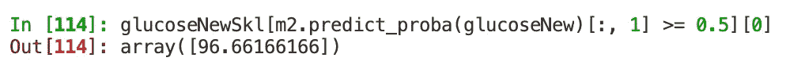

# 使用 statsmodels 和 scikit-learn 介绍 Python 中的逻辑回归

> 原文：<https://levelup.gitconnected.com/an-introduction-to-logistic-regression-in-python-with-statsmodels-and-scikit-learn-1a1fb5ce1c13>


Antonio Grosz 在 [Unsplash](https://unsplash.com?utm_source=medium&utm_medium=referral) 上的照片

# 介绍

数据科学家、统计学家和其他数据从业者遇到的许多问题都需要确定感兴趣的观察值是否可能属于某个结果的某个类别。例子包括信用评估(例如，潜在的借款人是否会拖欠债务？)、对可能欺诈的信用卡购买的标记以及对象分类(例如，这种植物是否是鸢尾？).虽然在技术上可以使用线性回归模型计算属于一个类别相对于另一个类别的概率，但更合适的回归技术是逻辑回归。这篇文章是上一篇[文章](/an-introduction-to-regression-in-python-with-statsmodels-and-scikit-learn-9f75c748f56e)的后续文章，标题为“使用 statsmodels 和 scikit-learn 介绍 Python 中的回归”,文章介绍了使用 *statsmodels* 和 *scikit-learn* 预测糖尿病诊断的简单逻辑回归模型的例子。

# 为什么不用线性回归呢？

假设我们有一个感兴趣的结果， *Y* ，它有两个离散值:0 和 1。我们希望使用预测变量 *x* 来预测一个数据点在 *Y* 上的值为 1 与值为 0 的概率。下面是假设数据的散点图，Y 值与 *x* 相对应。


如该图所示，给定数据点在 *Y* 上可以取值 0 或 1。如果我们对此数据运行线性回归模型，这就是我们获得的预测线。


在这里，我们看到了将线性回归模型拟合到只有两个离散可能值的结果的主要问题之一。线性回归模型会将直线预测线拟合到数据点，但是当感兴趣的结果只有两个可能的值时，预测线将超出结果的下限和上限。

在这种情况下，我们希望我们的预测限制在 0 和 1 之间。我们想要一条曲线，s 形的线来拟合数据，而不是直线。


上图中的这条曲线显示了给定数据点在 *x* 上的值，每个数据点在 *Y* 上的值为 1 的概率。这些预测的概率是通过将逻辑回归模型与数据拟合而产生的。现在让我们更详细地研究逻辑回归模型的细节。

# 逻辑回归模型剖析

线性回归模型旨在预测实际结果值 *Y* ，而逻辑回归模型预测 *Y* 的**对数优势**。


那么，对数几率是多少呢？我们来分解一下这个概念。**赔率**是通过将一个事件的概率(这里用 *p* 表示)除以它的补数(1- *p* )来计算的。上面等式左边括号内的项表示赔率。要获得对数赔率，我们只需取赔率的自然对数( *Ln)* (赔率的对数也称为 **logit** )。注意，上面等式中的下标 *i* 仅表示单个数据点。例如，在我们的等式中，下标为 *i* 的字母 *p* 代表在 *Y* 上值为 1 的单个数据点的概率。在等号的右边，𝛼代表截距(当预测变量 *x* 的值为 0 时的对数优势),𝛽是回归权重(单位增加的对数优势在 *x* 中的变化)。

现在，你可能会问，对数概率有什么特别之处？难道我们对概率不感兴趣，或者更好的是，预测一个数据点的离散 0 或 1 值？答案最终是肯定的，但是对数几率的预测是我们必须首先采取的重要步骤。与概率或二分变量的离散值不同，对数优势是在连续的尺度上测量的。为了说明，下面是 *x* 和 *Y* =1 的对数几率之间的关系图。


来自逻辑回归模型的预测对数优势可以很容易地转换为概率，公式如下，其中 *e* 表示相关上标数量的指数(上标公式在这种情况下是预测对数优势的公式)。


当我们绘制预测概率与值 *x* 的关系时，我们最终会得到一条在值为 0 和 1 时变平的 s 形曲线，但是我们如何理解这样的曲线呢？考虑下图，该图对之前的预测概率与 *x* 的关系图进行了一些修改。


在这个例子中，水平虚线表示预测概率值 0.5，即 *Y* 等于 1。预测概率曲线在 1.95 的 *x* 值处穿过这条水平线；垂直虚线标记了这一点。因此，在这个具有单个预测器的简单例子中，任何具有等于或大于 1.95 的 *x* 值的数据点将具有大于或等于 0.5 的预测概率，并被分类为 1。相反， *x* 值低于 1.95 的数据点将被归类为 0。

如上图所示，大多数 *x* 值等于或大于 1.95 的数据点的实际 *Y* 值为 1，因此被正确分类。这些实际和预测的 *Y* 值都为 1 的数据点被称为**真阳性**。同样，大多数具有小于 1.95 的 *x* 值的数据点具有 0 的实际 *Y* 值，并且也被正确分类；这些都是**真否定**。当然，我们也会得到一些实际的 *Y* 值与预测的 *Y* 值不匹配的数据点；这些数据点由红色“+”*标记表示。被错误归类为 0 的实际值为 1 的数据点为称为**假阴性**、，而被错误归类为 1 的实际值为 0 的数据点为**假阳性**。现在让我们看看如何在 Python 中实际实现和利用逻辑回归。*

# *数据*

*在下面的例子中，我们将使用[皮马印第安人糖尿病](https://www.kaggle.com/uciml/pima-indians-diabetes-database)数据。数据和相关信息可在[这里](https://www.kaggle.com/uciml/pima-indians-diabetes-database)找到。让我们从导入 *pandas* 开始，加载数据，并取这个练习感兴趣的列:`Glucose`(血糖浓度)和`Outcome`(1 =糖尿病，0 =其他)。葡萄糖列中值为 0 的观察值被视为缺失数据，并从分析中排除(由于葡萄糖值为 0，少于 1%的观察值被丢弃)。一旦数据集被加载并限制到所需的列和行，我们就可以用`diab.describe()`来看看我们的列的分布。*

**

*请注意，我们的预测指标葡萄糖的最小值是 44。回想一下，当预测值为 0 时，逻辑回归模型中的截距项代表预测的对数优势。因此，我建议通过从葡萄糖列中的每个值中减去最小值 44 来“最小居中”葡萄糖。*

```
*diab["Glucose"] = diab["Glucose"] - diab["Glucose"].min()*
```

*请注意，无论我们是否将预测值居中，我们的回归权重和模型拟合指标都是相同的。但是，居中会对截距值产生影响。如果没有最小居中，截距将代表当数据点的葡萄糖值为 0 时的预测对数优势，而数据集中的最小葡萄糖值为 44。通过使葡萄糖最小居中，截距将替代地表示在数据集中观察到的最低葡萄糖浓度水平的观察结果的糖尿病的预测对数优势。好了，现在我们的数据已经设置好了，让我们继续进行一些分析，从 *statsmodels* 中的逻辑回归建模开始。*

# *统计模型*

**statsmodels* 是“一个 Python 模块，它为许多不同的统计模型的估计，以及进行统计测试和统计数据探索提供了类和函数。”如果我们有兴趣对葡萄糖对糖尿病的影响进行正式的统计假设检验， *statsmodels* 非常有用，因为它可以轻松地为回归权重提供推断统计指标，如标准误差、置信区间和 p 值。*

*现在，实际上有两种不同“口味”的 *statsmodels* 。第一个是在前一篇文章“使用 statsmodels 和 scikit-learn 介绍 Python 中的回归”中使用的标准 *statsmodels* 包。第二个是 *statsmodels.formula* ，它允许用户使用字符串中包含的 R 样式公式来指定模型。除了能够在字符串中为自己的模型编写公式之外，使用 *statsmodels.formula* 的另一个优点是默认包含截距。因此，让我们在下面的练习中使用 *statsmodels.formula* 。*

*下面的代码导入 *statsmodels.formula，*将使用葡萄糖浓度预测糖尿病的逻辑回归模型赋给`m1`，然后使用`m1.summary()`输出模型结果的表格。要知道`m1`是用户自定义的名字。我选择了`m1`,因为在我看来，它代表“模型 1 ”,但是您不需要受限于我的命名约定。*

*让我们更详细地分解模型的代码(第 3-6 行)。第 3 行从 *statsmodels.formula* 调用`logit`，开始将逻辑回归模型拟合到数据的过程。第 4 行用字符串`Outcome ~ Glucose`指定了型号。`~`左侧的列名是结果，右侧的列是预测值(如果您想要包括多个预测值，需要在每个预测值的列名之间放置一个`+`)。第 5 行确定模型拟合的数据，第 6 行指定实际拟合的逻辑回归模型。*

*这是来自`m1`的结果表。*

**

*请注意，输出左上角的`Method`值是`MLE`。这代表**最大似然估计；请记住这个术语。现在，请注意输出的右边部分，即`Log-Likelihood`。似然函数可概括为观察数据由一组给定的*参数值*(即截距和回归权重值)生成的概率。这里，我们的目标是找到使*最大化*似然函数的参数值，因此，术语“最大似然”。***

*实际上，最好计算可能性的自然对数，即**对数似然性**，因为与可能性相比，对数似然性[更容易区分](https://towardsdatascience.com/probability-concepts-explained-maximum-likelihood-estimation-c7b4342fdbb1#:~:text=The%20log%20likelihood&text=This%20is%20important%20because%20it,instead%20of%20the%20original%20likelihood.)。其中 *p* 表示对于给定的观察值，属于二分结果中感兴趣的类别(例如，类别 1 相对于 0)的预测概率， *i* ，以及 *y* 表示观察值在二分结果中的实际值，对数似然可以写成如下。*

**

*我们模型的对数似然是-393.28。“空”模型，即截距作为唯一参数的模型，其对数似然为-493.35，如`Log-Likelihood`下方的`LL-Null`输出所示。`LLR p-value`提供手头模型与零模型的 [**似然比测试**](https://stats.idre.ucla.edu/other/mult-pkg/faq/general/faqhow-are-the-likelihood-ratio-wald-and-lagrange-multiplier-score-tests-different-andor-similar/) 的 p 值。如果这个 p 值满足统计显著性的既定阈值，那么我们可以得出结论，模型比零模型更适合数据。在这种情况下，似然比测试的结果表明，与只有截距的零模型相比，将葡萄糖浓度作为糖尿病的预测因子显著提高了模型拟合度。*

*现在，让我们关注表格底部的截距和回归权重结果。在`coef`列下，`Intercept`行的值为-3.9272。这意味着当葡萄糖值为 0 时，结果值为 1(即被分类为糖尿病)的预测对数优势为-3.9272。`coef`列中`Glucose`的值 0.0406 意味着葡萄糖值每增加一个单位，被归类为糖尿病的对数优势增加 0.0406。对数概率并不十分直观，这就是为什么我们希望最终从我们的模型中预测概率。尽管如此，我们可以将该模型的结果解释为显示较高的葡萄糖浓度与糖尿病的诊断正相关，这是有意义的。*

*`Glucose`行的`P>|z|`列中的值 0.000 表明葡萄糖对结果的影响在常规显著性水平上具有统计学显著性。因此，我们可以确信，在该数据集中观察到的葡萄糖浓度和糖尿病之间的关系不可能仅仅归因于[采样误差](https://methods.sagepub.com/Reference/encyc-of-research-design/n401.xml)。`[0.025`和`0.075]`列中的值分别提供了葡萄糖截距和回归权重的 95% [置信区间](https://stattrek.com/estimation/confidence-interval.aspx)。葡萄糖的 95%置信区间不超过 0 的事实也告诉我们，在该模型中，葡萄糖对糖尿病的影响在统计学上[显著](https://blog.minitab.com/blog/adventures-in-statistics-2/understanding-hypothesis-tests-confidence-intervals-and-confidence-levels)，显著性水平为 5%。*

*现在，让我们看一个例子，从我们的结果中获得给定葡萄糖值的预测概率。假设我们想要获得被归类为糖尿病的预测概率，给定葡萄糖浓度值为 54。基于上述模型的结果，我们得到预测的对数优势值为-3.5212*

***-3.5212 =-3.9272+(54–44)* 0.0406***

*要将预测的对数优势转换为预测的概率，我们需要对对数优势取指数(exp ),然后除以 1 加上取指数的对数优势。*

***exp(-3.5212)/(1+exp(-3.5212))= 0.0296/1.0296 = 0.0287***

*因此，假定葡萄糖浓度为 54，被归类为糖尿病的概率约为 0.03，或转换为百分比时为 3%。*

*如果我们想要使用我们的 *statsmodels* 模型获得一个单个值的预测，我们首先必须创建一个具有一列一行的*熊猫*数据框。在下面的代码中，我创建了一个数据框`newpred`，它有一个名为`Glucose`的列和一个值为 10 的单行。然后我就把`m1.predict`套用到了`newpred`上。*

**

*我们可以更好地评估葡萄糖和被归类为糖尿病的概率之间的关系，方法是根据我们的模型对葡萄糖值绘制预测概率。*

**

*在上面的图中，我们可以清楚地看到糖尿病的概率随着葡萄糖浓度的增加而增加。*

# *sci kit-学习*

**scikit-learn* 旨在为预测建模提供方便而有用的工具。逻辑回归就是这样一个工具，可以用`LogisticRegression`类来实现。然而，在进入`LogisticRegression`之前，让我们创建一个重塑的 *NumPy* 数组来包含葡萄糖浓度值，以确保我们的预测值数组既有行又有列。*

```
*X = diab["Glucose"].to_numpy().reshape(-1, 1)*
```

*为什么上面的代码是必要的？`LogisticRegression`类期望预测值数组既有行又有列。然而，我们数据中的*熊猫*系列`diab["Glucose"]`的尺寸有 763 行，没有列。*

**

*相反，我们新创建的数组`X`的维度有 763 行和一列。*

**

*现在我们准备好拟合我们的逻辑回归模型，它在下面的代码中被分配给第 3 行的`m2`。*

*现在让我们讨论一下 *scikit 的基本结构——学习*的模型拟合语法。我们从第 3 行开始，调用`LogisticRegression`类，然后将`fit`方法附加到这个类上。然后，预测值(即本例中的`X`)和结果值(即此处的`diab["Outcome"]`)作为参数传递给`fit`。使用逻辑回归模型拟合数据并分配给`m2`，我们可以分别使用`m2.intercept_`和`m2.coef_`查看截距和回归权重。*

**

*这些结果与 *statsmodels* 输出一致。尽管如此，幕后发生的一些事情使得 *scikit-learn* 的逻辑回归实现与 *statsmodels 的*略有不同，这里值得一提。首先， *scikit-learn* 的`LogisticRegression`使**对数损失**最小化，这与最大化似然函数相反。然而，对数损失函数只是对数似然乘以-1，所以这与 *statsmodels* 中的情况并没有太大的不同。我们可以使用`sklearn.metrics`中的`log_loss`输出日志损失。*

*请注意，`log_loss`中的`normalize`被设置为`False`，它输出我们数据中所有观察值的损失总和(与 *statsmodels* 中对数似然的计算一致)，而不是平均损失。*

**

*对数损失是 393.28，等于来自 *statsmodels* 的对数似然值乘以-1。*

**

*来自*统计模型的对数似然和其他结果。**

*除了最小化 log-loss，`LogisticRegression`默认执行正则化(使用 l2 惩罚作为默认惩罚)。虽然对正则化的全面讨论超出了本文的范围，但还是有必要做一个简单的描述。简而言之，正则化有助于通过惩罚回归权重来防止多重共线性和过度拟合。因此，更强的正则化将减少回归权重的大小。[这里的](https://towardsdatascience.com/intuitions-on-l1-and-l2-regularisation-235f2db4c261)是对正则化更详细的解释，如果你不熟悉这个概念，可能会觉得有帮助。*

*当然，如果您对使用逻辑回归进行预测感兴趣，您可能还想将数据分成[训练集和](https://scikit-learn.org/stable/modules/generated/sklearn.model_selection.train_test_split.html)测试集。这样做将允许您在训练集上拟合模型，然后在测试集中看不见的数据点上评估结果模型。我也鼓励你使用[交叉验证](https://scikit-learn.org/stable/modules/cross_validation.html)技术来防止过度拟合。*

# *混淆矩阵*

*我们还应该看看我们的模型在分类糖尿病和非糖尿病数据点方面表现如何。当我们的主要目标是预测时，这是一项特别重要的任务。完成这一任务的一个简单方法是输出一个**混淆矩阵**，它描绘了实际和预测的肯定/否定分类的分布。*

**

*这里，如果来自逻辑回归模型的观察的预测概率大于或等于 0.5，则该观察的结果(即，诊断的糖尿病)被分类为值 1。基于我们的模型，我们使用 *scikit-learn* 运行，当以最小为中心的葡萄糖值约为 96.66 或更高时，观察结果将被分类为 1(糖尿病)和 0(非糖尿病)。这个值 96.66 是通过下面显示的代码获得的。请注意，从 *scikit-learn* 获取预测概率，我们必须使用`predict_proba`，因为`predict`将返回一组观察值的预测分类(即本例中的 1 或 0)。*

**

*输出混淆矩阵的代码如下所示。`confusion_matrix`中的第一个参数`diab["Outcome"]`，指定感兴趣的结果的实际标签。第二个参数，`m2.predict(X)`，提供了我们的逻辑回归模型的预测标签。*

*这是输出的混淆矩阵。*

**

*在左上角我们可以看到我们的观察中有 437 个是真正的否定；这些观察结果的实际值和预测值为 0。移到右下角，我们有 132 个真阳性；这些观察结果的实际值和预测值为 1。因此，我们的模型对 763 个观察值中的 569 个进行了正确分类，准确率达到 75%。*

*现在是错误分类的观察。在右上角，我们可以看到我们有 60 个实际值为 0、预测值为 1 的观察结果。这些都是我们的误报。最后，在左下方，我们有 134 个假阴性——实际值为 1 而预测值为 0 的观察值。*

*值得一提的是，我们还可以使用`pred_table`输出一个带有 *statsmodels* 的混淆矩阵。*

**

*如你所见，`pred_table`的输出与 *scikit-learn* 的`confusion_matrix`的输出相匹配。*

# *结论*

*在这篇文章和之前的相关文章“用 statsmodels 和 scikit-learn 介绍 Python 中的回归”中，我花了很多精力在回归的基础上，原因有二。首先，线性和逻辑回归都是有用的建模技术。适当处理相关的预测因素，线性和逻辑回归是强大的建模工具，也可以提供可解释的结果。第二，对线性和逻辑回归的扎实理解对于理解许多其他回归和分类技术是必不可少的。*

*感谢您花时间阅读这篇文章。我希望你发现了它——或者至少是这篇文章的一部分——信息丰富。如果你感兴趣，这篇文章的全部材料可以在 GitHub [这里](https://github.com/scottadams26/introLogit)找到。像往常一样，请随时提出建设性的批评、您发现的错误和/或您可能希望在未来的帖子封面中看到的其他主题的建议。下次见，牛逼一点。*

*简介-stats 模型。(未注明)。2020 年 3 月 1 日检索，https://www.statsmodels.org/stable/index.html*