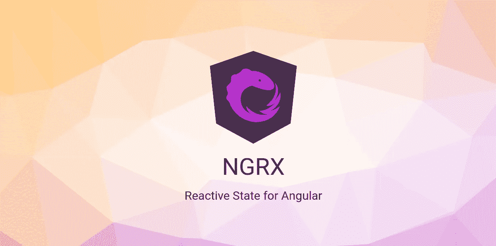
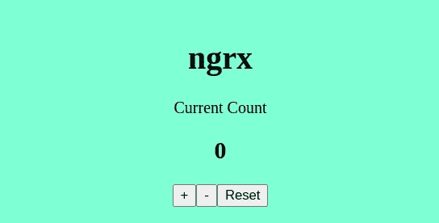
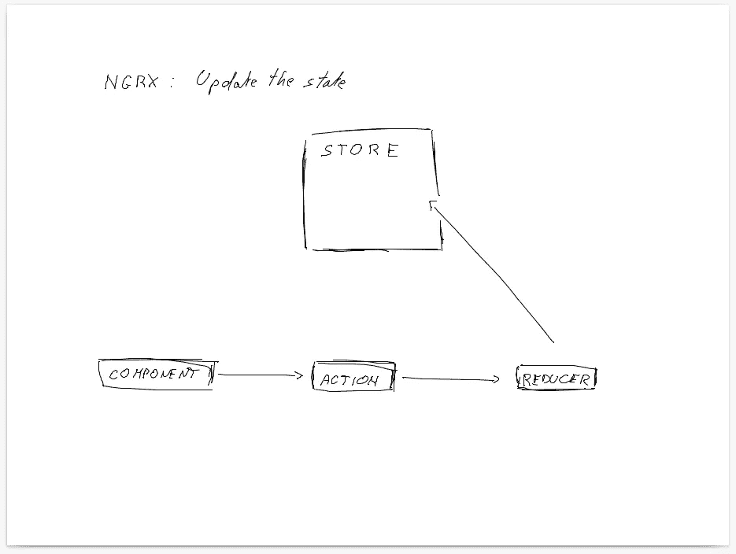
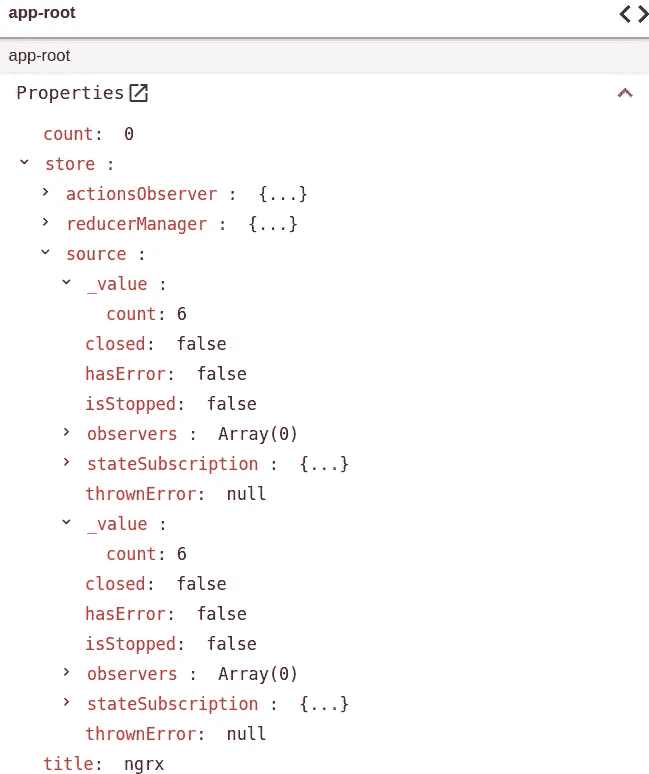
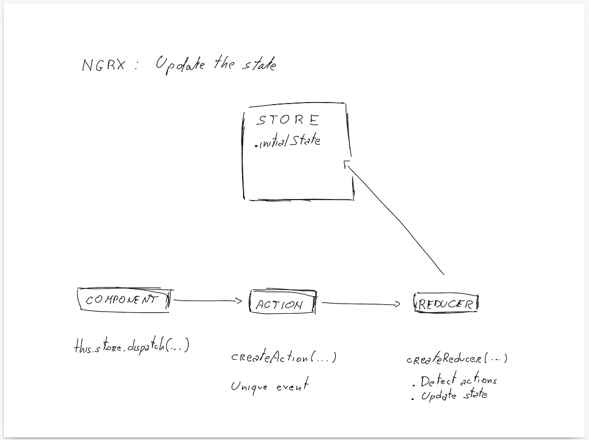
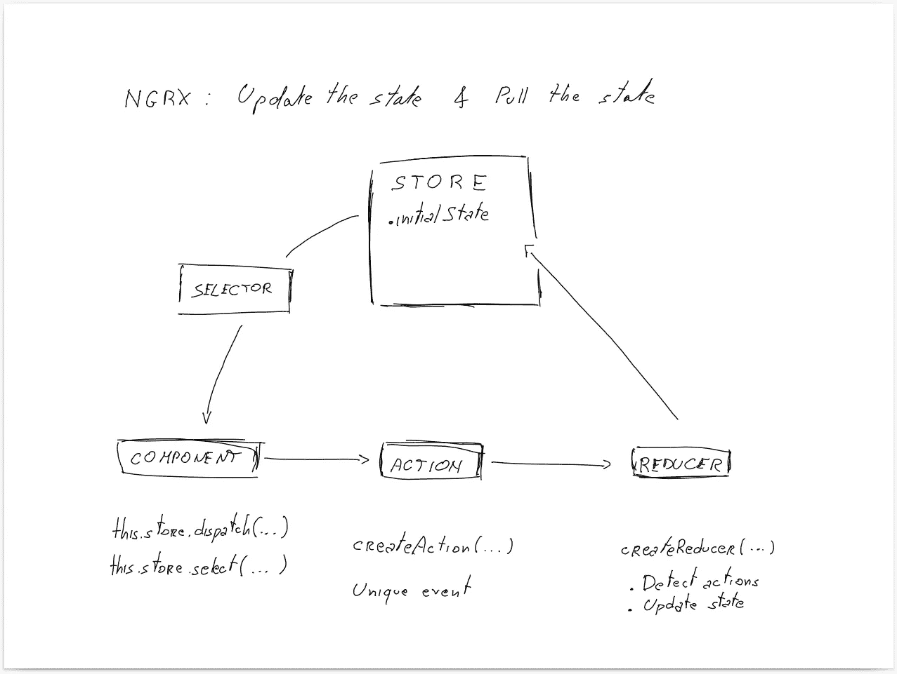

# NgRx 简介

> 原文：<https://levelup.gitconnected.com/an-introduction-to-ngrx-2d849c0baac4>

## [角度](https://medium.com/@lorenzozar/list/angular-5496c492a185)

## NgRx 是一个使用 Redux 模式的状态管理库。了解为什么以及何时使用它。

如果你听说过 NgRx，你可能认为它很复杂，除非你的应用程序有复杂的状态需要维护，否则你不应该使用它。

这通常是准确的。而这也是为什么在不需要的时候要熟悉的原因。那么当你确实需要它的时候，你就有了一个好的起点。

这是对 NgRx 基本概念的介绍。

我将首先回答

*   NgRx 是什么？
*   为什么我们需要国家管理？

在开始构建一个使用 NgRx 的简单应用程序之前。



https://ngrx.io/[主页](https://ngrx.io/)

# NgRx 是什么？

NgRx 是一个使用 Redux 模式的状态管理库。

## 什么是国家？

简单地说，您可以将**状态看作一个 JavaScript 对象，它包含应用程序不同部分使用的数据**。

这个想法是要有一个数据存储，其中应用程序、服务和组件的不同部分仍然可以在从存储接收它们的状态时相互交互。

这个**存储是整个应用程序状态的唯一真实来源**。

这个概念来自 Redux。

## Redux 是什么？

Redux 是一种状态管理模式，也是一个在任何应用程序中实现该模式的库。

Redux 背后的主要思想是，整个应用程序的状态存储在一个中心位置:存储。

把商店想象成一个 JavaScript 对象。


Redux 徽标

# 为什么我们需要国家管理？

到目前为止，我们说 NgRx 用于管理一个应用程序的状态。

要不是这样，我们可以使用服务！对于小而简单的应用程序，服务足以处理应用程序状态。

更具体地说，通过使用 RxJS 和 Subjects，我们可以在不使用 NgRx 的情况下走得更远。

然而，有一些很好的理由使用状态管理，特别是 NgRx，如果你正在使用 Angular。

## 使用 NgRx 的理由

根据 [ngrx.io](https://ngrx.io/guide/store/why) ，*你可能会使用 NgRx*

*   *当您构建一个具有大量用户交互和多个数据源的应用程序时，或者*
*   *当服务中的管理状态不再足够时*。

所以，如果你的应用变得越来越大，而你的状态管理变得越来越混乱，这可能是因为缺乏适当的状态管理。

他们甚至提出了一个简便的指南来回答这个问题:我需要 NgRx 存储吗？

*   **共享**:被多个组件和服务访问的状态。
*   **水化**:从外部存储持久化和再水化的状态。
*   **可用**:重新输入路线时需要可用的状态。
*   **恢复**:必须恢复的状态，有副作用。
*   **受影响**:受其他来源行动影响的状态。

## 为什么服务还不够？

首先，使用服务来处理大型复杂的应用程序可能会令人困惑，并且您可能会失去唯一的事实来源。

此外:

*   使用 RxJS 和 Subjects 时，Angular 可能无法检测嵌套在对象中的属性的值更改。在 JavaScript 中，改变一个对象的属性不会改变整个对象。
*   你需要一个清晰和结构化的模式来更新应用程序中的数据

话虽如此，请记住" *NgRx Store 附带了一些权衡[…]。这并不意味着是编写代码的最短或最快的方法。它还鼓励使用许多文件*、 [ngrx.io](https://ngrx.io/guide/store/why) 。

## 为什么是 NgRx 而不是 Redux？

简而言之，NgRx 与 Angular 集成得更好。此外，它使用可注入服务、 [RxJs](https://www.vitainbeta.org/2022/04/30/rxjs-primer/) 和 TypeScript。

NgRx 在副作用上固执己见，而 Redux 则有不同的做法。

# 使用 NgRx 构建一个简单的应用程序:概述和理论

我们将创建一个简单的计数器应用程序来探索 NgRx 的基础知识。

这个应用程序松散地遵循了 ngrx.io 上提供的 t [utorial。然而，我添加了一些解释，可能对第一次接触 NgRx 和 Redux 模式的开发人员有所帮助。](https://ngrx.io/guide/store#tutorial)

我们首先在 AppComponent 中创建一个计数器特性。CSS 基本上被省略了，但是你可以在 GitHub 上找到完整的代码。



计数器应用程序

app.component.html 的代码是

```
<p>Current Count</p>
<h2>{{ count }}</h2><button (click)="increment()">+</button>
<button (click)="decrement()">-</button>
<button (click)="reset()">Reset</button>
```

app.component.ts 中的代码是

```
...export class AppComponent {
  title = 'ngrx';
  count: number = 0; increment() { this.count++; } decrement() { this.count--; } reset() { this.count = 0; }
}
```

## 本地状态生命周期

目前，AppComponent 有一个本地状态。它是名为`counter`的变量，存储计数器的值。

让我们快速浏览一下 AppComponent 中的状态生命周期

从模板开始:

1.  点击一个按钮触发一个点击事件
2.  点击事件执行一种方法
3.  该方法更新类中`counter`的值
4.  最后，由于字符串插值，模板反映了更新的值

NgRx 中应用程序状态的总体流程非常复杂，但是有些元素与我上面描述的相似。

## 全局状态生命周期


NgRx 中应用状态的一般[流程](https://ngrx.io/guide/store)

在 NgRx 中，组件不存储状态，也不管理发生的变化。

状态现在存储在存储中，而不是组件中。

让我们从模板开始，看看状态生命周期是如何变化的:

1.  点击一个按钮触发一个点击事件
2.  点击事件执行一种方法
3.  该方法将动作分派给缩减器
4.  缩减器执行逻辑来更新存储器中的值`counter`
5.  最后，由于字符串插值，模板反映了更新的值

我们可以进一步分解这个逻辑。

1.  **更新状态**。前四个步骤更新存储中的状态值。
2.  **拉动状态**。最后一步从存储中提取状态值。

接下来，我们开始按照这两个部分构建应用程序。

# 使用 NgRx: Code 构建一个简单的应用程序

首先，安装 NgRx

```
npm install @ngrx/store --save
```

然后，让我们在第 1 部分中更新商店中的状态值。



专注于更新商店的状态

## 第 1 部分:更新状态

我将从创建代码来更新存储中的状态开始，因此只关注前四个步骤。

前两步是相同的，但是第三步引入了两个新概念:动作和减少器。

*   **动作**:动作代表应用程序中发生的唯一事件。例如，递增计数器。
*   **还原器**:还原器检测动作，修改当前状态，并将新状态存储在存储器中。我们通常为应用程序中的每个功能提供一个缩减器。一个缩减器可以处理多个动作，比如递增、递减和重置计数器。

让我们给减速器分派一个动作。

## 创建一个操作

我创建了一个状态文件夹，其中包含了与状态管理相关的所有内容。在 state 文件夹中，我创建了一个名为 counter.actions.ts 的文件。

我创建了一个递增计数器的操作:

```
//  counter.actions.tsimport { createAction } from '@ngrx/store';export const increment = createAction('[App Component] Increment');
```

要创建一个动作，我们只需将动作的名称传递给`createAction`方法。动作的名称是一个字符串，通常表示动作的来源，在方括号中，后面跟着动作是什么。

这是我们的第一个行动。现在我们需要创建一个接收动作并处理它的 reducer。

## 创建一个减速器

在 state 文件夹中，我创建了一个名为 counter.reducer.ts 的文件。

```
//  counter.reducer.ts import { createReducer, on } from '[@ngrx/store](http://twitter.com/ngrx/store)';
import { increment } from './counter.actions';export const initialState = 0;export const counterReducer = createReducer(
  initialState,
  on(increment, (state) => state + 1),
);
```

请注意，`initialState`将是应用程序在任何动作被调度之前的初始状态。在这个简单的应用程序中，`initialState`是一个数字，它将是 AppComponent 中`counter`的值。

为了创建一个减速器，我们使用`createReducer`方法。

第一个参数取最初分配给`counter`的值。这个值可以是一个对象，它存储应用程序或功能的初始状态。

第二个参数采用`on`方法来处理特定的动作。因此，在我们的例子中，当调度`increment`动作时，我们获取当前状态并返回一个新状态。

## 在 AppModule 中导入 NgRx

由于我们没有使用 [Angular CLI 添加 NgRx](https://ngrx.io/guide/store/install#installing-with-ng-add) ，所以需要手动添加。

在 AppModule 中，我们导入:

```
// app.module.tsimport { StoreModule } from '[@ngrx/store](http://twitter.com/ngrx/store)';
import { counterReducer } from './state/counter.reducer';[@NgModule](http://twitter.com/NgModule)({
  declarations: [AppComponent],
  imports: [BrowserModule, StoreModule.forRoot({ count: counterReducer })],
  providers: [],
  bootstrap: [AppComponent],
})
export class AppModule {}
```

请注意" *StoreModule.forRoot()方法如何注册在整个应用程序中访问存储所需的全局提供者"，ngrx.io* 。

StoreModule.forRoot 函数接受一个包含`count`和 counterReducer 方法的对象，我们用它来管理计数器的状态。

## 向减速器分派动作

现在我们有了一个动作(增量)和一个减速器(反减速器)。让我们最终调度我们的第一个行动。

如上所述，该方法将一个动作分派给 reducer，因此让我们更新 app.component.ts 中的代码来分派动作。

```
import { Component } from '[@angular/core](http://twitter.com/angular/core)';
import { Store } from '[@ngrx/store](http://twitter.com/ngrx/store)';
import { increment } from './state/counter.actions';...
export class AppComponent {
  title = 'ngrx';
  count: number = 0; constructor(private store: Store) {} increment() { 
    this.store.dispatch(increment());  
  } decrement() { this.count--; }
  reset() { this.count = 0; }
}
```

注意，我们需要导入`Store`和`increment`。然后我们在构造函数中注入`store`，最后，我们更新`increment`方法:

```
increment() { 
  this.store.dispatch(increment());  
}
```

现在，如果您单击应用程序中的`+`按钮，您将看到什么也没有发生。

但是，逻辑是正确的。我们向 reducer 发送一个动作，reducer 更新状态。

您可以使用 Angular DevTools 来检查这一点。见下图截图。



从 Angular DevTools 中，我们看到三个属性:计数、存储和标题。

*   **计数**。count 的值为 0。这是有意义的，因为我们在 AppComponent 中将`count`初始化为 0。自从我们将`increment`方法改为使用调度程序后，就再也不会改变`count`的值了。
*   **店铺**。当我们查看 store/source/_value/count 的值时，我们看到它是 6。那是店里状态下的 count 值！我点击了六次`+`按钮，结果如下！
*   **书名**。就是字符串“ngrx”

因此，状态得到了更新，这就结束了第 1 部分:更新状态。



状态得到更新

为什么我们在 UI 中看不到呢？因为模板是从 app.component.ts 中的`count`获取其值，而不是从 store 中获取！这就是第二部分:拉动国家。

顺便提一下，有一个 [Redux 扩展](https://github.com/reduxjs/redux-devtools)，它让您对 NgRx 状态管理有了更多的了解。

## 第 2 部分:拉动状态

正如我们上面所说的，第五步将状态的值从存储中拉入到类中。然后，我们可以使用新值来更新 UI。

为了从存储中获取数据，我们使用了一个选择器，`select`方法，它返回当前状态的流。

*   **选择器**:选择器将状态从商店拉进需要它的组件或服务中。重要的是要记住"*选择器是用于获得存储状态*、 [ngrx.io](https://ngrx.io/guide/store/selectors) 的片的纯函数

app.component.ts 中的代码演变为:

```
...
import { Observable } from 'rxjs';...
export class AppComponent {
  title = 'ngrx';
  count: number = 0;  // remove once all methods dispatch actions
  count$: Observable<number>; constructor(private store: Store<{ count: number }>) {
    this.count$ = this.store.select('count');
  } ...
}
```

注意`count$`指的是可观测的流。我们在构造函数中初始化`count$`的值。

最后，我们可以使用[异步管道](https://betterprogramming.pub/go-reactive-with-angular-async-pipe-b290988f4000)来订阅更改，并在更改发生时立即呈现它们。

因此，app.component.html 变成了:

```
...<h2>{{ count$ | async }}</h2>...
```

现在 UI 应该在你每次点击`+`时更新。



状态中的值反映在用户界面中

其他按钮不会产生任何效果。有必要

*   创建一个动作，
*   更新减速器，
*   将动作分派给减速器

对于每个按钮。

你可以自己尝试或者在 GitHub 上找到代码。

# 最终考虑

这只是对 NgRx 的介绍，并不探究效果。

如果您需要将 NgRx 用于异步操作，您应该看看效果，否则您可能会得到不希望的行为。

尽管有这些限制，我希望这篇文章能帮助你加强对 NgRx 的理解。

# 关键概念

*   NgRx 是一个使用 Redux 模式的状态管理库
*   状态是包含应用程序中使用的数据的 JavaScript 对象
*   Redux 是一种状态管理模式，提倡将应用程序的状态存储在一个中心位置:商店
*   要更新状态，您需要创建一个动作，更新 reducer，并将该动作分派给 reducer。
*   要从状态中提取数据，您需要使用 select 方法。

# 分级编码

感谢您成为我们社区的一员！在你离开之前:

*   👏为故事鼓掌，跟着作者走👉
*   📰查看[级别提升编码](https://levelup.gitconnected.com/)中的更多内容
*   🔔关注我们:[Twitter](https://twitter.com/gitconnected)|[LinkedIn](https://www.linkedin.com/company/gitconnected)|[时事通讯](https://www.getrevue.co/profile/lvlup)
*   🚀👉 [**软件工程师的热门职位**](https://jobs.levelup.dev/)