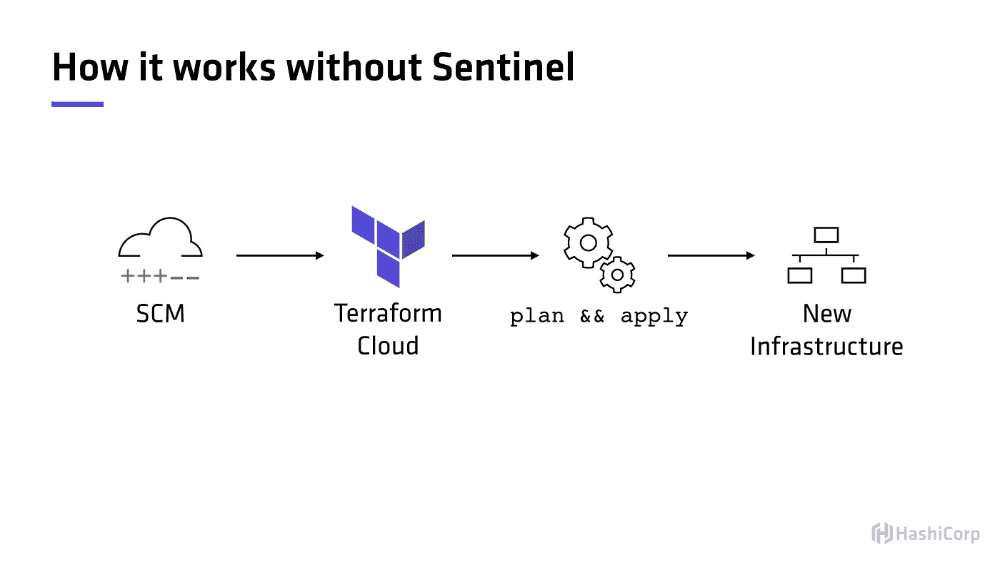

# 作为代码的策略介绍(哨兵)

> 原文：<https://levelup.gitconnected.com/an-introduction-to-policy-as-code-sentinel-4a3d4ec2f5b8>


照片由[詹姆斯·庞德](https://unsplash.com/@jamesponddotco?utm_source=unsplash&utm_medium=referral&utm_content=creditCopyText)在 [Unsplash](https://unsplash.com/s/photos/lego?utm_source=unsplash&utm_medium=referral&utm_content=creditCopyText) 拍摄

[Sentinel](https://www.hashicorp.com/sentinel/) 是 HashiCorp 实施政策代码(PaC)的框架。它与基础设施即代码(IaC)相集成，并允许团队/组织从法规遵从性/风险的角度积极主动。Sentinel 支持精细的、基于逻辑的策略决策，它从外部来源读取信息以得出决策。

简单地说，根据编写的逻辑(策略)，Sentinel 可以根据提供的信息作为决策者。当您想要阻止用户执行特定的动作，或者确保执行某些步骤/动作时，这是非常方便的。例如，一名员工试图部署一个不良做法网络规则，允许互联网上的所有人入站访问！需要指出的是，Sentinel 是一种动态编程语言，具有基于布尔逻辑的类型和处理规则构造的能力。

首先，Sentinel 的实施仅适用于 HashiCorp 企业客户，这也是唯一可用的文档来自 HashiCorp 的原因。它可以与以下 HashiCorp 产品一起使用；地形，金库，执政官和游牧者。然而，非企业用户仍然可以通过利用 [Sentinel 模拟器](https://docs.hashicorp.com/sentinel/downloads.html)来使用 Sentinel。

为了更好地理解 Sentinel，让我们观察一个传统的工作流程。让我们用 [Terraform](https://www.terraform.io/) 作为工作流程的例子。在传统的地形工作流程中，操作员/用户会起草一个配置模板，指定要部署哪些基础设施资源。下一步是发出命令`terraform plan`,以确保所需的资源和基础设施变更符合我们的预期目的。如果在`terraform plan`提供的输出中一切都检查完毕，那么最后一步就是执行`terraform apply`。`terraform apply`命令将实际部署我们的基础设施。此示例工作流适用于 Terraform Enterprise 和 Terraform Cloud ( *自由层*)。要了解两者之间的更多区别，请查看此[链接](https://www.terraform.io/docs/cloud/index.html#about-terraform-cloud-and-terraform-enterprise)。



来源:[https://learn . hashi corp . com/terra form/sentinel/sentinel-intro](https://learn.hashicorp.com/terraform/sentinel/sentinel-intro)

现在，让我们采用相同的工作流程，并将 Sentinel 添加到组合中。哨兵在`terraform plan`之后`terraform apply`之前进场(*见下图*)。


来源:[https://learn . hashi corp . com/terra form/sentinel/sentinel-intro](https://learn.hashicorp.com/terraform/sentinel/sentinel-intro)

假设我们有一个 Sentinel 策略(稍后将详细介绍策略),它阻止用户在没有至少一个标记的情况下将基础架构资源部署到公共云环境。将根据该标记策略来评估`terraform plan`输出。如果资源至少包含一个标记，如策略中所定义的，那么用户被允许执行`terraform apply`。否则，该计划将被拒绝，用户将被迫进行指定的更改，以便该计划通过策略检查。简而言之，Sentinel 阻止用户执行被策略作者视为“未经批准”的操作。传统上，策略作者是平台管理员和/或信息安全人员。

再次重申，Sentinel 仅适用于 Terraform Enterprise！

# 强制执行级别

执行级别有三种不同的风格；建议、软强制和强制。各种实施级别允许管理员/策略作者将策略行为从策略逻辑中分离出来。这意味着我们可以设置一个策略作为警告或通知，在这种情况下，失败仍然允许应用运行。

软强制要求策略通过，否则需要管理员/提升的用户手动覆盖失败的策略评估。如果提供了覆盖，则允许执行应用。

最严格的一关，硬强制，要求有政策才能通过，没有例外。绕过此策略的唯一方法是将其从目标工作区或全局范围中删除。

**策略可应用于选定的工作区和/或全局应用于所有工作区。注意:跳马企业有* [*不同的行为*](https://www.vaultproject.io/docs/enterprise/sentinel/index.html)

# 前哨政策

那么什么是前哨政策，它看起来像什么？啊，很高兴你问了，问得好，我的朋友！让我们来看一个概念性的例子(不是真实的)。

```
import "time"
import "temperature"# This is the first rule.
time_rule = rule { time is after 6pm and before 9pm } # This is the second rule.
temperature_check = rule { temperature is >= 71 degrees }# the main rule that combines both of them.
main = rule { time_rule and temperature_check}
```

我们有两个规则，每个规则的计算结果要么是`true`要么是`false`。虽然这个例子不太现实，但是这里的目标是解释这个概念。为了让这项政策通过，下列事情必须是真的。

**假设时间和温度值由 Sentinel 读取并可用。*

1.晚于下午 6 点，晚于晚上 9 点。

2.内部温度必须大于或等于 71 度。

如果这两个都是`true`，那么政策就会通过。如果它们中的任何一个成为`false` ，那么该策略将失败，并且不允许用户继续。

好吧，让我们更现实一点，观察下面的例子。

```
day = "wednesday"  # This is a variabletwo_greater  = rule { 2 > 1 } # This is a ruleis_wednesday = rule { day is "wednesday" } # This is also a rulemain = rule { two_greater and is_wednesday } # This is the main rule
```

哨兵是关于规则的！规则可以是`true`或`false`，最终都归结为一个布尔值。在上面的例子中，我们有两条规则；`two_greater`和`is_wednesday`。

`two_greater`规则评估数字`2`是否大于`1`。因为这是一个真实的语句，所以我们可以有把握地假设这个语句的计算结果为`true`。下一个规则`is_wednesday`，检查被赋值为`wednesday`的变量`day`是否等于字符串`wednesday`。这也是真的，所以我们可以再次假设语句的计算结果为`true`。

每个 Sentinel 策略都需要一个主规则，根据主规则的评估结果，当根据工作流输出进行评估时，主规则将决定策略的结果，例如`terraform plan`。

因此，如果我们看看我们的主规则，`main = rule { two_greater and is_wednesday }`，我们可以看到它检查定义的两个规则`two_greater`和`is_wednesday`是否都是`true`。因为两个规则都产生`true`并且我们使用了布尔比较操作符`and`，因此主规则将产生`true`。

本质上，我们将策略逻辑分解成两个独立的规则，并在主规则语句中比较这两个规则。我们不需要以这种方式打破我们的逻辑，我们可以在一个规则中完成同样的逻辑。然而，将逻辑分解成它们自己的规则，而不是编写一个单一的规则，这被认为是最佳实践——而且看起来更容易。后者在复杂的政策中更加明显。

```
day = "wednesday" main = rule { 2 > 1 and day is "wednesday" } 
```

# 真实世界政策

还记得前面要求资源至少有一个标记的示例策略吗？好吧，让我们来看看这个政策会是什么样子。下面是 AWS 的一个哨兵策略，它要求所有 EC2 实例至少有一个标记。

```
import "tfplan" 

main = rule {
  all tfplan.resources.aws_instance as _, instances {
    all instances as _, r {
      (length(r.applied.tags) else 0) > 0
    }
  }
}
```

让我们把政策分解一下。第一行允许我们读入一个`terraform plan`的输出。import 语句指定在运行时读入什么外部数据或包含什么库。然后我们进入主要规则，这里发生了一些事情:

1.  我们想从 tfplan 中读取所有 aws_instances 的**所有**(列表)，下面的键标为 _，值表示为 *instances* 。
2.  列表变量*的所有实例实例*，作为键标为 _，值为 *r* 。
3.  我们使用[长度函数](https://docs.hashicorp.com/sentinel/language/funcs/length)，调用元素的属性`applied.tags`，并确保它大于零。

如果我们看到一个与实际导入的对象( *tfplan 文件*)非常相似的 JSON 对象，并且应用了 Sentinel 逻辑，那么这是有意义的。我添加了一些注释来帮助理解上面的逻辑。

* *如果你熟悉 terraform statefiles，那也是差不多的模式。*

```
import "strings"_modules = {
 "root": {
  "data": {},
  "path": [],
  "resources": { 
   "aws_instance": {  // This is where the first **all** starts
    "demo_instance": {   // This where the second **all** starts
     0: {                // This is where the **r** object begins
      "applied": {
       "ami": "ami-123456789",  
       "associate_public_ip_address":  true,   
       "availability_zone":   "us-east-1a",
        ......
        "tags": {
        "Name": "aws-sentinel",
        "env":  "dev",
       },
........
```

提示:如果您是 Terraform Enterprise 客户，请使用运行中的“下载 Sentinel 模拟”来获取实际的模拟数据！这在为哨兵策略编写测试用例时非常有用。


来源:[https://www.terraform.io/docs/cloud/sentinel/mock.html](https://www.terraform.io/docs/cloud/sentinel/mock.html)

那么下一步是什么？为了验证 Sentinel 策略是否编写正确，以及出于测试目的，我们可以利用 Sentinel CLI 工具。在本文中，我们不会深入到策略测试中，我们将在以后的时间里讨论这个问题。但是为了准备下一篇文章，让我们安装 Sentinel 模拟器。

# 安装 Sentinel 模拟器

启动并运行模拟器非常简单。[下载](https://docs.hashicorp.com/sentinel/downloads.html)适用于您的操作系统的正确二进制文件，并解压缩文件夹。在压缩的文件夹中，你会找到一个二进制文件。与所有其他 HashiCorp 产品一样，只需要一个二进制文件就可以运行，只需将二进制文件放在用户/系统路径中，就可以开始使用 Sentinel 模拟器了。

如果您在这一步遇到困难，那么只需将二进制文件放在您的工作文件夹中，然后从那里继续。查找 YouTube 视频，了解如何在您的操作系统上更改 PATH 环境变量([Linux](https://www.youtube.com/watch?v=Y6_7xaxkPik)/[Windows](https://www.youtube.com/watch?v=bEroNNzqlF4))。

通过发出`sentinel version`验证 Sentinel 模拟器是否设置正确，如果设置正确，您将收到指示模拟器版本的输出。

```
sentinel versionC:\Users\Karl>sentinel version
Sentinel Simulator v0.12.0
```

# 结论

我们对哨兵是什么以及如何使用它还只是皮毛。希望这篇文章有助于通过 Sentinel 填补一些与策略代码相关的知识空白。还有很多东西需要学习，比如语言语法、编写函数、复杂的策略、测试、将 Sentinel 与 VCS 集成、通过 Terraform 上传 Sentinel 策略和集合等等。敬请关注更多文章，我们将继续深入哨兵的世界。