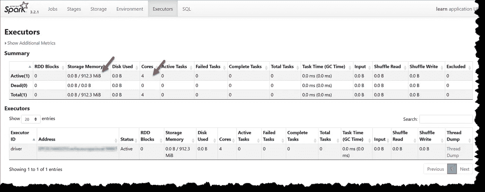

# PySpark 优化、物理规划和缓存简介

> 原文：<https://levelup.gitconnected.com/an-introduction-to-pyspark-optimisation-physical-plan-and-caching-ea98edfaa52a>

## 不小心缓存会弊大于利！

加里·穆勒曼斯在 Unsplash[上的照片](https://unsplash.com?utm_source=medium&utm_medium=referral)

本文的目的是快速介绍 PySpark 查询优化和物理规划。通过使用一个简单的示例，我们研究了物理规划，以及缓存或使用检查点对其有何影响。本文不会让您成为专家，但对于不太熟悉 Spark 中数据处理这一关键方面的读者来说，它可以作为一个起点。如果你已经了解了基本原理，那么在 Medium 中有许多优秀的文章，如[这篇](https://medium.com/plumbersofdatascience/this-spark-code-is-slower-than-a-snail-lets-optimize-it-dbe6736c784d)。

这些示例已经在本地部署的 Spark 环境(版本 3.2.1)上运行。spark 会话是用创建的

分配了 2gb(即 2 吉字节，即 2 ⁰字节)的 RAM 和 4 个内核。我们还设置了一个保存检查点信息的目录。我们可以在 Spark UI 中看到(localhost:4040)

图 Spark 用户界面中的 Executors 选项卡(localhost:4040)

从 2gb 的内存中，我们可以获得大约 900 MiB 的操作和存储内存。操作存储器用于数据转换，存储存储器用于数据。默认情况下，操作存储器和存储存储器之间的分割是相等的(这可以通过`spark.memory.storageFraction)`改变)。这对于我们的数值实验来说是足够的内存，以确保不会溢出到磁盘。

起始数据集由 pandas 和 numpy 生成，有 100 000 行。创建后，我们将其转换为 PySpark 数据帧，并复制 100 次。这给了我们 1000 万行，足够计算几秒钟。

Spark 数据帧完全缓存在内存中，大约消耗 100 MiB

图 2:缓存在内存中的起始数据帧

这意味着从现在起，所有操作都将起始数据帧存储在内存中，即不会重复任何联合操作。数据框有一个称为 group 的字符串列和一个称为 value 的双列，前者包含五个值，后者包含范围在[0.0，10.0]内的均匀随机数。

**实验 1:查看聚合操作的物理计划**

第一个数值实验使用字符串列进行分组，并计算第二列的平均值

我们用`%timeit -r10 sol1(show=False)`对执行进行计时，以获得每个循环 3.71 秒 199 毫秒(平均标准时间。戴夫。10 次运行，每次 1 个循环)。请注意，数据转换写得很差，是为了戏弄 Spark。第二个筛选器适用于分组变量，因此应该在聚合之前指定它。对于基准测试来说，`res.count()`函数通常是一个很好的选择，因为与`res.show()`函数相比，它执行整个转换，而`res.count()`函数可能只是(巧妙地)将转换调整到所需的程度。

如果我们用`sol1()`再次执行该功能，以查看物理平面图和我们获得的输出

查看物理平面图，并以通常的方式自下而上阅读，我们看到 Spark 非常聪明。这两个过滤器合并在一起，并在汇总前应用。事实上，Spark 在交换之前执行了预聚合，通过交换预聚合的分区而不是整个数据集来节省时间。这太棒了，显示了 Spark 在幕后做了多少工作。

**实验 2:使用检查点的效果**

如果我们在中间挤一个[检查点](https://spark.apache.org/docs/3.1.1/api/python/reference/api/pyspark.sql.DataFrame.checkpoint.html)会怎么样？让我们尝试使用

并使用`%timeit -r10 sol2(show=False)`计时，以获得每个循环 4.91 秒 127 毫秒(平均标准时间。戴夫。10 次运行，每次 1 个循环)。与第一个数值实验相比，执行时间增加了大约 30%。产生的数据帧当然是相同的，但是物理平面图(现在是两个)发生了变化

检查点的作用是将逻辑计划一分为二。现在，第二个过滤发生在交换之后，这导致了更长的执行时间。检查点在迭代算法中很有用，也需要使用，但是需要小心。我们正在试验优化器，我们应该有一个很好的理由这样做。

**实验 3:缓存的效果**

在第三个也是最后一个数值实验中，我们看到了中间数据帧的缓存如何影响执行时间。在这样做之前，我们先看看使用函数`sol1()`的修改版本进行缓存和清除缓存需要多少时间

输出再次不受影响。物理计划也与第一个数值实验中的相同，因为我们在有机会使用缓存之前清空了它。用`%timeit -r10 sol1_cache_overhead(show=False)`获得的执行时间也非常相似，每循环 3.86 秒 138 毫秒(平均标准时间。戴夫。10 次运行，每次 1 个循环)。由此我们可以得出结论，这种情况下的缓存成本可以忽略不计，因为缓存发生在聚合之后，这是可以理解的。现在让我们看看当我们真正使用缓存时会发生什么

用`%timeit -r10 sol3(show=False)`对执行进行计时，得出每个循环 5.77 秒 279 毫秒(平均标准时间。戴夫。10 次运行，每次 1 个循环)，即，与第一个数值实验相比，我们看到执行时间增加。查看物理规划，我们再次看到，两个过滤器没有合并在一起，因为缓存阻止了优化器使用这个选项

缓存可能比扰乱优化器有更多的不利影响。与再次计算缓存的数据帧相比，这会占用内存资源，最终可能会导致更长的执行时间。当数据框需要多次使用时，缓存会非常有用，在使用 REPL 进行实验时经常会出现这种情况。第二个用例是当训练机器学习模型时，在这种情况下，需要重复使用训练集。

Spark 应用程序的性能调优是一个高级主题。Spark 优化了数据处理流程，通常开箱即用。对于大多数用户来说，干预可能是有害的。作为一名数据分析师，我不是很有经验，如果我在查询数据库时需要使用优化器提示，我会像通常一样寻求数据工程师的建议。