# 使用 statsmodels 和 scikit-learn 介绍 Python 中的回归

> 原文：<https://levelup.gitconnected.com/an-introduction-to-regression-in-python-with-statsmodels-and-scikit-learn-9f75c748f56e>


瑞安·塞尔在 [Unsplash](https://unsplash.com?utm_source=medium&utm_medium=referral) 上的照片

# 介绍

我第一次用 Python 探索回归时，一头扎进了 [*scikit-learn*](https://scikit-learn.org/stable/) ，这是一个为开发预测模型提供了许多有用工具的包。我运行了一个简单的线性回归模型，并输出了截距、系数和模型拟合指标。作为 Python 的新手，我的背景主要是统计推断，还没有完全掌握统计学和数据科学之间的区别，于是我花了大量时间寻找输出回归权重的标准误差、置信区间和 p 值的方法。

在我搜索多个来源的信息时，我得到了一致的回应:使用 [*statsmodels*](https://www.statsmodels.org/stable/index.html) 包进行统计假设检验。果然，当使用来自 *statsmodels* 的适当工具运行我的模型时，我能够看到回归权重以及相关的标准误差、置信区间和 p 值。哎呀！在看到结果的兴奋中，我忽略了文档中显示截距需要显式添加到 *statsmodels* 中的模型的部分。

回想起这段经历，我决定写这篇文章来概述一下 *statsmodels* 和 *scikit-learn、*以及作为的一些“我希望我开始时就知道的事情”的帖子。

# statsmodels 和 scikit 概述-学习

*statsmodels* 被描述为“一个 Python 模块，它为许多不同的统计模型的估计，以及进行统计测试和统计数据探索提供了类和函数。”scikit-learn 提供了“简单高效的预测数据分析工具”从这些描述中可以明显看出， *statsmodels* 和 *scikit-learn* 旨在满足不同的需求。 *statsmodels* 更强调统计推断和统计假设检验，而 *scikit-learn* 非常适合预测未观测值是关键的项目。

# 数据

这篇文章中的所有例子都使用了皮马印第安人的糖尿病数据，可以从这里下载。该数据来自一个更大的数据集合，最初由[国家糖尿病、消化和肾脏疾病研究所](https://www.niddk.nih.gov/)收集，并提供了 768 名 21 岁或以上皮马印第安血统女性的诊断数据。请注意，本文中的分析旨在说明使用 Python 进行线性回归建模的不同方法，不应用于得出生物医学病理学的实质性结论。

让我们通过导入 *pandas* 库并加载数据来开始编码过程。出于本文的目的，为了简单起见，我们只保留列`Age` 和`Glucose`。

如果您正在执行本文中显示的分析，您需要将数据下载到当前工作目录中名为`data`的子目录中，或者在上面的代码块中更改 CSV 文件的路径。

`Age` 栏提供了每个参与者的年龄，以年为单位。`Glucose` 是通过口服葡萄糖耐量试验测量每个参与者在 2 小时时的血浆葡萄糖浓度。在目前的分析中，我们将使用年龄来预测参与者的血糖浓度。

运行`diab.head()`可以显示前五行数据。

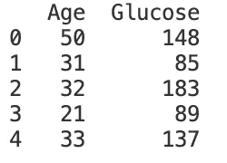

让我们也来看看每个带有`diab.describe()`的列的汇总统计数据。

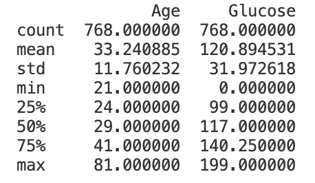

请注意，最小葡萄糖浓度为零。如果你更深入地研究这个数据，你会发现有五个葡萄糖值为零；下一个最小值是 44。让我们假设这些零值应被视为缺失数据，并将其从分析中排除。

```
diab = diab.loc[diab["Glucose"] != 0, :]
```

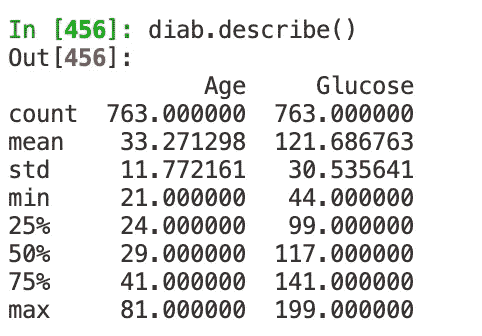

到目前为止，一切顺利。

# 探索性数据分析

我们先来看看年龄和血糖的相关性。

```
diab[["Age", "Glucose"]].corr()
```

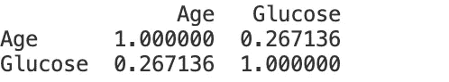

年龄和葡萄糖浓度之间的相关性为 0.27，表明适度的正相关关系。这意味着，平均而言，相对于年轻参与者，年长参与者往往具有更高的葡萄糖浓度。我们可以用散点图来显示这种关系，以便更好地了解年龄和血糖水平之间的关系。

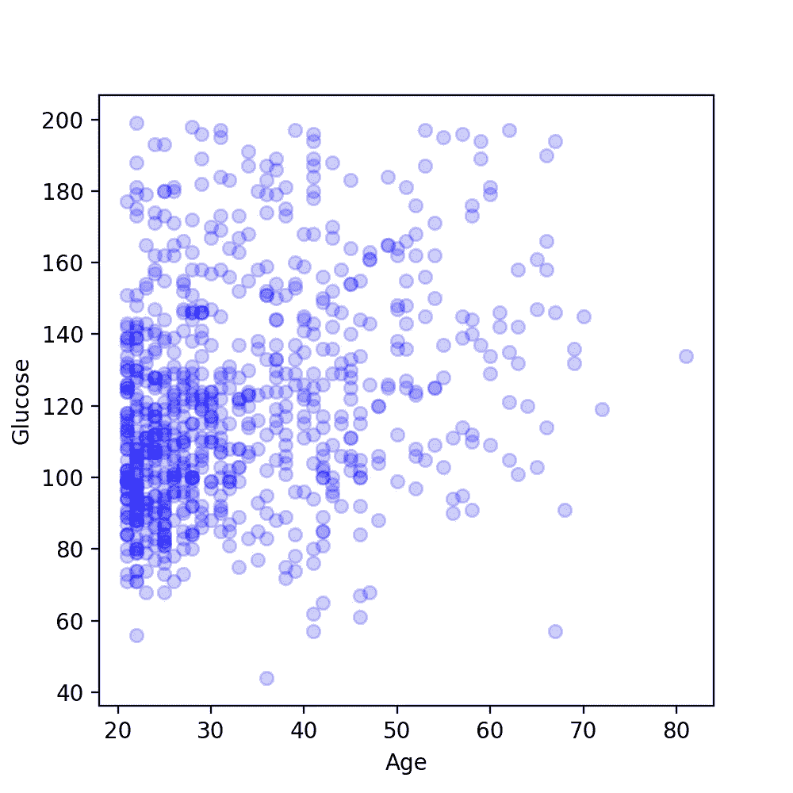

该散点图显示了随着年龄的增长，血糖水平略微升高的趋势。为了更简洁地说明年龄和葡萄糖之间的关系，我们可以通过散点图中的数据点拟合一条直线，该直线最好地最小化所述直线和各个数据点之间的距离。我们将使用线性回归模型生成这条线。

**线性回归**

现在简单介绍一下线性回归模型的背景。假设我们有一些数据，在这些数据中我们有一个我们有兴趣预测的结果，让我们称之为 *Y* 。我们还有另一个变量，我们称之为 *x* ，我们想用它来预测 *Y* 。线性模型公式可以写成如下形式。

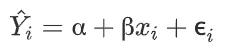

等号左边的项是我们对每个单独观察的感兴趣结果的预测值(用下标字母 *i* 表示)。 *Y* 上的脱字符号或“帽子”仅仅意味着由相应项表示的值是根据该项右边的等式计算的预测值(与实际观察值相反)。α代表截距，它是当预测值 *x，*的值为零时 *Y* 的预测值。β是回归权重，可以解释为 *Y* 的预测变化，其中 *x* 增加一个单位。当预测的结果值被绘制时，它们可以被连接形成一条直线。让我们看看一个线性函数的例子，以便更好地理解。

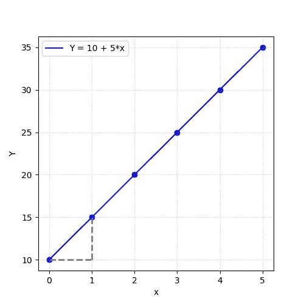

上面画出了函数 **Y=10 + 5*x** 。直线连接的蓝点代表 *Y* 在 *x* 不同值时的预测值。我们的截距(α)是 **10** 。这意味着当 *x* 的值为零时， *Y* 的预测值为 10。我们的回归权重(β)是 5。图左下方的灰色虚线有助于说明回归权重的作用。随着 *x* 的值从 0 变到 1(即，我们从左向右水平移动一个空格)，预测值 *Y* 增加 5。因此，当 *x* 等于 1 时， *Y* 的预测值为 **15** ，因为 **10 + 5*1 = 15** 。或者说，当 *x* 等于 3 时， *Y* 的预测值为 **25，**因为 **10 + 5*3 = 25** 。

等式中的最后一项ϵ是残差，它是单个观察结果值与观察的相关预测结果之间的差值。

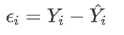

下图显示了通过一组 10 个生成的数据点绘制的回归线。每个数据点和回归线之间的垂直线是残差的直观表示。

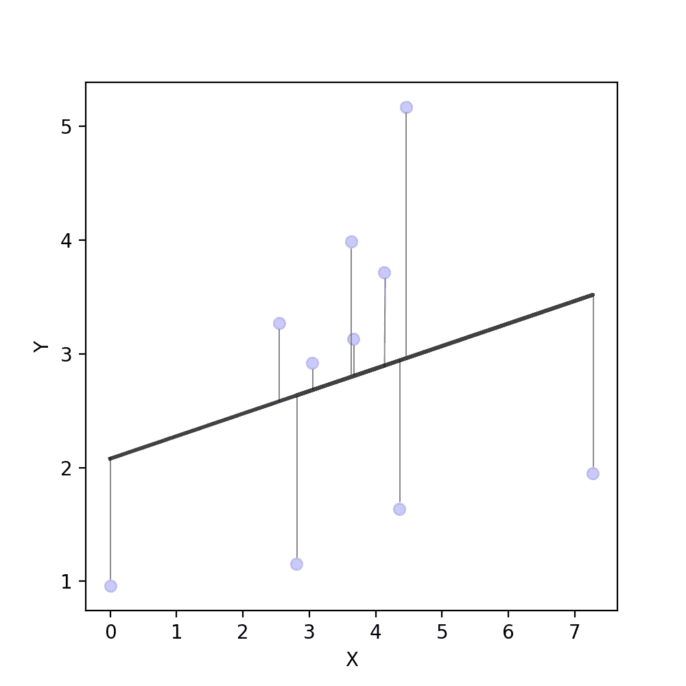

在拟合线性回归模型时，我们希望最小化观察到的结果和预测的结果之间的距离，从而生成一个可以生成尽可能接近实际结果值的预测值的模型。在实践中，通常通过检查基于残差平方和的度量来评估模型与数据点的拟合程度，例如残差平方和的平均值( [*均方误差*](https://scikit-learn.org/stable/modules/generated/sklearn.metrics.mean_squared_error.html) 或 [R](https://scikit-learn.org/stable/modules/generated/sklearn.metrics.r2_score.html) )。通过对残差求平方，在给定值 *x* 下，与预测结果具有相同绝对距离的正负残差值不会相互抵消。事实上，线性回归通常被称为*普通最小二乘(OLS)* ，反映了对最小化回归直线的平方偏差的重视。

请注意，这里没有讨论线性回归模型的几个基本假设。如果您对使用线性回归模型得出有实质意义的解释感兴趣，我建议您评估您的数据满足这些假设的程度。这个建议已经过时了，现在让我们继续来看看使用 *statsmodels* 进行回归。

# 统计模型

让我们从用`import statsmodels.api as sm` 导入 *statsmodels* 开始。`statsmodels.api`有一个`OLS`类，允许用户运行线性回归模型。在我们继续之前，回想一下上一节，截距表示预测值为 0 时结果的预测值。然而，在我们的数据中，最小年龄值是 21。

为了确保我们模型的截距值有助于解释与观察到的数据一致，通过从每个年龄值中减去最小值 21 来重新编码年龄是一个好主意。否则，截距值将外推至年龄为零时的观测值，这在该数据集中不存在(但无论是否从每个观测年龄值中减去最小值，回归权重和模型拟合度量都将相同)。

```
diab["Age"] = diab["Age"] - diab["Age"].min()
```

下面的代码创建了一个名为`smOLS`的线性回归模型，将葡萄糖浓度作为结果，年龄作为预测值。

```
smOLS = sm.OLS(diab["Glucose"], diab["Age"])
```

`smOLS`只包含我们模型的结构信息。因此，如果您在 Python shell 或 Jupyter notebook 单元中运行`smOLS`，您将得到以下输出:`<statsmodels.regression.linear_model.OLS at 0x1a27daa990>` 。在这一点上，我们仍然需要使模型符合我们的数据，这可以通过将`fit`方法应用于`sm.OLS`来实现。所以，让我们用拟合的模型覆盖`smOLS`。

```
smOLS = sm.OLS(diab["Glucose"], diab["Age"]).fit()
```

即使在使用了`fit`之后，运行`smOLS`本身仍然不会提供任何输出。要查看拟合模型的完整结果，我们可以使用`smOLS`上的`summary`。

```
smOLS.summary()
```

终于有结果了！

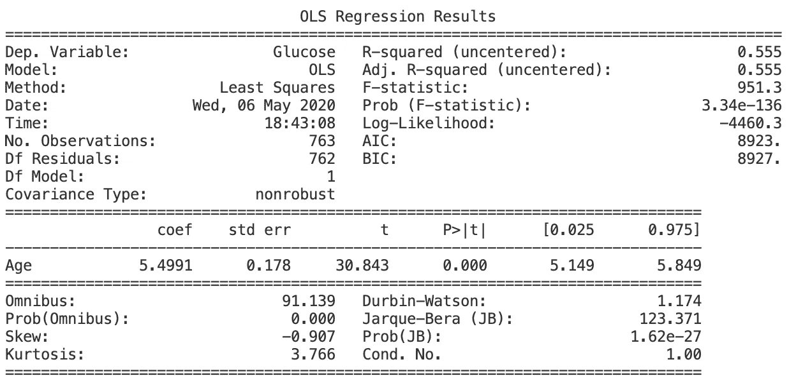

这里发生了很多事情，所以我只想关注几个输出。首先，`R-squared (uncentered)`的值为 0.555。如果我们将 R 解释为我们的模型所解释的结果中方差的比例，这个值告诉我们，我们的模型——只有一个自变量——解释了血糖水平方差的大约 56%。我们一会儿将回到这一点。其次，`Age`行中`coef`列下的值 5.4991 为我们的预测因子年龄提供了回归权重。我们可以将该值解释为年龄每增加一年，预测的葡萄糖浓度增加大约 5.50。因此，年龄比最小年龄高一岁(即 22 岁)的参与者预期具有比最小年龄(即 21 岁)的参与者高约 5.50 个单位的葡萄糖浓度。

`std err`、`P>|t|`、`0.025`和`0.975`列分别提供标准误差、p 值、95%置信区间的下限和 95%置信区间的上限。p 值 0.000 告诉我们，在常规显著性水平下，年龄对葡萄糖的影响具有统计学显著性(统计学显著性也是显而易见的，因为 95%置信区间没有过零)。我们不久将更详细地考虑统计显著性的概念。

注意 *statsmodels* 也提供了查看特定输出片段的方法。例如，如果我们只想从我们的模型中看到回归权重系数，我们将运行`smOLS.param`。运行`dir(smOLS)`提供了`smOLS`可用的所有特定结果的列表。

现在有了适合数据的模型，我们可以使用`predict`在观察值的散点图上绘制模型的回归线。

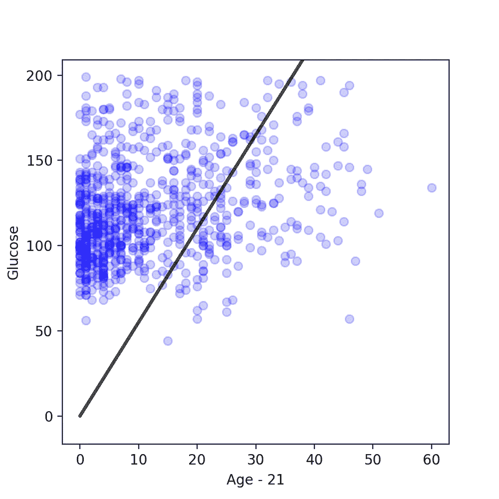

查看输出和图，您可能会注意到我们的模型不包括截距项。这是因为`OLS`默认排除了拦截。要添加截距，我们可以重写我们的模型，用`add_constant`显式地将截距添加到预测器中。

这是包含截距的输出。

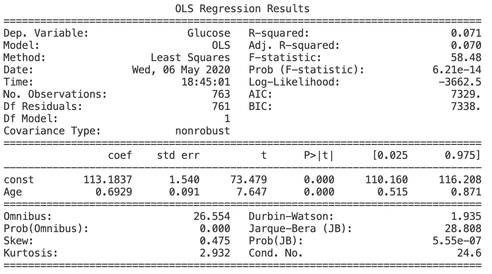

此输出中的 R 值为 0.071，远小于模型中的 R 值 0.555(不包括截距)。这里的教训是，当截距从线性回归模型中排除时，R 被人为地夸大了(这里的[很好地解释了为什么会发生这种情况)。](https://stats.idre.ucla.edu/other/mult-pkg/faq/general/faq-why-are-r2-and-f-so-large-for-models-without-a-constant/)

转到输出的中间，我们现在有了一组额外的结果。也就是标记为`const`的行，它提供了截取的结果。`const`的`coef`值 113.1837 意味着在最小年龄值时，从该模型预测的葡萄糖浓度值大约为 113。`Age`的`coef`值 0.6929 意味着年龄每增加一岁，葡萄糖浓度预计会增加 0.6929。我们可以将来自 *statsmodels* 输出的截距和回归权重估计值插入到幸福的预测方程中。

**葡萄糖= 113.1837+ 0.6929*(年龄-21)**

基于这个公式，例如，31 岁的参与者被预测具有大约 120 的葡萄糖浓度。

**120.1127 = 113.1837+0.6929 *(31–21)**

现在让我们来看看有截距和没有截距的回归线图。

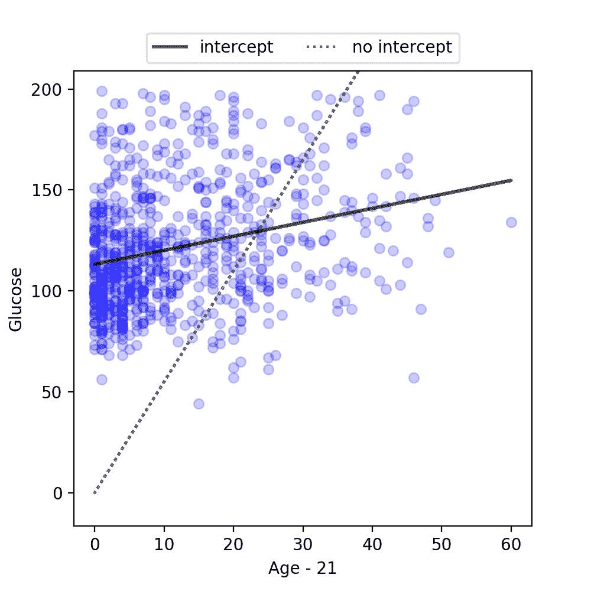

来自具有截距的模型的预测线由实线表示，虚线绘出来自没有截距的模型的预测线。包括截距在内，最小年龄时的预测葡萄糖水平约为 113；如果没有截距，预测的葡萄糖水平在相同的年龄为零。这两条线也清楚地说明了年龄的不同回归权重。包括截距时，权重为 0.6929，但不包括截距时，回归权重为 5.4991。因此，当包含截距时，预测线的斜率不像没有截距时那样陡。

回到`smOLS_int.summary()`的输出，`Age`的 p 值仍然小于 0.001，表明年龄对葡萄糖的影响具有统计学意义。这一具有统计学意义的结果告诉我们，如果年龄确实对样本人群中的葡萄糖没有影响，那么我们不可能观察到年龄对葡萄糖的影响至少与我们样本中观察到的影响一样大。换句话说，基于我们的研究结果，如果年龄和血糖在我们感兴趣的人群中实际上是不相关的，这将是非常令人惊讶的。因此，我们可以确信，观察到的年龄对葡萄糖的影响不仅仅是我们所拥有的特定样本的人为产物。

# sci kit-学习

在 *scikit 上-学习*。我们将从 scikit-learn 中的`linear_model`模块导入`LinearRegression`类开始。

```
from sklearn.linear_model import LinearRegression
```

鉴于结果和预测值在`sm.OLS`中被指定为参数，在 *scikit-learn* 中，结果和预测值需要在`fit`中指定。需要注意的重要一点是，`LinearRegression`默认包含截距，因此我们将能够从符合`LinearRegression`的模型中获得截距值，而无需任何额外的工作。

现在，让我们用下面的代码给`sklOLS`分配一个合适的模型，看看会发生什么。

```
sklOLS = LinearRegression().fit(diab["Age"], diab["Glucose"])
```

啊哦！我们得到一个错误。

```
ValueError: Expected 2D array, got 1D array instead:
```

在此错误消息的底部，我们看到以下内容。

```
Reshape your data either using array.reshape(-1, 1) if your data has a single feature or array.reshape(1, -1) if it contains a single sample.
```

scikit-learn 中的线性回归模型期望我们的预测值包含在一个二维数组中。如果我们用`diab["Age"].shape` 检查`Age`的形状，我们就能发现问题。

```
(763,)
```

这个输出告诉我们`diab["Age"]`有 763 行没有列，但是我们需要 763 行和一列。解决方案是将`diab["Age"]`转换成一个二维 *NumPy* 数组。

```
X = diab["Age"].to_numpy().reshape(-1, 1)
```

在`reshape(-1, 1)`中，值-1 意味着将从输入中推断行数。值 1 指定生成的形状必须有一列。让我们用`X.shape`来看看`X`的形状

```
(763, 1)
```

酷豆。763 行和一列；现在我们可以重试运行我们的线性回归模型。

```
sklOLS = LinearRegression().fit(X, diab["Glucose"])
```

成功！然而，我们无法像在 *statsmodels* 和`summary`中那样获得详细输出的完整表格。要查看截距、权重和 R 的值，我们需要分别使用`intercept_`、`coef`和`score`。

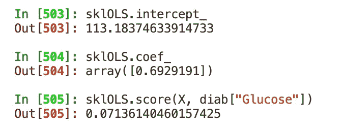

`skOLS.intercept_`给我们的值是 113.1837 ，`skOLS.coef_`返回 0.6929，这两个值都与 *statsmodels* 结果`smOLS_int`中的截距和系数值一致。`score`返回值 0.0714，这也与我们之前从 *statsmodels* 获得的结果一致。

如前所述， *scikit-learn* 面向预测，因此 *scikit-learn* 中建模的最终目标很可能是为新数据点生成预测。该任务可以使用`predict`完成。回到我们之前预测 31 岁个体的葡萄糖水平的例子，当输入值为 10 时，我们可以使用`predict`来生成预测(记住，我们需要减去最小年龄值 21)。确保首先用`import numpy as np`导入 *NumPy* 来重新创建我在下面用`np.array`创建的数组。

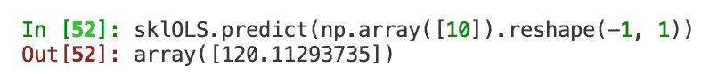

如果我们想预测多个值，我们可以在数组中包含更多的值。

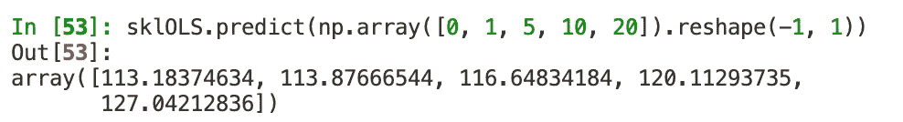

请注意，我将数组重新整形为二维数组，因为我们的 *scikit-learn* 模型仍然期望任何输入都有两行和至少一列。

## 培训和测试数据

如果我们的目标是使用 *scikit-learn* 开发高质量的预测，那么我们可以通过评估模型在从未遇到过的数据上的表现来评估我们的模型的预测能力。例如，对于当前的情况，假设我们想要评估我们的模型能够多好地预测 PIMA 遗传的成年女性的葡萄糖浓度。

在这里，我们可以将可用数据随机分为训练和测试数据集，以评估我们的模型的预测性能。训练数据是我们用来寻找实际回归公式的数据的子集。然后，可以将该公式应用于测试数据，我们可以检查得到的 R，以了解模型在未用于训练模型的数据上的表现。因此，测试数据作为观察到年龄而未观察到葡萄糖的新数据点的代理。

我们的原始数据可以通过 *scikit-learn* 中的`train_test_split`函数方便地分成训练集和测试集。以下代码使用`train_test_split`返回以下内容:一个名为`X_train`的预测值训练数据集，一个名为`X_test`的预测值测试数据集，以及分别名为`y_train`和`y_test`的结果值训练和测试数据集。

所示示例将原始数据的 80%采样到训练集中，20%采样到测试集中。如果我们想要一个不同的分割，比如说 10%进入测试集，我们可以将`test_size`参数的值从 0.2 更改为 0.1。`random_state`参数为`train_test_split`中使用的随机发生器设置种子。如果您为随机种子设置不同的数字，您将获得不同的结果，因为`train_test_split`将随机抽取不同的值到训练集和测试集中。

让我们对训练数据拟合线性回归模型，并评估得到的 R。

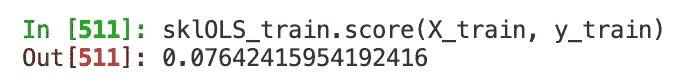

我们得到 R 为 0.0764。但是这个模型在测试数据上表现如何呢？我们可以通过对测试数据运行`sklOLS_train.score`来找出答案。

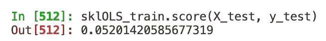

发生了什么事？来自训练数据的 R 不是很大，但是来自测试数据的 R 甚至更小。这是一种过度拟合的情况，意味着模型在新数据上的表现不如在用于拟合模型的数据上的表现。这并不奇怪。我们拥有的模型是一个过程的结果，该过程旨在为训练数据中的观察值提供最佳预测，因此我们可以预计该模型不会很好地适合它以前从未“见过”的数据。虽然超出了本文的范围，但值得注意的是，有一些方法可以减少过度拟合，从而提高模型的泛化能力。例如，重采样技术，如[*k*-折叠交叉验证](https://scikit-learn.org/stable/modules/cross_validation.html#cross-validation)，可以用作模型评估过程的一部分。当然，我们还想看看是否可以在训练和测试数据中获得更高的 R，也许是通过在模型中包括更多的预测因子和/或拟合不同类型的模型。

# 结论

statsmodels 和 *scikit-learn* 都是非常有用的软件包，但是每一个都更适合不同的任务。 *statsmodels* 为统计假设测试提供了便利的工具，而 *scikit-learn* 提供的功能则面向生成能够做出有用预测的模型。因此，选择使用一个包还是另一个包应该由给定项目的需求来决定。我希望这篇文章对你有所帮助，如果你处在我的位置，也就是刚刚开始数据科学和 Python 编程之旅，我特别希望这篇文章有助于让你的旅程更加顺利。

感谢你阅读这篇文章。如果你喜欢这篇文章，请跟我来，期待更多的文章即将到来。如果你不喜欢这篇文章…请跟我来，期待更多的文章即将到来。

本文中的例子假设您对 Python 的基本概念有所了解。

简介-stats 模型。(未注明)。检索于 2020 年 3 月 1 日，来自[https://www.statsmodels.org/stable/index.html](https://www.statsmodels.org/stable/index.html)

sci kit-learn:Python 中的机器学习。(未注明)。检索于 2020 年 3 月 1 日，来自[https://scikit-learn.org/stable/](https://scikit-learn.org/stable/)