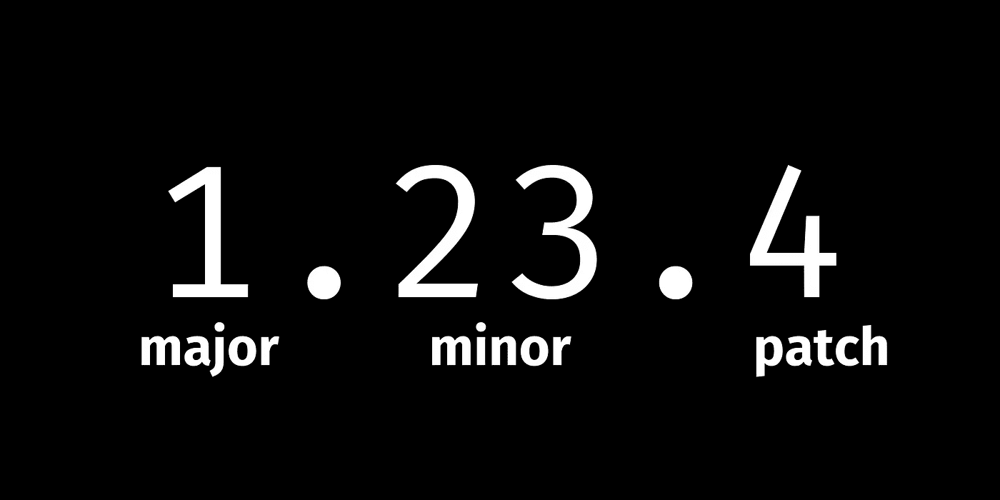

# 语义版本控制简介

> 原文：<https://levelup.gitconnected.com/an-introduction-to-semantic-versioning-6e33ed841165>

语义版本化是一个帮助开发者、项目经理和消费者理解发布过程的通用方法的系统。语义版本化是一些指导方针，以便我们能够理解在一个版本中发生了什么。

带有相关标签(主要、次要和修补程序)的版本号 1.23.4 的示例。

对我们编码人员来说更重要的是，语义版本控制将让我们知道一个变化是否会破坏我们的代码。

你会在 GitHub 上找到大多数使用语义版本控制的主要项目。

## **主要版本**

当我们增加这个版本时，意味着在这个版本中有向后不兼容的变化。API 已经更改，可能包含针对 API 用户的重大更改。

主版本号增加后，重置次版本和补丁版本。

如果我们正在为`1.23.11`做一个主要的发布，它会变成`2.0.0`。

## **次要版本**

当添加新的特性或功能时，我们会增加次要版本，而不会破坏或更改现有的 API。当您增加次要版本时，请将修补程序版本重置为零。

当您正在进行非 bug 修复的不间断更改时，请使用此选项。

如果我们为`1.23.11`做一个小版本，它会变成`1.24.0`。

## **补丁版本**

补丁版本用于错误修复。这是指更新中没有功能变化的情况。这些数字没有限制，我们不需要重置任何其他数字。

如果我们为`1.23.11`做一个补丁发布，它会变成`1.23.12`。

## **预发布和构建**

我们不会深入研究这种语法，因为有许多不同的方法来使用它，并保证有一篇自己的文章，但我确实希望您知道如何阅读预发布版本。但主要是当我们希望非正式地向一些用户发布软件以进行测试时使用。这些被称为预发布。

预发行版可能不稳定，或者与它们暗示的以前的主要版本、次要版本和修补程序版本不兼容。

例如，`1.23.11-beta.1`，我们的预发布标识符有两个部分。标签“beta”和版本“1”。您可能还会看到一些附加的构建数据，比如构建所来自的提交，例如`1.23.11-beta.1+nialljoemaher-2bf235`。

为了更深入，我在下面添加了几个链接，链接到一些帮助我理解预发布标记的精彩文章。

官方语义版本指南—[https://semver.org/](https://semver.org/)

更详细的指南和精彩的文章—[https://developer experience . io/practices/semantic-versioning](https://developerexperience.io/practices/semantic-versioning)

另一个我做研究时喜欢的地方是 https://devopedia.org/semantic-versioning

编码快乐！💜