# 无服务器 AWS lambda 函数简介

> 原文：<https://levelup.gitconnected.com/an-introduction-to-serverless-aws-lambda-functions-f2397e4e269e>

了解如何使用 Lambda 函数创建和部署 Node.js APIs，并从 React 应用程序访问它。


约翰·施诺布里奇在 [Unsplash](https://unsplash.com?utm_source=medium&utm_medium=referral) 上拍摄的照片

AWS Lambda 函数非常强大。它们允许我们快速实现后端功能，而无需实际创建后端服务器。通过这种方式，他们提供了无服务器架构。

Lambda 函数为运行随需应变的服务器端代码打开了一个可能性的世界，而不必运行专用的服务器。

如果我们创建一个后端服务器，那么它将一直监听请求，但是在 lambda 函数的情况下，它们只在新请求到来时被调用，从而节省资源和成本。

Lambda 函数在各种场景中都很有用，比如从数据库中访问数据、发送电子邮件等。

在本文中，我们将探讨如何创建它们，以及在将应用程序推向生产之前如何在本地环境中测试它们。

## 我们开始吧

lambda 函数具有以下语法:

```
exports.handler = function (event, context, callback) {
  // your server-side functionality
};
```

我们想要提供功能的代码被添加到这个函数中。

该函数接收 3 个参数

1.`event`:包含来自请求方的请求信息或触发该功能的事件信息

2.`context`:包含调用无服务器函数的上下文信息

3.`callback`:回调是一个函数，我们将调用它来将响应或错误发送回客户端

如果没有错误，回调的第一个参数将是`null`，第二个参数将包含响应。

一个简单的 lambda 函数如下所示:

```
exports.handler = function (event, context, callback) {
  callback(null, {
    statusCode: 200,
    body: 'This is from lambda function'
  });
};
```

现在，让我们看看如何创建和测试它们。

我们将使用 [Netlify](https://www.netlify.com/) 来托管 lambda 函数。

`Netlify`允许您部署无服务器 Lambda 功能，无需 AWS 帐户，功能管理直接在 Netlify 中处理。

Netlify 内部使用 AWS 来处理 lambda 函数。

创建一个名为`aws-lambda-functions`的新文件夹，并初始化一个`package.json`文件:

```
mkdir aws-lambda-functionsnpm init -y
```

安装依赖项:

```
npm install netlify-lambda@1.6.3
```

创建一个新的`functions`文件夹，并在其中添加一个新文件`products.js`，内容如下

产品. js

这里，我们创建了一个产品数组，并使用`JSON.stringify`方法将其发送回客户端。

```
callback(null, {
  statusCode: 200,
  body: JSON.stringify(products)
});
```

注意，我们不能直接发送数组，我们必须在发送前把它转换成一个字符串。

在`package.json`文件中添加两个新脚本

```
"scripts": {
  "build": "netlify-lambda build functions",
  "start": "netlify-lambda serve functions"
},
```

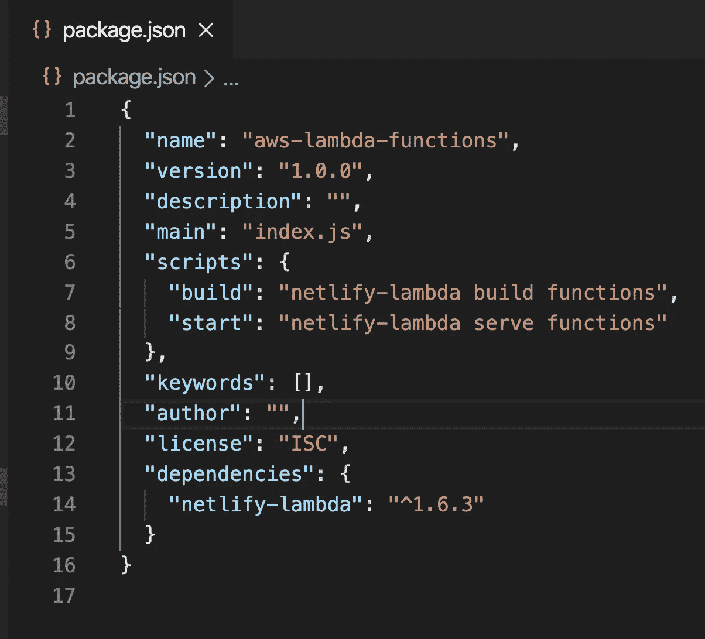

package.json

这里，

`netlify-lambda build functions`

和

`netlify-lambda serve functions`

意味着从`functions`文件夹中构建或提供代码。所以`functions`是我们存储 lambda 函数的文件夹的名称。

现在，在项目文件夹中创建一个新文件`netlify.toml`,内容如下

netlify.toml

Netlify 需要此文件来标识构建信息。

在这里，我们指定将代码部署到 Netlify 后需要执行的命令。下面的代码创建了一个名为`lambdas`的新文件夹，这是 lambda 函数的简化 javascript 代码

```
functions="lambdas"
```

以下命令指定启动应用程序的命令

```
command="npm install && npm run build"
```

现在，通过从终端运行`npm run start`命令启动您的应用程序。

一旦您执行了这个命令，您将会看到一个新的`lambdas`文件夹被创建，其中包含了您的代码的简化版本，并且服务器在默认端口 9000 上启动。

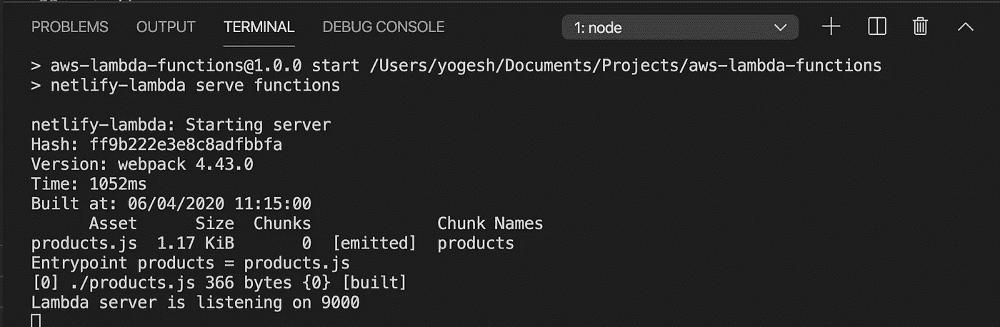

应用程序已启动

现在，如果您在浏览器中通过 [http://localhost:9000/](http://localhost:9000/) 访问该应用程序，您将会看到以下消息

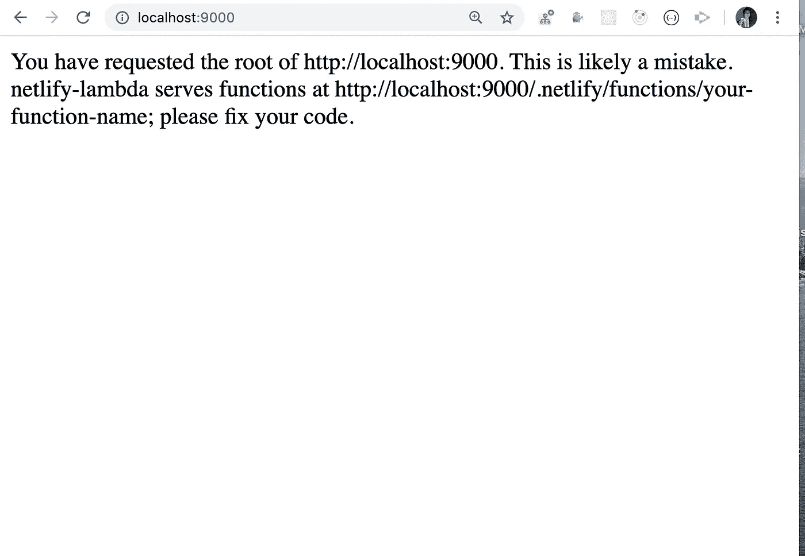

所以要访问 lambda 函数，我们需要在这个 URL 上访问它 [http://localhost:9000/。netlify/functions/products](http://localhost:9000/.netlify/functions/products) 你会看到我们的 lambda 函数的响应

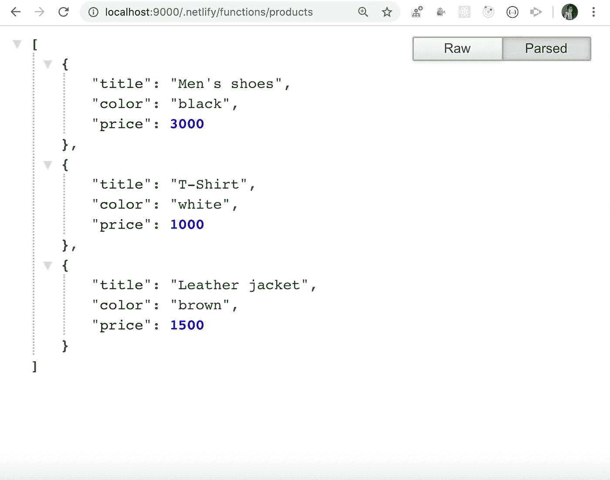

λ函数响应

> 恭喜你！您已经成功地创建了一个后端 API 来获取产品列表，而没有实际创建后端服务器。

现在，我们将把它部署到 Netlify。

创建一个新文件`.gitignore`，并在其中添加以下几行

```
node_modules
lambdas
```

这将确保您不会将`node_modules`和`lambdas`文件夹推送到存储库，因为它们将在我们运行应用程序时自动创建。

现在，我们将把更改推送到 Github 存储库。

> 如果你意识到要对 Github 进行修改，可以跳过这一步。

通过从命令提示符或终端执行以下代码，将当前项目初始化为 git 存储库

```
git init .
```

现在，将所有文件添加到临时区域

```
git add --all .
```

提交更改

```
git commit -m "initial commit"
```

在 https://github.com/new[创建一个新的 Github 库](https://github.com/new)

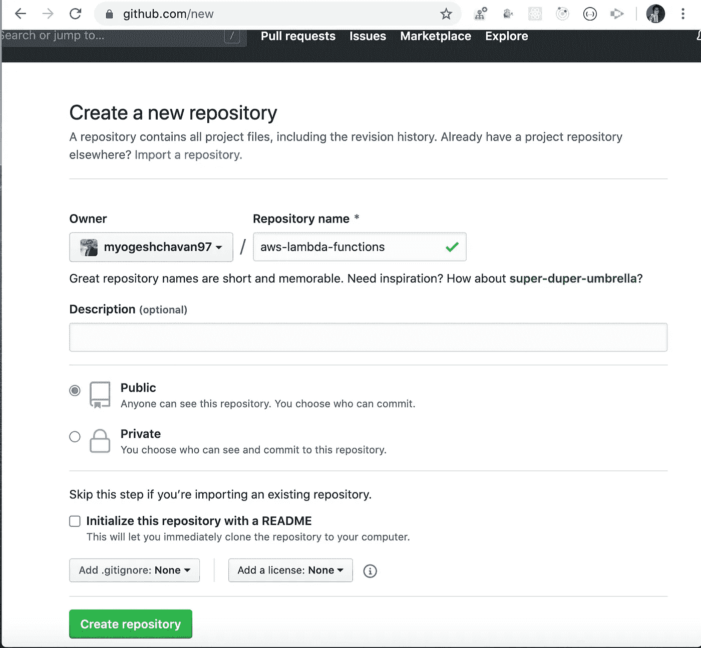

创建 Github 存储库

点击`Create repository`按钮，您将看到推送至您的存储库的 URL。

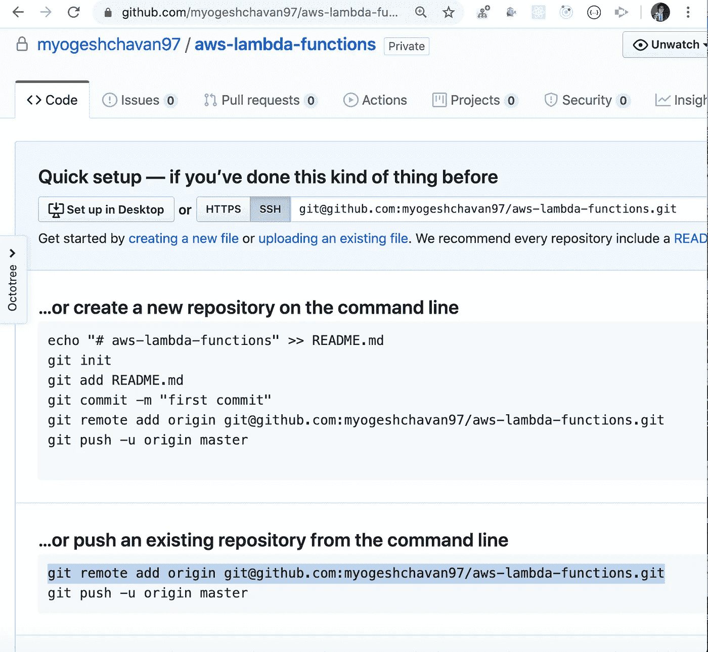

推送到存储库的 URL

从项目文件夹中复制并执行命令行中突出显示部分的 URL，并通过执行以下命令将更改推送到存储库

```
git push origin master
```

按照我上一篇文章[中提到的步骤，在这里](https://medium.com/javascript-in-plain-english/deploy-your-react-application-to-production-within-seconds-58754c79c239#d579)将存储库代码部署到 Netlify。

部署到 Netlify 时，您将看到以下屏幕。

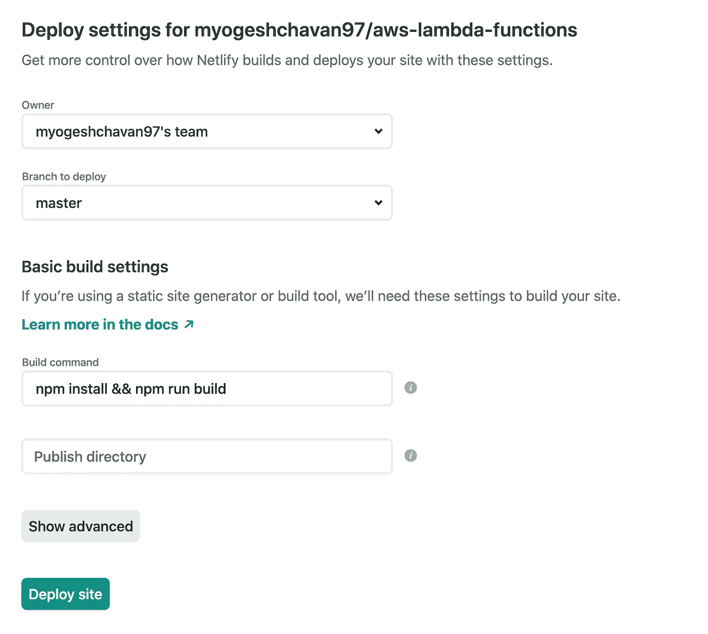

发布屏幕

构建命令将通过读取您的`netlify.toml`文件自动填充。保持`Publish directory`命令为空，点击`Deploy site`按钮。

部署后，您将看到以下屏幕

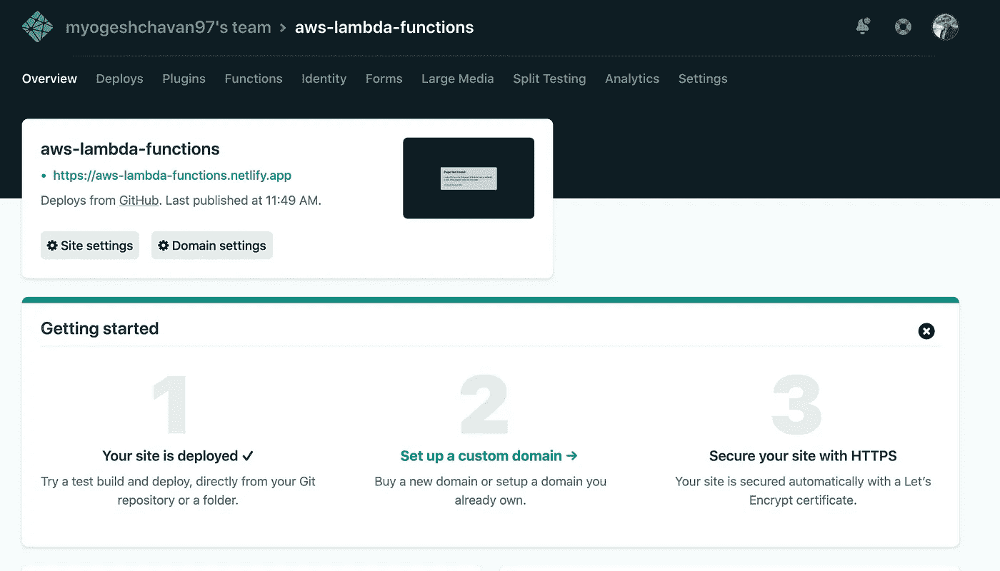

应用程序已部署

点击`functions`标签

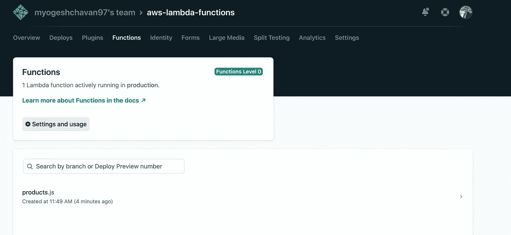

功能选项卡

您将看到带有`products.js`链接的 lambda 函数。点击它，您将被重定向到以下屏幕

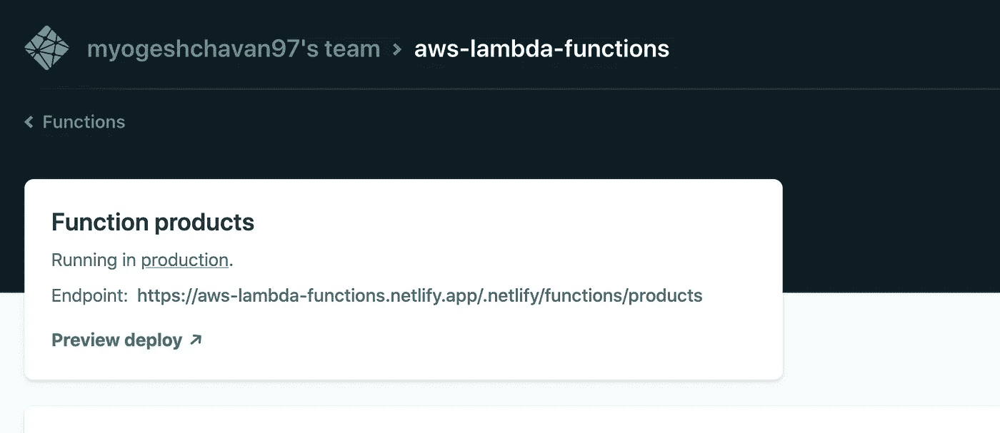

λ函数端点

在新标签中打开`Endpoint`网址。您将看到 lambda 函数 API 响应

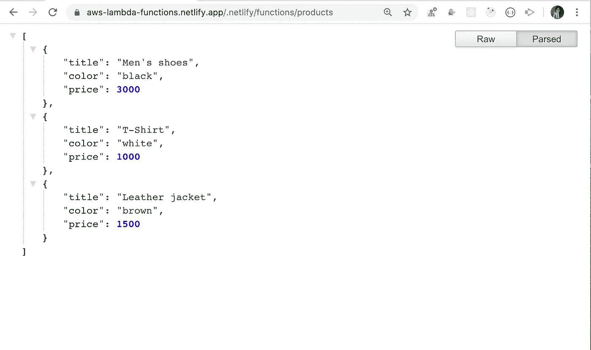

API 响应

厉害！您已经成功地将 lambda 函数部署到产品中，现在您可以在前端客户端应用程序中使用这个 URL 进行 API 调用来获取产品列表。

您可以在这里找到到此为止的源代码

现在，我们将了解如何将 React + Nodejs 应用程序部署到 Netlify。

为了处理 Nodejs APIs，我们将使用 lambda 函数

首先，从这里的[克隆存储库代码，它是在本文](https://github.com/myogeshchavan97/redux-thunk-demo)的[中创建的](https://medium.com/javascript-in-plain-english/how-to-integrate-redux-thunk-into-your-react-application-cd92b87c1629)

现在我们将重构相同的代码来使用 lambda 函数。

安装所需的依赖项

```
npm install netlify-lambda@1.6.3npm install serverless-http@2.5.0
```

使用`serverless-http`包是因为它提供了在 lambda 函数中使用`express.js`的包装器。因此，只需对代码做最小的改动，我们就可以使用相同的 express 代码和 lambda 函数。

打开`server/index.js`并为`serverless-http`添加导入

```
const serverless = require('serverless-http');
```

声明一个快速路由器

```
const router = express.Router();
```

和改变

```
app.get('/', (req, res) => {
```

到

```
router.get('/', (req, res) => {
```

也改变

```
app.get('/users', (req, res) => {
```

到

```
router.get('/users', (req, res) => {
```

并从`index.js`中删除以下代码

```
// Section 4
app.listen(port, () => {
    console.log('server started on port 3000');
});
```

相反，添加以下代码

```
app.use('/.netlify/functions/index', router);module.exports = app;
module.exports.handler = serverless(app);
```

正如您现在所知道的，Netlify lambda 函数只能在路径`/.netlify/functions/`上访问，我们已经为此添加了一个路由，因此每当我们访问`/.netlify/functions/index/`时，这个路由器都会被执行

在`package.json`所在的主项目文件夹下新建一个文件`start.js`，并添加以下内容

```
const app = require('./server/index');
const port = process.env.PORT || 3000;app.listen(port, () => {
  console.log(`server start on port ${port}`);
});
```

现在，`src/actions/users.js`内部发生变化

```
axios.get("/users").then((response) => {
```

到

```
axios.get('/.netlify/functions/index/users').then((response) => {
```

现在，将`package.json`中的脚本从

```
"scripts": {
  "build": "webpack",
  "build-prod": "webpack -p --env production",
  "start-server": "webpack-dev-server --watch",
  "start": "npm run build-prod && node server/index.js"
},
```

到

```
"scripts": {
  "build": "webpack",
  "build-prod": "webpack -p --env production",
  "start-client": "webpack-dev-server --watch",
  "server-build": "netlify-lambda build server",
  "serve": "netlify-lambda serve server",
  "start-server": "node start.js",
  "start-app": "npm run build-prod && npm run start-server"
},
```

这里，我们添加了两个新脚本，`server-build`和`serve`

`netlify-lambda build server`和`netlify-lambda serve server`命令通知`netlify-lambda`包使用`server`文件夹作为存储 lambda 函数的源。

现在，在您的项目文件夹中创建一个新文件`netlify.toml`,内容如下

通过添加`publish="public"`，我们将`public`文件夹指定为 React 应用程序的构建文件夹。

`functions="lambda"`创建一个名为`lambda`的新文件夹，它是来自`server/index.js`文件的 lambda 函数的简化 javascript 代码

就是这样。现在从终端运行`npm run start-app`命令启动应用程序，您可以在 [http://localhost:3000/](http://localhost:3000/) 访问应用程序

> 现场演示:[https://react-node-lambda.netlify.app/](https://react-node-lambda.netlify.app/)

此现场演示中使用的 Lambda 函数可在处[访问](https://react-node-lambda.netlify.app/.netlify/functions/index/users)

默认情况下，所有 lambda 函数都是用

*   美国东部-1 AWS Lambda 地区
*   1024 兆内存
*   10 秒执行限制

此处给出了使用 lambda 函数的定价

您可以找到

*   `aws-lambda-function`储存库[此处](https://github.com/myogeshchavan97/aws-lambda-functions)
*   `react-node-lambda`储存库[这里](https://github.com/myogeshchavan97/react-node-lambda)

今天到此为止。我希望你学到了新东西。

**别忘了订阅我的每周简讯，里面有惊人的技巧、诀窍和文章，直接放在你的收件箱** [**这里。**](https://yogeshchavan.dev/)