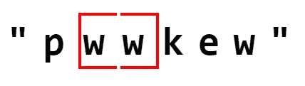

# 滑动窗口算法简介

> 原文：<https://levelup.gitconnected.com/an-introduction-to-sliding-window-algorithms-5533c4fe1cc7>

## 用两个指针、一个循环和一点耐心滑入线性时间。

在使用滑动窗口算法进入线性时间之前，应该理解算法被认为是有效的度量标准。

为了说明这一点，引用《小王子》的作者安托万·德·圣·埃克苏佩里的话就足够了。

> 完美的实现，不是当没有更多可以添加的时候，而是当没有什么可以拿走的时候。

这写得很漂亮，看起来很深奥，但是它与软件工程师、开发人员和他们的算法有什么关系呢？

首先，**算法**是用来实现某个目标的一组步骤。人们每天都在使用算法。以早上的通勤为例。一个人在选定的时间醒来，然后执行一系列步骤让他们按时工作。

这些步骤可以分解成具体的列表:

1.  早上八点半醒来。
2.  做 10 分钟的轻度健身操。
3.  穿上裤子、衬衫和袜子。
4.  记得穿上内衣。
5.  下楼去做一碗燕麦粥。
6.  在**吃燕麦片 n ≤ 20 分钟。**
7.  刷牙。
8.  上车，祈祷它能打开。

可以看出，这是一个算法。它是实现一个目标的一系列步骤。

对于软件工程师和开发人员来说，最有效的算法是使用最少步骤的算法。换句话说，计算机程序员最有效的算法是使用最少的时间，占用最少的空间，以最低的复杂度运行的算法。

所以，程序员的目标不是**给算法增加**个步骤；相反，程序员的目标是从算法中删除步骤。*当什么都没带走的时候*，算法就完美了。

当一个人从程序的算法中删除不必要的步骤、变量和迭代时，程序的运行效率会高得多。为此，程序员的目标是严格规划的简单性，而不是复杂性。

为了实现代码的简单性，需要有一个策略。这个策略不需要一开始就尽善尽美，但是在创建时应该考虑到优化。

滑动窗口算法是程序员简化代码的一种方式。这个算法听起来一模一样；一个**窗口**形成在数据的某一部分上，该窗口可以在数据上滑动以捕捉数据的不同部分。

为了解释这个模糊的定义，请看下面这个可以使用滑动窗口的问题的例子。

> 给定一个数组作为输入，提取所有对中总和最高的一对连续整数。将该对作为数组返回。

连续意味着连续，这意味着元素必须彼此紧挨着才能算作一对。这是一个巨大的线索，滑动窗口可以很好地解决这个问题。

在这个问题的上下文中，contiguous 还意味着不能简单地对数组进行排序并返回数组中的最后两个整数，因为我们希望数组中的一对**连续的**整数具有最高的和，因为它已经被排序。

对于这个问题，取输入`[5, 2, 4, 6, 3, 1]`作为输入。

这里不会详细解释滑动窗口，但会在下一节中介绍。这一部分作为一个带有轻松注释的视觉介绍。下图是这个问题的滑动窗口的第一次迭代。

该窗口有红色边框和薄荷色背景。该对的当前总和`[5,2]`为 7。继续遍历整个数组，看看是否仍然是最高的和。必须**将窗口向上滑动**1，以到达下一个迭代。

这个窗口评估为`6`，所以它不是更高。继续迭代。

这个窗口的对子是目前为止最高的。跟踪它，并将其与最后两次迭代进行比较。

接近，但仍然没有高于前一对。

这次迭代的对子肯定不是最高的。在所有迭代之后，最高和对是`[4, 6]`。

迭代次数在这里值得注意:迭代次数是 5，这使得这个问题的滑动窗口解决方案比`O(n)`略快。对于小型和大型输入，线性时间是一个理想的目标。

既然心智模型开始形成，人们可能会想**如何**识别可以成功使用滑动窗口的问题。

一般来说，作者要求以下任何返回值的任何问题都可以使用滑动窗口:

1.  最小值
2.  最大值
3.  最长值
4.  最短值
5.  *K* 大小的值

前一个问题要求既有 *K-* 大小的值(一对)又有最大值(最大和)。

此外，使用必须按顺序迭代的列表或数据类型的问题非常适合滑动窗口。前一个问题也符合这个标准，因为它有一个数组输入，并且需要顺序迭代。

最后，可以使用滑动窗口的最大线索之一是单词 **contiguous** 。请记住:在编程的上下文中，连续意味着元素是按顺序一个接一个放置的。

人们将使用滑动窗口的一些常见数据结构是**字符串、** **数组、**甚至**链表。**

由于使用数组的问题已经被使用过，下一个问题将使用一个**字符串**作为它的输入。

下一个问题如下:

> 给定一个字符串，找出没有重复字符的**最长子串**的长度。

**子串**是字符串中一组连续的字符。就本问题而言，子字符串不能包含任何重复字符。

所以，这个问题要求给定字符串中没有重复字符的最长子串的**长度。**

这个问题检查了上面提到的几乎所有使用滑动窗口的标准。它具有:

1.  字符串作为输入。
2.  连续元素要求。
3.  必须遍历整个字符串。
4.  必须找到最长的**子串。**

在深入研究这个问题之前，有必要了解程序员是如何实现滑动窗口的。

遵循即将出现的代码可能具有挑战性。在代码部分的下面是一个说明实现如何工作的示例，所以可以随意向下滚动来查看算法如何工作。到本文结束时，实现将变得有意义。

首先，需要一个**起始索引。**称之为`leftWindow`，因为它是用于查看当前子串的窗口的左侧。此外，变量`longest`可用于跟踪所有迭代子串的最大长度。

这里还需要一个**对象**，因为需要检查重复的字符。在其他语言中，**对象**或**散列表**的一个重要用途是存储某些字符的计数。从一个**对象**中查找一个键值对的时间是一个常数时间，`O(1)`，因此与需要遍历部分或全部值来找到正确值的数据结构相比，它节省了大量时间。命名这个`counts`或者类似的。

现在，调用一个`for`循环。声明并初始化一个名为`rightWindow`到`0`的块范围变量。此变量指向窗口右侧延伸到的索引。它最初指向`0`，因为当它满足某些条件时，窗口的大小只在循环内部增长。

不要设置递增条件:循环的块将包含何时递增`leftWindow`或`rightWindow`的指令。

一旦`rightWindow`到达字符串的末尾，就退出循环。

在编写滑动窗口的指令之前还有一个步骤。必须设置一个字符的**计数**递增的条件。在这个例子中，当字符是包含在滑动窗口中的**时，字符的计数增加。**

随着`rightWindow`的增加，滑动窗口中包含更多的字符。所以，在循环的顶部写一个`if`语句:如果`rightWindow`索引处的当前字符不作为`counts`变量中的`key`存在，则将当前字符作为键追加到`counts`中，值为`0`。然后，在`if`语句之外，用`1`增加键值对。

终于到了分解**何时**和**如何**滑动窗户的步骤了。由于窗口由索引`leftWindow`和`rightWindow`构成，两个索引之间的所有元素都将包含在子串中。随着`rightWindow`的增加，子串中将包含更多的元素。

这意味着是**而不是**重复的字符导致`rightWindow`递增，因为它**应该被包括在窗口中，因为它符合适合当前窗口的标准。**

对于`leftWindow`来说，情况正好相反:任何重复的字符都会迫使窗口收缩。随着`leftWindow`的增加，窗口变小，因为当前字符不能包含在内，因此当前子串不能变大。接下来必须评估从`leftWindow + 1`开始的子串，因为它可能大于前一个从`leftWindow`开始的子串。

因此，首先检查`counts`中的**某元素**大于`1`的情况。这意味着它是重复的。如果是这样，我们需要做以下事情:

1.  随着窗口的收缩，减少`leftWindow`处的字符，该字符不再出现在窗口的视图中。
2.  将`leftWindow`增加`1`，看看下一个子串是否会比上一个子串更长，从`leftWindow`开始，到`rightWindow`结束。

最后，需要检查当前子串的长度是否大于由`longest`指向的整数，该整数代表目前看到的`longest`子串长度。之后，窗口必须扩展以包含另一个字符，并查看当前子字符串是否可以变得更长。将`rightWindow`增加`1`。

太好了—滑动窗口已经创建好了。但是对于一个具体的例子来说，这会是什么样子呢？

取输入`'pwwkew'`。这个问题的答案是`3`，有那个长度的两个子串是`'wke’`和`'kew'`。

第一个窗口如下所示:

`rightWindow` 为 0，因此`leftWindow`也为 0。循环增量为`1`。

现在，该窗口的长度为`2`个字符，并且没有副本。`longest`被重新赋值给当前长度的子串。增量`rightWindow`。

子字符串重复。在`counts`中`leftWindow`将增加，而`p`的计数将减少。

仍然有一个副本。`leftWindow`再次增加，并且`counts`中的`w`的计数减少。一旦没有发现重复，`rightWindow`再次递增。

这里没有副本。再次增加`rightWindow`,看看车窗是否能达到`3`的长度。

成功！发现了一个新的最大长度。`longest`被重新分配，并且`rightWindow`增加。

又发现一个重复的，`w`。将`counts`中的`w`减 1，增加`leftWindow`。

这是最后一个子字符串，因为`rightWindow`不能再增加了。`break`出循环返回`longest`，也就是`3`，正确答案。

上面的解决方案不仅返回正确的值，而且运行时间接近线性。考虑到**子串**可以是≤ 26 的任意长度，这可不是一件小事。在具有较少重复字符的示例中，该解决方案甚至可以在严格的线性时间内运行。

这就是**滑动窗口**算法的强大之处:防止集合中不必要的迭代。此外，它还提供了一个直观的视角来查看子部分中的数据。

至于接下来的步骤，人们可以进入他们已解决问题的档案，寻找一个可以用滑动窗口解决的问题。然后，重构该解决方案，直到它以线性时间运行。

祝你好运！

# 分级编码

感谢您成为我们社区的一员！ [**订阅我们的 YouTube 频道**](https://www.youtube.com/channel/UC3v9kBR_ab4UHXXdknz8Fbg?sub_confirmation=1) 或者加入 [**Skilled.dev 编码面试课程**](https://skilled.dev/) 。

 [## 编写面试问题

### 掌握编码面试的过程

技术开发](https://skilled.dev)