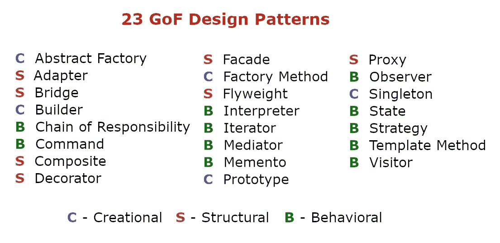

# 软件设计模式介绍

> 原文：<https://levelup.gitconnected.com/an-introduction-to-software-design-patterns-fa2985efd32e>

## 由著名的四人组创建的所有 23 个设计模式的简短介绍。

由 [Unsplash](https://unsplash.com/s/photos/software-design?utm_source=unsplash&utm_medium=referral&utm_content=creditCopyText) 上的[absolute vision](https://unsplash.com/@freegraphictoday?utm_source=unsplash&utm_medium=referral&utm_content=creditCopyText)拍摄

设计模式是一个术语，用于解决软件设计中常见问题的通用、可重用的解决方案。重要的是要明白，设计模式不是可以转换并直接应用到软件中的代码成品。相反，它们更像是一个模板，一个描述，或者一个概念，可以给你一个如何解决问题的想法，可以用在许多不同的情况下。

如果用在正确的地方，出于正确的原因，它们会非常有用。当战略性地使用时，它们增强了你的软件，并通过已经被无数开发者提炼的方法使它更有效。

# 为什么应该使用设计模式？

在软件开发中使用设计模式有几个好处:

*   **它们是经过验证的解决方案:**设计模式经常被许多不同的开发人员使用，所以你可以确信它们能按预期工作。此外，您可以确信它们已经过多次修改，并且已经进行了优化。
*   它们很容易重用:设计模式记录了一个可重用的解决方案，它可以被修改来解决多个特定的问题，因为它们不依赖于一个特定的问题。
*   **它们富有表现力:**大型解决方案可以用设计模式优雅地解释。
*   **他们简化了交流:**许多开发人员都熟悉设计模式，并且可以很容易地使用它们来交流给定问题的可能解决方案。
*   **它们避免了重构代码的需要:**通常，如果你在开发软件时使用设计模式，你可以避免以后的重构。这只适用于你对一个给定的问题使用正确的方法，因为它已经描述了一个最优的解决方案。
*   **它们降低了代码库的规模:**因为设计模式通常是优雅的、优化的、文档良好的解决方案，它们比其他解决方案需要更少的代码。

# 一切开始的地方

1994 年，一本标志性的计算机科学书籍《设计模式:可重用面向对象软件的要素》首次由四位作者出版:[埃里希·伽马](http://en.wikipedia.org/wiki/Erich_Gamma)、[理查德·赫尔姆](http://en.wikipedia.org/wiki/Richard_Helm)、[拉尔夫·约翰逊](http://en.wikipedia.org/wiki/Ralph_Johnson)和[约翰·维里西德斯](http://en.wikipedia.org/wiki/John_Vlissides)。在技术圈，你会经常看到这些作者被命名为“四人帮”或者简称为 g of。

尽管四人帮是在 C++环境下写的这本书，但它仍然与 Java、JavaScript、Python 或任何其他面向对象的编程语言密切相关。作者通过他们使用 C++创建大型企业系统的经验，看到了 23 种常见模式的出现。这 23 种设计模式并不是 C++独有的，而是可以应用于任何其他语言。

通常，作为一名开发小型到企业级应用程序的开发人员，您每天都会遇到四人组设计模式。

# 23 种 GoF 设计模式

四人帮推出的所有 23 种设计模式

四人组的 23 种设计模式分为三类:

1.  **创建**:用于处理对象创建机制。它们用于创建对象，而不是直接实例化对象。您的程序在决定为特定用例创建哪个对象时将更加灵活。
2.  **结构**:用于识别实现对象间关系的方式。这涉及到类/对象组合与继承，以定义获得新功能的不同方式。
3.  **行为**:用于处理不同对象之间的通信。

## 创造型的

四人组设计的创意类有 5 种设计模式。

[**1。抽象工厂:**](https://en.wikipedia.org/wiki/Abstract_factory_pattern) 创建几个类族的实例，而不详细描述具体的类。它允许为工厂类创建工厂。

[**2。构建器:**](https://en.wikipedia.org/wiki/Builder_pattern) 将对象构建与其表示分离，始终创建同一类型的对象。它一步一步地创建一个对象和一个方法，最终得到对象实例。

[**3。工厂方法:**](https://en.wikipedia.org/wiki/Factory_method_pattern) 将实例化一个对象的责任从类转移到工厂。然后，Factory 基于接口数据或事件创建几个派生类的实例。

[**4。Prototype:**](https://en.wikipedia.org/wiki/Prototype_pattern) 这种模式提供了一种机制，将原始对象复制或克隆到一个新对象，然后根据您的需要对其进行修改，以避免代价高昂的对象创建。

[**5。Singleton:**](https://en.wikipedia.org/wiki/Singleton_pattern) 限制类的初始化，以确保只能创建该类的一个实例。多次初始化尝试将导致反复返回同一个对象。

## 结构的

四人组设计的结构类有 7 种设计模式。

[**1。适配器:**](https://en.wikipedia.org/wiki/Adapter_pattern) 在两个不相关的实体之间提供一个接口，使它们能够协同工作。它在已经存在的类之间包装了一个接口，以便能够在不直接修改源代码的情况下相互协作。

[②**。Bridge:**](https://en.wikipedia.org/wiki/Bridge_pattern) 定义了一种策略，将接口从实现中分离出来，并对客户端程序隐藏实现细节。所以两者都可以独立变化。它使用封装、聚合和继承将职责分成多个类。

[**3。Composite:**](https://en.wikipedia.org/wiki/Composite_pattern) 如果您必须实现部分-整体层次结构，那么可以使用这种模式。它创建一组对象，这些对象应被同等地视为一个对象的单个实例。它由零个或多个对象组成，这些对象可以作为一个单独的对象来操作。

[4。装饰器:](https://en.wikipedia.org/wiki/Decorator_pattern) 用于在运行时修改对象的行为。它动态地向对象添加替代处理，而不影响同一类中的其他对象。

[**5。门面:**](https://en.wikipedia.org/wiki/Facade_pattern) 为子系统中的一组接口提供统一的接口。它定义了一个更高的层次，有助于更容易地使用子系统。它屏蔽了底层的复杂或结构化代码，并作为一个“*前端接口*

[**6。Flyweight:**](https://en.wikipedia.org/wiki/Flyweight_pattern) 描述了一个用于高效共享信息的细粒度实例。它缓存并重用对象实例，与不可变对象一起使用以最小化内存使用。

[**7。代理:**](https://en.wikipedia.org/wiki/Proxy_pattern) 为另一个对象提供占位符。您应该使用它来控制访问、降低成本和复杂性。

## 行为的

四人组设计的行为类有 11 种设计模式。

[**1。责任链:**](https://en.wikipedia.org/wiki/Chain-of-responsibility_pattern) 描述了一种在一系列对象之间委托命令或传递请求的技术，以找到能够处理命令或请求的对象。

[②**。命令:**](https://en.wikipedia.org/wiki/Command_pattern) 这种模式将命令请求封装成一个对象，以启用、记录和/或排队请求。此外，它为未处理的命令请求提供错误处理，

[**3。解释器:**](https://en.wikipedia.org/wiki/Interpreter_pattern) 包括应用程序中特定于语言的元素，以匹配目标语言的语法。它定义了一种语言的语法表示和使用这种语法的解释器。

[**4。迭代器:**](https://en.wikipedia.org/wiki/Iterator_pattern) 描述了遍历一组对象的标准化方式。它按顺序访问包含它的对象，而不公开它的底层表示。

[**5。中介:**](https://en.wikipedia.org/wiki/Mediator_pattern) 提供系统中不同对象之间的集中通信，实现不同对象之间的松耦合。它封装了这些不同的对象如何相互作用。

[**6。Memento:**](https://en.wikipedia.org/wiki/Memento_pattern) 每当保存一个对象时，存储该对象的状态，以便通过提供撤销操作来恢复先前的状态。

[第七期**。Observer:**](https://en.wikipedia.org/wiki/Observer_pattern) 通知一组订阅类的状态变化，以确保它们之间的一致性。

[**8。状态:**](https://en.wikipedia.org/wiki/State_pattern) 根据对象的内部状态启用行为变化。如果一个对象的状态改变了，它对请求的反应也会改变。

[**9。策略:**](https://en.wikipedia.org/wiki/Strategy_pattern) 当一个特定的任务存在多个算法，并且客户端决定在运行时应该使用哪个实现时，使用这个模式。它将算法封装在类中，将选择和实现分开。

[10**。模板方法:**](https://en.wikipedia.org/wiki/Template_method_pattern) 定义了一个算法的抽象框架，使得子类必须实现具体的行为。

[**11。访问者:**](https://en.wikipedia.org/wiki/Visitor_pattern) 将算法从它所操作的对象结构中分离出来。这使得能够在不改变结构的情况下向现有对象结构添加新操作。

# 结论

既然您已经阅读了这篇简短的软件设计模式介绍，那么您应该对几乎每种编程语言中使用的几种重要技术有所了解。

现在，您应该通过将所有或至少一些设计模式应用到您的副业项目中或者仅仅作为实践来磨练您的技能。此外，你可以开始考虑如何将它们应用到你的实际项目中。

虽然，有几个实现受益于利用设计模式，但请记住，它们从来就不是以“一刀切”的方式应用于代码的捷径。在软件工程中，真正解决问题的能力是无可替代的。

理解这一点非常重要，设计模式提供了一种公共语言，在与团队合作或管理大型代码库时，可以将重复的问题和解决方案概念化。

也就是说，最重要的告诫是确保每个设计模式背后的**如何**和**为什么** 被开发人员完全理解。

对软件设计模式的简短介绍到此结束。请随时在我的[个人简讯/博客](https://www.paulsblog.dev)、 [LinkedIn](https://www.linkedin.com/in/paulknulst/) 、 [Twitter](https://twitter.com/paulknulst) 和 [GitHub](https://github.com/paulknulst) 上与我联系。