# CSS 中的 SVG 介绍

> 原文：<https://levelup.gitconnected.com/an-introduction-to-svgs-in-html-8357775be350>

## 介绍

那么什么是 SVG，我们为什么要考虑使用它们呢？这是一个关于 SVG 的介绍性博客。我将快速解释并展示一些你可以用它们做的事情，读完这篇博客后，你将对它们有一个基本的了解，并知道如何对它们进行编码。

## 什么是 SVG？

SVG 代表“可缩放矢量图形”,矢量图形只是一个给定了某些数学指令的对象，它将显示一个形状。当我们总是可以从互联网或我们的文件中添加图像时，我们为什么还要考虑使用它们呢？我们脑海中可能有一些形状或结构过于复杂，无法在网上找到图像。让我们比较一下显示箭头的放大的 PNG 图像和放大的 SVG 箭头，看看有什么不同。

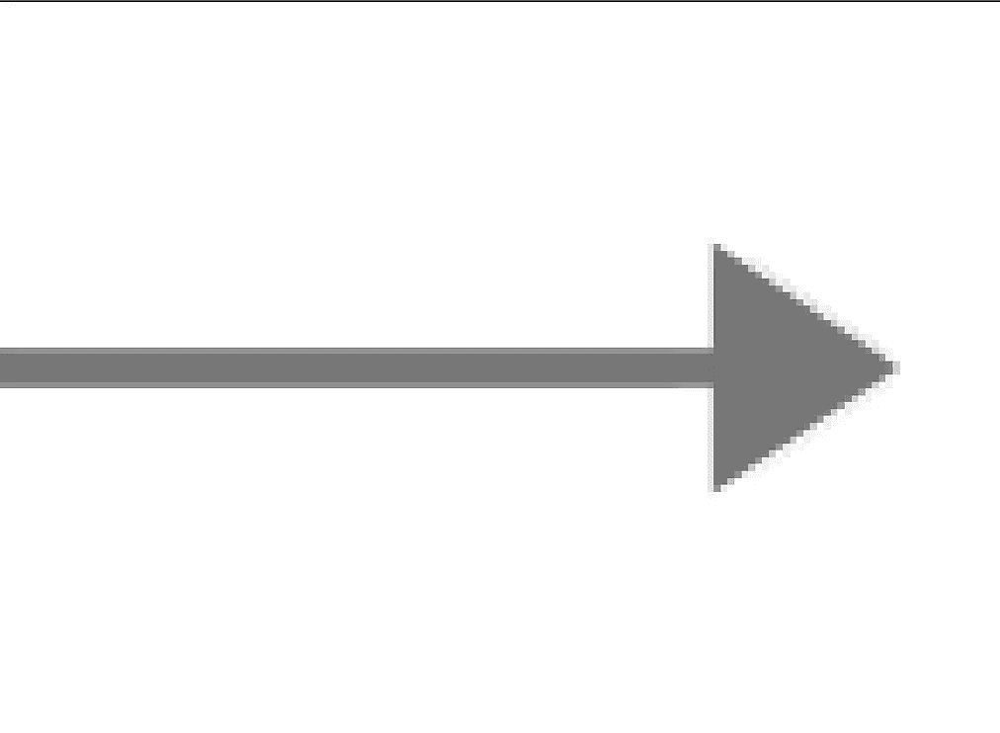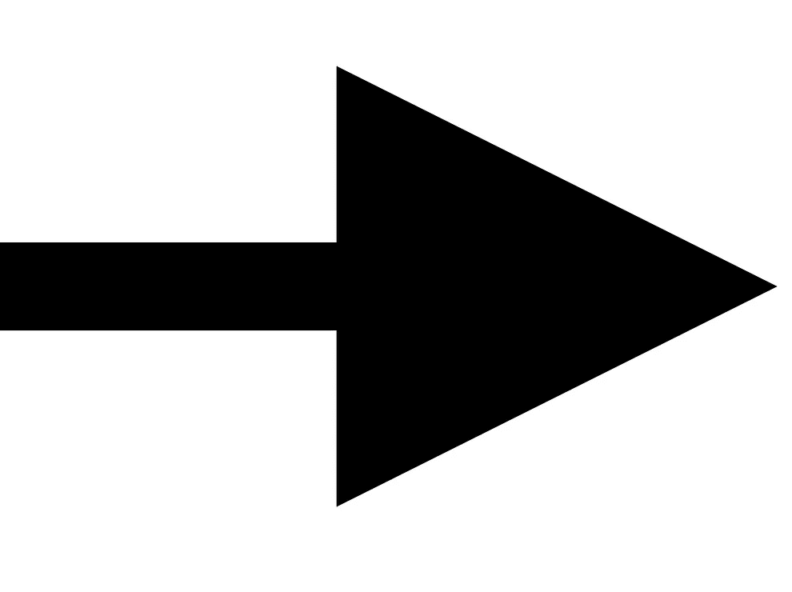

左:巴布亚新几内亚..右:SVG

正如你所看到的，一个正常的图像将在像素信息中渲染。换句话说，如果我们想让图标变得更大，SVG 就会显示难看的像素。另一方面，无论你放大到多近，或者放大到多大，我们都有清晰的图像。

SVG 的另一个优点是，它们实际上是由代码组成的，所以它们的大小很小，并且您不必处理 HTTP 请求，所以您的代码运行起来更有效率。

## 我们如何实际编码一个 SVG？

SVG 标签将其中的所有内容都解释为 XML，因此将用于创建 SVG 的每个属性都放在一个标签中。SVG 使用不同的元素来创建一个形状，在这篇博客中我将会谈到:圆形、矩形、直线和多边形。每个形状使用不同的属性来定义对象，让我们来分解每一个。

## 环

圆有三个主要属性:半径用“r”表示，X 轴上的圆心用“cx”表示，Y 轴上的圆心。让我们看看如何用这些来形成一个圆。

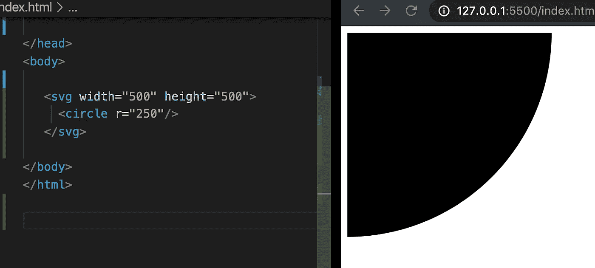

因此，如果我们检查左边部分的图像，我们会看到有一个具有宽度和高度的标记，在内部我们有一个只有“r”属性的<circle>标记，但是为什么我们只能看到圆的 1/4 呢？这是因为我们还没有指定圆心在哪里，让我们来看看如何做。</circle>

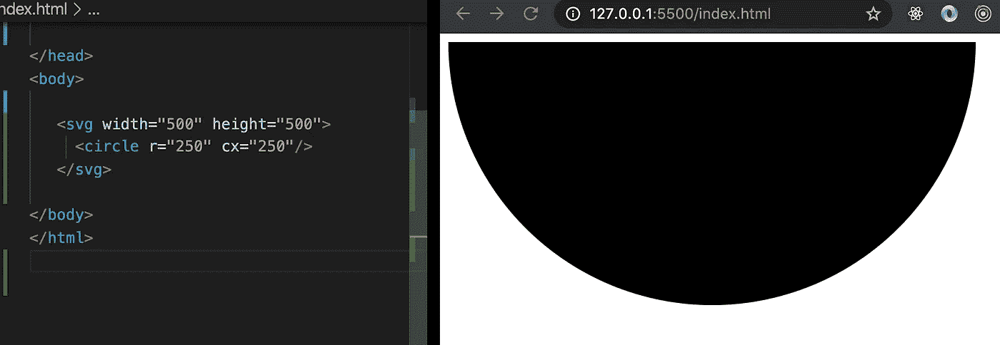

这里我们指定了基于 X 轴的圆心的位置，或者更简单地说，从左到右放置圆的位置。我们仍然没有一个完整的圆，所以让我们使用我们的第三个属性。

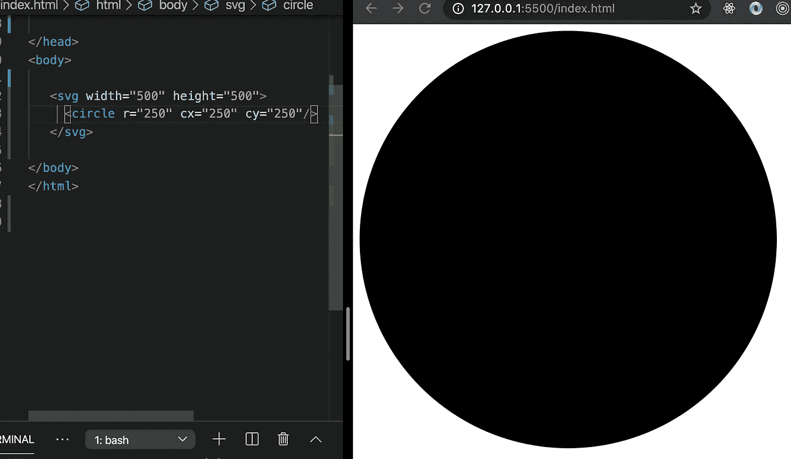

瞧啊。我们现在有了一个完整的圆，注意我们指定了圆在 Y 轴上的位置或者从上到下的位置。

## 长方形

矩形有六个主要属性来形成矩形。矩形中的“x”和“y”属性指的是形状左上角的位置，而不是圆形的中心。因此，如果我们指定“x”为 0，形状将一直在左侧，如果我们指定“y”为 0，形状将在顶部。我们有宽度和高度来指定，然后我们有“rx”和“ry ”,现在这两个用来指定形状的“圆度”,它们的作用就像 CSS 中的“边界半径”。让我们看看如何把这些结合起来得到一个形状。

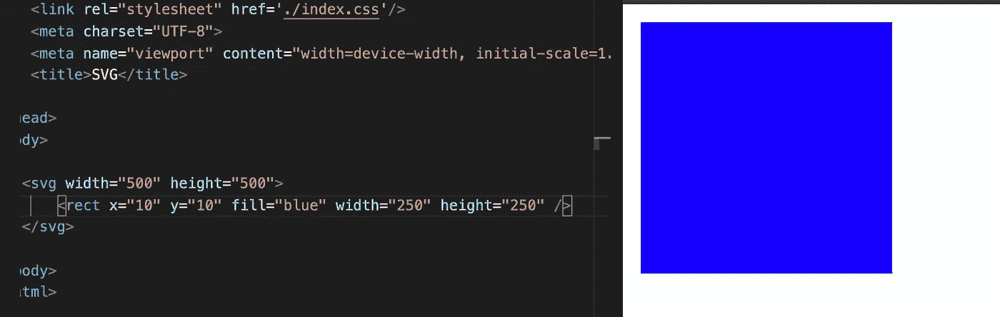

如果我们检查图像，我们可以看到“x”被指定为离开左侧 10px,“y”告诉形状将自己放置在离开顶部 10px 的位置。我们还可以看到，我们可以应用“填充”属性，使我们的正方形改变颜色。现在我们如何使用“rx”和“ry”呢？

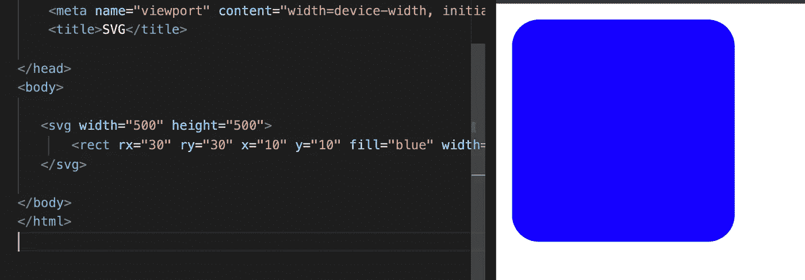

检查图像，我们可以看到 rx 定义了 X 轴上的边界或顶部和底部边界，因此如果我们指定“rx”为 25，形状将在 X 轴上的 25 个像素后停止弯曲，而“ry”定义了 y 轴上的边界或左侧和右侧边界；请注意，如果在 y 轴或 x 轴上没有舍入，实际上不会发生舍入。

## 线

台词更直白。我们在行中有六个主要属性:“X1”、“Y1”、“X2”、“Y2”、“笔画”和“笔画宽度”。因此,“X1”将确定 X 轴上直线的起点,“Y-1”指定 Y 轴上直线的起点，自然,“X-2”指定 X 轴上直线的终点,“Y-2”指定 Y 轴上直线的终点。“笔画”将指定线条的颜色，“笔画宽度”将指定线条的宽度。让我们看看它是如何工作的。

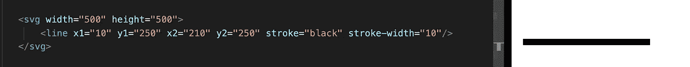

## 多边形

多边形实际上只是一个模板，用来构建你想要的任何形状。我们使用“点”来构建多边形，我们至少需要 3 个点来构建一个形状。“点”的工作方式是通过在一个属性中一起指定它们，让我们看一个例子并分解它。

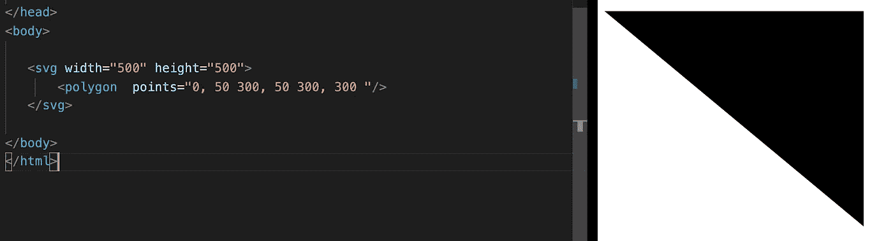

让我们仔细检查点属性，我们在属性中有三对数字，第一对定义第一个点，第二对指定第二个点，第三对指定第三个点，每个点代表形状的一个端点。每对之间用逗号隔开，左边的数字代表点在 X 轴上的位置，右边的数字代表点在 Y 轴上的位置。配对由空格分隔。我们可以给多边形添加任意数量的点。

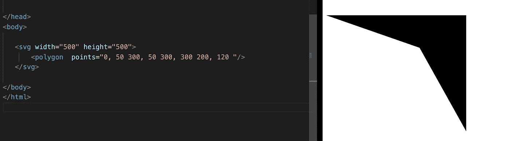

在这里，我们添加了另一个点，它位于三角形的中间，形成一个箭头形状。

## 样式属性

SVG 使用的属性与 CSS 略有不同。两个基本属性是:“fill”用于指定 SVG 的颜色，“stroke”用于指定边框，“stroke-width”用于指定边框的宽度。要指定宽度和高度，我们使用…宽度和高度，就像 css 一样。

# 在标记中包含 SVG 的不同方法

在 HTML 文件中包含 SVG 有不同的方法，我将向你展示几种方法。

**从另一个文件导入 SVG 作为图像**

包含 SVG 的一种方法是将它们作为图像从另一个文件导入。这里我在 HTML 中创建了一个普通的图片标签，我指示这个标签在目录中寻找一个 SVG 文件。

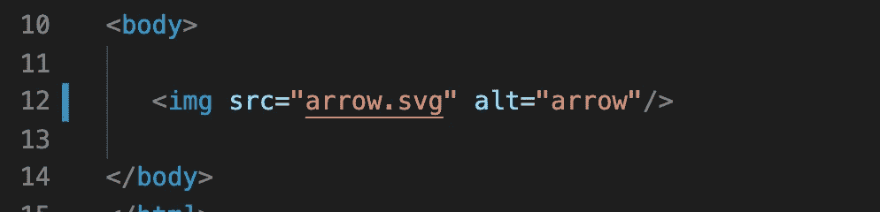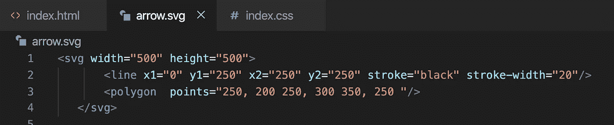

使用这种方法的缺点是我们不能直接改变标签中任何东西的样式，我们只能操作 SVG 本身的样式，而不能操作它内部的形状。

**直接在我们的 HTML 文件上写我们的 SVG**

所以我们可以包含 SVG 的另一种方法是直接在我们的 HTML 文件中编码。像这样包含我们的 SVG 内联使我们对 SVG 内部的形状有了更多的控制，我们现在可以改变 SVG 内部任何形状的样式。

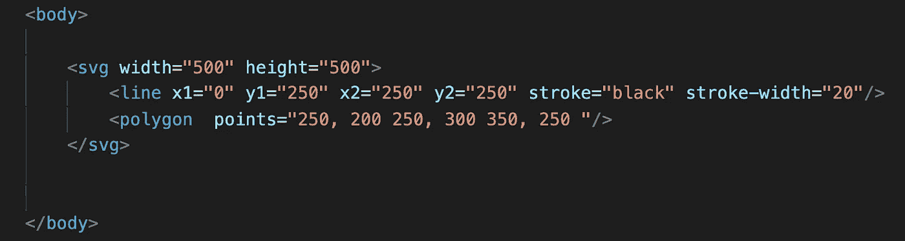

以这种方式嵌入 SVG 的缺点是我们的标记会很快变得很大。

**使用<使用/ >标签**

所以我们可以使用的第三种方法是使用 use 标签。它的工作方式是我们将 SVG 直接嵌入标记中，不同的是我们将 SVG 包装在一个 **<符号/ >** 标签中。

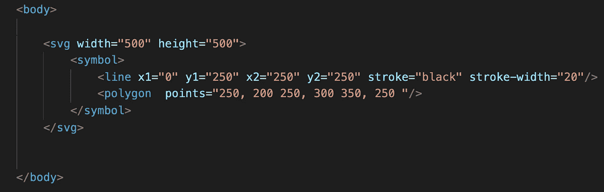

标签<symbol>将阻止 SVG 显示，也就是说在标签<use>出现的地方。</use></symbol>

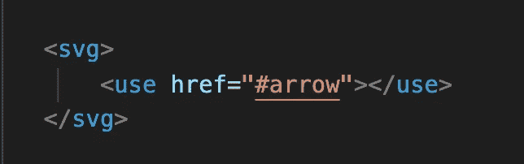

每当我们使用包裹在标签中的<use>标签(没有双关的意思)时，我们的 SVG 就会显示出来，这种方法的优点是我们可以在文件中创建大量的 SVG，并把它们都放在底部，所以每当我们想使用它时，我们只需使用一个<use>标签。</use></use>

# 结论

我们已经了解了 SVG 的基础知识，关于这个主题还有很多值得探索的地方，我渴望继续了解更多。我们可以用 SVG 做的事情是惊人的，它们让我们有可能创建清晰而有创意的图标来显示在我们的网页上。编码快乐！