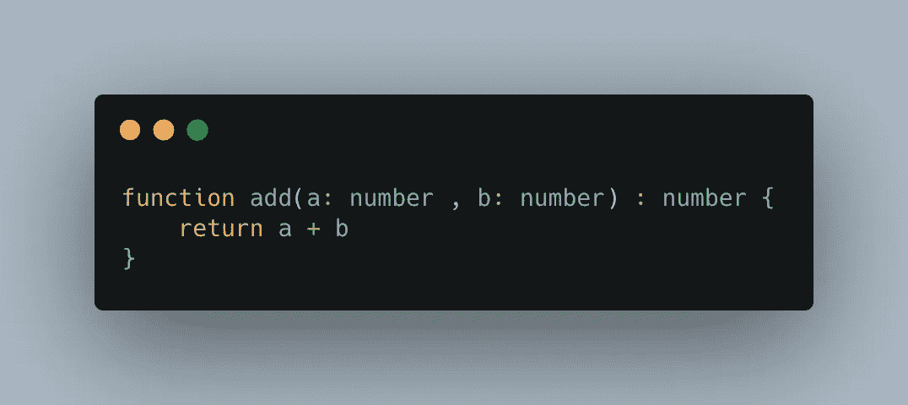
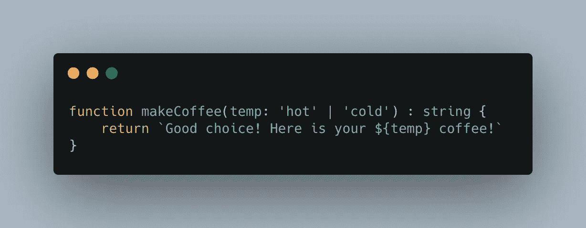
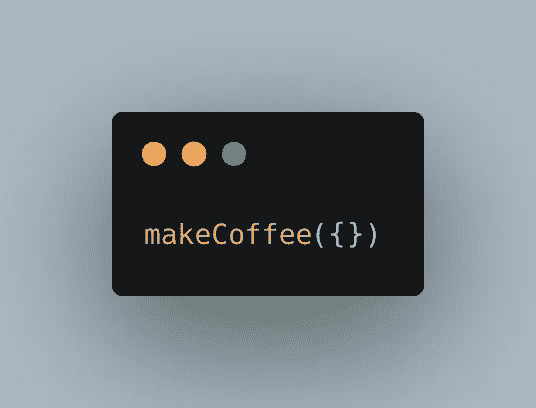
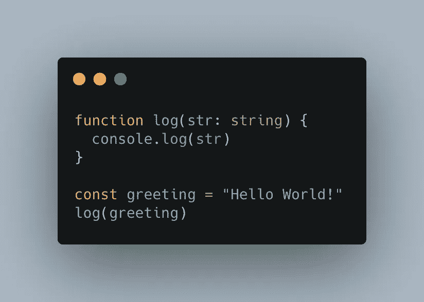
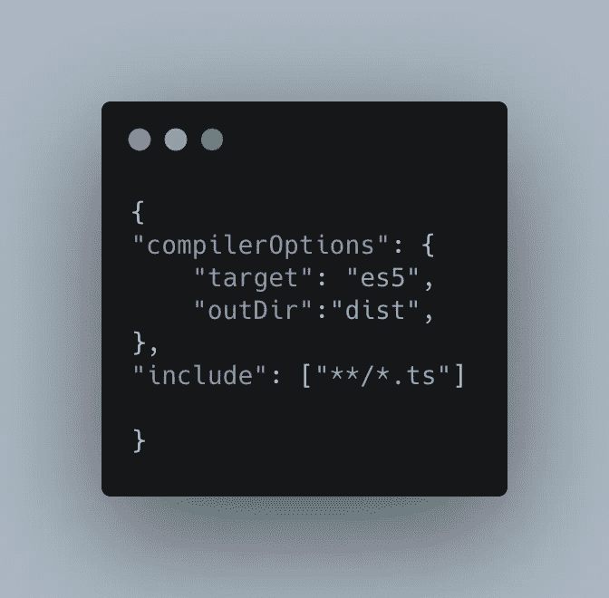
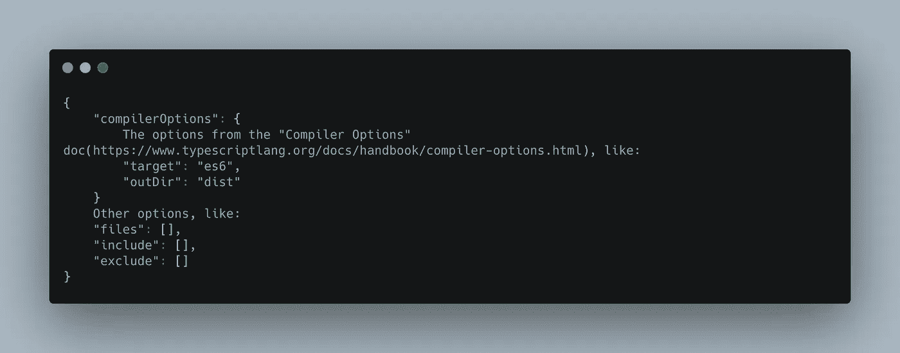

# Typescript + config ✨简介

> 原文：<https://levelup.gitconnected.com/an-introduction-to-typescript-config-d9f0461fd864>

TypeScript 是一种由微软开发和维护的编程语言。它是 JavaScript 的一个严格的语法超集，并为该语言添加了可选的静态类型。typescript 编译成 javascript，因此节点和浏览器运行 Javascript 而不是 Typescript。

先说一个例子:这是一个将两个值( ***a*** 和 ***b*** )相加的函数，两者都是类型*数字*，函数返回类型是*数字*。为了在浏览器或节点上运行这段代码，我们必须使用 typescript 编译器编译它，typescript 编译器将输出我们可以在浏览器或节点上运行的 javascript。

正如我前面提到，Typescript 是 javascript 的超集。类型系统帮助我们在生产之前捕捉代码中的错误。

这里有一个例子:

这个函数必须返回一个字符串。

如果我用一个不期望的值(例如一个对象)调用 makeCoffee，我们将得到一个错误，说明“hot”|“cold”类型的参数不期望一个对象:

错误:“类型为“{ 0 }”的参数不可赋给类型为“hot”|“cold”的参数。类型“{ 0 }”不可赋给类型“cold”。

# **如何安装 typescript 并使用 typescript 编译器？**

Typescript 编译器作为 NodeJs 包分发，因此您需要安装 NodeJs。你可以从这里安装:[https://nodejs.org/es/](https://nodejs.org/es/)

为了安装它，我们运行: *npm install typescript*

安装完成后，这个包将为我们提供 *tsc* 二进制文件，我们可以在控制台中运行这个命令: *tsc — help。*

现在用 *mkdir* 创建一个文件夹，并在 VSCode 中打开这个文件夹。里面创造了一个基本的**。ts** 文件: *hello-world.ts* 并编写以下代码:

让我们打开终端并编译我们的文件，为此，我们使用 *tsc* 命令并指定路径: *tsc hello-world.ts*

我们还可以指定不同的编译器选项，比如 target(target 选项告诉 typescript 我们希望将我们的 typescript 代码编译成什么版本的 javascript)，以查看所有可用的选项:[https://www . typescriptlang . org/docs/handbook/compiler-options-in-msbuild . html](https://www.typescriptlang.org/docs/handbook/compiler-options-in-msbuild.html)

如果我们不指定选项，typescript 将使用默认值。

默认情况下，它会在源文件旁边创建编译文件，我们有一个同名的文件，但带有。js 喜欢这样: *hello-world.js* 。

向 typescript 编译器提供选项的另一种方法是使用 tsconfig.json 文件。比如像这样:

*"compilerOptions"* :在此部分列出我们可以使用的所有选项。

“outDir”:我将使用这个选项来指定我想要存储编译文件的文件夹的路径，它被称为“dist”。

“include”:指定我们要编译的文件。这是一组文件和文件夹。

“* *”—任何子文件夹。

“*”—任何带有*的文件。ts* 当前项目中的扩展。

现在，如果你在终端中运行 **tsc** ，一个名为“dist”的文件夹将会自动创建，并将编译后的文件存储在其中。

# **常见的 TypeScript 编译器和 tsconfig 选项:**

您可以将 TS 编译器配置存储在名为“ *tsconfig.json”的文件中。你通常会把这个文件和“package.json”一起添加到你的项目的根目录中。*

当您启动编译器时，它会从您启动它的文件夹中读取 *"tsconfig.json* ，以获得关于如何编译您的项目的指令(例如，要编译哪些源文件，在哪里存储输出，等等)。

“tsconfig.json”的结构如下所示:

## **一些最常见的编译器/tsconfig 选项:**

***【目标】:【es6】***

这是您希望将代码编译到的 ECMAScript 版本。根据您希望在其中运行代码的环境选择此选项。例如，如果你的目标是非常老的浏览器，你可能想选择“ES5”。

***"lib": ["dom "，" dom.iterable "，" esnext"]***

这是您希望在编译过程中包含的库文件列表。基本上，库文件告诉编译器可以在类型脚本代码中使用哪些特性。

***“严”:真***

启用所有严格类型检查选项，如 noImplicitAny、noImplicitThis、alwaysStrict、strictBindCallApply、strictNullChecks、strictFunctionTypes、strictPropertyInitialization。建议启用此选项，以提高代码的类型安全性。

***【模块】:【commonjs】***

该选项设置将在编译后的(中使用的模块系统。JS)文件。

***【module resolution】:【节点】***

该选项定义了编译器如何解析模块——如何查看模块导入语句——如何决定在给定导入语句的情况下应该导入什么，如“从‘moduleA’导入 a”。值“node”告诉编译器模拟节点。Js 模块解析策略。

***“esModuleInterop”:真***

这个选项允许我们从没有默认导出的 *commonjs* 模块(没有导出“default”属性的模块)导入默认，比如 React，就好像它们有一样。如果我们启用了这个选项，我们可以像这样导入 React:*从“React”导入 React；。*

***【jsx】:【保存】***

我们使用这个选项来告诉编译器如何转换 JSX 代码，“preserve”让 JSX 保持在编译后的文件中，而“react”选项将 JSX 变成 React API 调用(例如 React.createElement('div '))。

***【skipLibCheck】:真***

此选项告诉编译器是否对项目中的声明(*.d.ts)文件(您的和第三方包中的)进行类型检查。

这个选项背后的想法是通过跳过声明的类型检查来减少项目的编译时间，这些声明已经由它们的作者测试过并且已知可以正确工作。

***“文件”:[”。/file1.ts "，"。/file2.d.ts "，…]***

我们使用这个选项来列出编译器应该总是包含在编译中的文件。无论“排除”选项如何，使用此选项包括的文件都会被包括在内。

***【包含】:[" src/* */*]***

我们使用这个选项来列出我们想要编译的文件。虽然“文件”选项需要文件的相对或绝对路径，但“包含”选项允许类似 glob 的模式，例如:

“* *”—任何子目录

“*”—任何文件名

"?"—后跟问号的字符变为可选字符(例如，“src/*。tsx？”)

***【排除】:["node_modules "，**/*/*.test.ts"]***

此选项从编译中排除文件。它接受与“include”选项相同的模式。您可以使用此选项来过滤使用“包含”选项指定的文件。“排除”选项不会影响“文件”选项。

这是我将要写的关于 Typescript 和 Typescript + React ♥️系列文章的第一部分

感谢阅读，

带着爱，

劳拉。

信息来自:[https://www.typescriptlang.org/](https://www.typescriptlang.org/)

你可以在这里找到这篇西班牙文的文章:[https://lalidiaz . medium . com/breve-introducci % C3 % B3n-a-typescript-configuraci % C3 % B3n-E0 EB 0 a 46 a 799](https://lalidiaz.medium.com/breve-introducci%C3%B3n-a-typescript-configuraci%C3%B3n-e0eb0a46a799)