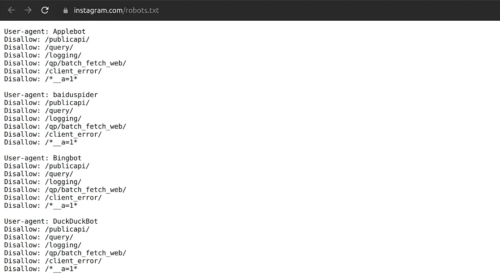
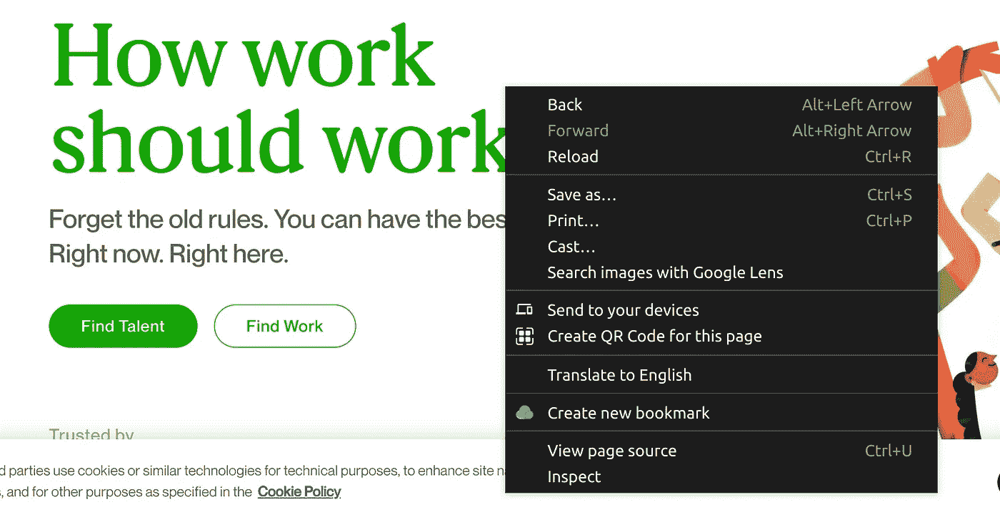
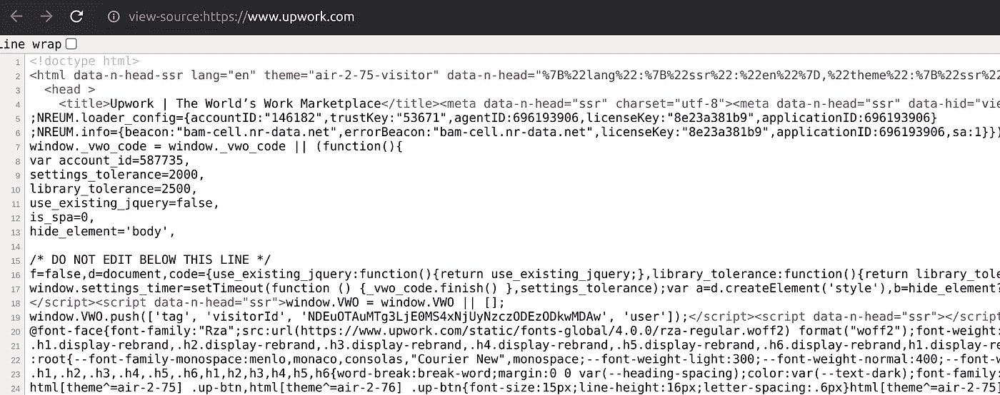
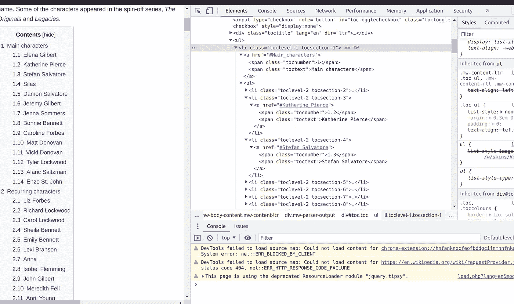

# Python 中 Web 抓取的介绍及实例

> 原文：<https://levelup.gitconnected.com/an-introduction-to-web-scraping-in-python-with-practical-examples-aa6adee93487>

## 如何用 Python 构建 Web Scraper


照片由 [Jackson So](https://unsplash.com/@jacksonsophat?utm_source=unsplash&utm_medium=referral&utm_content=creditCopyText) 在 [Unsplash](https://unsplash.com/s/photos/html?utm_source=unsplash&utm_medium=referral&utm_content=creditCopyText)

## 什么是网络抓取

根据维基百科，

> Web 抓取、web 采集或 web 数据提取是用于从网站提取数据的数据抓取。网络抓取软件可以使用超文本传输协议或网络浏览器直接访问万维网。虽然 web 抓取可以由软件用户手动完成，但该术语通常指的是使用 bot 或 web crawler 实现的自动化过程。这是一种复制形式，从 web 上收集并复制特定数据，通常复制到本地中央数据库或电子表格中，以供以后检索或分析。

## 网络报废合法吗

在您开始删除任何网页上的数据之前，您应该查看该网站上关于网络抓取的指南。清理指南位于名为 robots.txt 的文件中。Robots.txt 是由网站管理员创建的文件，用于指定允许清理的数据类型。比如这里是 Instagram 的`robots.txt` 文件截图。

确保您在任何刮擦活动之前总是检查该文件。



需要注意的几个重要事项是:

*   每隔一段时间刮一下，以免服务器不堪重负。
*   缓存重新请求的数据，这样您就不必继续获取它。

## 网页是如何工作的？

在开始 web 抓取之前，您需要了解 web 页面是如何构造的。

标准网页包含以下元素:

*   文本
*   形象
*   录像
*   不同文件格式的文件

您可以通过右键单击并选择查看页面源代码来检查任何网页的源代码。



单击查看页面源代码选项后，您应该会看到类似这样的内容:



## 请求库

Requests 是一个简单的 python 库，用于执行 HTTP 请求。首先，用 pip 安装请求。

```
pip install requests
```

例如，假设您的某个网页出现宕机，您希望确保该网站仍然正常运行，您可以这样做:

```
import requests
url = '[https://github.com/'](https://github.com/')
resp = requests.get(url)
print(resp.status_code)
```

结果将是:

```
200
```

状态代码 200 表示请求已经成功。一旦得到响应，就从其内容中获取数据。
响应将是 HTML 格式的，要获取所需的数据，您需要一个更强大的工具，即 Beautiful soup。

## 美丽的声音

根据文件显示，

> [Beautiful Soup](http://www.crummy.com/software/BeautifulSoup/) 是一个 Python 库，用于从 HTML 和 XML 文件中提取数据。它与您喜欢的解析器一起工作，提供导航、搜索和修改解析树的惯用方式。它通常为程序员节省数小时或数天的工作。

数据搜集包括 3 个步骤:

*   发送 GET 请求以获取网页内容
*   过滤网页内容
*   从网页元素中提取数据

第一步，用 pip 安装美汤。

```
pip install beautifulsoup4
```

假设您有一个包含以下数据的简单 html 页面:

使用 beautifulsoup，让我们开始搜集数据。假设您想要获得页面上每个元素的所有细节。您需要从标签中提取文本

在上面的代码中，我们首先导入漂亮的 soup，创建一个对象并解析页面细节。现在可以使用 soup 对象从元素标记中获取数据。

```
print(soup.h1)print(soup.h3)print(soup.ul)
```

结果将是:

```
<h1>My First Heading</h1>
<h3>My Third Heading</h3>
<ul>
<li>Liam James</li>
<li>William Jones</li>
<li>Charlotte wesly</li>
<li>Carol Lucas</li>
<li>Harper James</li>
<li>Theodo
```

假设您想获得页面上每个元素的所有细节，即 html 页面中包含的人名，您需要从标签中提取文本。
因为我们知道我们的名字包含在`< li> t` ag 中，所以我们可以指定属性并立即获得所有实例。

```
print(soup.find_all('li'))
```

结果将会是

```
[<li>Liam James</li>, <li>William Jones</li>, <li>Charlotte wesly</li>, <li>Carol Lucas</li>, <li>Harper James</li>, <li>Theodore Mason</li>]
```

正如您所看到的，我们得到了所有的名字，而 soup 在一个列表中返回数据。为了去掉上面的 `li` 标签，我们使用`soup.get_text()`

```
all_names = [name.get_text() for name in names]print(all_names)
```

结果将是:

```
['Liam James', 'William Jones', 'Charlotte wesly', 'Carol Lucas', 'Harper James', 'Theodore Mason']
```

正如您所看到的，我们已经成功地将 HTML 中的名字提取到一个更容易操作的列表中。

## 如何刮维基百科

在这一节中，我们将从维基百科中搜集数据。下面一页展示了我最喜欢的电视剧《吸血鬼日记》的所有演员阵容。
演员阵容分为主要角色和循环角色。要检查源代码并获取元素，右键单击您想要抓取的元素并选择“inspect ”,如下所示。



正如您在上面看到的，演员的数据包含在`<span class = “toctext”>`中。所以让我们用美丽的汤来寻找那个特定的元素。

为了使用 beautiful soup 按类进行搜索，我们使用 `.find_all()` 并指定类名作为参数，就像我们前面使用`li`标签所做的那样

结果将是:

因为我们只需要主要字符，所以让我们截断列表。

```
print(names[:15])
```

结果将会是，

然后，您可以将数据加载到数据帧中。

[](https://betterprogramming.pub/how-to-use-pandas-to-consume-data-and-perform-data-analysis-76e000ad5480) [## 如何使用熊猫消费数据和执行数据分析

### 熊猫数据分析导论

better 编程. pub](https://betterprogramming.pub/how-to-use-pandas-to-consume-data-and-perform-data-analysis-76e000ad5480) 

## 结论

本教程只是触及了你可以用漂亮的汤做些什么的表面。美丽的汤[文档](https://beautiful-soup-4.readthedocs.io/en/latest/)非常广泛，将涵盖你做更多数据搜集所需的一切。

如果你喜欢这个，你可能也会喜欢？

[](https://medium.com/codex/how-to-read-and-write-to-csv-files-in-python-380dabec30b4) [## 如何在 Python 中读写 CSV 文件

### 了解如何使用 Pandas 和 CSV 库操作 CSV 文件

medium.com](https://medium.com/codex/how-to-read-and-write-to-csv-files-in-python-380dabec30b4) 

我每周发布 Python 教程，[关注](https://essyking.medium.com/)了解更多。