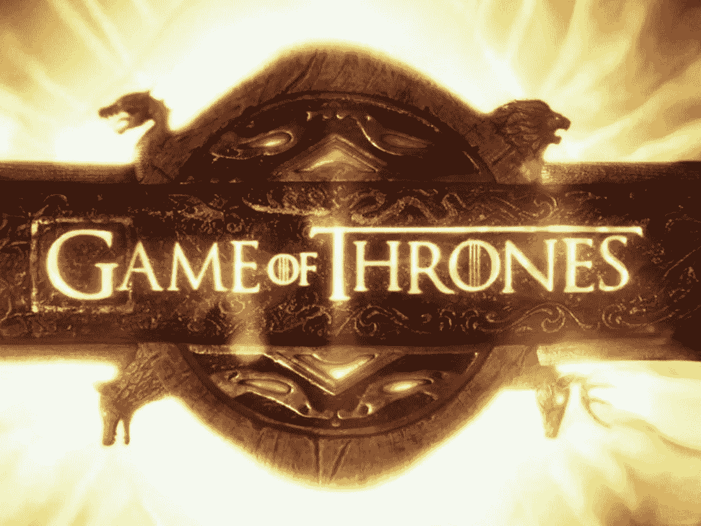
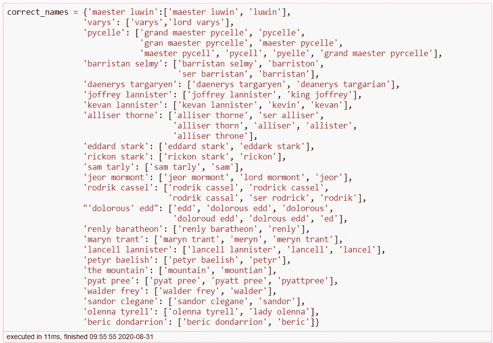
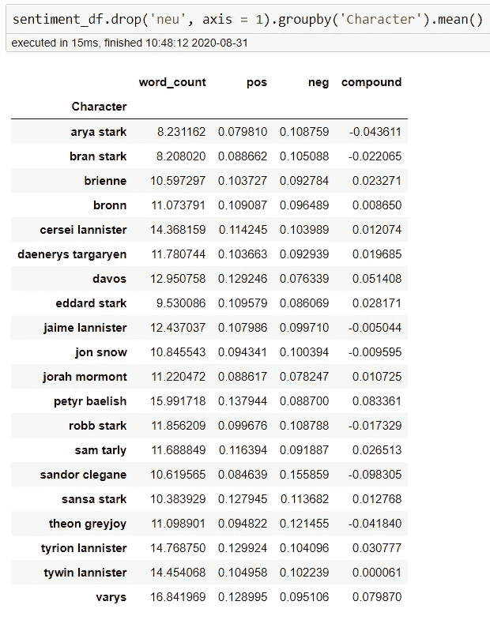
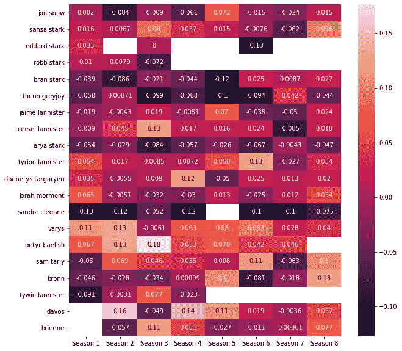
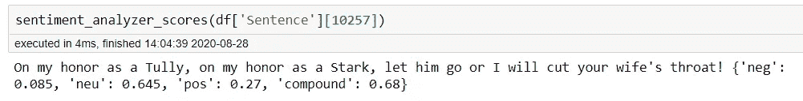
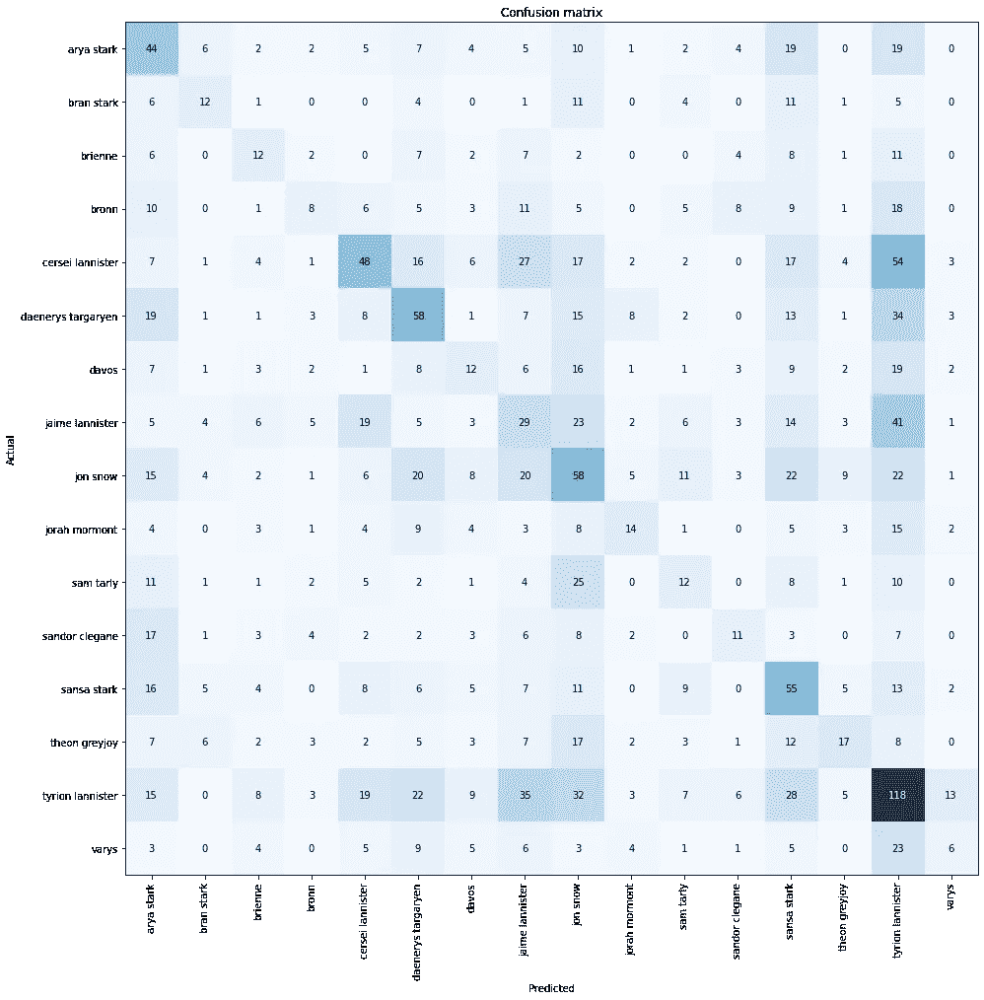
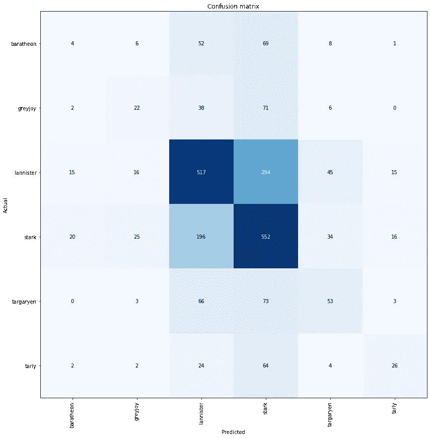
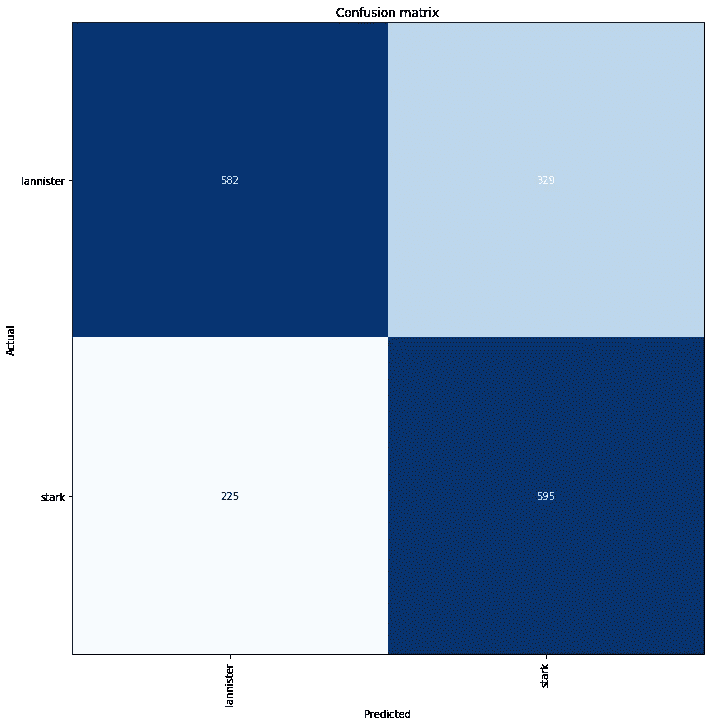

# 《权力的游戏》系列对话研究

> 原文：<https://levelup.gitconnected.com/an-investigation-into-the-dialogue-of-the-game-of-thrones-series-a7a828a64360>

## 试图根据口语识别特定的字符

下面是对最近在自然语言处理方面的努力的分析和解释。要查看我的完整工作和结果，请访问我的 [*GitHub 仓库*](https://github.com/pchadrow/got_character_speech_analysis) *为这个项目。*

这个项目的总体意图和目的是确定系列中的关键人物，并试图将对话的台词归类为最有可能说这些话的人物。

# 摘要

观察对白线的分布和每行的字数，很明显这部剧似乎最依赖提利昂这个角色，他相当稳定地保持着每季和每集最多的台词和最多的字数。当试图为单个字符识别建模时，在整个系列中出现的独特字符的绝对数量被证明是一个问题，因为这最终减少了我们基于我们试图分类的字符的数据。最初的建模尝试为拥有最多线条的角色提供了大约 24%的整体准确率。将方法改为按姓氏分类，我们的结果提高了 50%左右，除去兰尼斯特家和史塔克家，我们的准确率约为 68%。至于情感分析，大多数角色似乎都是中性的，桑铎·克里冈是最典型的消极角色，培提尔·贝里席和瓦里斯都是最典型的积极角色。有趣的是，泰温·兰尼斯特也被证明是几乎完全中立的。

# 分析

对数据的初步审查发现，有一些字符的命名不一致。深入到我们的独特字符列表，发现以下是正确的。

修复这些名称后，我们的独特字符总数从 564 个减少到 520 个。从这里，我开始在一个交互式仪表板上工作，以便更容易地洞察各个季节，剧集，甚至人物。

> [点击此处查看互动应用程序，并根据季节和剧集选择为您喜爱的角色创建文字云](https://got-character-lines-plot.herokuapp.com/)

*请注意，应用程序在创建词云时可能需要一些时间，因为它们是基于仪表板中所有以前的选择生成的。对用来创建 app 的资源库感兴趣的，可以在这里***查看。**

*通过这个应用程序，很快就可以明显看出，这场秀似乎取决于提利昂·兰尼斯特。这在剧集的早期就开始了，除了第七季，他一直是最受关注的角色。尤其是在最后一集，他占了所有口语词的 40%以上。足够有趣的是，虽然他确实倾向于拥有最多的台词和最多的单词，但最长独白的特权在第二季第八集被 Talisa 获得。*

# *感情*

*利用 nltk 的维达，我们接着开始分析我们角色的情绪。观察我们的顶级角色的平均整体情绪很有趣。*

**

*在这个图表的右边，我们可以看到我们的复合分数，其中 1 代表非常积极的情绪，而-1 代表非常消极的情绪。有趣的是，每个人的平均得分接近于零，这表明他们在对话中普遍持相当中立的态度。最初感觉这肯定是错误的，仔细想想这是有道理的。请记住，这种情绪只解释了角色的对话，而不是他们的行为，他们的对话很像你或我的对话，因为它主要是对话，通常是中性的。人物不会经常发表长篇大论或讲述他们看到的每一件积极的事情，这有助于证明对话的中立性。话虽如此，一些角色似乎仍然有一些趋势。我认为桑铎·克里冈成为最典型的反面角色并不奇怪。就积极性而言，培提尔·贝里席和瓦里斯在说话时平均都有更多积极的对话，同时平均也有最多的单词，所以当他们说话时，他们通常比其他角色有更多的话要说。特别有趣的是泰温·兰尼斯特，他看起来几乎完全中立。当计算复合得分的总和时，这种中立性更加明显。将所有的正值和负值相加，大多数人物的总数都是十或百，但泰温的总数仍然几乎为零。*

*按季节分解情绪，我们可以看到一些趋势，也可以看到角色如何随季节而变化。*

**

*请注意，空格表示该角色在那一季中不存在，很可能是因为被杀死了。*

*另一件要记住的事情是，这种分析是基于预先训练的情绪模型。我觉得这可能是在球场上，但仍然保留其有效性的具体例子如下。*

**

*我个人认为，这是否是一种积极的情绪，这是有争议的，可以认为这可能是更加消极的情绪。*

# *建模*

*我们最初的目标是尝试对正在说话的角色进行分类。首先，我使用所有可用的对话，基于 ULMFiT 方法创建了一个语言模型。然后我试着把第八季分离出来，在剩下的七季中训练我们的模型。从这里开始，我将不得不减少我们的角色，只保留那些一直到第八季还活着的角色。进一步筛选出至少有 300 行要训练的字符，使我们的类别从 500 个减少到 16 个。字符分类器不是最好的，整体准确率接近 25%。*

**

*兰尼斯特家和史塔克家似乎有更高的正确分类概率，这将引导我下一次按照家族分类对话的建模尝试。*

*按家族分类确实显著提高了 50%的总体准确率。*

**

*从这个情节中一个有趣的收获是葛雷乔伊和塔利的分类可能性。这两个关键人物都与史塔克家族关系密切，而且与其他家族相比，他们被错误归类为史塔克家族的可能性都非常高。*

*最后，我们只看史塔克和兰尼斯特的分类。将我们的类进一步简化为一个二元问题，我们的总体准确率约为 68%。*

**

# *结论*

*单个字符分类被证明是一个比最初认为的更复杂的问题；这主要是由于为了能够准确地对角色进行分类而需要的数据量，并且实际上只有数据来正确地识别剧中超过 500 个独特角色中的 2 个。尝试按房屋和姓氏分类确实提供了更好的结果，并且确实留下了一些改进的空间，因为这很可能是语音分类的最佳方法。就我们的情感分析而言，它的结果似乎有些可信。然而，应该使用健康数量的怀疑态度，因为它是通过预先训练的模型获得的，并且如果我自己不对脚本对话情感进行手动分类，就无法在当前状态下对数据进行再训练。作为这部剧的粉丝，提利昂一直是个令人愉快的角色。然而在这次调查之后，让我吃惊的是，他是如此的依赖这个系列。虽然我认为他在对话中占了很大比例，但我还是惊讶于在很多情况下他占了那么多。*