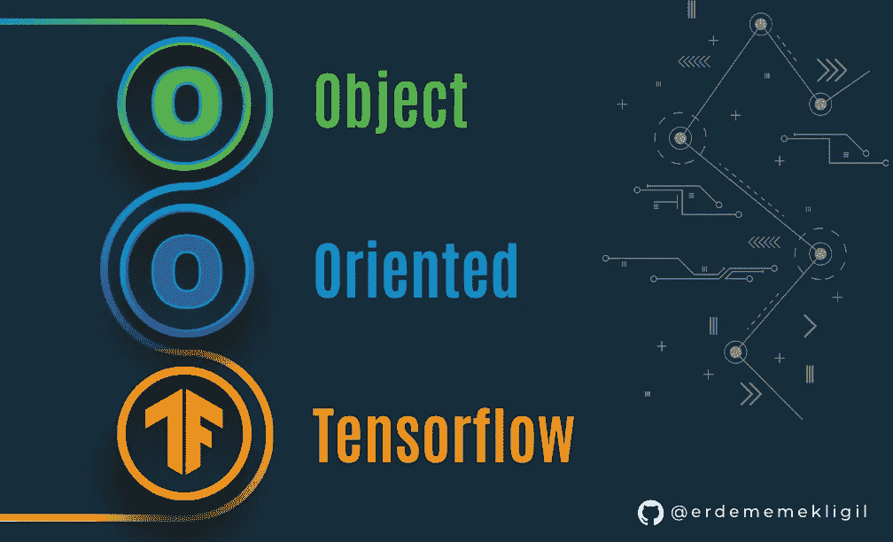

# 用张量流训练图像分类器的面向对象方法

> 原文：<https://levelup.gitconnected.com/an-object-oriented-approach-to-training-an-image-classifier-with-tensorflow-3bcaa7a7864e>

这是博客系列的第一部分，将涵盖 Tensorflow 模型训练、Tensorflow 服务及其性能。



图片来自[Emre sargül](https://www.linkedin.com/in/emre-sar%C4%B1g%C3%BCl-7064aa92/)

您可以在这里找到博客系列的完整应用程序代码:

[](https://github.com/erdememekligil/oop-tensorflow-serving) [## GitHub-erdememekligil/oop-tensor flow-serving:一种面向对象(OOP)的方法来训练…

### 一种面向对象(OOP)的方法，用于训练张量流模型并使用张量流服务为其提供服务。OOP 很好(在…

github.com](https://github.com/erdememekligil/oop-tensorflow-serving) 

## 为什么要为 OOP 烦恼呢？

*   自定义函数可以添加到模型中。例如，自定义函数进行预测并返回最可能的类标签而不是概率。除了创建新函数，现有的 Keras 函数如`call`可以被覆盖以改变它们的功能。
*   覆盖 Keras 函数使模型与其他类或函数兼容。例如，通过覆盖`save`方法来添加*签名*(可以由 Tensorflow 服务调用的方法)使其与 ModelCheckpoint 兼容。由于 ModelCheckpoint 调用被覆盖的`save`方法来保存模型，由它保存的模型将具有额外的签名。
*   一些与架构无关的需求可以在基类中得到满足，不同的模型架构可以在该基类的子类中定义。

## 扩展 tf.keras.Model

在这个应用程序中，我们希望有一个可以直接处理图像字节的模型，因为在生产环境中，图像通常是 PNG 或 JPG 格式。我们定义了一个基类 ImageClassifierModel，用于对图像分类器的常见需求和功能进行分组:

我们创建了一个函数，它以字节而不是 numpy 或张量数组的形式接收图像。我们还定义了一个函数来处理数组，比如默认的`call`方法:

这些方法是 *tf.functions* ，它们在 tf.keras.Model 的被覆盖的`save`方法中被设置为模型的签名:

`save`方法将模型以`SavedModel`格式写入磁盘。这些签名定义可以由 Tensorflow 作为 gRPC 或 REST 服务来提供。此外，甚至在从磁盘加载模型之后，也可以调用 tf.functions，如下所示:

```
model.predict_bytes_image(png_bytes)
```

LenetModel 和 ResnetModel 是 ImageClassifierModel 的两个子类，它们实现抽象的`create_model_io`方法来定义模型架构。ResnetModel 是预训练的 ResNet50V2 的包装器，它有助于微调:

LenetModel 是一个简单得多的类，它实现了 LeNet 架构:

两个模型都有预处理层，可以进行重新缩放等操作。操作，它们不需要预先处理数据。这使得用户(客户)在生产环境中调用这些模型时更容易使用。

## 培养

为了用任何数据集训练任何 ImageClassifierModel(它的子类),我们定义了`train`函数。该函数训练模型，直到它在最后 5 个时期中没有获得任何更高的验证准确性。

您可以使用`tf.keras.preprocessing.image_dataset_from_directory`函数创建训练和验证 DatasetV2 对象，并使用上面的函数。

## 结论

通过扩展`tf.keras.Model`,我们创建了与其他 Keras 函数更加兼容的模型。为了训练其他架构，可以创建一个扩展`ImageClassifierModel`的模型类，并且在不改变其余代码的情况下很容易训练它。这个经过训练的模型将准备好接受 Tensorflow 提供的服务，以及我们定义的附加签名。

请查看 GitHub [库](https://github.com/erdememekligil/oop-tensorflow-serving)以获得完整的代码和更详细的训练评估部分。欢迎在评论中提问。