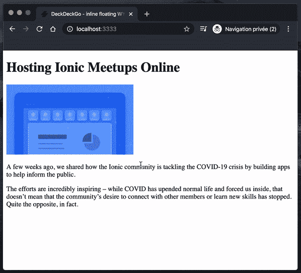
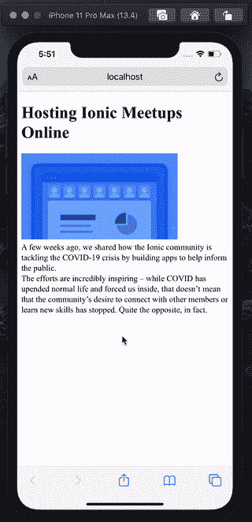
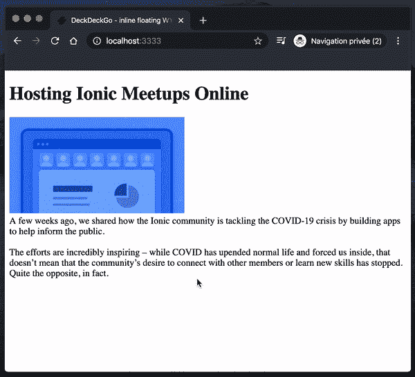
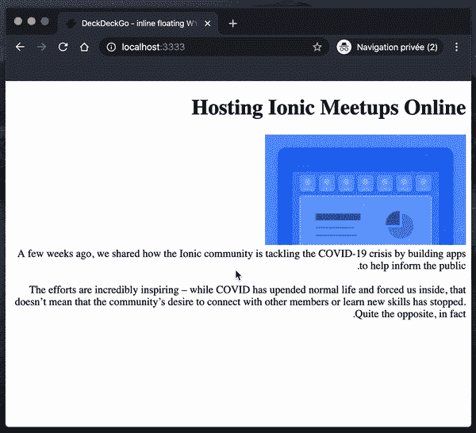

# 像 WYSIWYG 编辑器这样的开源媒体

> 原文：<https://levelup.gitconnected.com/an-open-source-medium-like-wysiwyg-editor-1258d3efdf92>

## 添加我们的所见即所得浮动或粘性编辑器到任何网络应用程序


西尔维娅娜·托德在 [Unsplash](https://unsplash.com/s/photos/free?utm_source=unsplash&utm_medium=referral&utm_content=creditCopyText) 上拍摄的照片

我分享[一天一招](https://medium.com/@david.dalbusco/one-trick-a-day-d-34-469a0336a07e)直到原定的 2020 年 4 月 19 日瑞士新冠肺炎隔离期结束。离第一个里程碑还有两天。希望更好的日子就在前面。

对于 [DeckDeckGo](https://deckdeckgo.com) 我们的演示编辑器，我们开发了许多用[模板](https://stenciljs.com/)开发的定制开源 Web 组件。

其中之一是一个类似媒体的所见即所得编辑器。它可以集成到任何现代 web 应用程序中，无论其技术如何，并且可以在任何设备(桌面、平板和移动设备)上工作。


实际上我不确定我是否曾经分享过这个组件，但是当我花了一天的时间改进它的布局，给它带来了它应得的关注(爱),并发布了一个新版本，这就是为什么我用这个新的博客帖子与你分享它😉。

**更新**:2022 年该部件被移动并整合到[触控笔](https://stylojs.com)中。

# 装置

我们在我们的[文档](https://docs.deckdeckgo.com/components/inline-editor)中提供了一些指导，Stencil 也展示了如何在任何[框架](https://stenciljs.com/docs/overview)中安装任何组件。

## 从 CDN 安装

要从一个 CDN 中获取组件，例如 [Unpkg](https://unpkg.com/) ，在你的 HTML 头中添加以下内容。

```
<script type="module" src="https://unpkg.com/@deckdeckgo/inline-editor@latest/dist/deckdeckgo-inline-editor/deckdeckgo-inline-editor.esm.js"></script><script nomodule="" src="https://unpkg.com/@deckdeckgo/inline-editor@latest/dist/deckdeckgo-inline-editor/deckdeckgo-inline-editor.js"></script>
```

## 从 NPM 安装

要从 [npm](https://www.npmjs.com/) 安装项目，请在您的终端中运行以下命令:

```
npm install @deckdeckgo/inline-editor
```

根据您的需要，可以导入它:

```
import '@deckdeckgo/inline-editor';
```

或者使用自定义加载程序:

```
import { defineCustomElements as deckDeckGoElement } from '@deckdeckgo/inline-editor/dist/loader';deckDeckGoElement();
```

# 将组件添加到您的应用程序中

我喜欢组件的用法非常简单。要将其添加到您的应用程序中，“只需”将其添加到 DOM 中，您就可以开始了。

```
<deckgo-inline-editor></deckgo-inline-editor>
```

就这样，您已经向应用程序添加了一个 WYSIWYG 编辑器🎉。

# 可编辑元素

默认情况下，组件将使属性`contenteditable`被定义为可编辑的任何元素`h1`、`h2`、`h3`、`h4`、`h5`、`h6`和`div`。

如果你喜欢我们的编辑器，你会有其他的需求，例如我们在`section`中处理内容，你可以在属性`containers`的帮助下覆盖这个列表。

```
<deckgo-inline-editor containers="h1,h2,section">
</deckgo-inline-editor/>
```

正如你所注意到的，一旦我这样做了，下面的段落(`p`)将不再可编辑，尽管它们仍然被设置为`contenteditable`。



# 容器元素

您可能希望只允许与应用程序的特定部分而不是整个文档进行交互。为此，它也公开了一个属性`attachTo`。如果您提供了它，那么只考虑来自该特定容器的鼠标或触摸事件。

# 移动设备

在移动设备上，使用浮动编辑器可能不是最好的 UX。当用户在他们的设备上选择文本时，系统操作系统选项的默认列表(复制、粘贴等。)会自动显示，这可能会与编辑器冲突。

这就是为什么我们有想法让编辑器在移动设备上有粘性。

```
<deckgo-inline-editor containers="h1,h2,section"
                      sticky-mobile="true">

</deckgo-inline-editor>
```

请注意，编辑器在 iOS 上显示在顶部，在 Android 上显示在底部。我很喜欢这个最后的版本，但是我没有找到一个聪明的方法来解决这个问题，因为 Webview 没有调整大小，键盘大小也不可用。



同样值得注意的是，当工具栏显示时，组件发出一个事件`stickyToolbarActivated`。由于这个事件，你可以隐藏你的应用程序的页眉或页脚，避免两层的小设计故障。

# 列表和对齐

由于 [Akash Borad](https://twitter.com/BoradAkash) 提供的 Pull 请求，我们最近增加了修改对齐的功能。不是所有的英雄都穿斗篷！

尽管如此，在我们的编辑器中，我们并不使用它们，因为我们在主工具栏中提供了这两个选项。这就是为什么组件公开了两个属性，`list`和`align`，以防您也不使用它们。

同样，默认情况下，组件不会考虑图像。这可以在另一个属性`img-editable`的帮助下修改。

```
<deckgo-inline-editor containers="h1,h2,section"
                      sticky-mobile="true"
                      list="false"
                      align="false"
                      img-editable="true">

</deckgo-inline-editor>
```


# 颜色；色彩；色调

可以在我们定制的颜色选择器的帮助下修改颜色。它有一个默认的调色板，但是也可以用它相应的属性`palette`覆盖。



# RTL

如果您的应用程序的方向是从右到左，组件的顺序将保持不变，但是，自动地，对齐功能将注意到它，并且默认显示为这样。



# CSS 定制

我没有计算，但是有很多 CSS 变量可以用来设置组件的样式，特别是所有与颜色、背景和选择有关的东西。

这些都显示在我们的[文档](https://docs.deckdeckgo.com/components/inline-editor)中。

像往常一样，如果缺少什么或者你需要一个功能，请在 [GitHub](https://github.com/deckgo/deckdeckgo/) 上联系我们。此外，拉请求是最受欢迎的😁。

# 还有更多…

有更多的选择，因为能够提供一个自定义的行动或使组件也粘在桌面上。

# 摘要

坦率地说，这可能是我开发过的最复杂的组件。我认为事实上它是有阴影的，而且[选择 API](https://developer.mozilla.org/en-US/docs/Web/API/Selection) 对它还不是很友好，这并没有让事情变得更容易。尽管我对结果很满意，但它在我们的[编辑器](https://deckdeckgo.com)中运行良好，我希望有一天它也能对其他地方的人有用。

呆在家里，注意安全！

大卫